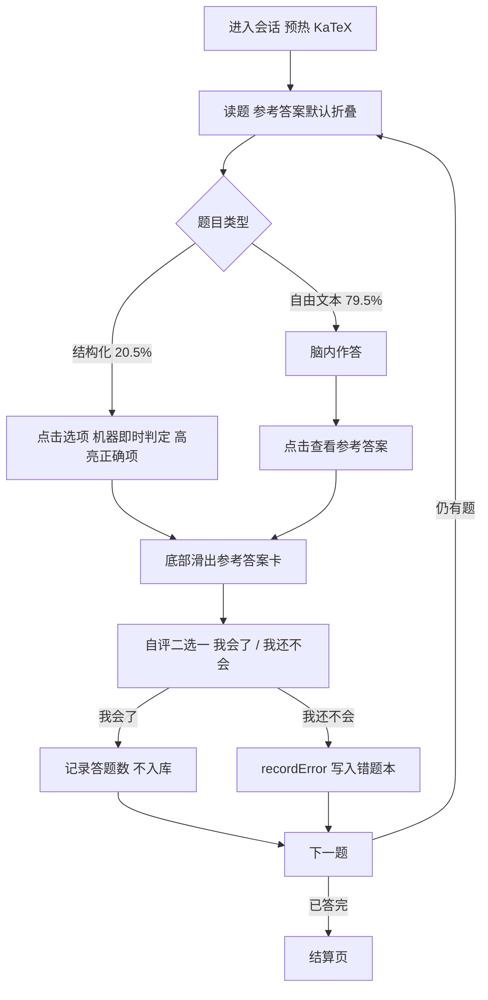

# 单招学习应用 · 移动端体验大改造 PRD

| 项 | 内容 |
| --- | --- |
| 文档版本 | v1.0 |
| 作者 | 许清楚（软件产品经理） |
| 项目 | danzhao-study-vue3（浙江单招学习应用） |
| 状态 | 已定稿（用户对 4 项待定已拍板，见第 8 节） |
| 适用范围 | 移动端优先（目标平台 Android），桌面窗口自适应 |
| 当前阶段 | **需求与方案设计阶段，尚未开工** |

**本文所有数字均为实测值，非估算。** 复核方法见第 0 节，每条给出取的~~来源文件与行号。

---

## 0. 代码事实基线（可复核）

所有结论基于以下实测，命令行可复跑验证。

### 0.1 结构与规模

| 指标 | 实测值 | 复核方法 |
| --- | --- | --- |
| 内容 JS 文件总数 | **147** | `find src/content -name "*.js" \| wc -l` |
| 其中含 `blocks:` 的文件 | **141** | 同藓 Python 遍历 |
| 含题目（`question:`）的文件 | **137** | 同上 |
| 路由数量 | **9** | `src/router/index.js` |
| 视图数量 | **7**（另有 editor 目录 3 文件） | `src/views/` |
| 区块类型数量 | **22** | `src/components/blocks/blockTypes.js` |
| 22 类中图标非空的 | **19**（desmos / columns / group 三个为空，见该文件 32 / 34 / 35 行） | 同上 |

### 0.2 题库盘点（三表 —— 决定「练习」Tab 性质的关键数据）

**表 1：题目总量与来源**

| 指标 | 实测值 | 复核方法 |
| --- | --- | --- |
| 题目总数（`question:` 计数） | **1393** | Python 遍历 `src/content/**/*.js` |
| `quiz` 区块数 | **171** | 正则 `type:\s*["']quiz["']` |
| `exam` 区块数 | **6**（其中 2 个位于同时含 quiz 的文件，故纯 exam 文件为 4 个） | 正则 `type:\s*["']exam["']` |
| 纯 exam 文件数（即不含 quiz 的 exam 文件） | **4**，共 104 题，其中结构化 55 题（52.9%） | 见下表；按文件结构化占比分别为 13/19、26/45、8/20、8/20 |

**表 2：结构化可判分 vs 自由文本（这是最关键的一张表）**

| 指标 | 实测值 | 占比 |
| --- | --- | --- |
| 有 `options:` 字段 | **286** | 20.5% |
| 有 `correctIndex:` 字段 | **286** | 20.5% |
| 题目总数 | **1393** | 100% |
| 推断：仅自由文本答案 | **1107**（1393 − 286） | 79.5% |

> 注：`options` 与 `correctIndex` 数量严格相等（均为 286），说明二者成对出现，可作为"可否机器判分"的可靠判据。

**表 3：4 个纯 exam 文件（唯一具备完整自动判分能力的来源）**

| 文件 | 题目数 |
| --- | --- |
| `src/content/chinese/06-模拟冲刺/02-真题模拟卷一.js` | 19 |
| `src/content/computer/05-模拟冲刺/02-真题模拟卷.js` | 45 |
| `src/content/math/12-模拟冲刺/02-真题模拟卷一.js` | 20 |
| `src/content/math/12-模拟冲刺/03-真题模拟卷二.js` | 20 |
| **合计** | **104** |

### 0.3 关键代码事实（含行号）

| 事实 | 位置 |
| --- | --- |
| `QuizBlock` **不做对错判定**，且整个组件不 import `studyDb`（即练习题作答不产生任何学习数据） | `src/components/blocks/QuizBlock.vue:106` 函数 `pickChoice`，注释原文"不做对错判定" |
| `ExamBlock` 已有自评能力 | `src/components/blocks/ExamBlock.vue:254` 函数 `selfAssess(i, correct)` |
| 错题写入的唯一入口 | `src/stores/studyDb.js:588` 方法 `recordError(...)` |
| `recordError` 去重键 | 同上：`subject + question + fileKey`（无 `fileKey` 时退化为 `unitNum`），命中返回 `{duplicated:true}` |
| 错题初始 SM-2 字段 | 同上：`reviewed:false, reviewCount:0, easeFactor:2.5, interval:0, repetitions:0, nextReviewDate: 当天` |
| SM-2 四档评分常量 | `src/composables/useSpacedReview.js:20` 导出 `GRADES`（AGAIN/HARD/GOOD/EASY） |
| 桌面居中列（Web 味主因之一） | `src/App.vue:146` `.app-main { max-width: 960px }` |
| 冷黑阴影 | `src/assets/css/main.css:224` `--shadow-xs: 0 1px 3px rgba(0,0,0,0.4)`；`src/assets/css/main.css:225` `--shadow-pop: 0 8px 30px rgba(0,0,0,0.55)` |
| 紫红渐变文字（AI 味明显示例，两处） | `src/views/HomeView.vue:466`（`.footer-author`）；`src/views/DashboardView.vue:310`（`.dashboard-credit strong`）；均为 `linear-gradient(135deg, #f43f5e, #a855f7)` + `background-clip: text` |
| 安全区变量已存在 | `src/assets/css/main.css:254-257` `--sat/--sab/--sal/--sar` |
| Tauri 窗口默认尺寸 | `src-tauri/tauri.conf.json` `1080 × 720` |
| CSP | `src-tauri/tauri.conf.json:23` `script-src 'self'`（极严，禁止任何运行时 eval 的库） |

### 0.4 现有交互与移动端适配现状

| 指标 | 实测值 |
| --- | --- |
| 媒体查询总数 | **20**：`@media (max-width:600px)` ×10、`@media (max-width:1150px)` ×3，`min768` / `min1024` / `max640` / `min1151-max1456` / `max1150+landscape` / `orientation:landscape` / `prefers-reduced-motion` 各 1 |
| CSS `transition:` 声明 | 分布 **12 个文件**（多为 hover/active 微交互） |
| Vue `<transition>` 组件 | 仅 **fade / topbar** 两处（无路由级转场） |
| 触摸手势 | **全站仅 ContentSidebar 抽屉一处**（`touchstart/touchmove` 抓手下拽关闭） |
| 底部 Tab Bar | **不存在**（全仓搜索 tabbar / bottom-nav 命中 0） |
| 响应式断点 | 600 / 640 / 768 / 1024 / 1150 / 1151-1456 多档并存，缺统一治理 |

---

## 1. 用户画像与使用场景

### 1.1 画像

- **人群**：浙江高职单招考生，15–18 岁，高中生为主。
- **设备**：手机为主（目标平台 Android），桌面窗口为辅。
- **使用时段**：晚自习后与睡前碎片、课间 10 分钟、周末集中刷题。
- **心理状态**：备考焦虑叠加时间稀缺。核心诉求是"我今天有没有进步""我哪里还弱"，需要即时反馈与掌控感，而非长时间沉浸阅读。

**代码佐证**（说明产品心智已被部分实现，不是主观推断）：

- 首页已有「继续学习」卡（`src/views/HomeView.vue` ← `localStorage.last_study`）
- 首页已有「今日待复习 N 道错题」（同上，基于 SM-2 `nextReviewDate`）
- 已实现 SM-2 间隔复习（`src/composables/useSpacedReview.js`）
- 已实现薄弱点聚合（Dashboard `weakAreas`，按错题数取 学科+单元 Top5）
- 已由 `removeMastered` 定义掌握标准（`repetitions>=3 && interval>=7`）

结论：真实心智是「碎片续学 + 错题驱动」，本次改造应放大而非推翻这套心智。

### 1.2 手机场景与桌面场景的差异（决定双端信息架构）

| | 手机 | 桌面（Tauri 窗口） |
| --- | --- | --- |
| 姿态 | 单手竖屏 | 坐下专注 |
| 单次时长 | 3–15 分钟为主 | 30 分钟以上 |
| 目标形态 | 目标导向，直奔单元/错题/刷题 | 可多栏并排（内容 + 目录/答题卡） |
| 导航建议 | 底部 Tab Bar 一级导航 + 大触控目标 + 底栏常驻 | 内容为王 + 侧栏；**不应把手机 Tab Bar 生搬过来** |

结论：**底部 Tab Bar 是移动端主导航；桌面端一等形态是「内容 + 侧栏」**，Tab Bar 在宽屏退化为顶部或侧栏。二者响应式共存，不各自维护一套路由。

### 1.3 竞品特征（简述，不展开）

学生学习类 App 的移动端共性：底部 4–5 Tab、首页「继续学习」卡、刷题与错题本各自成 Tab、Anki 式到期复习队列、Duolingo 式手势与进度反馈。本产品**数据层已具备**（`studyDb` + SM-2），缺的是移动端形态与练习聚合层。

---

## 2. 信息架构

### 2.1 现状：典型 Web 式 IA，无一级导航

- `App.vue` 常驻站点式顶部 header（品牌 + 同步 + 用户名 + 管理 + 退出 + 主题），`.app-main` 居中 960px（`src/App.vue:146`）。
- 一级入口靠首页 tool-grid 的 4 张卡片 + 页脚 footer-nav + 面包屑，本质是"用网站首页当导航中心"。
- 内容页导航靠 `ContentSidebar`（宽屏侧栏；≤1150px 退化为底部操作栏 + 答题卡抽屉）——目前唯一的移动化尝试。
- Dashboard / ErrorBook / Profile 三个页面均带**面包屑**（纯 Web 惯用法）。
- 全站无 Tab Bar。

### 2.2 目标：4 个一级 Tab

| Tab | 收录现有页面 | 归并理由 |
| --- | --- | --- |
| **学习**（首页） | HomeView：继续学习、学科切换、阶段分组单元、搜索入口 | 内容导航是最高频入口；「继续学习」天然是 App 首页首屏 |
| **练习** | 新增聚合层：单元练习 / 薄弱专项 / 模拟冲刺（含自动组卷） | 「刷题」是独立心智与独立任务流（进入即做题、有对错与结算），值得独立 Tab；当前题目埋在页内且无聚合入口 |
| **复习** | ErrorBookView + SM-2 今日到期队列（useSpacedReview）+ Dashboard 薄弱点洞察 | 错题本、间隔复习、薄弱点属于同一个「补漏」闭环，任务连续 |
| **我的** | ProfileView + DashboardView（学习进度/今日统计/学科进度）+ 主题/同步 + 管理后台 + 退出 | 「账号 + 我的数据 + 设置」是标准「我的」Tab 内容；仪表盘属低频查看，下沉即可 |

采用 4 Tab（而非 5）的理由：底部栏 4 项可稳定保证每项 ≥44px 触控宽度且不易误触；「数据」类内容对高中生属于低频查看，下沉到「我的」更符合使用频率分布。

### 2.3 二级页面（下钻）

- 学习 → 学科 → 单元列表 → 内容页 `/study/:subject/:unitNum/:fileIndex?`（保留现有 UnitView）
- 练习 → 模式选择 → 组卷配置 → 做题会话 → 结算页
- 复习 → 今日到期队列 / 错题列表（学科 + 状态筛选）→ 错题详情 → 跳回来源页
- 我的 → 学习数据 → 设置（主题 / 同步）→ 管理后台（`role=admin`）
- **搜索**：保持顶层浮层（首页头部搜索图标唤起），不占 Tab
- **登录** `/login`：全屏，位于 Tab 之外

### 2.4 与现状的差异总结

由「网站首页做导航中心 + 顶部站点 header + 面包屑 + 页脚」改为「底部 Tab 一级导航 + 页面内 header + 全屏 app shell」，移除面包屑与页脚，桌面端保留侧栏形态。

---

## 3. 需求池

标注：P0 必做 / P1 应做 / P2 可选。验收标准均要求可客观判断。

原始 6 点诉求到需求的映射：诉求 1 → R4 / R5；诉求 2 → R6 / R7；诉求 3 → R8；诉求 4 → R1 / R2；诉求 5 → R5；诉求 6 → R2 / R3 / R9。

### R1 · 底部 Tab Bar 一级导航（P0，诉求 4）

**描述**：新增常驻底部 Tab Bar，4 个一级入口按 2.2 表；替换 `App.vue` 顶部 header 的主导航角色。

**验收**
1. 4 个 Tab 在 ≤600px 屏上各自触控区 ≥44×44px，且不换行。
2. 当前 Tab 高亮态清晰可辨（不依赖单一颜色通道，需有形/色差异）。
3. 进入内容页后 Tab Bar 可自动隐藏，保证沉浸阅读。
4. 存在独立 TabBar 组件（建议 `src/components/TabBar.vue`）+ 截图证据。
5. 移动端任意一级页面到达其余 3 个 Tab 均只需 1 次点击。

### R2 · 路由转场与返回手势（P0，诉求 6）

**描述**：`App.vue` 的 `<router-view>` 外层包 `<transition>`；支持边缘右滑返回。

**验收**
1. 页面切换存在 ≤300ms 转场，前进左入、后退右入，方向可辨。
2. 内容页边缘右滑可返回上一页，与系统返回行为一致。
3. `prefers-reduced-motion` 下转场禁用（`src/assets/css/main.css` 已有兜底，复用即可）。

### R3 · 去 Web 味（P0，诉求 6）

**描述**：由居中阅读列改为全屏 app shell。现状因果均有幕证：`.app-main` 居中 960px（`src/App.vue:146`）、常驻站点 header、首页页脚 nav + 版权行、三个页面的面包屑、无路由转场。

**验收**（逐条可判）
1. 移除 `.app-main` 的 `max-width:960px` 居中约束（或仅桌面保留、移动端全宽）。
2. 面包屑组件引用从 3 个 view 中移除。
3. 首页页脚 nav 与版权行移除。
4. 移动端首屏不存在品牌 header 占位，改为页面内标题栏。
5. 页面切换存在转场（见 R2）。
6. 触控点击具备原生式反馈（见 R6）。

### R4 · 页面级布局自由度（P0，诉求 1）

**描述**：在「区块数组」之上引入 **layout 层**——每个内容页可声明布局模板（如 cover / immersive / reading / steps / hero+grid），不再由 22 类区块等权纵向堆叠；22 类区块降级为「内容单元」，由 layout 决定排布。

**验收**
1. 至少实现 3 种可切换 layout 模板，并落到至少 1 个真实页面。
2. 同一份区块数据在不同 layout 下渲染出不同排布（可截图对比）。
3. 新增或修改 layout 不需要改动任何区块组件。
4. 内容页可通过字段指定 layout，缺省回退到默认 reading。
5. **存量 147 页零改动**（用户已决策）。

### R5 · 内容差异化（P0–P1，诉求 5）

把"虚"的诉求拆为三个正交轴：

**轴 A · 题型差异化（P0）**：概念 / 例题 / 练习 / 错题 各有不同呈现形态。
验收：例题具备"题面 → 解析"渐进揭示；练习具备独立专注形态（聚焦单题）；错题具备"我的作答 vs 正确答案"对比强调。三类页面在结构与交互上各至少 1 处可指出差异。

**轴 B · 学科差异化（P1）**：数学 / 语文 / 计算机 各有视觉调性（配色 / 图标 / 排版节奏）。
验收：三科页面并排截图存在可辨识差异；通过学科主题变量实现，不改组件内部。

**轴 C · 内容层次节奏（P1）**：页面具备 hero → 核心 → 练习 → 小结 的节奏，而非 22 个等权区块瀑布。
验收：存在节奏性间距与段落引导（章节序号、阶段性小结），单页区块间存在 ≥2 级视觉层次。

具体落地见第 7 节（学习页改进方案）。

### R6 · 动效系统（P1，诉求 2）

**描述**：视差、滚动叙事、手势驱动、触控反馈。现状：12 个文件有 `transition:`（多为微交互），`<transition>` 仅 fade / topbar，触摸手势全站仅 ContentSidebar 抽屉一处。

**验收**
1. 全站可点元素具备 `:active` 反馈（缩放或态变）。
2. 内容页 hero / 封面支持滚动视差或叙事动效。
3. 至少 1 处手势驱动交互（除抽屉外，如滑动切题/切页）。
4. 统一动效 token（`--dur-1/2/3`、`--ease-standard/out` 已存在）且 `prefers-reduced-motion` 全量兜底。
5. 首屏动画不阻塞输入。

### R7 · 视觉现代化（P1，诉求 2）

**描述**：在现有 Claude 温暖纸质 token 体系上提升年轻感。详细规范见第 6 节。

**验收**
1. 字号 / 圆角 / 色阶存在明确层级提升（改造前后截图对比）。
2. 首屏无大片空白。
3. 正文对比度达 WCAG AA（≥4.5:1）。

### R8 · 删除低代码编辑器（P0，诉求 3）

**描述**：移除 `/editor` 路由、`src/views/editor/`（EditorView.vue + BlockForm.vue + schemaForm.js）、首页 tool-grid 与页脚中的编辑器入口。

**验收**
1. 全仓搜索 `editor` / `EditorView` 无残留引用。
2. 路由表不含 `/editor`。
3. 首页不再出现「内容编辑器」入口。
4. 构建通过。

### R9 · 加载与首屏感知（P0，诉求 2 / 6）

**描述**：骨架屏 / 占位，消除白屏与"网页加载"感。

**验收**
1. 内容页与异步区块（`diagram` / `exam` / `desmos` 已懒加载）具备骨架屏，而非「加载中…」文字。
2. 首帧无主题闪烁（`index.html` 已有预处理，保留）。
3. 路由切换无白屏空帧。

---

## 4. 用户旅程

### J1 · 系统性学习闭环


**痛点**
- D：答错时无即时引导（当前仅记录，无回看提示）。
- E：错题收录后无入口提示（当前仅首页有「今日待复习」）。
- C：概念页为长区块瀑布，无节奏引导，易疲劳（对应 R5 轴 C）。
- 上述三点是「练习 Tab」与本文第 5 节要解决的核心断点。

### J2 · 碎片时间续学


**痛点**
- E / F：换科目后要在长列表里重新找单元，单元卡无「最近 / 在学」置顶。
- B：碎片场景首屏被 hero 标题与页脚占用，无效内容过多（对应 R3）。

---

## 5. 「练习」Tab 交互稿

### 5.1 前置事实与定性

基于第 0.2 节三表，三条硬结论：

1. **现有 `QuizBlock` 完全不判分，也不产生任何学习数据**（`QuizBlock.vue:106`，且组件不 import `studyDb`）。今天学生在练习题上作答，系统一行数据都不记。
2. **79.5% 的题目没有可机器校验的答案**（1107 / 1393），答案形态为自由文本加内嵌 LaTeX，例如 `"答案：4。\(x+\frac{4}{x} \ge ...\)"`。
3. 唯一具备自动判分能力的是 exam 区块，仅存在于 **4 个纯 exam 文件、共 104 题**。

**定性**：「练习 Tab」不是"把题目搬到新页"，而是要补一条今天不存在的链路——

> 作答 → 判定/自评 → 错题入库 → SM-2 间隔复习

这是本 Tab 的真正工作量，也是所有关键决策的推导起点。

### 5.2 关键决策

#### D1 · 题目粒度：双模式（不二选一）

| 模式 | 粒度 | 适用场景 | 理由 |
| --- | --- | --- | --- |
| 日常练习 | **单题一屏**（卡片流） | 3–15 分钟碎片 | 单屏一个决策是移动端的原子单位；可随时中断续做；进度天然呈现为「3/10」 |
| 模拟冲刺 | **列表式**（保留 exam 既有形态） | 30–120 分钟整块时间 | 具备 duration / totalScore / passingScore，需要全局时间管理、未答跳转、回看修改 |

列表式是为 120 分钟整卷设计的，要求连续注意力；碎片场景下会令学生只做前 3 题就离开。因此这一选择取决于会话时长分布，而非审美偏好。

#### D2 · 反馈时机：即时揭示 + 自评（用户已决策：强制自评）

原两难的两个选项实际都不成立：
- 「即时判分」做不到 —— 79.5% 无标准答案。
- 「交卷后统一结算」在碎片场景失效 —— 答完即走，错题本失去输入（这正是今天 `QuizBlock` 的结局）。

**取法**：答完 → 立即揭示参考答案 → 自评二选一。

心流保护三项：
1. **非阻断**：底部滑出参考答案卡，不弹窗、不跳页、不夺焦点。
2. **可回溯**：完成后仍可回看已做题。
3. **无延迟枷锁**：不设每题倒计时。

**强制规则（用户已拍板）**：看答案后必须选择「我会了 / 我还不会」才能进入下一题。理由：自评是错题入库的**唯一触发器**；若可跳过，学生会一路看答案刷过，练习数据依旧全空，本 Tab 失去意义。

#### D3 · 判分口径必须二分显示

| 类型 | 占比 | 判定方式 | 数据性质 |
| --- | --- | --- | --- |
| 结构化题（有 `options` + `correctIndex`） | 20.5%（286 题） | 机器自动判 | 客观 |
| 自由文本题 | 79.5%（1107 题） | 用户自评（会 / 不会） | 主观 |

结算页**必须分两行**显示（例如"自动判 6 题，正确 5；自评 14 题，会 9"）。合并为一个百分比即产生假数据，既误导学生也误导仪表盘。

#### D4 · 会话规模

5 / 10 / 20 题 ≈ 3 / 8 / 15 分钟，与碎片时间画像对齐。默认 10 题。

### 5.3 四层页面结构

#### L1 练习首页（Tab 落点）

1. 未完成会话：`继续上次练习 · 数学／不等式 · 7/10`（有则显示，无则不占位）。
2. 三个模式入口：

| 入口 | 选题逻辑 | 面向场景 |
| --- | --- | --- |
| 单元练习 | 选学科 → 选单元 → 题量 | 学完即练（最常用） |
| 薄弱专项 | 按下文口径聚合题目 | 补漏 |
| 模拟冲刺 | 4 套真题卷 + 自动组卷（见 5.6） | 考前整卷，列表式 + 倒计时 |

3. 底部统计：本周练习 X 题 / 新入错题 Y 道。**只显示真实数据，无数据时不放占位卡**（呼应第 6 节 AI 味清单第 9 条）。

**薄弱专项口径（用户已决策）**：复用 Dashboard 现成的 `weakAreas`（错题按 学科+单元 聚合、降序 Top5），零新逻辑。

#### L2 组卷配置

学科 → 单元（可多选）→ 题量（5 / 10 / 20）→ 难度（可选，取自 `item.difficulty`）→ 开始。

#### L3 做题会话（单题一屏，核心）



会话页元素规范：
- 顶部：细阅读进度条 + 「3/10」 + 退出（有作答时二次确认）。
- 题干区：`MathJaxRender`；进入会话前须 `warmKatex()`（题目普遍含 `\(...\)`）。
- 参考答案区：**默认折叠**，严禁与题面同屏可见。
- 底部常驻动作条（拇指区）：`看答案` → `我会了` / `我还不会`。
- 手势：左滑下一题，**仅完成自评后可用**（对应 D2 强制规则）。
- 离开保护：复用 `ExamBlock` 既有三层思路（父级 `examState` 注入 / `beforeunload` / 路由守卫）。

#### L4 结算页

- 正确率：**分两行**（自动判 / 自评），不得合并。
- 用时、题量。
- **本次新入错题 N 道** —— 这是最有价值的数字，直接接上 J1 旅程中「错题收录后无提示」的断点。
- 下一步四个动作：`重做错题` / `看解析` / `回看知识点`（跳回来源页 `/study/:subject/:unitNum/:fileIndex`）/ `再来一组`。
- 「新入错题 N」需可一键直达复习 Tab。

### 5.4 与「复习」Tab 的数据流（SM-2 衔接）

```
自评「我还不会」
  → studyDb.recordError(subject, unitNum, question, correctAnswer, userAnswer, explanation, extra)
      （实现位置 src/stores/studyDb.js:588）
  → 写入 error_book，初始 SM-2 字段：
      reviewed:false, reviewCount:0, easeFactor:2.5, interval:0, repetitions:0, nextReviewDate: 当天
  → useSpacedReview.loadDueReviews() 立即捞到
      （判定条件：reviewed===false && !lastReviewedAt → true）
  → 复习 Tab「今日待复习」+1
  → reviewCard(error, grade) 四档评分（GRADES: AGAIN/HARD/GOOD/EASY）
  → SM-2 重算下次间隔
  → 掌握标准 repetitions>=3 && interval>=7 → removeMastered 软删
```

三条实现注意点：

1. **`fileKey` 必须传入**：`recordError` 的去重键是 `subject + question + fileKey`，缺 `fileKey` 会退化为 `unitNum` 粒度，1393 题规模下误判率显著上升。跨单元组卷时每题须携带原始 `fileKey`。
2. **同题跨源**：同题出现在不同来源页会被判为两条记录（去重键含 `fileKey`）。此为明确接受项：同题重复出现概率极低，换取实现复杂度下降。
3. **解析填充**：现有 `answer` 字段已含「答案 + 解析」，可直接整段填入 `explanation`。参照 `ExamBlock` 现有写法（`模拟卷解析：${item.answer}`）整理即可。

### 5.5 技术要求

**对既有方案的一处修正**：遍历原语实际位于 `scripts/lib/load-content.mjs`（导出 `ROOT` / `CONTENT_DIR` / `collectFiles` / `buildMetaIndex` / `importFresh` / `relPathOf`），`build-search-index.mjs` 与 `validate-content.mjs` 均消费它。新脚本应同样从该库 import，而非照抄 search-index 内的写法，以避免二次漂移。

建议新增 `scripts/build-practice-bank.mjs`：

- 遍历三学科 → `importFresh` → 遍历 `page.blocks` → 收集 `type === 'quiz' | 'exam'` 的 `items`。
- 每题附加**来源坐标**：`subject / unitNum / fileIndex / fileKey / unitTitle / fileTitle / blockTitle`。
- 每题标记：

```
gradable: Array.isArray(item.options) && item.options.length > 0 && item.correctIndex !== undefined
source:   item.type === 'exam' ? 'exam' : 'quiz'
```

- 产出 `public/practice-bank/{subject}.json`，**按学科分片**（参照 `public/search-body/` 模式），并沿用 searchIndex 的键命名与「超限必报告」纪律。
- 体积需实测后决定是否细化到单元分片：数学是主力科目且题量最大，建议动手前先输出单学科体积。

其余要求：

- 会话状态用新 Pinia store（建议 `src/stores/practice.js`，内存态）；落库一律走既有 `studyDb`。
- 除 `recordError` 外必须调用 `recordAnswered(n, {fileKey})`，否则仪表盘「答题总数 / 今日答题」不会增长。
- **CSP 约束（`script-src 'self'`）**：产物为 JSON 数据，使用 `fetch + JSON.parse`，**禁止**动态 `import()`；禁止引入任何运行时 eval 的库。
- 公式渲染走既有本地 KaTeX（`MathJaxRender`），会话进入前 `warmKatex()`。

### 5.6 自动组卷（用户已决策支持）

用户决定：**支持从 1393 题自动组卷，不止现有 4 套真题卷。**

#### 组卷策略

| 参数 | 默认值 | 说明 |
| --- | --- | --- |
| 范围 | 学科 + 单元多选 | 未选单元时按全科 |
| 题量 N | 20（可选 10 / 30 / 50） | 与会话时长对应 |
| 难度分布 | 基础 50% / 中等 35% / 较难 15% | 取自 `item.difficulty` |
| 单元权重 | 优先来自 `weakAreas` Top5 | 错题数越多，该单元被抽取概率越高 |

**动态权重**：某单元错题占比高时提高该单元权重，实现"哪里弱练哪里"。权重来源即用 5.3 节已决策的 `weakAreas`，不新增聚合逻辑。

#### 去重规则

1. **会话内去重**：同一 `fileKey + question` 在一组内不重复出现。
2. **与真题卷隔离**：自动组卷**默认排除 `source === 'exam'` 的题目**（即 4 个纯 exam 文件的 104 题），避免"自动组卷组出真题卷原题"削弱真题卷的稀缺性与可信度。用户可在设置中显式勾选「含真题卷题目」，**默认关闭**。
3. **跨组去重**：同一 `seed` 重放结果完全一致，保证「再来一组 / 重做这组」可复现。

#### 与 4 套真题卷的关系

| | 4 套真题卷 | 自动组卷 |
| --- | --- | --- |
| 入口 | 模拟冲刺（一级） | 模拟冲刺 → 自定义冲刺（二级） |
| 形态 | 列表式 + 倒计时 | 列表式 + 倒计时（与真题卷一致） |
| 判分 | 104 题中 **55 题可自动判（52.9%）**，其余仍走自评 —— 显著高于全站 20.5%，但并非全部可自动判 | 沿用二分口径（20.5% 自动判 / 79.5% 自评） |
| 文案 | 可称「真题模拟卷」 | **禁止自称真题**，须表述为「自定义组卷」 |

**关键冲突点**：文案必须严格区分二者，不允许把自动组卷结果称作"真题"。

#### 自动组卷验收标准（补充到 5.7）

1. 默认配置下连续组卷 100 次（N=20），与 4 套真题卷的 104 题**零交集**。
2. 难度分布偏差 ≤ ±2 题。
3. 同一 `seed` 重放结果完全一致。
4. 会话内无重复题目（按 `fileKey + question` 判定）。
5. 构造"某单元错题最多"的数据后，该单元在组卷结果中占比最高。

### 5.7 「练习」Tab 验收标准汇总

1. 题库产出覆盖 **1393** 题（允许容差），`gradable` 标记比例与实测 **20.5%** 一致（±2%）。
2. 随机抽 20 道结构化题，自动判结果与其 `correctIndex` **100% 一致**。
3. 自评「我还不会」任意 5 题 → `error_book` 新增 5 条，`nextReviewDate` 为当天；重复提交同一题返回 `duplicated:true` 且不重复入库。
4. 上一步完成后，复习 Tab 的 `dueToday` 立即 +5。
5. 未完成自评时，「下一题」按钮 disabled 且左滑手势无响应（验证 D2 强制规则）。
6. 会话中退出有二次确认；确认退出后答题数已计入 `daily_stats`。
7. 结算页「自动判」与「自评」两行分别显示，未合并。
8. 弱网 / 离线全程可用（IndexedDB 已具备），不发起网络请求。
9. 会话页首题可交互 < 1.5s（低端安卓实机）。
10. 自动组卷 5 条标准（见 5.6）。

---

## 6. 视觉规范

### 6.1 三色体系（纸白 / 墨色 / 陶土橙）

**纸白** —— 页面不使用纯白，纯白只给卡片。

| 用途 | token | 值 |
| --- | --- | --- |
| 页面底 | `--bg`（=`--bg-100`） | `#faf9f5`（纸质暖白） |
| 卡片 / 浮层 | `--surface`（=`--bg-50`） | `#ffffff` |
| 次级容器（嵌在卡片内的槽） | `--surface-muted`（=`--bg-200`） | `#f5f4ef` |

规则：禁止 `#fff` 直接做页面底色；禁止两个不同用途共用同一档纸白。

**墨色** —— 层次靠墨的深浅，不靠增加颜色。

| 用途 | token | 值 |
| --- | --- | --- |
| 标题 / 强调 | `--text-primary` | `#28261b` |
| 正文 | `--text` | `#3d3929` |
| 次级文字 | `--text-secondary` | `#535146` |
| 弱化 / 时间戳 | `--text-muted` | `#6e6d68` |

规则：`main.css` 已确立「标题最多 600，不靠加粗」的原则，但现有 `h1/h2/h3` 实际使用了 `font-weight:700`，属自相矛盾。**统一压到 600**，层次由字号与留白建立。

**陶土橙** `--primary` `#c96442` —— 全站唯一情感色，克制到可用数量核实：

- 仅允许出现在：① 当前激活 Tab；② 主行动按钮（每屏至多 1 个）；③ 进度填充条；④ 极少量关键强调（如"待复习 N"数字）。
- **量化门禁**：单屏主色面积 ≤ 5%；同屏主色出现点 ≤ 3 处（学习页加严，见 7.3）。
- 禁止：主色做大面积背景、做正文色、做渐变、做 >1px 的边框。

### 6.2 字号与行高阶梯（含中文度量）

现状：`@media (max-width:600px)` 下 `body { font-size:17px; line-height:1.75 }`；`--fs-*` 阶梯已存在，但未与行高做语义绑定。

| 层级 | 字号 | 行高 | 用途 |
| --- | --- | --- | --- |
| display | 1.75rem（28px） | 1.3 | 页面主标题 |
| title | 1.4rem | 1.4 | 卡片标题 |
| subhead | 1.15rem | 1.5 | 区块标题 |
| **body** | **17px（1.0625rem）** | **1.75** | **正文（中文下限，不得更小）** |
| caption | 0.85rem | 1.6 | 辅助说明 |
| meta | 0.75rem | 1.5 | 时间 / 角标（下限，不再更小） |

**中文行宽（纠正 65ch 的拉丁度量）**

`65ch` 是拉丁字母度量，套用于中文会得到 60+ 汉字一行，阅读散且累。中文语境下 1em ≈ 1 个汉字宽，因此：

- 阅读容器统一 **`max-width: 36em`**（≈ 32–38 汉字/行），配套 token `--measure-cn: 36em`。
- `65ch` 在中文语境一律不使用。
- **公式块豁免**：KaTeX 显示态公式需要横向空间，允许溢出或横向滚动，不被 36em 裁切。

CJK 排版三项补充（当前均缺失，建议新增）：

- `line-break: strict;` `word-break: normal;`（避免标点与数字不当折行）
- `text-wrap: pretty;`（避免尾行孤字）
- 字体栈维持现有 `--font-base`（`PingFang SC` → `Microsoft YaHei` → `Noto Sans CJK SC` 已 CJK 优先，正确，不要改动）

### 6.3 圆角阶梯

现有 8 / 12 / 16 / 20 / 24，缺的是用法约束。

| 档位 | 值 | 用途 |
| --- | --- | --- |
| sm | 8px | Tag / Chip / 输入框 |
| md | 12px | 按钮、卡片内元素 |
| radius | 16px | 标准卡片（现有 `--radius`） |
| lg | 20px | 容器卡片（现有 `.card` 使用此档） |
| xl | 24px | 底部抽屉、全屏弹层顶部两角 |

规则：**同一视觉层级的容器必须使用同一档**。当前主要问题是列表中 16px 与 20px 混用。抽屉顶部两角 24px、底部为 0（贴底）。

### 6.4 留白节奏

现有 `--space-1..9`（4 / 8 / 12 / 16 / 24 / 32 / 48 / 64 / 96）。

| 语义 token | 值 | 用途 |
| --- | --- | --- |
| `--gap-block` | 32px | 区块与区块之间 |
| `--gap-block-tight` | 16px | 同组元素 / 容器内 |
| `--pad-shell` | 20–24px | 卡片内边距 |
| `--pad-page` | 24px（移动端 16px） | 页面左右留白 |

规则：**同层级间距必须相等**，不得 24 / 20 / 16 混用。

补充：`main.css` 中 `--spacer-6 / -10 / -14 / -20 / -40` 五个字面量档位尚未归并到 `--space-*`，涉及约 59 处、每处 2–4px 变化，属设计改动，建议与本次视觉改造一并处理，不单独先行。

### 6.5 阴影（暖可可，禁止纯黑）

现状全部为冷黑（`main.css:224-225`，且 alpha 高达 0.4 / 0.55），需统一改为暖可可。取 `--brand-900 #582e1d` 的 RGB `(88,46,29)`：

| 档位 | 规范值 | 用途 |
| --- | --- | --- |
| shadow-1 | `0 1px 2px rgba(88,46,29,.06)` | 静态卡片微抬 |
| shadow-2 | `0 8px 24px rgba(88,46,29,.10)` | Tab Bar / 悬浮层 |
| shadow-3 | `0 12px 32px rgba(88,46,29,.16)` | 拖拽中 / 抬起态 |
| shadow-4 | `0 -24px 64px rgba(88,46,29,.20)` | 全屏弹层 |
| scrim | `rgba(58,43,32,.32)` | 模态遮罩（替换现有 `rgba(0,0,0,.45)`） |

禁止：任何 `rgba(0,0,0,*)` 的阴影与遮罩；任何彩色辉光 / 泛光。

### 6.6「降低 AI 味」可判断标准

沿用拆解"Web 味"的方法，把"AI 味"拆为可逐条核查的清单，并附现状实测。

| # | AI 味特征 | 判据 | 现状实测 |
| --- | --- | --- | --- |
| 1 | emoji 当图标 | 正则扫 UI 文件，真 emoji 命中数须为 0 | **未达标**：UI 侧 121 个真 emoji + 148 个符号字形（见下方注意） |
| 2 | 紫 / 蓝渐变 + 光晕 | 饱和度 >50% 的紫蓝青渐变，或任何 glow | **未达标**：`HomeView.vue:466`、`DashboardView.vue:310` |
| 3 | 渐变文字 | 出现 `-webkit-background-clip: text` | **未达标**：同上两处 |
| 4 | 居中英雄区 + 单一渐变 CTA | hero 居中且占屏 >30%，下方孤立主按钮 | **未达标**：HomeView `.home-hero`（居中标题 + 副标题 + 卡片群） |
| 5 | 无信息密度的装饰卡 | 卡片内无可操作内容、无真实数字 / 进度，只有图标加一句陈述 | **部分**：HomeView tool-grid 部分卡为纯静态入口 |
| 6 | 一律大圆角且无边界 | 所有容器圆角相同且缺 1px 分隔线 | **部分**：`--radius-lg`（20px）大面积统一使用 |
| 7 | 冷黑阴影 / 遮罩 | 存在 `rgba(0,0,0,*)` | **未达标**：`main.css:224-225` 及多处遮罩 |
| 8 | 复制腔文案 | 命中词表：赋能 / 一站式 / 极致 / 轻松搞定 / 全新升级 | **达标**：现有文案朴实，无此类用词 |
| 9 | 假数据占位 | 面板使用占位示例数而非真实值 | **达标趋势**：Dashboard / Profile 均含 loading 与 error 分支，未见假数据 |
| 10 | 尾注式署名卡片 | 每页底部重复署名块 | **未达标**：HomeView 页脚与 DashboardView 页脚各一处，且含心形 emoji |

**用户已决策（第 10 条）**：作者署名**保留一处**，仅放在「我的」页，改为墨色小字，去除紫红渐变文字与心形 emoji；其余页脚署名卡全部删除。

**emoji 处置的准确边界（重要）**

实测需区分两类，不可一刀切：

| 范围 | 真 emoji | 符号字形 | 处置 |
| --- | --- | --- | --- |
| UI 文件（views / components / stores，约 40 个文件） | 121 | 148 | **全部替换为 Lucide SVG 图标** |
| 内容文件（`src/content/`，66 个文件） | 149 | 420 | **不改动**（用户已决策存量 147 页零改动） |

内容文件的符号字形绝大多数属于**正文语义**，例如 `src/content/computer/05-模拟冲刺/02-真题模拟卷.js` 第 12 / 269 / 276 行中的 `①②③④` 编号与 `→` 流程箭头（形如"服务器管理器→添加角色→安装 DHCP"）。这些是真实的中文内容记号，若被误当作图标清除会直接损坏题目与解析文本。**自动化的 emoji 清理脚本必须排除 `src/content/`。**

需替换的图标规模：19 个区块类型图标（22 类中 desmos / columns / group 为空）+ 4 个 Tab 图标 + 若干操作图标，合计约 30–40 个 path。建议落地为 `src/components/icons/` 本地组件或 path 常量表，**不引入 `@lucide/*` 运行时渲染**（体积与 CSP 考量），天然满足 `script-src 'self'`。

**验收建议**：以上第 1 / 2 / 3 / 7 / 8 / 10 条做成 CI 正则扫描门禁，命中即失败，避免"降 AI 味"停留在主观审美讨论。

---

## 7. 学习页视觉改进方案

针对原始诉求「内容过于死板、没有差异化」。现状根因：22 类区块排布节奏相同，一律等宽纵向堆叠。

### 7.1 区块级差异化：把 22 类归并为 5 种内容角色

不逐个改造 22 个区块组件，而是把它们归入 5 种内容角色，每类给一套视觉形态。这样可在**不动存量内容**的前提下实现差异化。

| 内容角色 | 涵盖区块类型 | 视觉形态 |
| --- | --- | --- |
| **概念** | knowledge, objectives, vocab, strategy, mindmap | 沉静：纯纸白背景，无边框或仅极细 1px 底线，衬线标题，无左侧装饰条。占比最大，充当"背景层" |
| **要点（结构化）** | formula, table, summary, compare, steps, cloze | 次级底 `--surface-muted`、柔和圆角、内部有编号 / 表格 / 分栏节奏；summary 与 compare 可卡片化并加 1px 边框 |
| **例题** | example | 渐进揭示：白底 + 左侧 3px 主色竖条（学习页允许的橙色点位之一），"题面 / 解析"分段折叠，解析区用更浅底 + 分隔线 |
| **练习** | quiz | 交互形态：独立卡片，作答区明确；**未揭示前不使用任何色彩暗示对错**；区块结尾给出「去练习」CTA 跳转练习 Tab |
| **小结 / 警示** | warning, tip, errorfocus | 强调形态：唯一允许使用色相的一组（warning / danger 语义色左侧竖条 + 淡底），但饱和度须受控；tip 用墨色表达，不额外加色 |

**差异化的手段不是给每类换颜色，而是四个形态变量**：
1. 背景层级（0 / 1 / 2 层：页面纸白 / 次级底 / 卡片）
2. 边界处理（无边框 / 1px 细线 / 3px 左侧竖条 / 完整卡片）
3. 内部节奏（是否编号、是否分栏、是否可折叠）
4. 是否可交互（静态阅读 / 需作答 / 可展开）

**关键原则**：5 类角色中**只有「例题」与「小结/警示」允许色彩表达**，其余三类依靠墨色层级、留白与边界建立差异。这样既建立节奏感，又保住长时间阅读的可读性。

### 7.2 导航与进度：玻璃质感迷你顶栏

**结论：采用，但做克制版**，与导航页 v2 的液态 TabBar 呼应而不夺戏。

- 出现时机：滚动离开页面标题后淡入。
- 尺寸：高 44px + `--sat` 安全区。
- 视觉：30–38% 半透明 + 内侧 1px 高光边 + `backdrop-filter: blur(12px)`；**不加投影**（投影保留给 TabBar 与内容卡）。
- 组成：返回（Lucide ChevronLeft）+ 当前页标题（单行截断）+ 右侧「本页进度 xx%」。

现状 `UnitView.vue` 已有 `.reading-progress` 与 `.mobile-topbar`，因此本节属**改良而非重建**。

进度用两条互补方式呈现，避免都做成动效：

1. **顶部细进度线**：保留现有 `.reading-progress`，2px，主色，定位在顶栏下沿，跟随滚动。
2. **迷你顶栏右侧百分比**：静态数字，不设动画。

禁止：环形进度、跳动徽章、巨大 sticky header。

### 7.3 橙色在学习页的用量

用户反馈导航页橙色偏少、学习页需相应加量，但阅读场景仍需克制。给出白名单与上限：

| 允许位置 | 数量上限 | 说明 |
| --- | --- | --- |
| 顶部阅读进度线 | 1 | 现有 `.reading-progress__bar` 已是主色 |
| 例题区块左侧竖条 | 按例题数，视觉上计为 1 类 | 3px 主色竖条 |
| 「去练习」CTA 按钮 | 至多 1 | 实心主色，每页唯一主行动 |
| 交互元素选中 / 焦点态 | 按需 | 单选高亮、输入框 focus ring |
| 链接激活态 | 按需 | 链接色已是主色 |
| 关键数字（待复习 N） | 至多 1 | 仅用于结算 / 提示场景 |

禁止：区块标题用橙色、大面积橙色底、橙色描边区块、橙色渐变、橙色做正文强调（应使用加粗加墨色）。

**量化门禁（学习页）**：单屏橙色面积 **≤3%**；出现点 **≤6 处**，其中实心填充 **≤1 处**（主 CTA）。
作为对比，导航页为 ≤5% 面积 / ≤6 处 —— 学习页标准更严，因长时间阅读需要视觉安定。

### 7.4 与导航页 v2 的呼应关系

**三同**：同一色板（纸白 / 墨色 / 陶土橙）、同一圆角阶梯、同一暖可可阴影体系、同一字体栈、同一 Lucide 图标族。

**三异**：

| | 导航页 v2 | 学习页 |
| --- | --- | --- |
| 主色角色 | 活跃、引导（约 6 处：激活 Tab 底色 / 数字 / 进度条 / chip 标签 / 主按钮） | 沉静、标注（≤6 处，实心仅 1 处） |
| 玻璃 | TabBar 液态悬浮 pill，28px 圆角，30–42% 半透明 + 暖可可投影 | 迷你顶栏更轻（30–38%，无投影、非 pill），无常驻玻璃 |
| 动效 | 视差 / 手势 / 滚动叙事（丰富） | 克制：仅滚动进度与转场，无装饰动画（保护阅读） |

**原则：一个 App，两种呼吸。** 导航页负责吸引与引导（活泼），学习页负责长时间阅读（沉静）。二者的切换发生在"进入内容页"的转场上——建议该转场表达为：卡片抬起 → 展开为全屏纸白，同时玻璃 TabBar 下滑退出。用这一个转场明确告诉用户"已从导航进入阅读"。

---

## 8. 已决策事项（用户已拍板，非待定）

| # | 议题 | 用户决定 | 本文对应章节 |
| --- | --- | --- | --- |
| A6-1 | 自评是否可跳过 | **强制自评**：看答案后必须选择「我会了 / 我还不会」才能进入下一题 | 5.2 D2、5.3 L3 |
| A6-2 | 薄弱专项口径 | 复用 Dashboard 现成 `weakAreas`（错题 Top5 单元），零新逻辑 | 5.3 L1 |
| A6-3 | 模拟冲刺仅有 4 套卷 | **支持自动组卷**，从 1393 题按难度 / 单元组卷 | 5.6 |
| B6-10 | 作者署名块 | **保留一处**：仅「我的」页，墨色小字，去除紫红渐变文字与心形 emoji；其余页脚署名卡全删 | 6.6 第 10 条 |

其余已定前提（早前确认，一并记录以免漂移）：

- 4 Tab = 学习 / 练习 / 复习 / 我的
- 内容模型 = 布局原语，实现排布自由度，**存量 147 页零改动**
- 动效 = 丰富 + 分级降级；目标手机平台 = 仅 Android；自适应优先
- GeoGebra 演练场**已决定下线**；低代码编辑器将删除
- 视觉：导航页玻璃拟态 + 柔光渐变；学习页 Claude 纸质阅读风；**全面禁用 emoji，改用 Lucide SVG 图标**

---

## 9. 遗留待确认

| # | 议题 | 说明 |
| --- | --- | --- |
| 1 | 自动组卷是否含真题卷题目 | 当前自动组卷默认排除 4 套真题卷的 104 题；若希望「考前冲刺也能练到真题」，需明确是否放宽默认（现默认关闭，可在设置中手动开启） |
| 2 | 内容文件的装饰性 emoji | 存量 147 页零改动是既定前提，因此内容侧 emoji（如部分题目标题前的标记）本次不动；若日后放开内容改造需单独立项 |
| 3 | 自动组卷体积 | `practice-bank` 产物体积需实测确定分片粒度（学科 / 单元） |
| 4 | 桌面端 Tab Bar 策略 | 宽屏下 Tab Bar 退化为顶部还是侧栏，需与 `ContentSidebar` 现状协同确认 |

---

## 附录 A · 验收标准总表

| 编号 | 验收项 | 判定方式 |
| --- | --- | --- |
| R1-1..5 | Tab Bar 触控 / 高亮 / 沉浸隐藏 / 组件归一 / 一线可达 | 见第 3 节 R1 |
| R2-1..3 | 路由转场 / 返回手势 / reduced-motion 兜底 | 见 R2 |
| R3-1..6 | 去 Web 味六条 | 见 R3 |
| R4-1..5 | layout 层三条模板 / 数据复用 / 组件解耦 / 缺省回退 / 存量零改动 | 见 R4 |
| R5 | 题型 / 学科 / 节奏三轴 | 见 R5 与第 7 节 |
| R6-1..5 | 触控反馈 / 视差 / 手势 / token / 不阻塞 | 见 R6 |
| R7-1..3 | 层级提升 / 无空白 / AA 对比度 | 见 R7 |
| R8-1..4 | 编辑器清除彻底且构建通过 | 见 R8 |
| R9-1..3 | 骨架屏 / 无闪屏 / 无空帧 | 见 R9 |
| P1..P10 | 练习 Tab 十条（题库 / 判分 / 入库 / SM-2 / 强制自评 / 退出 / 二分显示 / 离线 / 性能 / 自动组卷） | 见 5.7 与 5.6 |
| V1..V10 | AI 味十条专项清单 | 见 6.6 |

## 附录 B · 数据来源与复核命令

```bash
# 总题量与可判分占比
python3 -c "
import re,glob
tot=opts=ci=0
for f in glob.glob('src/content/**/*.js',recursive=True):
    s=open(f,encoding='utf-8').read()
    if 'blocks:' not in s: continue
    tot+=s.count('question:'); opts+=s.count('options:'); ci+=s.count('correctIndex:')
print(tot,opts,ci, round(100*opts/tot,1))
"
# 预期输出：1393 286 286 20.5

# 内容文件总数
find src/content -name "*.js" | wc   # 预期 147
```

文档中引用的行号可用 `sed -n '<行号>p' <文件>` 直接抽查，已在撰写时逐条核对。
