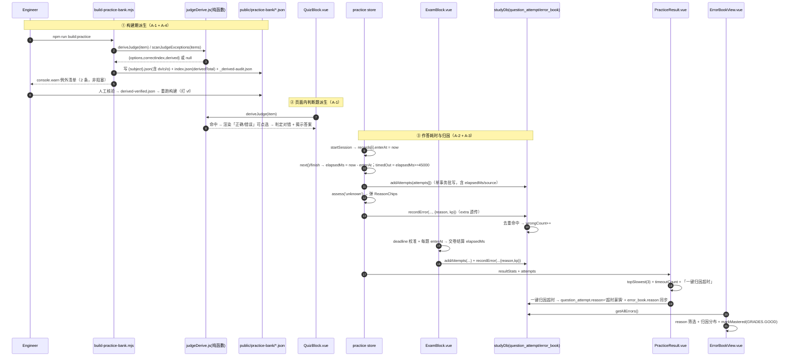
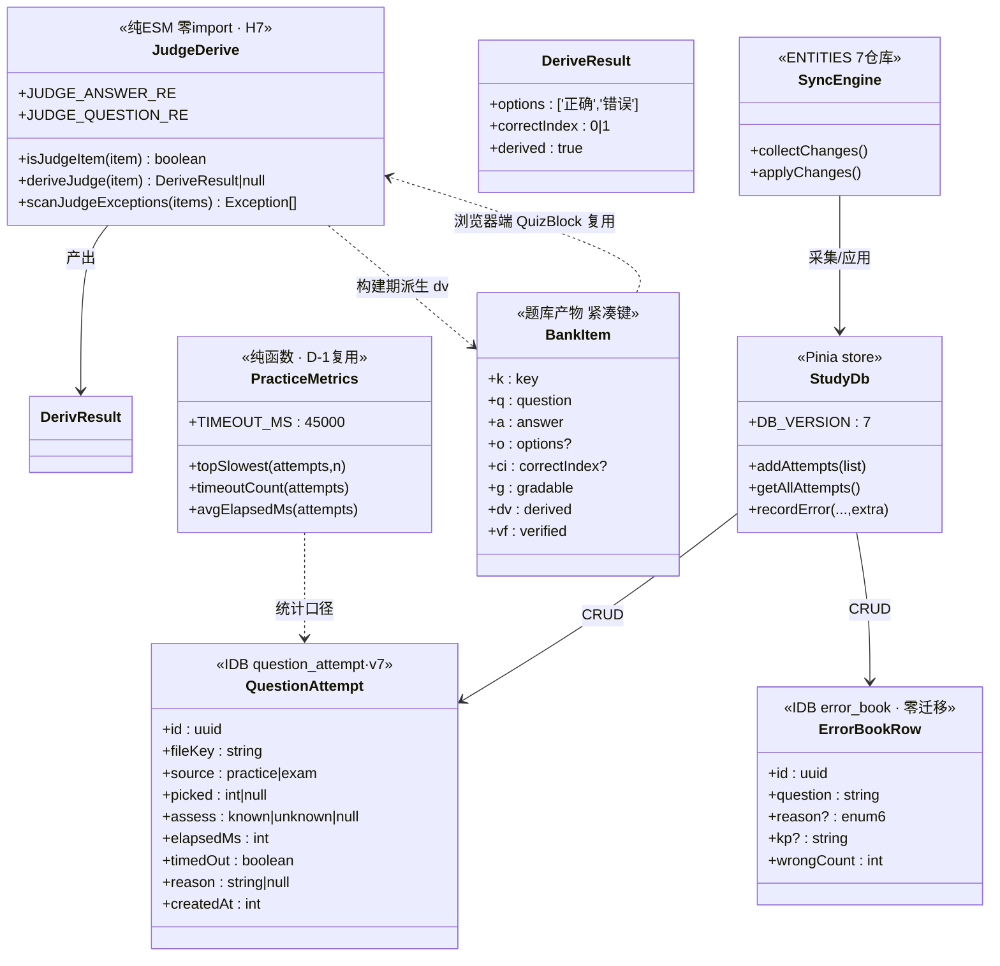

# 批 A 任务列表（判分与归因前哨）—— 工程师照单实现版

> 状态：**规划定稿（未写代码）**。本文是 `implementation-roadmap.md` §2「批 A」的**细化落地版**，不推翻原分解，只把它拆到「可直接开工」的粒度（文件、接口、测试点、验收条、commit 划分）。
> 角色：架构师（高见远 / Gao）产出；供工程师直接照单实现，供 team-lead / 用户拍板末节列出的遗留点。
> 上游（已读并内化）：
> - `docs/proposals/implementation-roadmap.md` §0.2 硬约束 / §2 批 A / §5 数据结构变更 / §6 拍板结果
> - `协同交流/03_共同决策/D-001_三项实现形态共识.md`（构建期派生 / 两类 kp 分离 / 判分自评二分 / cloze 兼容）
> - `协同交流/02_功能侧回函/2026-10-09_对内容侧17项需求的评审回应.md`（17 项验收标准）
> - `docs/proposals/content-extension-dual-track.md`（S2 的 v7 表结构，供升版合并决策）
>
> **两条纪律贯穿全文**：① 数字、行号、接口一律以**本次实际读码**为准，不确定处标「待核实」；② 不写实现代码，只给「关键函数签名 + 伪代码级要点」。
> **任务数 = 4**（`A-1 / A-2 / A-3 / A-4`），≤ 5 硬上限；按**功能模块**分组，不按单文件拆。

---

## 0. 开工前必读：本次核查对上游的**更正与补充**（务必以本节为准）

> 上游（路线图 / 评审回应）的「判断题形态」描述与**实际读码不一致**，若工程师照抄会走偏。以下为本次只读核查的实测结论（`collectBank()` 逐条扫描 1393 题 + 全库 regex 复核）。

| # | 上游写法 | 实测事实（本仓库 HEAD） | 处理 |
|---|---|---|---|
| 更正 1 | 「`type:'judge'` 的题」 | 内容里**普遍不写 `type`**（数学/语文判断题常省略）；题库产物里 `itemType==='judge'` 的**仅 75 条**，但 `question` 以「判断：」开头却不带 type 的**另有 4 条** | 判据改为 **`type==='judge'` OR `question` 以「判断：」开头**（见 A-1） |
| 更正 2 | 「`answer` 以 `**正确。`/`**错误。` 开头」 | 主判据命中 **77 条**（`/^\*\*(正确\|错误)。/`），**但存在 2 条例外写法**（见下表） | 主判据派生前置；例外出「例外清单」，不派生、不阻塞 |
| 补充 1 | 未提 | 题库产物 `public/practice-bank/*.json` **已入库 git**（`git ls-files` 命中），且 `npm run build` 的 `prebuild` **只**构建搜索索引、**不含**题库 | A-1/A-4 改完**必须** `npm run build:practice` 重生成并**提交产物**（见 A-1.4） |
| 补充 2 | 「判分率 286/1393（20.5%）」 | 实测 `gradable = 286`，`total = 1393`，**完全一致** | 作为基线锚点；A-1 后 → **363/1393 ≈ 26.1%**（+77） |
| 补充 3 | 「写死 `grade=4`」 | 实测 `ErrorBookView.vue:227` `calculateSM2(err, 4)` **确实写死** | A-3.5 处理（本批**不引入四档 UI**，只做常量命名 + 留痕） |
| 补充 4 | 「recordError extra 透传 `:642`」 | 实测 `studyDb.js:642` `Object.assign(error, extra)` **确实存在** | A-3 零迁移通路成立 |

### 0.1 派生前「例外清单」（本次全量扫描结果，**非阻塞**，交内容侧确认）

| 位置（题库 key） | 学科/文件 | 现象 | 建议 |
|---|---|---|---|
| `01/0/0/2` | `chinese/01-语言文字运用/01-字音字形.js` | `question: "判断：…"`，但 `answer` 以 **`正确。`**（**无 `**` 加粗**）开头 | 主判据不命中 → 本例**不派生**；出清单请内容侧补 `**` |
| `01/6/1/7` | `computer/...`（`itemType==='judge'`） | `answer` 以 **`**对**。`**（用「对/错」而非「正确/错误」）开头 | 主判据不命中 → **不派生**；出清单请内容侧统一为 `**正确。**` |

> 除上述 2 条外，**无**「命中判据但答案无正确/错误前缀」的题，也**无**「有前缀但判据不命中」的题（实测 extra = 0）。清单应作为**构建脚本的 console.warn 输出**持久化（超限必报告纪律），不写死在本文件。

---

## 1. 总览：任务编号 / 依赖 / 顺序 / 预估

### 1.1 任务一览表

| 任务 | 对应需求 | 内容 | 依赖 | 预估 | 触碰 DB 升版 |
|:--:|---|---|:--:|:--:|:--:|
| **A-1** | **P0-1** | 判断题客观化（构建期派生 + 页面内 QuizBlock 派生，单一纯函数复用） | 无 | **M** | 否 |
| **A-2** | **P0-3** | 单题耗时 `elapsedMs`（练习 + 考试采集 → 新仓库 `question_attempt` → 结算呈现） | 无 | **M–L** | **是（v6→v7）** |
| **A-3** | **P0-4** | 错题归因（`reason`/`kp`/`wrongCount` + 二级归因层 + 错题本筛选/分布） | **A-2**（超时归因联动） | **M** | 否（行内加字段） |
| **A-4** | **P2-15** | 派生题 `verified` 人审框架（抽检清单 + 产物 `vf` + 同权统计） | **A-1**（同产物 / 同紧凑键） | **S** | 否 |

### 1.2 依赖图

```mermaid
graph TD
    A1["A-1 判断题客观化<br/>P0-1 · M"] --> A4["A-4 派生题 verified<br/>P2-15 · S"]
    A2["A-2 单题耗时 elapsedMs<br/>P0-3 · M-L · DB v7"] --> A3["A-3 错题归因<br/>P0-4 · M"]
    A1 -. 仅共享 practiceBank.js 紧凑键（弱耦合） .-> A4
    A2 -. 同为做题数据面，practice.js/ExamBlock.vue 顺序编辑 .-> A3
```

> **读图**：`A-1` 与 `A-2` **互相独立、可并行**；`A-4` 必须等 `A-1` 的产物与紧凑键落地；`A-3` 必须等 `A-2`（「一键归因超时」要读 `elapsedMs`，且二者先后编辑 `practice.js`/`ExamBlock.vue`）。

### 1.3 实现顺序建议（详见 §5）

```
① A-1 (P0-1)  →  ② A-2 (P0-3, 唯一 DB 升版)  →  ③ A-3 (P0-4) + A-4 (P2-15)
```
`A-1` 先行是因为它**零 DB 风险、直接抬判分率**，且 `A-4` 挂在它后面可一次把「构建产物面」改干净。

---

## 2. 逐任务卡

### 任务 A-1 · 判断题客观化（P0-1）

**目标**：让**判断题**变成**可机器判分**——① 构建期把判据命中的判断题派生进题库产物（练习/组卷可判分）；② 页面内 `QuizBlock` 判断题**同步派生**为可点选、可判分。两处复用**同一个纯函数**（H7 单一真相源）。派生前全量扫描并输出「例外清单」（非阻塞）。`validate:content` 零新增报错。

**涉及文件**

| 动作 | 路径 | 说明 |
|---|---|---|
| 新增 | `src/content/judgeDerive.js` | 纯 ESM、**零 import**、两端共用（构建脚本 + 浏览器）。判据常量 + 派生函数 + 例外扫描（H7） |
| 新增 | `tests/judge-derive.test.js` | 纯函数单测 |
| 改 | `scripts/build-practice-bank.mjs` | `collectBank()` 内对每条题目尝试派生；`index.json` 增 `derived`/`gradable` 计数；例外清单 `console.warn` 点名 |
| 改 | `src/content/practiceBank.js` | `BANK_ITEM_KEYS` 增 `dv:'derived'`；`normalizeBankItem` 展开 `derived` |
| 改 | `src/components/blocks/QuizBlock.vue` | 判断题（派生命中）渲染「正确/错误」可点选 + 判定对错 + 揭示答案 |
| 改 | `tests/practice-bank.test.js` | 更新 gradable 基线锚点；新增派生断言（见测试要点） |
| 重生成 | `public/practice-bank/{math,chinese,computer,index}.json` | **提交产物**（见 A-1.4，易漏！） |

**数据结构与接口签名**

```js
// ---- src/content/judgeDerive.js（纯函数，零 import）----

/** 主判据：答案以加粗「正确。/错误。」开头 → 可确定 T/F */
export const JUDGE_ANSWER_RE = /^\*\*(正确|错误)。/
/** 题型判据：type==='judge' 或题干以「判断：」开头 */
export const JUDGE_QUESTION_RE = /^\s*判断[：:]/

/**
 * 该条目是否为「判断题」（形态判据，不看答案）
 * @param {{type?:string, question?:string}} item
 * @returns {boolean}
 */
export function isJudgeItem(item)

/**
 * 尝试派生 T/F 客观判分形态（唯一真相源：构建脚本与 QuizBlock 都调它）
 * 前置：isJudgeItem(item) 为真 **且** answer 命中 JUDGE_ANSWER_RE
 * @param {{type?:string, question?:string, answer?:string}} item
 *   —— 注意：调用方须把「answer 缺失时回退 solution」先做好再传入（两端口径一致）
 * @returns {{options:['正确','错误'], correctIndex:0|1, derived:true} | null}
 *   「正确」→ correctIndex 0；「错误」→ correctIndex 1；不命中返回 null（保持原样、不判分）
 */
export function deriveJudge(item)

/**
 * 例外扫描：命中 isJudgeItem 但 deriveJudge 为 null 的条目（给内容侧确认，非阻塞）
 * @returns {Array<{question:string, answerHead:string, reason:'no-bold-prefix'|'variant-marker'|'empty-answer'}>}
 */
export function scanJudgeExceptions(items)
```

```js
// ---- src/content/practiceBank.js（增量）----
export const BANK_ITEM_KEYS = {
  // ... 既有键不变 ...
  dv: 'derived'   // 判断题构建期派生而来（布尔）
}
// normalizeBankItem 追加：
item.derived = raw.dv === true
```

```js
// ---- scripts/build-practice-bank.mjs（collectBank 内，逐条 item）----
const derived = deriveJudge({ type: itemType, question: qCap.text, answer: rawAnswer })
let gradable = /* 原口径：有 options 且 correctIndex !== undefined */
if (!gradable && derived) {
  entry.o = derived.options
  entry.ci = derived.correctIndex
  entry.dv = true
  gradable = true
}
entry.g = gradable
// 例外：isJudgeItem 但 !derived → 收集到 exceptions[]，build() 末尾 console.warn 点名
```
> **关键顺序**：派生判定在 `capText` **之后**（前缀在答案开头，尾部截断不影响前缀）；`rawAnswer = item.answer || item.solution`（复用既有 L130 回退逻辑，**两端必须同一回退**）。

**关键实现要点（复用既有纯函数的方式）**

1. **单一真相源（H7）**：`judgeDerive.js` 只此一份；构建脚本 `import` 它，`QuizBlock.vue` 也 `import` 它——**不得**在任一端再写第二份正则。放 `src/content/`（与 `practiceBank.js`/`searchIndex.js` 同层，保证「零 import、两端共用」纪律）。
2. **构建脚本接线点**：`collectBank()` 的 `questions.forEach(...)` 内（现 `build-practice-bank.mjs:~127-159`）。`build()` 汇总 `index.json` 时，`subjects[subject]` 增 `derived` 计数；顶层增 `derivedTotal`。**超限必报告**：例外清单用 `console.warn`，格式对齐既有的 `truncated/unregistered` 段。
3. **页面内 QuizBlock**：`isChoice(item)` 判定**前**先试 `deriveJudge(item)`——
   - 命中 → 当作 choice 渲染（`state.options = derived.options`、`state.correctIndex = derived.correctIndex`），点选后**判定对错**（绿/红）+ 揭示答案。
   - 不命中 → 维持现状（非选择 → 「查看答案」）。
   - **判分与自评二分（H3）**：本题这次点选算「自动判」。
   - **是否落错题本**：本批建议**不落**（维持 `QuizBlock` 既有「不记错题本」契约，错题落库仍只在练习/考试链路）——见 §6 待拍板 P-A1。
4. **不做的事**：`derived` 是**产物字段**，**不进** `schema/content-schema.json`（H5 不触发——不改内容文件、不加内容字段）；`QuizBlock` 内派生是**渲染期内存派生**，同样不改内容。
5. **`validate:content` 零新增报错**：因为只改构建产物 + 渲染，**不触碰** `src/content/**` 数据页，`validateBlock.js` / schema 均不动——天然满足。工程师需**实测确认**（见测试要点④）。

**测试要点（`tests/judge-derive.test.js` + 扩 `tests/practice-bank.test.js`）**

- ① `deriveJudge`：`type:'judge'` + `answer:'**正确。**…'` → `{options:['正确','错误'], correctIndex:0, derived:true}`；`**错误。**` → `correctIndex:1`。
- ② `deriveJudge`：`question:'判断：…'`（无 type）+ 加粗答案 → 同样派生（**覆盖更正 1**）。
- ③ `deriveJudge`：命中 `isJudgeItem` 但答案非主判据（`正确。` 无加粗 / `**对**。`）→ 返回 `null`（**不派生**）。
- ④ `scanJudgeExceptions`：对真实内容库扫描，返回**恰好 2 条**（锚定 `01/0/0/2` 与 `01/6/1/7`），且不含其它条目——内容变更时此断言提醒复核。
- ⑤ `collectBank()` 真实库：`gradable` 从 **286 → 363**（±2 容差），`derived` 计数 = **77**；`index.json` 含 `derivedTotal`。
- ⑥ `tests/practice-bank.test.js` **必须**同步改：既有「gradable 占比 20.5%±2%（0.185–0.225）」锚点会**越界**（26.1%），改成新锚点并在注释里写「2026-10 批 A 派生后」。
- ⑦ `normalizeBankItem`：紧凑键 `dv:true` → 运行时 `derived === true`；缺省 `false`。

**验收标准（对齐评审回应）**

- 评审 §3 P0-1：「派生放构建期 + `derived:true` 标记」「首句匹配失败保持原样、`validate:content` 零新增报错」——全部满足。
- D-001 共识一：构建期派生 ✅、首句匹配失败不判分 ✅、`validate:content` 不新增报错 ✅。
- 拍板 #3：产物 + 页面内 `QuizBlock` **双落点**、同一纯函数 ✅。

---

### 任务 A-2 · 单题耗时 `elapsedMs`（P0-3）

**目标**：练习与考试**都**记录每题耗时；**存储 = 新仓库 `question_attempt`**（拍板 #2）；随同步上传；结算页呈现「耗时最长 Top N」+ 45s 超时标记 + 「一键归因超时」（联动 A-3）。**本批包含唯一的 DB 升版（v6→v7）**。

**涉及文件**

| 动作 | 路径 | 说明 |
|---|---|---|
| 改 | `src/stores/studyDb.js` | `DB_VERSION 6→7`；`onupgradeneeded` 追加 **v7 分支**（建 `question_attempt` + 预留 S2 两表）；新增 `addAttempt` / `addAttempts`(批写) / `getAllAttempts` / `getAttemptsByFileKey` |
| 改 | `src/sync/engine.js` | `ENTITIES` 增 `question_attempt`；`collectChanges()` switch 增 `case`（整行 LWW） |
| 改 | `src/stores/practice.js` | `session.records[]` 增 `enterAt` / `elapsedMs`；切题/自评时结算；`finishSession()` 批写 `question_attempt` |
| 改 | `src/components/blocks/ExamBlock.vue` | 每题进入时间戳 → 交卷结算 `elapsedMs` → 批写 |
| 改 | `src/views/practice/PracticeResult.vue` | Top N 耗时 + 超时标记 + 「一键归因超时」 |
| 新增 | `src/utils/practiceMetrics.js` | 纯函数：`TIMEOUT_MS` + `topSlowest` / `timeoutCount` / `avgElapsedMs`（D-1 复用，H7） |
| 新增 | `tests/practice-metrics.test.js` | 纯函数单测 |
| 改 | `tests/studyDbMigration.test.js` **或** 新增 `tests/studyDbV7.test.js` | v6→v7 迁移断言 |

**数据结构与接口签名**

```js
// ---- studyDb.js：v7 迁移（照抄既有 oldVersion 分支模式）----
const DB_VERSION = 7   // 6 → 7

// onupgradeneeded 内追加：
if (oldVersion < 7) {
  // ① 本次消费：单题作答记录
  if (!d.objectStoreNames.contains('question_attempt')) {
    const s = d.createObjectStore('question_attempt', { keyPath: 'id' }) // 业务 UUID，无自增
    s.createIndex('createdAt', 'createdAt', { unique: false })
    s.createIndex('fileKey', 'fileKey', { unique: false })
    s.createIndex('subject', 'subject', { unique: false })
  }
  // ② 为 S2（内容缓存）预留，避免 S2 再升 v8 —— 形状已定稿于双轨方案 §2.3
  if (!d.objectStoreNames.contains('content_cache')) d.createObjectStore('content_cache', { keyPath: 'key' })
  if (!d.objectStoreNames.contains('content_meta'))  d.createObjectStore('content_meta',  { keyPath: 'key' })
  // 注：D-2 学习计划存储形态仍「待定」，本批不预留；若最终走 IndexedDB → 后续独立 v8（见 §6 P-A2）
}

// 新增 actions（全部先 await this.init()）
async addAttempt(attempt)               // dbAdd('question_attempt', { ...attempt, id: attempt.id || genId() })
async addAttempts(list)                 // 单事务批写（一次交卷 = 一事务，避免 N 次放大）
async getAllAttempts()                  // dbGetAll（含软删？question_attempt 无墓碑需求——只增不改）
async getAttemptsByFileKey(fileKey)
```

```js
// ---- question_attempt 行结构 ----
{
  id: string,            // genId() UUID
  subject, unitNum, fileKey,
  questionKey: string,   // paperKeyOf(item) 或题库 k（会话内唯一，便于回流）
  itemType: string,      // single/judge/fill/solution/...
  source: 'practice' | 'exam',
  picked: number | null, // 自动判题所选索引
  assess: 'known' | 'unknown' | null, // 自评结果（H3 与 picked 二分共存）
  correct: boolean | null,            // 最终对错（自动判 → picked===correctIndex；自评 → null）
  elapsedMs: number,
  timedOut: boolean,     // elapsedMs >= TIMEOUT_MS（结算口径落库，供 D-1 复用）
  reason: string | null, // 预留：A-3「一键归因超时」回写（见 A-3.4）
  createdAt: number, createdAtDate: string, updatedAt: string
}
```

```js
// ---- src/utils/practiceMetrics.js（纯函数，H7 单一真相源）----
export const TIMEOUT_MS = 45000   // 评审 §3 P0-3：45s 可配置；D-1 复用同一常量
export function topSlowest(attempts, n)   // 按 elapsedMs 降序取前 n
export function timeoutCount(attempts)    // attempts.filter(a => a.elapsedMs >= TIMEOUT_MS).length
export function avgElapsedMs(attempts)     // 平均单题耗时（D-1 的 P0-5 结算复用）
```

```js
// ---- practice.js：会话记录增时 ----
// startSession: records 初始化改为 questions.map(() => ({ picked:null, revealed:false, assess:null, enterAt:Date.now(), elapsedMs:null }))
// 切题结算（next()/finishSession 前）：rec.elapsedMs = Date.now() - rec.enterAt；下一题 rec.enterAt = Date.now()
// finishSession(): 批量组装 attempts[] → await db.addAttempts(...)
```

**关键实现要点**

1. **升版合并决策（本批最容易埋雷的点）**：采取「**一次 v7，预留 S2 两表**」。理由见 §6 P-A2；**要点**：`onupgradeneeded` 只跑一次，空表零成本；S2 落地时 **DB 层零改动**，兑现路线图 §6「只升一次」的意图。
2. **时序校准复用**：`ExamBlock.vue` 已有 `deadline` 时间戳基准校准（~L234-245）。每题进入时间戳同用 `Date.now()`；**不用** `setInterval` 累加（会被后台节流）。交卷时 `elapsedMs = min(now, deadline) - enterAt`，能自然吸收「切标签页」的漂移。
3. **练习链路**：`practice.js` 的单题结算点——`next()` 前进、`finishSession()` 收尾、以及 `assess()` 之后。**最小实现**：在 `next()` / `finishSession()` 读 `currentRecord` 结算（上一题 `elapsedMs`）；`startSession` 给首题 `enterAt`。不引入计时器（练习心流无倒计时，prd-mobile §5.3）。
4. **批写落库**：一次会话 = 一次 `addAttempts`（单 IndexedDB 事务），**不做**逐题写（避免写放大，路线图 §2 A-2「写放大」风险留档）。落库失败**不阻断结算**（`console.error` + 会话仍可结算，与既有 `ExamBlock` 逐题容错同款）。
5. **同步（评审 §3.3 硬要求）**：`engine.js` 加 `ENTITIES` 条目 `{ entity:'question_attempt', store:'question_attempt', keyPath:'id' }` + `collectChanges()` 的 `case 'question_attempt'`（走 `getAllAttempts()`）。整行 + `updatedAt` LWW，**无需**服务端改动（协议无字段枚举白名单）。
6. **结算呈现**：`PracticeResult.vue` 插入区块——`topSlowest(attempts, 3)` 列前三（题干摘要 + 秒数 + ⏱ 超时角标）；`timeoutCount` > 0 时出「一键归因超时」按钮 → 跳/触发 A-3 的归因层（`reason` 预置 `超时蒙猜`）。**未做 A-3 时此按钮可暂 hide**（先满足 P0-3 单独可验收）。

**测试要点（`tests/practice-metrics.test.js` + 迁移测试）**

- ① `topSlowest`：乱序 attempts → 正确降序、长度 N、并列稳定。
- ② `timeoutCount`：边界 `elapsedMs === 45000` 计为超时；`44999` 不计。
- ③ `avgElapsedMs`：空数组 → 0（不 NaN）。
- ④ 迁移（`fake-indexeddb`，对齐 `studyDbMigration.test.js` 模式）：造 v6 库 → `init()` → 断言 `question_attempt` / `content_cache` / `content_meta` **三表已建**、既有 6 表数据**零丢失**（沿用旧行的 `id` 断言）。
- ⑤ `addAttempts` 原子性：批写后 `getAllAttempts().length` 增加、每行有 UUID `id` 与 `updatedAt`。
- ⑥ 同步采集：调用 `collectChanges()`（或抽出的纯采集函数）→ 变更列表含 `entity:'question_attempt'` 的行。

**验收标准**

- 评审 §3 P0-3：「练习会话与考试均记录」「随同步上传」「超时阈值 45 秒可配置」——满足。
- 路线图 §5：「`question_attempt` 与 S2 的 v7 合并为一次升版」——通过「一次 v7 + 预留」满足。
- 结算展示平均单题耗时 / 超时题数（M3 里程碑口径）——由 `practiceMetrics` 提供可复用口径。

---

### 任务 A-3 · 错题归因（P0-4）

**目标**：`error_book` 行加 `reason`（六选一）/ `kp`（自由文本）/ `wrongCount`；自评「不会」后弹**二级归因层**（≤6 chip，一点即完成、可跳过）；错题本可按 `reason` 筛选 + **归因分布**；顺带处理 `grade=4` 写死（本批**不改四档行为**，只做常量命名 + 留待 P0-6）。**零迁移**（利用 `recordError` 的 `extra` 透传，`studyDb.js:642`）。

**涉及文件**

| 动作 | 路径 | 说明 |
|---|---|---|
| 新增 | `src/components/ReasonChips.vue` | 二级归因层：六选一 chip + `kp` 自由文本输入（可跳过） |
| 改 | `src/stores/practice.js` | `assess('unknown')` 落库前/后触发归因层；`reason`/`kp` 经 `recordError` 的 `extra` 透传 |
| 改 | `src/components/blocks/ExamBlock.vue` | 错题（自评答错 / 选错）触发归因层；`extra` 透传 |
| 改 | `src/stores/studyDb.js` | `recordError`：**去重命中时 `wrongCount` 自增**（评审 §4.2）；新增行默认 `wrongCount:1` |
| 改 | `src/views/ErrorBookView.vue` | `reason` 筛选 + **归因分布**区块；`markMastered` 的 `grade=4` → 命名常量 + 注释（A-3.5） |
| 新增 | `tests/error-reason.test.js` | 归因字段 / `wrongCount` 自增 / 二分统计单测 |

**数据结构与接口签名**

```js
// ---- error_book 行新增（零迁移；行内加字段，engine.js 自动随行同步）----
{
  // ... 既有字段 ...
  reason: '概念不清'|'记错公式'|'计算失误'|'审题偏差'|'步骤缺失'|'超时蒙猜'| undefined, // 用户数据，非内容 schema
  kp: string | undefined,        // 自由文本（与「题目侧 kp 标签」两条独立路径，评审 §4.2）
  wrongCount: number             // 用户数据字段；重复入本自增
}
```

```js
// ---- studyDb.recordError：去重命中分支改为自增（现 L633 直接 return）----
if (dup) {
  await dbPut('error_book', { ...dup, wrongCount: (dup.wrongCount || 1) + 1 })
  return { id: dup.id, success: true, duplicated: true }
}
// 非命中：error 默认 wrongCount = 1（放在 error 初始化对象里）
```

```js
// ---- ReasonChips.vue props/emits（受控组件，纯展示 + 回传）----
// props: { open: boolean, reason?: string, kp?: string }
// emits: { 'update:reason': (v), 'update:kp': (v), 'done': ({reason, kp}), 'skip': () }
// 六个 chip 常量：export const REASONS = ['概念不清','记错公式','计算失误','审题偏差','步骤缺失','超时蒙猜']
//   —— 建议放 src/utils/practiceMetrics.js 或同层常量文件，两端（practice/Exam）+ ErrorBook 筛选共用一处
```

**关键实现要点**

1. **归因层触发时机**：**自评「不会」/ 错题落库后**弹层（非阻断、可跳过）。练习链路在 `practice.js:assess('unknown')` 的 `recordError` 调用处，把 `reason/kp` 追加进既有 `extra` 对象；考试链路在 `ExamBlock.submitExam()` 的错题循环（~L323-340）里，**交卷后**统一逐题弹（或结果页逐题补标）——**避免在作答中打断考试**。归因结果通过 `db.updateError` 回写对应错题行（按 `fileKey+question` 或刚拿到的 `id`）。
2. **可跳过 + 一点即完成**：chip 点击即 `emits('done')` 关闭；`skip` 不写 `reason`（字段缺省为 `undefined`，不写空串——对齐 `validateBlock` 的「可选字段给了空串等于本想删」纪律）。`kp` 自由文本**可选**。
3. **`wrongCount` 自增**：唯一改点在 `recordError` 去重命中分支（见上）。**勿**在 UI 层自增（避免双写）。
4. **与 A-2 的联动**：`question_attempt.reason`（A-2 预留字段）在「一键归因超时」时被置 `超时蒙猜`，同时对应 `error_book` 行 `reason` 也置 `超时蒙猜`——两条记录通过 `fileKey+question` 关联。
5. **`grade=4` 处理（A-3.5，最小化）**：本批**不引入四档 UI**（超批 A 范围）。仅做**零行为变更的留痕**：
   - `ErrorBookView.vue:~227` `calculateSM2(err, 4)` → `calculateSM2(err, GRADES.GOOD)`（从 `useSpacedReview` 导入 `GRADES`，已有导出）；
   - 加注释：「伪参数：此路『已掌握』未做四档自评，借用 GOOD 档；P0-6 复习器落地后改为真实评分入口（见路线图 C-1）」。
   - **理由**：改行为会牵动 C-1 的「统一评分入口」，本批只留痕、不改口径（见 §6 P-A3）。
6. **H3 二分**：`reason`（用户自评归因）与自动判分结果**分别统计、不合并**——`resultStats`（practice.js:~243）与错题本分布是两套口径。

**测试要点（`tests/error-reason.test.js`）**

- ① `recordError(..., { reason:'计算失误', kp:'一元二次', wrongCount? })` → 行含 `reason`/`kp`；未传 → 字段 `undefined`（非空串）。
- ② 同 `subject+question+fileKey` 二次 `recordError` → 返回 `duplicated:true` 且 `wrongCount` 从 1 → 2（读回断言）。
- ③ `REASONS` 六项齐全且与 `ErrorBookView` 筛选项**同源**（同一常量，防漂移）。
- ④ H3：构造一条 `reason` 有值 + 自动判对的题 → 归因分布**不**计入判分统计。（逻辑层断言）
- ⑤ `grade` 留痕：静态断言 `ErrorBookView.vue` 不再出现裸 `, 4)` 调用（可选，防回归）。

**验收标准**

- 评审 §3 P0-4：「`reason`/`wrongCount` 是用户数据字段（错题本 + 同步协议），不进内容 schema」✅；两条 `kp` 路径分开 ✅。
- 评审 §4.2：`wrongCount` 重复入本自增 ✅。
- 路线图 A-3：跳过归因不阻塞 ✅；`reason` 与自动判分分别统计 ✅。

---

### 任务 A-4 · 派生题 `verified` 人审框架（P2-15）

**目标**：派生题标记 `derived:true`（A-1 已做）；提供**抽检确认通道**（最小可行：构建脚本输出派生题清单 → 人工在清单上标记 → 重新构建时合并进产物）；`verified:true` 后才与人工题**同权统计**。**H1 约束下不引管理 UI**。

**涉及文件**

| 动作 | 路径 | 说明 |
|---|---|---|
| 改 | `scripts/build-practice-bank.mjs` | ① 输出派生抽检清单 `public/practice-bank/_derived-audit.json`；② 读人工核验白名单 `scripts/derived-verified.json` → 产物打 `vf:true`；③ `index.json` 增 `verifiedDerived` 计数 |
| 新增 | `scripts/derived-verified.json` | **人工维护**的「已核验题库 key」白名单（初始 `{ "keys": [] }`），随构建消费 |
| 改 | `src/content/practiceBank.js` | `BANK_ITEM_KEYS` 增 `vf:'verified'`；`normalizeBankItem` 展开 `verified` |
| 改 | `tests/practice-bank.test.js` | `verified` 同权统计断言 |
| 重生成 | `public/practice-bank/*.json` | 提交产物（同 A-1.4） |

**数据结构与接口签名**

```js
// ---- 抽检清单（构建脚本产出，供人工看）----
// public/practice-bank/_derived-audit.json
[
  { "k": "01/0/0/2", "s": "chinese", "q": "判断：…", "verdict": "错误", "aHead": "**错误。**…" },
  ...
]
// ---- 人工核验白名单（人工编辑后入库）----
// scripts/derived-verified.json
{ "keys": ["01/0/0/2", "…"] }   // 认同派生结论、与人工题同权
// ---- 产物条目 ----
entry.vf = verifiedKeySet.has(entry.k)   // 仅对 dv:true 的条目置位
```

**关键实现要点**

1. **通道最小化**：**不引运行时管理页**（H1 下不引 UI）。通道 = 「脚本产清单 → 人工改 `derived-verified.json` → 重跑构建」。
2. **同权语义**：`verified:true` 的派生题在**统计/组卷**中与人工题同权；`derived:true` 但未 `verified` 的，仍**可判分可练**（P0-1 收益不等人审），但**统计口径**上可区分（`index.json` 分列 `derivedTotal` / `verifiedDerived`）——供 M1 里程碑核查。
3. **`vf` 只对派生题有意义**：人工题的 `verified` 缺省不写（`undefined`），避免污染既有 286 题口径。
4. **产物重建**：与 A-1 同批（同一次 `npm run build:practice`）产出，**同 commit**。

**测试要点**

- ① `normalizeBankItem`：`vf:true` → 运行时 `verified === true`；缺省 `false`。
- ② 构建脚本：把某 key 放进 `derived-verified.json` 后，产物对应条目 `vf:true`；移出后 `false`。
- ③ `index.json`：`verifiedDerived ≤ derivedTotal`。
- ④ 同权断言：`verified` 计数纳入「可判题总量」与人工题一致口径。

**验收标准**

- 评审 §3 P2-15：「抽检确认后标记 `verified:true` 同权统计」✅。
- D-001 共识一：派生结果**可被人工查看**（`_derived-audit.json`）✅。

---

### 2.5 关键程序调用流（sequenceDiagram）



### 2.6 关键类结构（classDiagram）



---

## 3. 跨任务共享知识（工程师必读，防漂移）

1. **紧凑键命名（`BANK_ITEM_KEYS`，单一来源）**：本次**只增两个键**——`dv:'derived'`（A-1）、`vf:'verified'`（A-4）。`normalizeBankItem` 同步展开（`!!raw.dv` / `!!raw.vf`）。**禁止**在别处另写一套「紧凑键 ↔ 全名」映射（`practiceBank.js:59-76` 是唯一来源）。
2. **纯函数放置（H7 单一真相源）**：
   - `src/content/judgeDerive.js`（零 import、两端共用）。
   - `src/utils/practiceMetrics.js`（`TIMEOUT_MS` + 三个统计函数；D-1 复用）。
   - **禁止**在 `build-practice-bank.mjs` 或 `QuizBlock.vue` 内联第二份正则/阈值。
3. **DB 升版迁移规范（照抄既有模式）**：`studyDb.js` `onupgradeneeded` 以 `oldVersion < N` 分支追加；`DB_NAME` 不变；**升级事务内禁止再开新事务**（用 `e.target.transaction`）；本次 v7 只**建表**（无数据搬迁，最简单）。
4. **sync `ENTITIES` 增量**：新实体 `question_attempt` 必须在 `src/sync/engine.js` 的 `ENTITIES` **和** `collectChanges()` switch **两处**同时加（漏一处 = 静默不参与同步，评审 §3.3 会不达标）。整行 + `updatedAt` LWW，keyPath 用 `id`（UUID）。
5. **注释规范**：写「**为什么**」不写「是什么」；本次重点注释三处——① v7 为何预留 `content_cache/content_meta`（避免 S2 再升版）；② `calculateSM2(err, GRADES.GOOD)` 为何仍是伪参数（待 P0-6）；③ `judgeDerive` 主判据为何要先 `isJudgeItem` 再看答案前缀（形态与答案双重校验）。
6. **硬约束自查**：H1（无动态 import/eval）、H2（不动 `site.js`）、H3（判分/自评二分）、H4（node v22 跑测）、H5（**本批不触碰内容 schema**）、H6（`validate:content` + `lint --max-warnings 0` 必过）、H7（派生规则/形状定义各只一份）。
7. **产物纪律**：`public/practice-bank/*.json` **已入库**——改 `build-practice-bank.mjs`/`practiceBank.js` 后**必须**重跑 `npm run build:practice` 并**提交**产物，否则线上与源码不一致。

---

## 4. 风险表（每任务 1–3 条 + 缓解）

| 任务 | 风险 | 影响 | 缓解 |
|:--:|---|---|---|
| **A-1** | 派生正则写「宽」了，把非判断题误派生 | 判分错误、污染题库 | 主判据**双前置**：`isJudgeItem`（形态）+ `JUDGE_ANSWER_RE`（加粗答案开头）；`scanJudgeExceptions` 单测锚定 2 条例外 |
| **A-1** | 忘记重生成/提交产物 | 线上仍不可判分 | CI/PR 检查清单显式加「`npm run build:practice` 后产物无 diff 或已提交」；测试锚点 `gradable==363` 会在旧产物上失败 |
| **A-1** | `practice-bank.test.js` 旧锚点（20.5%）先失败被误判为「改坏了」 | 误导 | 任务卡已明示「该锚点是**有意为之**，本次须更新为 26.1%」 |
| **A-2** | 升版策略选错 → 后续 S2/D-2 多次升版 | 迁移链复杂、风险累积 | **一次 v7 + 预留 S2 两表**（§6 P-A2）；D-2 存储待定 → 不预留 |
| **A-2** | 耗时用 `setInterval` 累加，后台被节流 → 漂移 | 耗时失真 | 一律**时间戳差值**（复用 `ExamBlock` `deadline` 校准思路） |
| **A-2** | 逐题落库写放大 / 交卷失败丢数据 | 性能 + 数据 | **单事务批写**；落库失败不阻断结算（`console.error`） |
| **A-3** | 归因层在考试作答中弹出，打断考试 | 体验差 | 考试链路的归因**只在交卷后**（结果页）触发，作答期不弹 |
| **A-3** | `wrongCount` 双写（UI + store 各加一次） | 计数翻倍 | 唯一自增点在 `recordError` 去重命中分支 |
| **A-3** | 误把 `grade=4` 当成「本批修」→ 扩散到四档 UI | 超范围、牵动 C-1 | 本批**只留痕**（常量命名 + 注释），行为不变（§6 P-A3） |
| **A-4** | 派生题被当人工题同权统计 | 统计失真 | `vf` 仅对 `dv:true` 置位；`index.json` 分列 `derivedTotal`/`verifiedDerived` |

---

## 5. 给工程师的实现顺序建议（commit 划分）

> 采用 **3 个 commit**（比 team-lead 备选的「A-1 / A-2 / A-3+P2-15」更省一次产物改动；理由：`A-1` 与 `A-4` 同改 `build-practice-bank.mjs` + `practiceBank.js`，**合并到一次构建产物改动**避免两次 rebuild）。

| commit | 内容 | 任务 | 关卡（提交前本地必跑） |
|:--:|---|---|---|
| **C1** | 判断题客观化 + verified 人审框架 | **A-1 + A-4** | `npm run build:practice` → `npm run validate:content` → `npx vitest run tests/judge-derive.test.js tests/practice-bank.test.js` → `npm run lint` |
| **C2** | 单题耗时 elapsedMs（**唯一 DB 升版**） | **A-2** | `npx vitest run tests/practice-metrics.test.js tests/studyDbV7.test.js tests/studyDbMigration.test.js` → `npm run lint` |
| **C3** | 错题归因 | **A-3** | `npx vitest run tests/error-reason.test.js` → `npm run lint` |

- **C2 单独成 commit** 的额外理由：DB 升版是**唯一不可逆**面，独立 commit 便于出问题时精确回滚，不影响 A-1/A-3。
- 每个 commit 后**全量** `npm test` + `npm run lint --max-warnings 0` + `npm run validate:content`（CI 硬关卡预告）。
- **C1 与 C2 之间无依赖**，可并行开发（但建议按序提交，减少 `practiceBank.js` 的 rebase 冲突——A-1 已改该文件）。

---

## 6. 待 team-lead / 用户拍板的点（本文件收敛，非阻塞开工）

| # | 事项 | 建议 | 触发谁 |
|:-:|---|---|---|
| **P-A1** | 页面内 `QuizBlock` 判断题**判分后是否写错题本**？ | **不写**（维持 QuizBlock 既有「不记错题本」契约；错题落库仍只在练习/考试）。若要求写，需同步设计「学习页错题」的去重与会话口径 | 用户 |
| **P-A2** | **DB 升版策略**：一次 v7（预留 S2 两表）vs 分批升版 | **推荐一次 v7**：`question_attempt`（本次消费）+ 预留 `content_cache`/`content_meta`（S2 形状已定稿于双轨方案 §2.3，零成本兑现「只升一次」）；**不预留** D-2 `study_plan`（存储形态待定，预留可能键路径错配，D-2 若入库后续独立 v8） | 用户（关键） |
| **P-A3** | `grade=4` 写死是否本批修？ | **本批只留痕**（`GRADES.GOOD` 常量 + 注释），**不引四档 UI**（超批 A 范围、牵动 C-1 统一评分入口）；真正修复留 P0-6 | 用户（次要，倾向建议即可） |
| **P-A4** | `verified` 抽检通道最小形态是否为「脚本清单 + `derived-verified.json` 白名单」？ | **是**（H1 下不引管理 UI，最简可审计） | team-lead 确认即可 |

> 除 P-A2 外，其余均**不阻塞开工**（可按建议默认执行，用户有异议再改）。

---

## 附：本文件核对过的代码事实（行号为本次实测，可能随后续提交漂移）

| 事实 | 证据 |
|---|---|
| `DB_VERSION = 6`，6 仓库 | `src/stores/studyDb.js:29,92,103` |
| `recordError` extra 透传 | `src/stores/studyDb.js:642`；去重命中直接 return 在 `:633` |
| `ENTITIES` 6 条目 + `collectChanges` switch | `src/sync/engine.js:18-25,54-81` |
| 练习会话 records / assess / resultStats | `src/stores/practice.js:106,184-216,243-271` |
| 考试计时基准 `deadline` + 交卷循环 | `src/components/blocks/ExamBlock.vue:234-245,291-352` |
| 错题本写死 `calculateSM2(err, 4)` | `src/views/ErrorBookView.vue:227` |
| `calculateSM2` / `GRADES` 导出 | `src/composables/useSpacedReview.js:20-25,45-72` |
| QuizBlock `isChoice`（无 options 不可点选） | `src/components/blocks/QuizBlock.vue:102-104` |
| 题库产物紧凑键 `BANK_ITEM_KEYS` / `normalizeBankItem` | `src/content/practiceBank.js:59-94` |
| 构建脚本抽取 / 派生接入点 | `scripts/build-practice-bank.mjs:75-164`（`extractQuestions` / `collectBank`） |
| 产物已入库 git | `git ls-files public/practice-bank/*` 命中 4 文件 |
| `npm run build` 不含题库构建 | `package.json`：`prebuild` 只跑 `build-search-index.mjs`；题库走 `build:practice` |
| schema `quizItem.type` 枚举含 `judge` | `schema/content-schema.json`（`["single","judge","fill"]`） |
| 实测：`gradable=286`、`total=1393`、派生 +77、例外 2 条 | 本文件 §0 扫描脚本输出 |

> 本文件为功能实现侧的技术规划，不构成对考试成绩或录取结果的承诺；考试内容、结构与分值以浙江省教育考试院当年发布为准。
