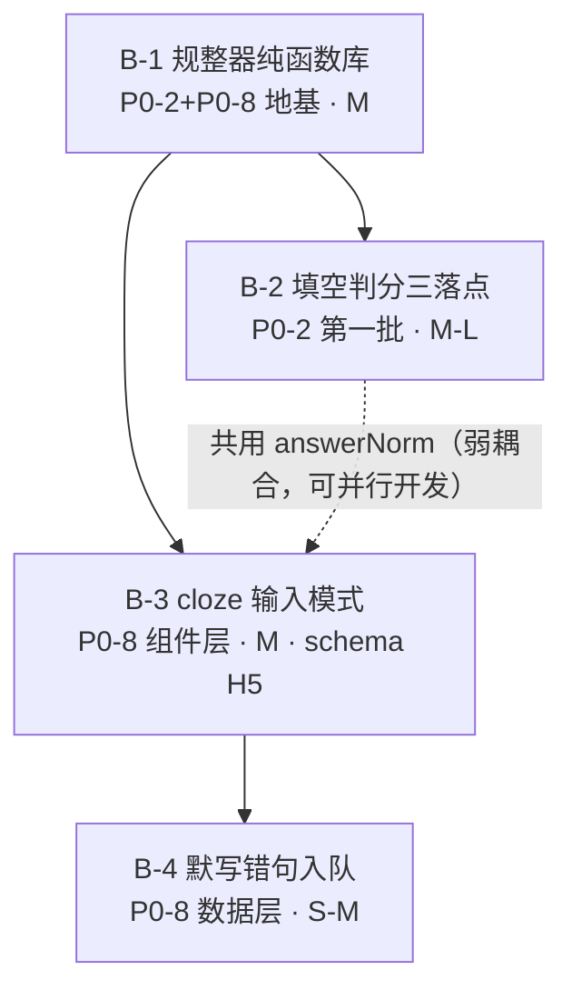
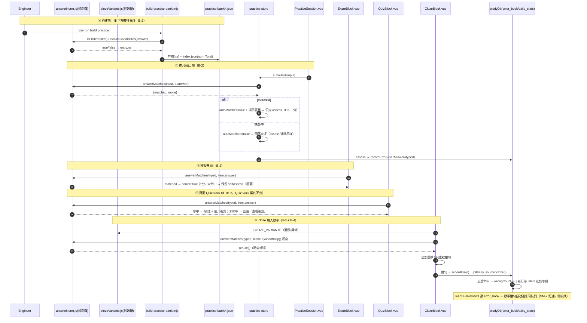
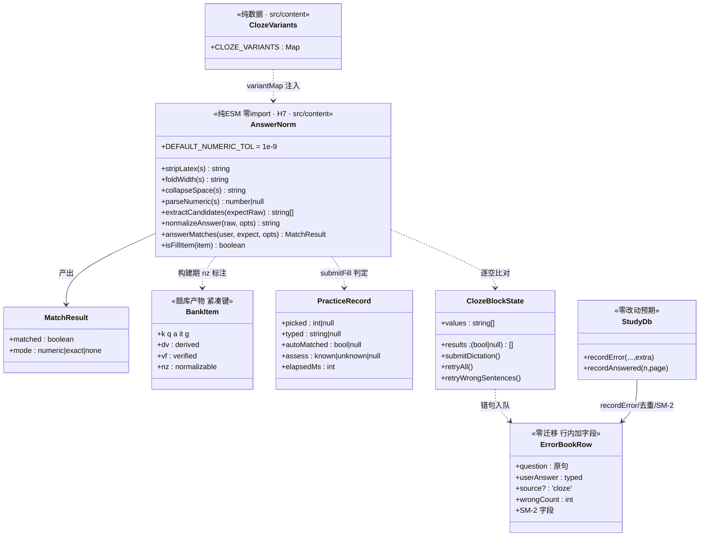

# 批 B 任务列表（填空规整判分第一批 + cloze 输入默写）—— 工程师照单实现版

> 状态：**规划定稿（未写代码）**。本文是 `implementation-roadmap.md` §2「批 B」的**细化落地版**，不推翻原分解，只把它拆到「可直接开工」的粒度（文件、接口、测试点、验收条、commit 划分）。
> 角色：架构师（高见远 / Gao）产出；供工程师直接照单实现，供 team-lead / 用户拍板 §7 的遗留点。
> 上游（已读并内化）：
> - `docs/proposals/implementation-roadmap.md` §0.2 硬约束 / §2 批 B / §5 数据结构变更 / §6 拍板结果
> - `协同交流/02_功能侧回函/2026-10-09_对内容侧17项需求的评审回应.md`（P0-2 / P0-8 验收标准，§3 P0-2「匹配失败回落自评」、P0-8「存量 cloze 保持点击揭晓」）
> - 批 A 先例（复用模式，不重造）：`src/content/judgeDerive.js`（纯函数单一真相源 + 双落点）、`build-practice-bank.mjs` 的 `dv/vf` 标注、`docs/proposals/batch-a-tasks.md` 全文
>
> **两条纪律贯穿全文**：① 数字、行号、接口一律以**本次实际读码**为准，不确定处标「待核实」；② 不写实现代码，只给「关键函数签名 + 伪代码级要点」。
> **任务数 = 4**（`B-1 / B-2 / B-3 / B-4`），≤ 5 硬上限；按**功能模块**分组，不按单文件拆。

---

## 0. 开工前必读：本次核查对上游的**更正与补充**（务必以本节为准）

> 以下为本次只读核查的实测结论（题库产物逐条扫描 + 源码复核）。**第 1 条直接改变规整器的形态设计**，若照抄上游会做出「判分率几乎为零」的空转规整器。

| # | 上游写法 | 实测事实（本仓库 HEAD） | 处理 |
|---|---|---|---|
| **更正 1** | 「规整判分 = 用户输入 vs 答案文本归一化后比对」 | **fill 题的 `answer` 绝大多数不是裸答案**，而是「值 + 解析」复合文本。实测样例：`\(a = 3\)（因为 \(2^3 = 8\)）。`、`\(S_5 = \frac{1\times(1-2^5)}{1-2}\)…`、`转折。"出淤泥而不染"中…`、`enable → configure terminal → …` | 规整器必须先做**期望值抽取**（extractCandidates：从复合答案文本中抽候选值），再做归一比对。判对口径**从严**（见 §0.1） |
| **更正 2** | 「`answerNorm` 生成到产物、运行时直接用」 | fill 题共 **51 条**（math 14 / chinese 26 / computer 11），`fillGradable = 0`；期望值抽取是**启发式**，预生成规整结果一旦算法升级就要重建产物 | **构建期只标注「可规整性」`nz`（布尔），不预生成规整结果**；规整必然运行时（学生输入实时比对），构建期标注仅供组卷统计 / M1 里程碑测算 |
| 补充 1 | 「chinese 309 题」 | 实测产物 chinese **348 题**（总 1393 → 1702，内容侧已有新增） | 批 A 建立的 gradable 锚点数字会漂移，**锚点用相对口径**（比例、差值），不锚绝对值 |
| 补充 2 | 「cloze 默写专项待内容侧」 | 全库**已有 1 处** cloze 使用：`src/content/chinese/05-文学常识/01-中国文学史.js`；`clozeItem` schema 只有 `text` 字段 | B-3 的输入模式开关 **存量缺省 = reveal**，天然兼容该页 |
| 补充 3 | 「cloze 默写结果入队通路待评估」 | `studyDb` **v7 已就绪**：`question_attempt` 表已建（`studyDb.js:180-193`）、`addAttempts/addAttempts 批写`已有（`:467-484`）；`recordError` 的 extra 透传 + `wrongCount` 自增已落地（`:728-754`）；`loadDueReviews` **只读 error_book**（`useSpacedReview.js:86-102`） | 默写错句入队走 **error_book（recordError）**，不走 `question_attempt`——理由与签名见 B-4 |
| 补充 4 | 「ClozeBlock 需要 page 上下文」 | `BlockRenderer.vue:26` 已把 `context` **透传给所有叶子区块**（`UnitView.vue:79-82` 传 `pageContext`），ClozeBlock 目前只是没声明该 prop | B-4 接 `context` **零渲染链改动** |

### 0.1 判对从严原则（本批规整判分的第一设计公理）

填空自动判分的错误分两类，代价完全不对称：

- **误判对**（false positive）：把错的判成对 → **污染学习数据、误导考生，不可接受**；
- **误判错**（false negative）：规整器覆盖不到 → 回落自评（评审 §3 P0-2 明确「不判错、不阻塞」）→ **代价≈现状**。

因此：

1. `answerMatches` 只有**命中候选值**才返回 `matched:true`；抽取不到候选 / 比对失败一律 `matched:false`（回落自评），**绝不**因为「形似」判对；
2. 数学多空 / 命令序列类（`enable → configure terminal → …`）第一批**不做**多空拆分比对，整体抽取不到单一候选 → 直接回落自评（分学科分批：数学优先，computer 序列题留给第二批）；
3. 每条判对路径必须有单测锚定；无法锚定的启发式（如「第一分句截取」）只允许作为**候选生成**（最终仍走精确/数值比对），不允许直接产生 `matched:true`。

### 0.2 「三落点」判分入口现状（实测，B-2 的改造地图）

| 落点 | fill 题现状 | 判分机制 | 回落自评点 |
|---|---|---|---|
| **练习会话**（`practice.js` + `PracticeSession.vue`） | `q.gradable=false` → 无输入，只「看答案」（`PracticeSession.vue:63`）→ 强制自评（`assess`，`:198-233`） | 无（自评） | **现有自评通路即回落点**：`assess('known'/'unknown')` 不动 |
| **页面内 QuizBlock** | `type:'fill'` 走「查看答案」分支（`QuizBlock.vue:60-62`） | 无（仅揭示） | 回落 = 回到「查看答案」分支，**不给自动判定**（QuizBlock 契约：不记错题本，批 A 拍板 #3 同款） |
| **模拟卷 ExamBlock** | 非选择题走 `selfAssess(i, true/false)`（`ExamBlock.vue:285-288`），计分 `answers[i].correct` | 无（自评计分） | 回落 = fill 匹配失败时**保留自评按钮**（`selfAssess` 不动） |

**双落点确认结论**：practice 会话、ExamBlock、QuizBlock 三处都改（B-2）；三处共用 `answerNorm` 同一纯函数（H7），与批 A `judgeDerive` 双落点同模式，但这里是**三**落点。

---

## 1. 总览：任务编号 / 依赖 / 顺序 / 预估

### 1.1 任务一览表

| 任务 | 对应需求 | 内容 | 依赖 | 预估 | 触碰 DB / schema |
|:--:|---|---|:--:|:--:|---|
| **B-1** | P0-2 + P0-8 共用地基 | 规整器纯函数库 `answerNorm.js`（期望值抽取 + 策略链比对）+ 通假字/异体字映射表 + 单测 | 无 | **M** | 否 |
| **B-2** | **P0-2 第一批** | 填空规整判分**三落点**（practice / ExamBlock / QuizBlock）+ 构建期 `nz` 可规整标注 | **B-1** | **M–L** | 否（题库产物加紧凑键 `nz`） |
| **B-3** | **P0-8 组件层** | ClozeBlock 输入模式（逐空比对 + 全部重默 / 只重默错句 + 移动端输入）+ schema/validateBlock 白名单 | **B-1** | **M** | **是（H5 白名单：`clozeBlock.mode` + `clozeItem.alts`）** |
| **B-4** | **P0-8 数据层** | 默写错句入 error_book（SM-2 自动打通）+ 答题计数 + 错题本「默写」标记 | **B-3** | **S–M** | 否（行内加字段） |

### 1.2 依赖图



> **读图**：`B-2` 与 `B-3` 互相独立（仅共享 B-1），**可并行开发**；`B-4` 必须等 `B-3`（入队动作挂在 ClozeBlock 输入模式的提交流程上）。

### 1.3 实现顺序建议（详见 §6）

```
① B-1（地基，纯函数零风险） → ② B-2（P0-2 三落点 + 产物重建） → ③ B-3 + B-4（P0-8，同改 ClozeBlock/schema，合一个 commit）
```

`B-1` 先行因为它**零 DB / schema 风险**，且是 B-2/B-3 的编译期依赖。

---

## 2. 逐任务卡

### 任务 B-1 · 规整器纯函数库（P0-2 / P0-8 共用地基）

**目标**：一个**零 import 纯函数库**，承载 P0-2 数值容差 / 分数↔小数 / LaTeX 剥离 / 全半角空格容错，以及 P0-8 语文场景的通假字/异体字容错（映射表可配置）。策略链形态：**剥 LaTeX → 全半角折叠 → 空白归一 → 期望值抽取 → 数值/精确比对**。判对从严（§0.1）。

**⚠️ 位置更正**：上游路线图写 `src/utils/answerNorm.js`；本次**改放 `src/content/answerNorm.js`**。理由：B-2 的构建脚本要 import 它做 `nz` 标注，必须遵守批 A `judgeDerive.js` 确立的「放 `src/content/`、零 import、构建脚本裸 Node 直接 import 不拖浏览器依赖链」纪律（`judgeDerive.js:8-13` 注释原文）。**H7：全库只此一份，禁止任何落点内联第二份正则/容差常量。**

**涉及文件**

| 动作 | 路径 | 说明 |
|---|---|---|
| 新增 | `src/content/answerNorm.js` | 纯 ESM、**零 import**、构建脚本 + 浏览器两端共用（H7） |
| 新增 | `src/content/clozeVariants.js` | 通假字/异体字映射表（**纯数据**，零逻辑）；初始只收语文默写高频组，预留增长 |
| 新增 | `tests/answer-norm.test.js` | 策略链全用例（含评审验收样例 `0.5`==`1/2`==`0.500`） |
| 新增 | `tests/cloze-variants.test.js` | 映射表形状 + 应用规则单测 |

**数据结构与接口签名**

```js
// ---- src/content/answerNorm.js（纯函数，零 import）----

/** 数值容差（相对误差上界）：0.5 与 1/2 的浮点表示差远小于此；可由 opts 覆盖 */
export const DEFAULT_NUMERIC_TOL = 1e-9

/** 剥 LaTeX 包裹：\(…\) / \[…\] / $$…$$ / $…$ → 内文；无包裹原样返回 */
export function stripLatex(s: string): string

/** 全角→半角折叠：ASCII 可见字符 + 常用标点；CJK 汉字不动（语文默写不受影响） */
export function foldWidth(s: string): string

/** 空白归一：移除全部空白字符（数学/语文答案中空格均无判分语义） */
export function collapseSpace(s: string): string

/**
 * 分数↔小数互认：'1/2' / '-3/4' / '0.500' / '.5' → number | null
 * 仅接受 严格 a/b（a、b 为整数或小数）与十进制；'π'、'√2' 等返回 null（本批不做符号数值）
 */
export function parseNumeric(s: string): number | null

/**
 * 期望值抽取（更正 1 的核心；启发式，只产候选、不判对）：
 * 从「值+解析」复合答案文本抽候选值，返回 0..N 个规范串
 * 步骤（有序，全去重）：
 *   1) 剥 LaTeX 取各段内文；段内含 '=' 取最右 RHS（`a = 3` → `3`）
 *   2) 剥尾部解说括号 （…）/(…)；
 *   3) 按句读（。；;!\n）切分取首个非空短句（语文短语型：`转折。…` → `转折`）
 *   4) 兜底：整串归一化结果本身也是候选
 * 多空/序列类（含 '→' 或多个填空标记）→ 返回空数组（§0.1 判对从严：第一批不判）
 */
export function extractCandidates(expectRaw: string): string[]

/** 单串全链路规整：stripLatex → foldWidth → collapseSpace → variantMap 逐字映射 */
export function normalizeAnswer(raw: string, opts?: { variantMap?: Record<string,string> }): string

/**
 * 判分唯一入口（三落点 + cloze 共用）：
 * @returns {{ matched: boolean, mode: 'numeric' | 'exact' | 'none' }}
 *   matched=true 仅当 user 与 extractCandidates(expect) 的某候选：
 *     - 双方 parseNumeric 成功 → |a-b| <= tol*max(1,|b|)（mode:'numeric'）
 *     - 或归一化后全等（mode:'exact'）
 *   抽取不到候选 / 全部不等 → { matched:false, mode:'none' }（调用方回落自评）
 */
export function answerMatches(
  userRaw: string,
  expectRaw: string,
  opts?: { numericTol?: number, variantMap?: Record<string,string> }
): { matched: boolean, mode: string }
```

```js
// ---- src/content/clozeVariants.js（纯数据，零逻辑）----
/** 键值方向：variant → canonical（两侧等价时归一到课本文选形；双向等价组写两条） */
export const CLOZE_VARIANTS: Record<string, string> = {
  // 示例（首批内容以语文默写高频通假为主，交内容侧增补）：
  // '说': '悦',   // 「学而时习之，不亦说乎」说/悦 通
  // '反': '返',   // 「寒暑易节，始一反焉」
  // ...
}
```

**关键实现要点**

1. **`foldWidth` 不折 CJK**：全角→半角只作用于 ASCII 区（数字/字母/`+-*/=().,:;?!` 等）与全角空格；汉字、日文假名等一字一码的字符原样——否则通假字映射会被先行破坏。
2. **`variantMap` 应用时机**：在 `collapseSpace` **之后**、比对**之前**，对 user 与 expect **两侧同映射**（对称变换，不引入方向性偏差）。
3. **`extractCandidates` 是候选生成器不是判分器**：它产出的每个候选仍要走 `numeric/exact` 精确比对；这保证启发式只会「漏判（回落自评）」不会「误判对」（§0.1）。
4. **`clozeVariants` 与 `answerNorm` 分文件**：映射表是**内容侧可增补的数据**，逻辑是功能侧代码——分开放才可能让内容侧「只改数据不动代码」（评审 §6.1 白名单精神）。
5. **容差语义**：用**相对误差**（`tol*max(1,|expect|)`），避免大数值（如 `1e8` 量级的科学计数答案）被绝对容差误杀；`tol` 可由 opts 覆盖，默认常量导出供测试锚定。

**测试要点（`tests/answer-norm.test.js` + `tests/cloze-variants.test.js`）**

- ① 评审验收锚点：`answerMatches('0.5','1/2')`、`('1/2','0.500')`、`('0.50','0.5')` → 全 `matched:true, mode:'numeric'`。
- ② LaTeX 剥离：`answerMatches('3','\\(a = 3\\)（因为 \\(2^3 = 8\\)）。')` → `matched:true`（RHS 抽取路径）。
- ③ 全半角/空格：`answerMatches('ｘ＝－１','x=-1')` → `matched:true`；`'1 / 2'` vs `'1/2'` → `matched:true`。
- ④ 语文短语：`answerMatches('转折','转折。"出淤泥而不染"中…')` → `matched:true, mode:'exact'`（首分句路径）。
- ⑤ 判对从严（反向锚定）：`answerMatches('4','\\(S_5 = \\frac{1(1-2^5)}{1-2}\\)…')`（多空/序列/抽不出候选）→ `matched:false, mode:'none'`；`answerMatches('悦','说通"悦"，意为愉快。')` 不得因 variantMap 把「说通悦」错折（映射只做等价替换，候选仍需比对命中）。
- ⑥ 容差边界：`|a-b|` 恰等于 `tol*max(1,|expect|)` 计 matched；超一位浮点噪声不计。大数值相对容差用例（如 `1e8` vs `1e8+1` → 不 matched，可配大 tol 时 matched）。
- ⑦ `parseNumeric` 负分数 / 假分数 / `'.5'` / `'π'`→null / `'1//2'`→null / 空串→null。
- ⑧ `clozeVariants`：键值均为单字或词、无重复键冲突（同 key 双写检测）；`normalizeAnswer('不亦说乎',{variantMap:CLOZE_VARIANTS})` → 逐字映射生效。

**验收标准**

- 评审 §3 P0-2 第一批：「数值容差 / 分数↔小数 / LaTeX 剥离 / 全半角空格容错」→ ①②③ 全过。
- P0-8 判分复用：「至少去空格/全半角/常见异体字与通假容错（可配置映射表设计）」→ ③⑦⑧ 覆盖，映射表独立文件可增补。
- H7：全库唯一一份规整逻辑（后续 B-2/B-3/B-4 均 import 本文件）。

---

### 任务 B-2 · 填空规整判分三落点 + 构建期可规整标注（P0-2 第一批）

**目标**：fill 题（`type==='fill'` 或题干含 `___` 填空标记）在三处获得**输入 + 自动判分**；匹配失败**回落自评，不判错、不阻塞**（H3 二分保持）；构建期给 fill 标注 `nz`（可规整性）供组卷统计与 M1 测算。数学优先——但本批代码不分学科，学科差异由 `extractCandidates` 的覆盖面自然体现（§0.1 第 2 条）。

**fill 判据**（对齐批 A「形态判据先行」教训，`type` 常被省略）：

```js
// 放 src/content/answerNorm.js 导出（两端同判据，勿内联）
export function isFillItem(item: { type?: string, question?: string }): boolean
// = item.type === 'fill' || /_{3,}/.test(item.question || '')
```

**涉及文件**

| 动作 | 路径 | 说明 |
|---|---|---|
| 改 | `src/stores/practice.js` | record 增 `typed/autoMatched`；新 action `submitFill`；`resultStats` 扩展（H3 口径见下） |
| 改 | `src/views/practice/PracticeSession.vue` | fill 题输入 UI + 提交判分 + 失败回落自评提示 |
| 改 | `src/components/blocks/ExamBlock.vue` | fill 输入 + 交卷时自动比对（对→计分/对；错→保留自评按钮） |
| 改 | `src/components/blocks/QuizBlock.vue` | fill 输入 + 命中→绿/红即时判定（同 judge 派生先例）；未命中→回落「查看答案」 |
| 改 | `scripts/build-practice-bank.mjs` | fill 条目构建期标 `nz`；`index.json` 增 `normTotal` / 学科级 `normalizable`；无新增 warn（本批无例外清单需求） |
| 改 | `src/content/practiceBank.js` | `BANK_ITEM_KEYS` 增 `nz:'normalizable'`；`normalizeBankItem` 展开 |
| 新增 | `tests/fill-grading.test.js` | 三落点共享逻辑 + resultStats 扩展 + 紧凑键单测 |
| 重生成 | `public/practice-bank/{math,chinese,computer,index}.json` | **提交产物**（批 A 补充 1 纪律，易漏！） |

**数据结构与接口签名**

```js
// ---- practice.js：会话 record 扩展（startSession 初始化处 :112-119）----
// record: { picked, revealed, assess, enterAt, elapsedMs, errorId,
//           typed: string|null,      // fill 输入原文（判分与 recordError.userAnswer 共用）
//           autoMatched: boolean|null } // null=未自动判；true/false=已判（false=未命中，回落自评）

// ---- practice.js：新 action（与 pickOption 平级）----
/**
 * fill 提交判分：仅 isFillItem(q) 且未自评时有效（幂等，防重复提交）
 * - matched → rec.typed=input; rec.autoMatched=true; rec.revealed=true（揭示参考答案）
 * - 未命中 → rec.typed=input; rec.autoMatched=false; rec.revealed=true;
 *            UI 提示「未自动匹配，请对照答案自评」（回落点 = 现有 assess 流程，零改动）
 * - 不直接写 assess / 不落库（assess 仍是单题完成唯一标志，D2 强制规则不动）
 */
function submitFill(input: string): void

// ---- practice.js：resultStats 扩展（:386-396，判分口径仍二分）----
// 自动判：picked !== null（选择/判断） OR autoMatched === true（fill 判对）
//   autoCorrect 同步扩展：picked===correctIndex || autoMatched===true
// 自评：其余（含 autoMatched===false 的 fill —— 回落自评即归自评口径，天然 H3 合规）
//   selfKnown 判定不变（assess==='known'）

// ---- practice.js：assess() 的 userAnswer 分支（:208-211）----
// fill 且 rec.typed 非空 → userAnswer = rec.typed（真实输入进错题本，替代 '自评：我还不会'）
```

```js
// ---- ExamBlock.vue ----
// answers[i] 扩展：{ answered, selected, correct, typed?: string }
// fill 题 UI：isFillItem(item) → 输入框 + 「提交」按钮（渲染在原 self-assess 位置上方）
//   提交 → answerMatches(typed, item.answer)：
//     matched  → answers[i] = { answered:true, selected:null, correct:true, typed }（自动计分，score 照加）
//     未命中   → 不置 correct，**保留 selfAssess 两个按钮**（回落自评），typed 留在框里
// buildExamAttempts（:318-338）：fill 已判行 picked:null, assess:null, correct:true/false；
//   attempt 行新增可选字段 `typed`（question_attempt 行内加字段，零迁移，随整行同步）
// 交卷错题循环（:436-455）：fill 错题 userAnswer 用 typed || '自评答错'
```

```js
// ---- QuizBlock.vue（对齐 judge 派生先例 :131-157）----
// fillState: reactive({}) —— { i: { typed, result: 'hit' | 'miss' | null } }
// isFillItem(item) 且非 choice/judge 派生 → 渲染输入 + 提交：
//   answerMatches 命中 → result:'hit'，绿/红反馈样式复用 .judge-feedback/.judge-ok/.judge-no，
//                        自动展开答案面板（opened[i]=true，与 pickChoice 同款）
//   未命中 → result:'miss'，**不判对错**，回到「查看答案」按钮路径（回落，QuizBlock 契约不变）
// 区块进度 stats（:107-112）：total 计入 fill 可判题
// 不记错题本、不计正确率（契约原文 :8 不动；见 §7 P-B5）
```

```js
// ---- build-practice-bank.mjs（collectBank 内，逐条 item，:210-262 附近）----
import { isFillItem, extractCandidates } from '../src/content/answerNorm.js'
// entry 增：
if (isFillItem(item)) {
  entry.nz = extractCandidates(aCap.text).length > 0   // 可规整性标注（启发式覆盖面，非判分承诺）
}
// applyVerifiedFlags（:78-112）增 normalizable 计数 → subjects[s].normalizable + 顶层 normTotal
```

```js
// ---- practiceBank.js ----
export const BANK_ITEM_KEYS = {
  // ... 既有键不变 ...
  nz: 'normalizable' // fill 题构建期标注：期望值抽取非空（B-2，统计口径；缺省不写）
}
// normalizeBankItem 追加：item.normalizable = raw.nz === true
```

**关键实现要点**

1. **H3 二分贯穿**：fill 判对进 `autoCount`，fill 未命中回落自评进 `selfCount`——`resultStats` 的两个分支互斥、不合并（`practice.js:379-407` 的注释契约保持）。
2. **assess 仍是单题完成唯一标志**（D2 强制规则）：fill 判对后用户仍需点「我会了」/「我还不会」才能下一题——与批 A practice 会话内判断题「点选判分后仍需自评」完全同构，**不引入**「判对自动完成」新规则（避免两套会话收口逻辑）。
3. **ExamBlock 计分口径**：fill `matched → correct:true` 直接计分（`item.score`）；未命中时**不预扣分**，交给自评按钮定 `correct`——与现有非选择题「自评计分」同权。
4. **构建期只标 `nz`，不预生成规整结果**（更正 2）：`extractCandidates` 是启发式，算法升级不应要求重建产物；产物里存「可规整性」布尔足够组卷统计（`composePaper` 后续可选优先 nz 题）与 M1 测算。
5. **产物重建 + 提交**：改完 `build-practice-bank.mjs` / `practiceBank.js` 必须跑 `npm run build:practice` 并提交 4 个产物文件（批 A 风险表同款缓解）。
6. **H5 不触发**：`nz` 是**产物字段**不进内容 schema；本任务不触碰 `src/content/**` 数据页与 `schema/content-schema.json`——`validate:content` 天然零新增报错（工程师实测确认）。

**测试要点（`tests/fill-grading.test.js`）**

- ① `isFillItem`：`type:'fill'` → true；无 type 但题干含 `______` → true（覆盖省略 type 的存量）；选择题/判断题 → false。
- ② `submitFill` 判对路径：record 增 `typed/autoMatched=true`、`revealed=true`、assess 仍 null；重复提交幂等（第二次 no-op）。
- ③ `submitFill` 未命中：`autoMatched=false`、不抛错、后续 `assess('unknown')` 正常落库且 `userAnswer === typed`。
- ④ `resultStats`：构造 1 选择判对 + 1 fill 判对 + 1 fill 回落自评 + 1 自评 → `autoCount=2, selfCount=2`（H3 锚定）；fill 判对计入 autoCorrect。
- ⑤ `normalizeBankItem`：`nz:true → normalizable===true`；缺省 `false`。
- ⑥ 构建断言：`index.json` 含 `normTotal` 且 ≤ fill 总数（51±容差，内容会漂移用相对口径）；math 的 normalizable ≥ 「数值型」样例数（锚定 2 条实测样例）。
- ⑦ ExamBlock `buildExamAttempts`：fill 判对行 `correct:true, assess:null, typed` 有值（行内新字段不破坏旧断言）。

**验收标准**

- 评审 §3 P0-2：「第一批（数值容差/分数↔小数/LaTeX 剥离/全半角空格容错）+ 匹配失败回落自评，不判错」→ B-1 测试 + 本卡 ②③④ 满足。
- 路线图 B-1：「构建期可选预生成 → 收敛为标注 `nz`（更正 2，待 §7 P-B4 确认）」。
- 批 A 拍板 #3 精神：纯函数多落点复用 ✅（本批三落点）。
- M1 里程碑：`index.json` 的 `normTotal` 可直接用于「填空可规整量测算」（路线图附：待核实项闭环）。

---

### 任务 B-3 · cloze 输入模式（P0-8 组件层）

**目标**：`ClozeBlock` 新增 `input` 模式——空位可输入 → 提交**逐空比对**（复用 B-1 `answerNorm` + `clozeVariants`）→ 逐空标对错；提供「全部重默」「只重默错句」；**存量缺省保持「点击揭晓」零变化**（向后兼容，评审 §3 P0-8 原文）。移动端输入体验专门处理。

**cloze 数据结构扩展（H5 白名单，一次走完）**

```jsonc
// schema/content-schema.json（两处增量）
// ① clozeBlock 的 if/then：block 级开关
{ "if": { "properties": { "type": { "const": "cloze" } } },
  "then": { "required": ["items"],
    "properties": {
      "items": { "type": "array", "items": { "$ref": "#/definitions/clozeItem" } },
      "mode": { "enum": ["reveal", "input"],
                "description": "交互模式：reveal 点击揭晓（缺省，存量兼容）| input 输入默写" }
    } } }
// ② clozeItem：可接受答案别名（多音/异写/通假由 clozeVariants 兜，alts 只放内容侧认定的等价答案）
//    "clozeItem": { "required": ["text"], "properties": {
//      "text": { … 原有 … },
//      "alts": { "type": "array", "items": { "type": "string" }, "minItems": 1,
//                "description": "该空位的其他可接受答案（与 {{}} 内主答案并列判对）" } } }
```

**涉及文件**

| 动作 | 路径 | 说明 |
|---|---|---|
| 改 | `src/components/blocks/ClozeBlock.vue` | `mode:'input'` 分支：空位渲染 `<input>`、逐空比对、结果条 + 重默操作；`reveal` 分支**零改动** |
| 改 | `schema/content-schema.json` | 上白名单（如上）；**流程纪律：先在本交流区知会内容侧再合入**（评审 §6.1） |
| 改 | `src/utils/validateBlock.js` | cloze case 增：`mode` 非法值报 schema 兜底；`alts` 元素为空串报错（「空串=本想删」纪律）；`alts` 内含 `{{`/`}}` 报错（禁止嵌套挖空） |
| 新增 | `tests/cloze-input.test.js` | 解析 / 比对 / 重默状态机单测（见测试要点） |

**数据结构与接口签名**

```js
// ---- ClozeBlock.vue（script setup 内）----

// 空位答案集合：主答案 + alts（parseCloze 后逐空装配）
//   blankAnswerOf(item, segIndex) → { mains: string[], alts: string[] }
//   判定：answerMatches(typed, main, { variantMap: CLOZE_VARIANTS }).matched
//         OR alts.some(a => answerMatches(typed, a, { variantMap }).matched)

// 状态（input 模式）：
// values: ref<string[]>      // 每空输入（items 内多句平铺为全局空位序）
// results: ref<(boolean|null)[]>  // 每空判定：null=未提交
// sentenceHasWrong(i): boolean    // 「只重默错句」按句（item）粒度过滤

// actions：
// submitDictation(): void   // 逐空 answerMatches → 填 results；不发请求、不落库（B-4 挂接点）
// retryAll(): void          // results 清空 + values 清空 + 焦点回第一空
// retryWrongSentences(): void // 仅清「含错空的句子」的 values/results；对的句子保持已判态展示
```

**关键实现要点（含移动端约定）**

1. **开关形态：block 级数据字段 `mode`**（理由见 §7 P-B1）：内容侧按块决定——默写专项页标 `mode:'input'`，公式/命令补全类保留缺省 reveal。**缺省（字段缺失）= 'reveal'，渲染路径与改造前完全一致**（`parseCloze` / `revealed` Set 逻辑原样保留），存量兼容自动成立（补充 2：现有唯一 cloze 页不受影响）。
2. **逐空比对在提交时一次完成**，不做逐键实时判定（移动端软键盘组合输入/联想会导致中间态误判）；提交前允许自由修改任意空。
3. **输入框统一属性（全站约定，写进 §4 共享知识）**：`type="text"`、`inputmode` 默认、`autocapitalize="off"`、`autocorrect="off"`、`spellcheck="false"`、`autocomplete="off"`、`font-size ≥ 16px`（防 iOS 聚焦缩放）、容器挂 `data-no-swipe`（与 UnitView/PracticeSession 手势体系兼容）。
4. **软键盘触达**：`@focus` 时 `scrollIntoView({ block: 'center', behavior: 'smooth' })`；空位行高 ≥ 44px 触控目标；`enterkeyhint="next"` + Enter 跳下一空、最后一空 Enter = 提交（桌面键盘流）。
5. **「只重默错句」语义**：句（item）粒度——句内任一空错 → 整句重默；全对句冻结展示（绿标），避免误触丢状态。**不加**「单空重默」（粒度过碎，语文默写以句为单位）。
6. **比对口令**：`variantMap: CLOZE_VARIANTS` 固定传入（cloze 是语文场景）；alts 与主答案同权判对。判定结果只在本组件内存态，**本任务不落库**（B-4 职责）。
7. **validateBlock 语义规则**（Node CI + 编辑器两端同一份，`:298-318` cloze case 内追加）：`mode` 给了非法值由 schema 拦，校验器补 human-readable 提示；`alts` 空串元素报错；`alts` 元素含 `{{`/`}}` 报错。
8. **CSP / H1 自查**：无动态 import、无 eval；纯组件内逻辑。

**测试要点（`tests/cloze-input.test.js`）**

- ① `parseCloze` 既有行为回归：`{{答案}}` 切分、未闭合 `{{` 原样保留（现实现 `:47-59` 的锚定用例）。
- ② blankAnswerOf：主答案 + `alts` 并集；无 alts 时仅主答案。
- ③ submitDictation：构造 3 句 5 空，2 空 typed 命中（含一个全角变体、一个通假变体）→ results 对应位 true，其余 false；句粒度 `sentenceHasWrong` 正确。
- ④ retryAll / retryWrongSentences：状态机断言（对的句冻结、错的句清空、焦点复位标志）。
- ⑤ reveal 兼容：`mode` 缺省时组件行为与改造前快照一致（不出现任何 input 元素）。
- ⑥ validateBlock：alts 空串 → 报错；alts 含 `{{` → 报错；mode:'input' 合法不报。
- ⑦ schema：`mode:'typo'` → JSON-Schema 校验失败（CI 关卡路径）。

**验收标准**

- 评审 §3 P0-8：「输入模式为可选形态；存量 cloze 保持点击揭晓不变（向后兼容）；判分复用 P0-2 规整逻辑；移动端输入体验专门处理」→ 全部满足。
- 路线图 B-2：「schema 走白名单 H5：`clozeItem` 增输入模式标记 + validateBlock」→ 满足（形态收敛为 block 级 `mode`，见 §7 P-B1）。
- 「全部重默 + 只看错的那句」→ ③④ 覆盖。

---

### 任务 B-4 · 默写错句入队 + SM-2 打通（P0-8 数据层）

**目标**：input 模式提交后，**含错空的句子**自动入错题本（error_book），经 `recordError` 的 SM-2 初始字段**自动进入复习队列**（`loadDueReviews` 只读 error_book，零额外接线）；同句去重 + `wrongCount` 自增复用既有机制；错题本里可识别「默写」来源。

**通路评估结论（team-lead 关键问题 5 的答案）**：走 **error_book（`recordError`）**，不走 `question_attempt`。理由：

1. **SM-2 队列的物理存储就是 error_book**（`useSpacedReview.js:86-102` 按 `reviewed/nextReviewDate` 过滤）——入 error_book 即零代码打通 SM-2；入 `question_attempt` 反而要在 C-1 复习器里再造一条合流逻辑；
2. `recordError` 已有**同句去重 + `wrongCount` 自增**（`studyDb.js:728-741`）与 **extra 透传**（`:751` `Object.assign(error, extra)`）——行内加字段零迁移、`engine.js` 零改动，与批 A 归因体系（`reason/kp`）天然同构；
3. `question_attempt` 的语义是「组卷会话/考试的单题作答流水」（供耗时统计），默写不是组卷会话，混入会污染 D-1 仿真统计口径。若未来要默写耗时分析，再以 `source:'cloze'` 独立评估（本批不做，记 §7 P-B2）。

**涉及文件**

| 动作 | 路径 | 说明 |
|---|---|---|
| 改 | `src/components/blocks/ClozeBlock.vue` | 声明 `context` prop（BlockRenderer 已透传，零渲染链改动）；submitDictation 后对错句调 `recordError` + `recordAnswered` |
| 改 | `src/views/ErrorBookView.vue` | 错题行显示「默写」来源角标（读 `source==='cloze'`）；无其他改动 |
| 改 | `src/stores/studyDb.js` | **预期零改动**（recordError extra 透传已覆盖）；若测试暴露缺省字段再补——本卡按零改动验收 |
| 新增 | `tests/cloze-enqueue.test.js` | 入队 / 去重 / 复习队列可见性单测 |

**数据结构与接口签名**

```js
// ---- ClozeBlock.vue：入队（submitDictation 内，判定完成后）----
// 句粒度入队（与 recordError 去重键 subject+question+fileKey 对齐；question = 原句文本）：
// for each sentence i where sentenceHasWrong(i):
//   await db.recordError(
//     context.subject, context.unitNum,
//     items[i].text,                                   // question：原句（含 {{}} 标记的原文）
//     answers joined '；',                              // correctAnswer：该句各空答案
//     typed joined '；' || '默写未作答',                  // userAnswer：学生实际输入
//     '默写专项',                                        // explanation
//     { fileKey: context.fileKey, fileTitle: context.fileTitle,
//       unitTitle: context.unitTitle, source: 'cloze' } // extra 透传（含来源标记）
//   )
// await db.recordAnswered(提交空位数, { fileKey: context.fileKey })  // 答题计数（一次提交一笔）
// 落库失败：console.error + 不阻断结果展示（批 A「落库不阻断做题」同款容错）
```

```js
// ---- error_book 行（零迁移，行内新增）----
{ /* …既有字段… */
  source: 'cloze'   // 来源标记：'cloze' = 默写入队；练习/考试入队无此字段（undefined）
}
```

**关键实现要点**

1. **入队时机 = 提交判定后一次性完成**，与结果展示同帧；**重复提交同句**走 `recordError` 去重分支（`wrongCount` 自增、不产生重复行）——「全部重默」再错不会刷出重复错题。
2. **全对不入队**；部分错句**整句入队**（句是语文默写的学习单位，也与去重键粒度一致）。
3. **归因衔接**：默写错句入队后 `reason` 缺省（undefined）——P0-4 归因层的触发场景是「自评不会」，默写是机器判定，**本批不弹 ReasonChips**（非目标，避免提交流程多一步打断）；错题本里可后补归因，`attributeError` 通路现成。记 §7 P-B2 供拍板。
4. **C-1 前瞻**：C-1 复习器单页（P0-6）落地后，默写错句与普通错题同队列、同四档评分——本批不需要任何预埋，只保证 `error_book` 行形状兼容（普通错题字段全齐）。
5. **context 缺省容错**：`context` 可能为空对象（ClozeBlock 在容器区块内也会被透传，但防御式处理）；缺 `fileKey` 时**不入队**只提示（无 fileKey 的去重会退化为单元粒度，宁缺勿错——对齐 practice.js `:212-213` 注释纪律）。

**测试要点（`tests/cloze-enqueue.test.js`）**

- ① 提交 3 句、2 句含错空 → `getAllErrors()` 增 2 行，行含 `source:'cloze'`、SM-2 初始字段（`easeFactor:2.5, reviewed:false` 等）。
- ② 同句再次提交（全部重默再错）→ `duplicated:true`，行数不变、`wrongCount` 1→2。
- ③ 全对提交 → error_book 无新增。
- ④ 复习队列可见性：入队后 `loadDueReviews()` 结果包含该行（「从未复习」分支，SM-2 打通锚定）。
- ⑤ `recordAnswered` 计数：当日 daily_stats.questionsAnswered 增加。
- ⑥ context 无 fileKey → 不入队、无异常。

**验收标准**

- 路线图 B-2：「默写结果进错题/复习队列（与 SM-2 打通）」→ ①④ 满足。
- 评审 §3 P0-8 与批 A 体系衔接：error_book 行内加字段零迁移、engine.js 零改动 ✅；`wrongCount` 去重自增复用 ✅。
- 向后兼容：reveal 模式不产生任何入队行为（submitDictation 仅 input 模式可达）。

---

## 3. 关键程序调用流（sequenceDiagram）



## 3.5 关键结构（classDiagram）



---

## 4. 跨任务共享知识（工程师必读，防漂移）

1. **规整器单一真相源（H7）**：`src/content/answerNorm.js`（**不是**路线图写的 `src/utils/`——理由见 B-1 位置更正）+ `src/content/clozeVariants.js`。**禁止**在 practice.js / ExamBlock.vue / QuizBlock.vue / ClozeBlock.vue / build 脚本内联任何规整正则、容差常量、通假映射。
2. **判对从严公理（§0.1）**：`answerMatches` 未命中一律回落，**绝不**新增「模糊判对」路径；每个 `matched:true` 分支要有单测锚定。
3. **H3 二分口径扩展**：自动判集合 = 「选择/判断点选（picked≠null）」∪「fill 判对（autoMatched===true）」∪「cloze 逐空判定（cloze 不进 resultStats，独立展示）」；fill 未命中回落自评。自评通路（assess / selfAssess）**一行不改**。
4. **cloze 数据结构扩展（定稿）**：block 级 `mode:'reveal'|'input'`（缺省 reveal）+ item 级 `alts:string[]`（可接受答案别名）；通假/异体不走 alts、走 `clozeVariants`（数据与内容解耦）。alts 禁空串、禁 `{{}}` 嵌套。
5. **移动端输入统一约定**（B-3 起，后续任何输入框沿用）：`autocapitalize/autocorrect/spellcheck/autocomplete` 全关、`font-size ≥ 16px`、容器 `data-no-swipe`、focus 时 `scrollIntoView({block:'center'})`、触控目标 ≥ 44px、`enterkeyhint` 引导换空/提交。
6. **与批 A 体系的衔接点**：错句入队 = `recordError(extra)`（A-3 的 reason/kp/wrongCount 通路原样复用）；`question_attempt` 本批**只**在 ExamBlock fill 判分行加可选 `typed` 字段（行内加字段）；无 DB 升版、无 `ENTITIES` 变更。
7. **产物纪律**：B-2 改完必须 `npm run build:practice` 并提交 4 个产物文件；`index.json` 新增 `normTotal`。
8. **硬约束自查**：H1（无动态 import/eval）✅、H2（不动 site.js）✅、H3（二分）✅、H4（node v22 跑测）✅、**H5（B-3 的 schema 白名单须先在协同交流区知会内容侧再合入）**、H6（`validate:content` + `lint --max-warnings 0` 每 commit 必跑）、H7（上文第 1 条）。

---

## 5. 风险表（每任务 1–3 条 + 缓解）

| 任务 | 风险 | 影响 | 缓解 |
|:--:|---|---|---|
| **B-1** | `extractCandidates` 启发式**误判对**（把解说文本当答案） | 污染学习数据（不可接受） | 候选只产不改判；`matched` 必须过 numeric/exact 精确比对；反向锚定用例 ⑤；灰度期关注错题本 userAnswer 抽查 |
| **B-1** | 全半角折叠破坏通假字映射 / 中文标点语义 | 语文题误判 | `foldWidth` 不折 CJK（单测锚定）；variantMap 在折叠**后**应用且两侧对称 |
| **B-2** | practice 会话「判对仍需自评」被用户误解为 bug | 体验疑问 | 文案明示「已自动判定，请确认」；与批 A 判断题行为完全一致（不是新规则） |
| **B-2** | 忘记重生成/提交产物 | nz 标注不生效、统计失真 | CI 检查清单 + `normTotal` 断言在旧产物上会失败 |
| **B-2** | ExamBlock fill 自动计分与「仿真统计」口径冲突（D-1） | 结算数字歧义 | fill 判对 = `correct:true`，与选择题同口径进 D-1 的 autoCorrect；question_attempt.typed 可回溯 |
| **B-3** | schema 白名单未走流程直接合入 | 违反 H5、内容侧不知情 | 任务卡显式列出「先知会再合入」步骤（共享知识 8） |
| **B-3** | 移动端软键盘遮挡提交按钮 / 输入框错位 | 默写不可用（P0-8 主场景是移动端） | scrollIntoView + sticky 操作条 + 真机验收项；`font-size≥16px` 防缩放 |
| **B-3** | alts 与通假字职责混淆（内容侧把通假写进 alts） | 映射双写漂移 | 共享知识 4 明确分工；validateBlock 不做该语义检查（无法机判），靠内容约定 |
| **B-4** | context 缺 fileKey 时错误入队 → 去重退化 | 错题重复/错挂 | 缺 fileKey 不入队（宁缺勿错）；单测 ⑥ |
| **B-4** | 「全部重默」反复提交刷 wrongCount | 计数失真 | 去重分支本就自增不新增行——**这是设计行为**（同句反复默错=反复遗忘的证据），文案无需处理 |

---

## 6. 给工程师的实现顺序建议（commit 划分）

| commit | 内容 | 任务 | 关卡（提交前本地必跑） |
|:--:|---|---|---|
| **C1** | 规整器纯函数库 + 通假字映射表 + 全部单测 | **B-1** | `npx vitest run tests/answer-norm.test.js tests/cloze-variants.test.js` → `npm run lint` |
| **C2** | 填空判分三落点 + 构建期 nz 标注 + **产物重建提交** | **B-2** | `npm run build:practice` → `npm run validate:content` → `npx vitest run tests/fill-grading.test.js` → `npm run lint` |
| **C3** | cloze 输入模式（schema/validate/组件）+ 错句入队 | **B-3 + B-4** | `npm run validate:content` → `npx vitest run tests/cloze-input.test.js tests/cloze-enqueue.test.js` → `npm run lint` |

- C2 与 C3 **可并行开发**（仅共享 C1），但 C3 内 B-3/B-4 必须同 commit（同改 `ClozeBlock.vue` + 同次 schema 白名单变更，拆开会产生「schema 有 mode 但组件未用」的中间态）。
- 每个 commit 后全量 `npm test` + `npm run lint --max-warnings 0` + `npm run validate:content`（CI 硬关卡预告）。
- C3 合入前在**协同交流区知会内容侧**：① schema 白名单两项（`clozeBlock.mode` / `clozeItem.alts`）+ 书写样例；② 请内容侧在默写专项页使用 `mode:'input'` 并按需补 `alts`（等待内容侧，不阻塞功能合入——存量缺省 reveal 兼容）。

---

## 7. 待 team-lead / 用户拍板的点（本文件收敛，非阻塞开工）

| # | 事项 | 建议 | 触发谁 |
|:-:|---|---|---|
| **P-B1** | **cloze 输入模式开关形态**：block 级数据字段 `mode` vs 全局设置 | **block 级数据字段**：① 内容形态差异大（默写专项 vs 公式补全），全局一刀切必然错配；② 全局设置需持久化/同步面，成本高收益低；③ 缺省 reveal 天然向后兼容；④ 与 `alts` 同一次 schema 白名单走完 | 用户（关键） |
| **P-B2** | **默写错句入队通路**：error_book vs question_attempt | **error_book（recordError）**：SM-2 队列物理存储就是 error_book（零接线打通）；去重/wrongCount/extra 透传现成；question_attempt 是组卷作答流水，混入污染 D-1 口径。默写耗时分析如未来需要，再独立评估 | 用户（关键） |
| **P-B3** | 多答案语法：`clozeItem.alts` 字段 vs `{{a|b}}` 管道 | **alts 字段**：`\|` 在 LaTeX（绝对值/集合）与语文标点中语义冲突风险高；字段显式、schema 可校验。代价：内容侧书写稍繁琐 | team-lead 确认即可 |
| **P-B4** | 构建期标注收敛为 `nz`（布尔），**不预生成**规整结果（偏离路线图「可选预生成 answerNorm」） | **是**：期望值抽取是启发式，预生成结果会随算法升级反复重建产物；布尔标注满足组卷统计 + M1 测算 | team-lead 确认即可 |
| **P-B5** | 页面 QuizBlock fill 判分是否写错题本 | **不写**（维持 QuizBlock「不记错题本」契约，同批 A P-A1 拍板逻辑）；错题落库只在练习/考试/默写链路 | 用户（倾向建议即可） |
| **P-B6** | 第一批判分率预期管理：fill 仅 51 条且多为复合文本，`extractCandidates` 覆盖后**可判对的实际增量有限**（预计十几条量级，待实测） | 提前对齐预期：本批价值在**打通规整判分机制**（cloze 默写、后续第二批集合/区间、内容侧扩量均复用），而非 fill 判分率暴涨；M1 口径用 `normTotal` 实测后修正 | 用户（预期管理） |

> 除 P-B1 / P-B2 外，其余均**不阻塞开工**（可按建议默认执行，有异议再改）。P-B1/P-B2 若按建议执行亦不阻塞——建议直接采纳，本文件按建议方案编写。

---

## 附：本文件核对过的代码事实（行号为本次实测，可能随后续提交漂移）

| 事实 | 证据 |
|---|---|
| ClozeBlock 现状 = 点击揭晓，`parseCloze` / `revealed` Set | `src/components/blocks/ClozeBlock.vue:47-76` |
| cloze 内容仅 1 处使用 | `src/content/chinese/05-文学常识/01-中国文学史.js`（grep `type: 'cloze'` 全库唯一命中） |
| `clozeItem` schema 仅 `text` 字段 | `schema/content-schema.json` definitions.clozeItem |
| validateBlock cloze 配对校验 | `src/utils/validateBlock.js:298-318` |
| fill 实测：math 14 / chinese 26 / computer 11，fillGradable=0；answer 为「值+解析」复合文本 | 本文件 §0 扫描 + 样例（`\(a = 3\)（因为…）`、`转折。…`、`enable → configure terminal`） |
| BlockRenderer 向叶子区块透传 context；UnitView 传 pageContext | `src/components/BlockRenderer.vue:26`；`src/views/UnitView.vue:79-82` |
| practice 会话 records 初始化 / pickOption 锁定 / assess 强制自评 | `src/stores/practice.js:112-119,175-183,198-233` |
| practice recordError userAnswer 组装（fill 接入点） | `src/stores/practice.js:208-221` |
| resultStats H3 二分 | `src/stores/practice.js:379-407` |
| ExamBlock 自评 / 交卷错题循环 / attempts 组装 | `src/components/blocks/ExamBlock.vue:285-288,434-455,313-341` |
| QuizBlock judge 派生先例 + 非选择题「查看答案」 | `src/components/blocks/QuizBlock.vue:131-157,60-62` |
| studyDb v7 已建 question_attempt（+S2 预留表） | `src/stores/studyDb.js:26-27,180-193` |
| addAttempts 单事务批写 / recordError extra 透传 + wrongCount 自增 | `src/stores/studyDb.js:467-484,728-754` |
| loadDueReviews 只读 error_book（SM-2 队列） | `src/composables/useSpacedReview.js:86-102` |
| `BANK_ITEM_KEYS` / `normalizeBankItem` 单一来源 | `src/content/practiceBank.js:59-99` |
| 构建脚本 nz 接入点（collectBank 逐条 item） | `scripts/build-practice-bank.mjs:210-262` |
| judgeDerive 零 import 纪律注释（B-1 位置更正依据） | `src/content/judgeDerive.js:8-13` |
| 实测：chinese 348 题（上游写 309，内容侧已扩量） | 题库产物扫描 |

> 本文件为功能实现侧的技术规划，不构成对考试成绩或录取结果的承诺；考试内容、结构与分值以浙江省教育考试院当年发布为准。
