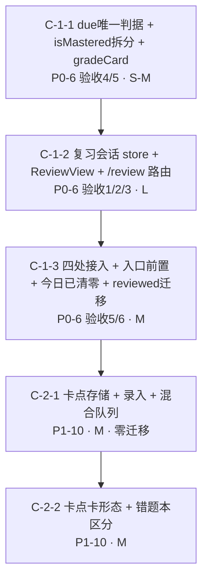
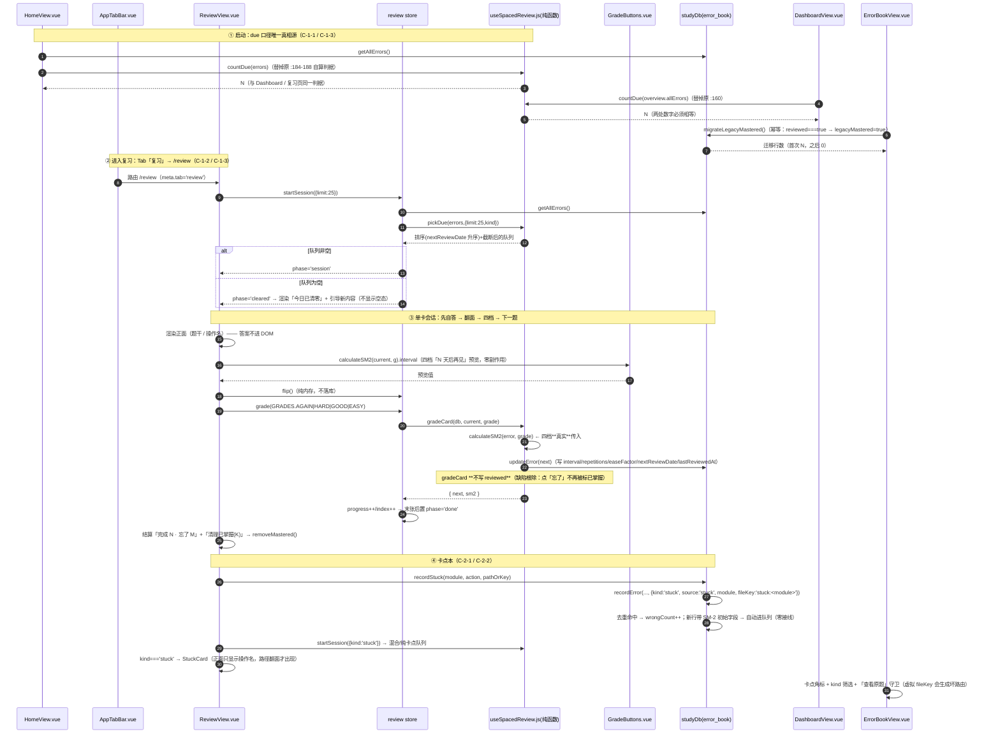

# 批 C 任务列表（复习闭环：复习器单页 + 卡点本接入 SM-2）—— 工程师照单实现版

> 状态：**规划定稿（未写代码）**。本文是 `implementation-roadmap.md` §2「批 C」的**细化落地版**，不推翻原分解，只把它拆到「可直接开工」的粒度（文件、接口、测试点、验收条、commit 划分）。
> 角色：架构师（高见远 / Gao）产出；供工程师直接照单实现，供 team-lead / 用户拍板 §7 的遗留点。
> 上游（已读并内化）：
> - `docs/proposals/implementation-roadmap.md` §0.2 硬约束 / §2 批 C / §4 里程碑 M2 / §5 数据结构变更 / §6 拍板结果
> - `docs/功能与布局改进需求_内容侧提出.md:112-123`（P0-6 六条验收标准）、`:39/:155/:208`（P1-10 卡点本）
> - `docs/prd-mobile.md` §5.4「与复习 Tab 的数据流（SM-2 衔接）」三条实现注意点
> - 批 A / 批 B 先例（复用模式，不重造）：`docs/proposals/batch-a-tasks.md`、`batch-b-tasks.md` 全文；`src/content/judgeDerive.js` / `src/content/answerNorm.js` 的「零 import 纯函数 + 多落点」纪律；`src/stores/studyDb.js` 行内加字段零迁移通路
>
> **两条纪律贯穿全文**：① 数字、行号、接口一律以**本次实际读码**为准（关键校验一律 Python 脚本复核 —— 本环境 grep 漏命中，结论以 Python 为准），不确定处标「待核实」；② 不写实现代码，只给「关键函数签名 + 伪代码级要点」。
> **任务数 = 5**（`C-1-1 / C-1-2 / C-1-3 / C-2-1 / C-2-2`），≤ 5 硬上限；按**功能模块**分组，不按单文件拆。

---

## 0. 开工前必读：本次核查对上游的**更正与补充**（务必以本节为准）

> 以下为本次只读核查的实测结论（HEAD = `a6de74a`；工作树 52 项改动**全部**是 `src/content/**` 内容页，src 代码侧与 HEAD 一致）。**更正 1–4 直接改变任务分解**：照抄上游会漏掉一半工作量，或重复派一批 A 已完成的活。

| # | 上游写法 | 实测事实 | 处理 |
|---|---|---|---|
| **更正 1** | 「合并**两处** due 口径（Dashboard 与复习页）」 | 实测全库**四处** due 实现，判据互不相同：① `useSpacedReview.js:92-96`（`loadDueReviews` 过滤）② `useSpacedReview.js:123-131`（`loadReviewStats.dueToday`）③ `DashboardView.vue:160`（`todayDue`）④ `HomeView.vue:184-188`（`dueCount`） | 四处全部收敛到 `isDue()` 一处（H7）；见 §0.1 |
| **更正 2** | 「四档评分**真实传入** `calculateSM2`（**不再写死**）」 | `reviewCard()` 全库**零调用点**（实测仅 `:149` 定义 + `:195` 导出）；`calculateSM2` 的真实调用点只有 `ErrorBookView.vue:271`，传 `GRADES.GOOD` 常量 | 这不是「改」，是**首次接线**；本批新建唯一写库入口 `gradeCard`，见 §0.2 |
| **更正 3** | 「移除写死 `grade=4`（`ErrorBookView.vue:227`）」 | 实测 `:271` **已经是** `...calculateSM2(err, GRADES.GOOD)`，且带批 A 留痕注释（`:266-270`）；裸 `, 4)` 全库 **0 命中** | **降级为回归验证项**（C-1-3 测试 ⑤），**不重复派活**；本批只把它换成统一入口 `gradeCard`，**行为不变** |
| **更正 4** | 「C-2 卡点本存储**待定**（复用 error_book 加 kind vs 新仓库）」 | 路线图 §6 **拍板结果 #5（`:324`）已定：复用 `error_book`（加 `kind` 字段，零迁移）**。C-2 正文 `:180` 的「待定」是拍板前残留写法 | 以 §6 为准：**存储方案已拍板**。本文把它降为「已拍板、照做」，但仍给出完整二选一对比（§7 P-C5）供用户确认，并提真正未决的子项 |
| **更正 5**（实施期回改） | 测试要点 ⑦ / ⑤ / ⑨ 里「同一**初始行**用四档 → 至少 2 个不同 `interval`」「`EASY` 与 `GOOD` 在初始行产生不同 `nextReviewDate`」 | **这两条预期在 SM-2 下不可能成立**：经典 SM-2 的成功档间隔倍数与档位无关。实测 `calculateSM2` 初始行（`repetitions=0`）四档 `interval` **全为 1**（`easeFactor` 才有差：AGAIN 1.70 / HARD 2.36 / GOOD 2.50 / EASY 2.60） | 改锚：⑦ 用**已复习两轮的行**（`repetitions=2, interval=6`）得 `[1,15,15,15]` 取「≥2 个不同值」；⑤ 改锚 `easeFactor` 差异（端到端读库）；⑨ 同步改。**验收点本身不受影响**（AGAIN 重置 + 四档 EF 分化 + 下一轮起间隔拉开，仍成立） |
| **补充 1** | 未提（team-lead 指出） | **缺陷**：`reviewCard():156` 无条件写 `error.reviewed = true`，而 `reviewed` 在 UI 上 =「已掌握」（`ErrorBookView.vue:114` 绿色边框 / `:216-217` 计数 / `:232-233` 筛选）。→ 用户在复习页点「**忘了**」，该卡**反被标成已掌握**、绿色、从「待复习」筛选里消失 | 本批必修。方案见 §0.2（`reviewed` 语义拆分 + 迁移口径） |
| 补充 2 | 「参考 `PracticeSession.vue`（421 行）一屏一题骨架」 | 实测 421 行；骨架：顶栏进度 `:12-18` / 题面 `:27-33` / 可判分区 `:36-72` / **默认折叠**的答案卡 `:75-80` / 底部 sticky 动作条 `:84-107` / 退出二次确认 `:110-123` / 二级归因层 `:126-131` | C-1-2 直接照此骨架搭 `/review`，复用其 `--space-*` 与 48px 触控约定 |
| 补充 3 | 未提 | `HomeView.vue:178` 用运行时动态 import 取 store：`await import('@/stores/studyDb')` | C-1-3 改**静态 import**（H1 精神：能静态就静态；且省掉首页一次 chunk 往返） |
| 补充 4 | 未提 | 卡点本用 `kind` 字段，会与 `src/components/blocks/blockTypes.js` 的 `kind`（**内容角色** concept/point/…）**同名不同义** | 沿用 `kind`（已拍板），取值域限定 `'stuck'`，两处注释互相点名防误合并（§4 共享知识 4） |
| 补充 5 | 未提 | `error_book` 在 `studyDb.js:83` 有 `reviewed` **索引**。本批新增字段走 JS 过滤，**不需要**新建索引、**不需要**升版 | 零升版确认（DB 停在 v7，`:33`） |
| 补充 6 | 未提 | 组件级测试先例：`tests/cloze-enqueue.test.js:164-180` 用 `@vue/test-utils` + `fake-indexeddb` 直接 mount 组件并调 `useSpacedReview()`，断言 `dueReviews` 含 `source:'cloze'` | C-1-2 / C-2-2 的 UI 行为走同款组件级测试 |
| 补充 7 | 多处文档写「198 行 / 300 行」 | 实测真实行数：`useSpacedReview.js` **199**、`DashboardView.vue` **301**、`ErrorBookView.vue` 435、`HomeView.vue` 427、`AppTabBar.vue` 297、`router/index.js` 140、`studyDb.js` 886、`practice.js` 542、`tests/useSpacedReview.test.js` 126 | 本文所有行号以本次实测为准 |

### 0.1 due 口径：四处实现逐条对照与统一决议（本批最易埋雷点）

**四处现状（实测原文语义）**

| # | 位置 | 判据 | 排除 `reviewed===true`？ | 含「从未复习」？ | 缺 `nextReviewDate` 时 |
|:-:|---|---|:-:|:-:|---|
| ① | `useSpacedReview.js:92-96` | `reviewed===false && !lastReviewedAt` → true；否则 `nextReviewDate <= today` | 否 | 是（显式分支） | 有 `lastReviewedAt` → **false** |
| ② | `useSpacedReview.js:123-131` | 同 ①（`dueToday` 累加） | 否 | 是 | 同 ① |
| ③ | `DashboardView.vue:160` | `!e.reviewed && e.nextReviewDate <= ds` | **是** | 间接（见下注） | `undefined <= ds` → false |
| ④ | `HomeView.vue:184-188` | `e.reviewed` → false；`reviewed===false && !lastReviewedAt` → true；否则 `(nextReviewDate \|\| '') <= ds` | **是** | 是（显式分支） | `'' <= ds` → **true** |

> 注：③ 之所以「间接」包含从未复习，是因为 `recordError` 建行时即写 `nextReviewDate = 创建日`（`studyDb.js:748`），新卡当天就满足 `创建日 <= 今天`。

**统一决议 —— due 判据唯一真相源（H7）**

```js
// ---- src/composables/useSpacedReview.js（新增导出；全库 due 判据只此一份）----

/** 单次复习上限（P0-6 验收 2 要求 20–30，取中位 25）。单一来源，禁止视图里另写 20/30 */
export const REVIEW_SESSION_LIMIT = 25

/** 「已掌握」唯一判据（与 removeMastered() :177 同口径，H7）—— 见 §0.2 */
export function isMastered(e)

/**
 * 该错题行今日是否到期 —— due 判据唯一真相源（H7）
 * @param {Object} e error_book 行
 * @param {string} [today] YYYY-MM-DD
 */
export function isDue(e, today = getDateStr()) {
  if (!e) return false
  if (isMastered(e)) return false          // 已掌握出列（与 removeMastered 同一口径）
  const nd = e.nextReviewDate || ''
  // 缺排期（遗留行）一律视为到期：漏掉一张卡的代价是遗忘曲线中断，
  // 远大于「多复习一张」的代价 —— 与判分侧「误判对不可接受」同一种从严取向
  if (!nd) return true
  return nd <= today
}

export function countDue(list, today = getDateStr())   // 计数（Dashboard / 首页用）
export function pickDue(list, opts = {})               // 排序 + 截断（复习页用）
//   opts: { limit = REVIEW_SESSION_LIMIT, kind = null, today = getDateStr() }
//   排序：nextReviewDate 升序（排期最早 = 逾期最久），同排期按 createdAt 升序
```

**三条关键理由（工程师务必理解，别照旧代码改回去）**

1. **不能再用 `!e.reviewed` 当「待复习」判据。** `reviewed` 是「用户手动标过已掌握」的语义（见 §0.2），用它挡 due 会让**所有复习过的卡永不再进队列**，SM-2 复现机制彻底失效 —— 这正是 P0-6「现状」第 1 条「SM-2 是伪参数、间隔不可信」的根因之一。
2. **不需要额外的「从未复习优先」分支。** `recordError` 建行即写 `nextReviewDate = 创建日`（`studyDb.js:748`），从未复习的老卡排期最早，按升序自然排最前；缺排期的遗留行由 `!nd → true` 兜住。
3. **已掌握（isMastered）才出列**，而不是「复习过就出列」。这与既有 `removeMastered()`（`:177`，`repetitions>=3 && interval>=7`）是同一口径，避免「两套掌握标准」（`docs/prd-mobile.md:824` 已警示过全站「掌握」语义容易分裂）。

#### 0.1.1 口径变更前后 Dashboard 数字的差值说明（team-lead 点名要的量化）

新口径在存量数据上按行逐类对照（设迁移已完成，见 §0.2）：

| 行类别 | 旧 ③ `DashboardView.vue:160` | 新 `isDue` | Δ |
|---|---|---|:-:|
| A. `reviewed===true`（用户手动点过「已掌握」） | 排除 | 排除（迁移后 `isMastered=true`） | **0** |
| B. `reviewed===false` 且 `nextReviewDate <= today` | 计入 | 计入 | **0** |
| C. `reviewed===false` 且 `nextReviewDate > today` | 排除 | 排除 | **0** |
| D. `reviewed===true` 但真未掌握 | —— | **迁移后此类不存在**（迁移把 A 类全部翻成 `legacyMastered=true`） | **0** |
| E. 缺 `nextReviewDate`、有 `lastReviewedAt`、`reviewed===false` | 排除（③）/ 计入（④）/ 排除（①） | **计入** | **+1/行** |
| F. 复习页上线后新产生的行 | 计入规则同新口径（`reviewed` 恒 false） | 计入 | **0** |

**结论（可直接写给用户的量化说明）**：

- **「今日待复习」数字在存量数据上 Δ = 0，不变。** 唯一可能变化的 E 类（缺排期的遗留行）在当前数据生产链路中**不产生** —— `recordError` 必写 `nextReviewDate`（`studyDb.js:748`），批 A/B 之后的新行全部带排期。
- **真正会变的只有「行为」，不是「存量数字」**：
  1. **缺陷修复**：复习时点「忘了」的卡**留在**待复习（旧行为：`reviewed=true` → 跑到「已掌握」、绿色、从待复习消失）。用户感知是「bug 修好了」。
  2. **SM-2 首次真正运行**：此前 `reviewCard` 零调用，间隔从未被真实评分驱动过。复习页上线后，评 GOOD 的卡 **1 天后**回来、评 EASY 的更久 —— 「今日待复习」数字会随复习行为**逐渐**变化，这是 P0-6 要的效果本身。
- **可验证**：`tests/review-consistency.test.js` 用构造数据集（含 A–E 五类各若干行）直接算出 Δ，不需要摸真实 IndexedDB；工程师跑测试即得数。

### 0.2 `reviewed` 语义拆分方案（含缺陷修复与存量迁移口径）

**问题**：`reviewed` 一个布尔被三种语义共用 ——

| 语义 | 写入方 | 读取方 |
|---|---|---|
| 「已复习过」 | `reviewCard():156`（**零调用，但是本批要启用的路径**） | —— |
| 「已掌握」 | `ErrorBookView.markMastered():272` 写 `true`；`markRelearn():285` 写 `false` | `:114` 绿色边框、`:216-217` 计数、`:232-233` 筛选 tab、`:157` 按钮显隐 |
| 「初始未复习」 | `studyDb.js:746` 写 `false` | `tests/cloze-enqueue.test.js:107`、`tests/practice-store.test.js:106` 断言 |

→ **缺陷**：复习页点「忘了」→ `reviewed=true` → 错题本把它当「已掌握」（绿色、移出待复习）。

**方案（字段方案 + 判据 + 迁移，三步走，全部零升版）**

1. **新增 `legacyMastered` 布尔（行内加字段，零迁移）**：承载「用户当年手动点过已掌握」这一**存量标注**，与 SM-2 真掌握分开。
2. **判据唯一真相源**：
   ```js
   export function isMastered(e) {
     if (!e) return false
     // ① 真掌握：SM-2 口径，与 removeMastered() :177 完全一致
     if ((e.repetitions || 0) >= 3 && (e.interval || 0) >= 7) return true
     // ② 存量手动标注：reviewed===true 在旧口径下只能由「已掌握」按钮产生（reviewCard 全库零调用，
     //    实测），故它就是用户的手动标注；legacyMastered 是迁移固化后的副本，
     //    两者并存期间都认，保证「迁移没跑完也不会显示错」
     return e.legacyMastered === true || e.reviewed === true
   }
   /** 已复习过（与「已掌握」彻底分开） */
   export function hasReviewed(e) { return !!e.lastReviewedAt }
   ```
3. **`reviewed` 退役为「只读历史字段」**：
   - `gradeCard`（新评分入口）**不再写 `reviewed`**，只写 `lastReviewedAt` → **缺陷根除**；
   - `recordError`（`studyDb.js:746`）**保持写 `reviewed: false`**（不动，两个既有测试断言依赖它）；
   - `markMastered` 保持写 `reviewed: true`（用户手动标注，语义正确）。

**存量数据迁移口径**

```js
// ---- src/stores/studyDb.js 新增 action（行内加字段，零升版、engine.js 零改动）----
/**
 * 一次性迁移：把旧口径的 reviewed===true 固化为 legacyMastered=true
 * 幂等（legacyMastered === undefined 才写）；迁移完成后恒返回 0
 * @returns {Promise<number>} 本次迁移行数
 */
async migrateLegacyMastered() {
  await this.init()
  const all = await this.getAllErrors()
  const todo = all.filter((e) => e.reviewed === true && e.legacyMastered === undefined)
  for (const e of todo) await dbPut('error_book', { ...e, legacyMastered: true })
  return todo.length
}
```
- **触发点**：`ErrorBookView.onMounted` 与 `/review` 的 `startSession` 各调一次（幂等，成本≈0；首轮写入行数 = 存量已掌握行数，通常个位数到几十）。
- **为什么不是「按 SM-2 真口径重算」**：存量 `reviewed===true` 的行 `repetitions` 大多为 1（`markMastered` 只评过一次 GOOD），若按真口径重算会**全部掉回「待复习」**，等于推翻用户当年的标注 —— 尊重存量标注，只在新评分上启用真口径。

**UI 三处改法（保证不破坏既有筛选 tab 与绿色样式）**

| 位置 | 现状 | 改为 | 用户可见变化 |
|---|---|---|---|
| `ErrorBookView.vue:216` | `filter((e) => !e.reviewed).length` | `filter((e) => !isMastered(e)).length` | 标签「待复习」不变；存量数字**不变** |
| `ErrorBookView.vue:217` | `filter((e) => e.reviewed).length` | `filter(isMastered).length` | 标签「已掌握」不变；存量数字**不变** |
| `ErrorBookView.vue:220` | `masteredRate` 同上 | 换 `masteredCount` | 掌握率**不变** |
| `ErrorBookView.vue:114` | `:class="{ mastered: err.reviewed }"` | `:class="{ mastered: isMastered(err) }"` | 绿色左边框样式**保留**；存量行照样绿 |
| `ErrorBookView.vue:157` | `v-if="!err.reviewed"`（显示「已掌握」按钮） | `v-if="!isMastered(err)"` | 未掌握的卡仍可标已掌握 |
| `ErrorBookView.vue:232-233` | 按 `reviewed` 过滤 | 按 `isMastered` 过滤 | 两个筛选 tab **保留**、语义不变 |
| `ErrorBookView.vue:211-212` | `{key:'unreviewed'}` / `{key:'reviewed'}` | **key 保持不动**（防 `statusFilter` 默认值与既有行为漂移），只换判据 | 无 |

> ⚠️ **`markRelearn`（`:282-295`）必须补写 `legacyMastered: false`** —— 它重置 SM-2（`repetitions:0`），但若该行已被迁移固化 `legacyMastered:true`，`isMastered` 仍返回 true，用户点「仍需复习」会**没反应**。这是本方案最容易漏的一处。

---

## 1. 总览：任务编号 / 依赖 / 顺序 / 预估

### 1.1 任务一览表

| 任务 | 对应需求 | 内容 | 依赖 | 预估 | 触碰 DB / schema |
|:--:|---|---|:--:|:--:|---|
| **C-1-1** | **P0-6 验收 4/5** | due 判据唯一真相源（`isDue`/`countDue`/`pickDue`）+ `isMastered` 语义拆分 + 统一评分入口 `gradeCard` + 纯函数单测 | 无 | **S–M** | 否（行内加字段，零升版） |
| **C-1-2** | **P0-6 验收 1/2/3** | 复习会话 store + `ReviewView.vue` 单卡会话 + `/review` 路由 + `GradeButtons` 四档组件 | **C-1-1** | **L** | 否 |
| **C-1-3** | **P0-6 验收 5/6** | 四处消费点改接唯一真相源 + 复习入口前置首页顶部 + 空队列「今日已清零」+ `reviewed` 迁移与 UI 三处改造 + 一致性测试 | **C-1-2** | **M** | 否 |
| **C-2-1** | **P1-10 存储/队列** | 卡点存储（`recordStuck` → error_book `kind:'stuck'`）+ 录入组件 + 混合队列 `kind` 筛选 | **C-1-3** | **M** | 否（行内加字段，零迁移） |
| **C-2-2** | **P1-10 卡面形态** | 卡点卡组件（只显示操作名、隐藏路径）+ 复习页按 kind 渲染 + 错题本区分展示 | **C-2-1** | **M** | 否 |

> **批 C 全程零 DB 升版、零 `engine.js` 改动**：DB 停在 v7（`studyDb.js:33`），预留表 `content_cache/content_meta` 已在 `:188-191`。**不触发 H5**（不动 `src/content/**` 数据页、不动 `schema/content-schema.json`）。

### 1.2 依赖图



> **读图**：批 C 是一条**严格串行链**。C-2 依赖 C-1 是需求原文明确的（「P1-10 依赖 P0-6 的复习队列先落地」——`docs/功能与布局改进需求_内容侧提出.md:208`）。C-1-1 先行因为它是**零 UI、零 DB 风险**的纯函数地基，且 C-1-2 / C-1-3 编译期依赖它。

### 1.3 实现顺序建议（详见 §6）

```
① C-1-1（纯函数地基） → ② C-1-2 + C-1-3（复习页 + 四处接入，同一 commit） → ③ C-2-1 + C-2-2（卡点本，同一 commit）
```

---

## 2. 逐任务卡

### 任务 C-1-1 · due 判据唯一真相源 + `reviewed` 语义拆分 + 统一评分入口（P0-6 验收 4 / 5）

**目标**：① 把**四处**各写各的 due 判据收敛成**一处**纯函数 `isDue`；② 拆开「已复习过」与「已掌握」两种语义，根除「点『忘了』反被标已掌握」的缺陷；③ 落地**唯一**的四档评分写库入口 `gradeCard`。本任务是**纯逻辑层**，不碰 UI，零 DB 升版 / 零 schema 风险。

**涉及文件**

| 动作 | 路径 | 说明 |
|---|---|---|
| 改 | `src/composables/useSpacedReview.js` | 新增导出 `REVIEW_SESSION_LIMIT` / `GRADE_META` / `isMastered` / `hasReviewed` / `isDue` / `countDue` / `pickDue` / `gradeCard`；`loadDueReviews`（`:92-96`）与 `loadReviewStats`（`:123-131`）改调 `isDue`/`isMastered`；`reviewCard`（`:149-170`）降为旧名转调，**不再写 `reviewed`** |
| 新增 | `tests/review-due.test.js` | due 判据 + 队列排序截断 + 掌握语义拆分单测 |
| 改 | `tests/useSpacedReview.test.js` | 扩「四档 → 间隔映射真实变化」断言（P0-6 验收 4 的算法侧证据） |

**数据结构与接口签名**

```js
// ---- src/composables/useSpacedReview.js ----

/** 单次复习上限（P0-6 验收 2：20–30，取中位 25）。单一来源，禁止视图另写 20/30 */
export const REVIEW_SESSION_LIMIT = 25

/** 四档元信息（UI 文案与 grade 值的唯一来源，防按钮与 GRADES 漂移） */
export const GRADE_META = [
  { grade: 0, key: 'AGAIN', label: '忘了', tone: 'danger'  },
  { grade: 3, key: 'HARD',  label: '困难', tone: 'warning' },
  { grade: 4, key: 'GOOD',  label: '良好', tone: 'success' },
  { grade: 5, key: 'EASY',  label: '简单', tone: 'primary' }
]

export function isMastered(e)   // 见 §0.2（真掌握 OR 存量手动标注）
export function hasReviewed(e)  // !!e.lastReviewedAt —— 「已复习过」，与「已掌握」彻底分开
export function isDue(e, today = getDateStr())   // 见 §0.1
export function countDue(list, today = getDateStr())
export function pickDue(list, opts = {})         // 不改入参，返回截断后的新数组

/**
 * 统一评分入口（本批唯一写库点，H7）
 *  - 不改入参（防 UI 持有被改写对象导致「看起来没保存」）
 *  - 不碰 sessionStats（会话统计是 review store 的职责，见 C-1-2）
 *  - **不写 reviewed**（该字段退役为只读历史；写 lastReviewedAt 表示「已复习过」）—— 缺陷根除点
 * @param {Object} db studyDb store 实例（便于测试直接传入，无需 mock Pinia）
 * @returns {Promise<{ next: Object, sm2: { interval, repetitions, easeFactor, nextReviewDate } }>}
 */
export async function gradeCard(db, error, grade)

/** @deprecated 旧名保留兼容：转调 gradeCard 并额外累加 sessionStats（行为与改造前一致，唯独不再写 reviewed） */
async function reviewCard(error, grade)
```

```js
// ---- loadDueReviews 改造后（:86-102）----
async function loadDueReviews(subject = null) {
  // 既有 try/catch + await db.init() + getAllErrors() 不动
  const errors = await db.getAllErrors()
  const scoped = subject ? errors.filter((e) => e.subject === subject) : errors
  dueReviews.value = pickDue(scoped)   // ← 判据与排序全部来自 pickDue（H7）
}

// ---- loadReviewStats 改造后（:118-133 的 forEach 内）----
errors.forEach((e) => {
  /* 学科计数不动 */
  // dueToday 与复习页队列同一判据，杜绝「统计说 5 张、进去只有 3 张」
  if (isDue(e, today)) stats.dueToday++
  else {
    stats.reviewed++
    if (isMastered(e)) stats.mastered++     // ← 与 removeMastered() 同口径
  }
})
// 注：newCards 语义保留（e.reviewed === false && !e.lastReviewedAt），但不再影响 dueToday
```

**关键实现要点**

1. **纯函数、零 Vue 依赖**（对齐 `judgeDerive.js` / `practiceMetrics.js` 既有形态）：`isMastered/isDue/countDue/pickDue` 不 import 任何东西、不碰 store，构建脚本 / 测试 / 视图共用。
2. **`pickDue` 不改入参**（`[...list]` 后排序），与 `practiceMetrics.topSlowest` 既有约定一致。
3. **`gradeCard` 不改入参**：`next = { ...error, ...sm2, lastReviewedAt: Date.now(), reviewCount: (error.reviewCount||0)+1 }` → `await db.updateError(next)` → 返回 `{ next, sm2 }`。调用方用返回的 `next` 刷新本地列表。
4. **`gradeCard` 不写 `reviewed`**（§0.2 缺陷根除）。`reviewCard` 旧名保留：转调 `gradeCard` + 累加 `sessionStats`，但**同样不写 `reviewed`**。
5. **`reviewed` 的注释要写清退役原因**：「旧语义『已复习过』已由 `lastReviewedAt` 承担；旧语义『已掌握』已由 `isMastered()` 承担。本字段仅历史数据保留，新代码**只读不写**」——防后人又拿它当判据。
6. **排序口径写进注释**：「排期最早的先复习（= 逾期最久），同排期按入本时间」——可解释性要求，用户问「为什么先出这张」时要有答案。
7. **H1 自查**：无动态 import、无 eval / `new Function`。

**测试要点（`tests/review-due.test.js` + 扩 `tests/useSpacedReview.test.js`）**

- ① `isDue`：新建行（`nextReviewDate = 今天`）→ `true`；明天 → `false`；昨天 → `true`。
- ② `isDue` 对 **已复习过**（`lastReviewedAt` 有值、`reviewed` 未写）且排期到期的行 → **必须 `true`**（反向锚定：防后人把 `reviewed` 判据改回来）。
- ③ `isDue` 缺 `nextReviewDate` → `true`（漏卡从严）；**已掌握**（`repetitions:3, interval:7`）→ **`false`**（与 `removeMastered` 同口径）。
- ④ **`isMastered` 语义拆分**：
  - `{reviewed:true, repetitions:1}` → `true`（存量手动标注，不能掉回待复习）；
  - `{reviewed:false, repetitions:3, interval:7}` → `true`（真掌握）；
  - `{reviewed:false, lastReviewedAt:now, repetitions:0}`（**点了「忘了」**）→ **`false`**（缺陷回归锚点，最重要的一条）；
  - `{legacyMastered:true}` → `true`；`{legacyMastered:false, reviewed:false, repetitions:0}` → `false`。
- ⑤ `hasReviewed`：`lastReviewedAt` 有值 → `true`，与 `isMastered` **互不相关**（构造「复习过但未掌握」与「掌握但无 lastReviewedAt」两组交叉用例）。
- ⑥ `pickDue`：10 行不同排期 → 顺序 = 排期升序、同排期按 `createdAt` 升序；`limit:3` 长度 3；入参不被改动。
- ⑦ **四档 → 间隔真实变化**（扩进 `tests/useSpacedReview.test.js`，P0-6 验收 4 的算法侧证据）：
  - ⚠️ **不能用初始行**（见 §0 更正 5）：初始行（`repetitions=0`）四档 `interval` 恒为 `1`，拿不到 2 个不同值。改锚**已复习两轮的行**（`repetitions=2, interval=6, easeFactor=2.5`）→ `AGAIN` 1 / `HARD` 15 / `GOOD` 15 / `EASY` 15 → 得 2 个不同值；
  - `AGAIN` 的 `repetitions` 归零且 `nextReviewDate` = 明天；`EASY` 的 `easeFactor` > `GOOD`（初始行即可锚，这才是四档在初始行的真实分化维度）。
- ⑧ `GRADE_META` 与 `GRADES` 同源：`GRADE_META.every(m => GRADES[m.key] === m.grade)`。
- ⑨ `gradeCard`：`await gradeCard(db, err, GRADES.EASY)` → `next.nextReviewDate` 前进、`reviewCount +1`、**`next.reviewed` 不存在/保持原值（未被写 true）**；入参 `err` 未被改动；`getAllErrors()` 读回同一行。
- ⑩ 回归：`tests/cloze-enqueue.test.js:107`（`reviewed===false`）与 `:164-180`（默写错句 `loadDueReviews` 可见）、`tests/practice-store.test.js:106` **必须仍通过**。

**验收标准**

- P0-6 验收 4「四档评分必须真实传入 `calculateSM2`」→ ⑦（算法侧）+ C-1-2 的 UI 接线（调用侧）。
- P0-6 验收 5「合并两处 due 口径」→ 全库 due 判据只剩 `isDue` 一处；可用 Python 全库扫描断言：`nextReviewDate <=` 字面量只出现在 `useSpacedReview.js`。
- 缺陷修复 → ④ 第三组用例通过（`gradeCard` 不写 `reviewed`）。
- H7：无第二份 due 判据 / 掌握判据 / 间隔常量。

---

### 任务 C-1-2 · 复习会话 store + `/review` 单页 + 路由（P0-6 验收 1 / 2 / 3）

**目标**：落地**单卡会话式**复习页 `/review`：进入即取到期队列（上限 `REVIEW_SESSION_LIMIT`）→ 逐卡「先自答 → 翻面 → 四档评分 → 下一题」；评分**真实驱动 SM-2**（调 `gradeCard`）；会话结算给出「完成 N / 忘了 M」。骨架照抄 `PracticeSession.vue`（421 行）。

**涉及文件**

| 动作 | 路径 | 说明 |
|---|---|---|
| 新增 | `src/stores/review.js` | Pinia setup store：复习会话编排（队列 / 下标 / 阶段 / 进度） |
| 新增 | `src/views/ReviewView.vue` | 单卡会话页 |
| 新增 | `src/components/GradeButtons.vue` | 四档评分按钮（含「下次间隔」预览） |
| 改 | `src/router/index.js` | 新增 `/review` 路由（含 `meta.tab`） |
| 新增 | `tests/review-session.test.js` | 会话状态机 + 组件级交互测试 |

**数据结构与接口签名**

```js
// ---- src/stores/review.js（Pinia setup store，与 practice.js 同形态）----
export const useReviewStore = defineStore('review', () => {
  const db = useStudyDbStore()

  const queue      = ref([])       // 本轮队列（已按 pickDue 排序 + 截断）
  const index      = ref(0)
  const phase      = ref('idle')   // 'idle' | 'loading' | 'session' | 'cleared' | 'done'
  const flipped    = ref(false)    // 当前卡是否翻面（仅内存态，不落库）
  const kindFilter = ref(null)     // null = 全部；'error' | 'stuck'（C-2-1 接线）
  const progress   = ref({ total: 0, done: 0, again: 0 })

  const current   = computed(...)   // queue[index] || null
  const remaining = computed(...)   // queue.length - index
  const isLast    = computed(...)

  /**
   * 开始一轮复习：迁移 → 拉 error_book → pickDue（排序+截断）→ 定 phase
   * 空队列 → phase='cleared'（**不进空态**，由视图渲染「今日已清零」）
   */
  async function startSession({ limit = REVIEW_SESSION_LIMIT, kind = null } = {})

  function flip()          // 翻面（纯内存）
  async function grade(g)  // gradeCard(db, current, g) → progress++ / 推进 index → 末尾置 'done'
  function quit()          // 退出并复位（不写库；已评过的卡逐张已落库）

  return { queue, index, phase, flipped, kindFilter, progress, current, remaining, isLast,
           startSession, flip, grade, quit }
})
```

```js
// ---- src/components/GradeButtons.vue ----
// props: { error: Object, disabled?: boolean }
// emits: { pick: (grade: number) => void }
// 渲染 GRADE_META 四档（忘了/困难/良好/简单），每档下方一行「N 天后再见」
//   预览值 = calculateSM2(props.error, m.grade).interval —— 纯函数求值，零副作用（防误触发写库）
// 移动端：min-height ≥ 44px，横向四等分（沿用批 B 共享知识 5 的按钮/输入约定）

// ---- src/router/index.js（新增，插在 dashboard 路由之前即可，顺序无语义）----
{
  // 复习：单卡会话（P0-6）—— 一级 Tab「复习」直达行动页，错题本降为二级入口（§7 P-C1）
  path: '/review',
  name: 'review',
  meta: { tab: 'review', tabOrder: 2 },
  component: () => import('@/views/ReviewView.vue')
}
```

**`ReviewView.vue` 页面结构（照 `PracticeSession.vue` 骨架）**

```
/review
├─ 顶栏：进度条 + 「{{ index + 1 }}/{{ queue.length }}」 + 退出（有评分时二次确认）
├─ phase='loading'：加载中
├─ phase='cleared'（队列为空）：
│    「✅ 今日已清零」卡 + 副文案「到期错题已全部复习完，可以安心学新内容」
│    + 引导按钮：去学习新内容（→ /） / 去做题（→ /practice）
│    + （C-2-1 接线后）「+ 记一个卡点」次级入口
├─ phase='session'：
│    ├─ 卡头角标：学科 / unitTitle / 错次（wrongCount>1）/ 归因 reason / kp / 默写角标（source==='cloze'）
│    ├─ 正面：题干 <MathJaxRender :text="current.question" />
│    ├─ 未翻面：底部「翻面看答案」（对应 P0-6 的「先自答」阶段）
│    └─ 已翻面：正确答案 / 解析 / 我的作答（userAnswer）+ 底部 <GradeButtons @pick="grade" />
└─ phase='done'：结算「完成 N 张 · 忘了 M 张」
     + 「再来一组」（仍有到期时）/ 「去学新内容」（→ /）
     + 「清理已掌握（K）」→ removeMastered()（二次确认；K = isMastered 行数）
```

**关键实现要点**

1. **翻面前不得渲染答案**：与 `PracticeSession.vue:75-80` 同款纪律（`v-if` 答案卡）。注释写清理由：复习的价值来自**检索练习**，先给答案等于取消检索。
2. **只有四档评分写库**：翻面 / 切卡 / 退出全是纯内存。写库失败 `console.error` + 提示可重试，**不静默跳过**（批 A「落库不阻断」同款容错）。
3. **不做自动判分（H3）**：复习页**不**引入 `answerNorm` / 选项点选 / 自动判对。四档评分就是自评，与客观判分是两条互斥口径，混进来会重演「判分/自评不分」的老问题。
4. **归因信息上卡面（闭环价值点）**：卡头展示 `reason`（批 A 落库的六选一）、`kp`、`wrongCount`、`source==='cloze'` 的「默写」角标。这些信息批 A/B 已落库却**从未在任何界面露面** —— 复习卡是最合适的露出位，用户复习时看到「当时为什么错」才是闭环。
5. **不记答题数**：复习**不**调 `recordAnswered`（不污染「答题总数 / 今日答题」口径）。`daily_stats.questionsAnswered` 语义是「做题」；复习只累加 `error_book.reviewCount`。写进注释防后人补记。
6. **KaTeX 预热**：`onMounted` 调 `warmKatex()`（题目普遍含 `\(...\)`，与 `PracticeSession.vue:277-280` 同款）。
7. **离开保护**：**不做** `beforeunload` / 路由守卫拦截 —— 复习逐张即时落库、随时可退，拦截只制造摩擦（与练习会话「未答完要保留」语义不同）。只做「有评分时点退出的二次确认」。
8. **`GradeButtons` 间隔预览必须零副作用**：只调 `calculateSM2` 求值，不写库。这是 P0-6 验收 4 最直观的可视化证据（四个按钮显示不同的「N 天后再见」），QA 一眼可验。
9. **H1 自查**：路由用静态字面量 `import()`（Vite 编译期切分，非运行时动态 import）；无 eval；`GradeButtons` 纯渲染。

**测试要点（`tests/review-session.test.js`）**

- ① `startSession`：造 30 行到期 + 5 行未到期 → `queue.length === REVIEW_SESSION_LIMIT`（25），5 行未到期不在其中，`phase === 'session'`。
- ② `startSession` 空队列 → `phase === 'cleared'`，`queue.length === 0`，不抛错。
- ③ `flip()` 纯内存：翻面后读 DB，该行 `nextReviewDate` 未变（无副作用）。
- ④ `grade(GRADES.AGAIN)`：行 `repetitions` 归零、`interval === 1`、`reviewCount +1`、`nextReviewDate` = 明天、`lastReviewedAt` 有值，且 **`reviewed` 仍为 false**（缺陷回归）；`progress.again +1`、`index +1`。
- ⑤ `grade(EASY)` 与 `grade(GOOD)` 在同一初始行上产生**不同**的 `easeFactor`（GOOD 2.50 / EASY 2.60；P0-6 验收 4 端到端证据）。
  - ⚠️ **不要锚 `nextReviewDate`**（见 §0 更正 5）：初始行两者 `interval` 同为 1、`nextReviewDate` 同为明天，锚它必假红。
- ⑥ 评到末张 → `phase === 'done'`，`progress.total === queue.length`。
- ⑦ 组件级：mount `ReviewView`，断言「翻面前 DOM 不含 `correctAnswer` 文本」；点「翻面看答案」后出现；点「忘了」后进度 +1 且 DB 该行已更新（对齐 `tests/cloze-enqueue.test.js` 的 mount + `waitUntil` 模式）。
- ⑧ 组件级：空队列渲染含「今日已清零」且**不含**「还没有错题记录」类空态文案（P0-6 验收 6）。
- ⑨ `GradeButtons` 渲染四档；`pick` 事件带正确 grade。
  - 预览徽标：**新卡**（`repetitions===0`）四档预览间隔必然相同 → 不逐档渲染徽标、改一行统一说明；**非新卡**（如 `repetitions=2, interval=6` → `[1,15,15,15]`）才逐档渲染。
  - ⚠️ 判据用 `repetitions === 0` 直判，**不要**用「四档间隔是否相同」推断新卡——外部导入的破坏行（`reps=2, interval=1, ef=1.3`，四档间隔恰为 `[1,1,1,1]`）会让「首次复习」文案说谎（详见 §5 风险表末行）。
- ⑩ 卡面归因：造一行带 `reason:'计算失误'` / `kp:'一元二次'` / `wrongCount:3`，mount 后卡头 DOM 含三者文本。

**验收标准**

- P0-6 验收 1「有独立入口」→ `/review` 可达（入口前置由 C-1-3 完成）。
- P0-6 验收 2「单次上限 20–30，队列可清零」→ ① + ⑥。
- P0-6 验收 3「先自答 → 翻面 → 四档评分 → 下一题」→ ⑦ + ③ + ④。
- P0-6 验收 4「四档真实传入 `calculateSM2`」→ ⑤ + ⑨。
- 路线图 M2「复习器四档评分真实驱动 SM-2」。

---

### 任务 C-1-3 · 四处消费点接入 + 复习入口前置 + 「今日已清零」+ `reviewed` 迁移（P0-6 验收 5 / 6）

**目标**：Dashboard / HomeView / ErrorBookView 三处消费点全部改接 C-1-1 的唯一真相源；执行 `reviewed` 存量迁移与 UI 三处改造；复习入口**前置到首页顶部**（先复习、后学新）；空队列呈现「今日已清零 + 引导新内容」。完成后，四处 due 数字在同一数据集上**必须完全相等**。

**涉及文件**

| 动作 | 路径 | 说明 |
|---|---|---|
| 改 | `src/views/DashboardView.vue` | `todayDue`（`:156-161`）→ `countDue`；「去复习 →」（`:100`）改指 `/review` |
| 改 | `src/views/HomeView.vue` | `dueCount`（`:184-188`）→ `countDue`；动态 import（`:178`）改静态；**今日任务区块（`:42-58`）上移到「继续学习」（`:25-34`）之前**；链接改指 `/review` |
| 改 | `src/components/AppTabBar.vue` | `tabs[2]`（`:80`）`to` 由 `/error-book` → `/review` |
| 改 | `src/views/ErrorBookView.vue` | `markMastered`（`:266-279`）改调 `gradeCard`（行为不变）；`markRelearn`（`:282-295`）补写 `legacyMastered:false`；UI 三处改 `isMastered`（`:114/:157/:216/:217/:220/:232-233`）；顶部加「去复习（N）」入口 |
| 改 | `src/stores/studyDb.js` | 新增 `migrateLegacyMastered()`（§0.2） |
| 新增 | `tests/review-consistency.test.js` | **四处 due 数值一致性** + 迁移正确性 + Δ 可计算断言 |

**关键改动（含精确落点）**

```js
// ---- DashboardView.vue（:156-161 整段替换）----
import { countDue } from '@/composables/useSpacedReview'
const todayDue = computed(() => countDue(overview.value?.allErrors || []))
// 模板 :100 —— 「去复习 →」改 <router-link to="/review">
// 模板 :102 —— v-else 文案保持「今日没有到期错题，可以学习新内容」（不动）

// ---- HomeView.vue ----
import { useStudyDbStore } from '@/stores/studyDb'      // 静态 import，替掉 :178 的 await import
import { countDue } from '@/composables/useSpacedReview'
// :184-188 整段替换为：
const errors = await db.getAllErrors()
dueCount.value = countDue(errors)
// 模板：把 <section class="today-task">（:42-58）整块上移到 <section class="continue-card">（:25-34）之前
//   —— 这就是 P0-6 验收 1 的「先复习、后学新」：打开首页第一眼是复习，其次才是继续学新内容
// :43 —— <router-link to="/review">（原 /error-book）

// ---- AppTabBar.vue :80 ----
{ id: 'review', label: '复习', to: '/review', icon: 'refresh' }
// 理由：Tab 直达「行动页」而非「管理页」；错题本由 /review 顶部 + Dashboard + 首页三处可达（§7 P-C1）

// ---- ErrorBookView.vue ----
import { calculateSM2, GRADES, gradeCard, isMastered } from '@/composables/useSpacedReview'
// :216  unreviewedCount → errors.value.filter((e) => !isMastered(e)).length
// :217  reviewedCount   → errors.value.filter(isMastered).length
// :114  :class="{ mastered: isMastered(err) }"
// :157  v-if="!isMastered(err)"
// :232  statusFilter==='unreviewed' → list.filter((e) => !isMastered(e))
// :233  statusFilter==='reviewed'   → list.filter(isMastered)
// :271  markMastered 改调 gradeCard(db, err, GRADES.GOOD)（**行为不变**，仅换统一入口；见更正 3）
// :285  markRelearn 补 legacyMastered: false —— 漏了这行「仍需复习」会失效
// onMounted（:312）首行：await db.migrateLegacyMastered()
```

**关键实现要点**

1. **`todayDue` / `dueCount` 只保留一处调用**：两个视图都只剩 `countDue(...)` 一行，判据在 `useSpacedReview.js`。**禁止**在视图里再写任何 `nextReviewDate <=` 比较。
2. **首页顺序**：今日任务卡必须在「继续学习」之上。这是 P0-6 验收 1「先复习、后学新」的**唯一**落地动作，别做成「加个入口就行」。
3. **迁移幂等 + 静默**：`migrateLegacyMastered()` 返回行数；首次运行时若有写入，`console.info` 一行（超限必报告 H6 的精神：迁移属于数据面变更，要留痕）。失败不阻断页面渲染。
4. **`markRelearn` 补 `legacyMastered:false`**（§0.2 表格最后一行）——本卡最容易漏的一处，漏了「仍需复习」按钮等同失效。
5. **静态 import 替换动态 import**（补充 3）：`HomeView.vue:178` 的 `await import('@/stores/studyDb')`。
6. **`isMastered` 是函数不是 computed**：`ErrorBookView` 的 `filtered` computed 内直接调，注意别写进 `v-for` 里的高频路径（数据量小，实测无性能问题；若错题上千再考虑预计算 map）。

**测试要点（`tests/review-consistency.test.js`）**

- ① **四处一致性**：构造同一份 `error_book`（含 A–E 五类行，见 §0.1.1），分别走 ① `pickDue().length`、② `loadReviewStats().dueToday`、③ Dashboard 的 `todayDue` 计算式（改为 `countDue`）、④ 首页 `dueCount`（改为 `countDue`）→ **四个数字必须完全相等**。
- ② **Δ 可计算**：对同一数据集算出「旧 ③ 判据」与「新 `countDue`」的差值并断言等于预期集合大小（A–D 类贡献 0，只有 E 类贡献 +1/行）。
- ③ 迁移正确性：造 3 行 `reviewed:true`（无 `legacyMastered`）→ 调 `migrateLegacyMastered()` 返回 3，三行 `legacyMastered===true`；**再调一次返回 0**（幂等）。
- ④ 迁移后「已掌握」数不变：迁移前后 `errors.filter(isMastered).length` **相等**（用户可见数字零变化的硬断言）。
- ⑤ **回归验证（更正 3）**：静态断言 `ErrorBookView.vue` 源码不含 `, 4)` 形式的裸评分调用；只出现 `GRADES.GOOD` / `gradeCard`。
- ⑥ 缺陷回归：`gradeCard(db, err, GRADES.AGAIN)` 后 `isMastered(err) === false`（点了「忘了」仍在待复习）。
- ⑦ `markRelearn` 后 `isMastered === false`（覆盖 `legacyMastered` 清除）。
- ⑧ 首页顺序：mount `HomeView`，断言今日任务 section 在 DOM 中位于继续学习 section **之前**（P0-6 验收 1）。

**验收标准**

- P0-6 验收 1「独立入口 + 前置首页顶部 + 先复习后学新」→ ⑧ + AppTabBar `/review`。
- P0-6 验收 5「合并两处（实测四处）due 口径，数字必须一致」→ ①。
- P0-6 验收 6「空队列显示『今日已清零』并引导新内容，不显示空态」→ C-1-2 测试 ⑧。
- 路线图 M2：「两处 due 口径数字一致 → 空队列『今日已清零』」。
- 存量用户错题本数字零变化 → ④。

---

### 任务 C-2-1 · 卡点存储 + 录入 + 混合队列（P1-10）

**目标**：卡点（「想不起来的操作」）以 `kind:'stuck'` 复用 `error_book`（路线图 §6 拍板 #5，零迁移），经 `recordError` 的 SM-2 初始字段自动进复习队列；`/review` 支持 `kind` 筛选的混合队列；提供录入入口。

**涉及文件**

| 动作 | 路径 | 说明 |
|---|---|---|
| 改 | `src/stores/studyDb.js` | 新增 `recordStuck(module, action, pathOrKey, opts)` —— 内部转调 `recordError` + extra |
| 新增 | `src/components/StuckCardComposer.vue` | 卡点录入表单（模块/作品 + 操作名 + 路径或快捷键 + 备注） |
| 改 | `src/composables/useSpacedReview.js` | `pickDue` 支持 `kind` 过滤；`isDue` 不变 |
| 改 | `src/stores/review.js` | `kindFilter` 接线（`'error'` / `'stuck'` / `null`） |
| 新增 | `tests/stuck-card.test.js` | 入队 / 去重 / 混合队列 / 录入校验 |

**数据结构与接口签名**

```js
// ---- error_book 行（卡点形态，行内加字段，零迁移、engine.js 零改动）----
{
  /* …既有错题字段全保留（subject/unitNum/question/correctAnswer/userAnswer/explanation/
      reviewed/easeFactor/interval/repetitions/nextReviewDate/lastReviewedAt/wrongCount/…）… */
  kind: 'stuck',          // 'stuck' = 卡点；错题行**无此字段**（undefined）
  source: 'stuck',        // 与批 B 的 source:'cloze' 同构，供角标区分来源
  module: 'PS 图层面板',   // 模块/作品名（卡片副标题 + 表单回显）
  subject: 'computer',    // 卡点当前只服务计算机操作类（PS/PR）
  question: '自由变换',                 // 正面：只显示操作名
  correctAnswer: 'Ctrl+T / 编辑 → 自由变换',  // 背面：路径或快捷键（翻面才显示）
  userAnswer: '',
  explanation: '模块：PS 图层面板；备注：与「变换选区」区分',
  fileKey: 'stuck:PS 图层面板',         // 虚拟 fileKey —— 复用 recordError 去重键，
                                        // 且不与真实内容页 fileKey（形如 math_01_xxx）冲突
  unitNum: '04' | ''
}
```

```js
// ---- src/stores/studyDb.js ----
/**
 * 记录一个卡点（P1-10）—— 复用 error_book，零迁移
 * 去重键沿用 recordError 的 subject + question + fileKey：同模块同操作名只存一条，
 * 重复录入走 wrongCount 自增（同「反复想不起来」的证据，与批 A 同款设计）
 * @returns {Promise<{ id, success, duplicated? }>}
 */
async recordStuck(module, action, pathOrKey, { unitNum = '', unitTitle = '', note = '' } = {}) {
  await this.init()
  return this.recordError(
    'computer', unitNum,
    action,                                   // question   = 操作名（正面）
    pathOrKey,                                // correctAnswer = 路径/快捷键（背面）
    '',                                       // userAnswer
    `模块：${module}${note ? '；备注：' + note : ''}`,
    { kind: 'stuck', source: 'stuck', module, fileKey: `stuck:${module}`, fileTitle: module, unitTitle }
  )
}
```

```js
// ---- useSpacedReview.js 增量 ----
// pickDue(list, { kind = null, ... })
//   kind === null    → 全部（混合队列）
//   kind === 'error' → 只要错题（e.kind !== 'stuck'）
//   kind === 'stuck' → 只要卡点（e.kind === 'stuck'）
// 判据写进常量，禁止在视图里另写 e.kind === 'stuck'
export const CARD_KINDS = { ERROR: 'error', STUCK: 'stuck' }
```

**关键实现要点**

1. **为什么复用 `error_book`（推荐方案，路线图 §6 拍板 #5）**：SM-2 队列的**物理存储就是** `error_book`（`loadDueReviews` 只读它）—— 入 error_book 即**零接线**打通 SM-2；`recordError` 的去重 / `wrongCount` 自增 / extra 透传现成；`engine.js` 的 `ENTITIES` 与 `collectChanges` **零改动**（行内字段随整行 LWW 自动同步）。新仓库则要 v8 升版 + 同步协议扩实体 + 复习队列再造一条合流逻辑，成本高一个量级。二选一完整对比见 §7 P-C5。
2. **`fileKey` 用 `stuck:<module>` 虚拟键**：既让去重落在「模块 + 操作名」粒度，又避免与真实内容页 fileKey（形如 `math_01_集合的概念与表示`）撞车。⚠️ 副作用：`ErrorBookView.sourceRoute()`（`:247-263`）按 `_` 切分 fileKey 反推路由，虚拟键会生成坏路由 → **C-2-2 必须给「查看原题」按钮加守卫**。
3. **录入校验**：模块与操作名与路径**三者必填非空**（空串纪律：可选字段给了空串等于本想删）。路径允许「`Ctrl+T`」或「`编辑 → 自由变换`」两种写法，**不做格式校验**（机判不了，靠用户书写）。
4. **不自动判分（H3）**：卡点是**陈述性知识的自评**，四档评分即自评，不引入 `answerNorm`。
5. **移动端输入约定**沿用批 B 共享知识 5：`autocapitalize/autocorrect/spellcheck/autocomplete` 全关、`font-size ≥ 16px`、触控目标 ≥ 44px、focus 时 `scrollIntoView({block:'center'})`。
6. **录入入口位置**：`/review` 页顶部（含「今日已清零」区）+ 错题本页「+ 卡点」按钮，**同一组件**（§7 P-C6）。

**测试要点（`tests/stuck-card.test.js`）**

- ① `recordStuck('PS 图层面板','自由变换','Ctrl+T')` → error_book 增行，`kind==='stuck'`、`source==='stuck'`、`module` 正确、`easeFactor:2.5 / reviewed:false / nextReviewDate:今天`（SM-2 初始字段）。
- ② 同模块同操作名二次录入 → `duplicated:true`，行数不变、`wrongCount` 1→2。
- ③ 不同模块同名操作（「PS 图层面板」vs「PR 时间线」）→ **两条独立行**（fileKey 不同）。
- ④ 混合队列：造 3 错题 + 2 卡点全到期 → `pickDue(list)` 长度 5；`pickDue(list,{kind:'stuck'})` 长度 2 且全是 `kind==='stuck'`。
- ⑤ 复习页 `kindFilter` 接线：`startSession({kind:'stuck'})` 后 `queue` 全为卡点；`kind:null` 混合。
- ⑥ 录入校验：模块或操作名或路径为空串 → 不落库、无异常、给出提示。
- ⑦ 零迁移断言：`recordStuck` 后 `getAllErrors()` 可读回，**`engine.js` 无改动**（人工核对 + 全库扫描 `ENTITIES` 未变）。

**验收标准**

- 需求 P1-10「新增独立 kind（作品/模块 + 想不起来的操作 + 路径/快捷键），接入复习队列」→ ① + ④。
- 路线图 §6 拍板 #5「复用 error_book（加 kind 字段，零迁移）」→ ⑦（无升版、无 `ENTITIES` 变更）。

---

### 任务 C-2-2 · 卡点卡形态 + 复习页渲染 + 错题本区分（P1-10）

**目标**：卡点卡以「**只显示操作名、隐藏路径**」的默写形态呈现（正面操作名 → 翻面显示路径/快捷键 → 四档评分）；复习页按 `kind` 分支渲染；错题本区分展示并修掉虚拟 fileKey 带来的坏路由。

**涉及文件**

| 动作 | 路径 | 说明 |
|---|---|---|
| 新增 | `src/components/StuckCard.vue` | 卡点卡（正面操作名 / 背面路径或快捷键） |
| 改 | `src/views/ReviewView.vue` | 按 `kind` 分支渲染错题卡 / 卡点卡 |
| 改 | `src/views/ErrorBookView.vue` | 「卡点」角标 + `kind` 筛选 + 「查看原题」守卫 |
| 改 | `tests/stuck-card.test.js` | 卡面形态 + 渲染分支 + 错题本区分 |

**数据结构与接口签名**

```js
// ---- src/components/StuckCard.vue ----
// props: { card: Object, revealed: boolean }
// emits: { flip: () => void }
// 正面（revealed=false）：
//   ├ 模块角标：card.module（如「PS 图层面板」）
//   ├ 大字操作名：card.question（如「自由变换」）
//   └ 提示文案：「想一下：菜单路径 / 快捷键是什么？」
// 背面（revealed=true）：
//   └ 等宽展示 card.correctAnswer（路径或快捷键）+ card.explanation 备注
// 契约：**路径在翻面前绝不出现在 DOM 里**（与 C-1-2 要点 1 同款检索练习纪律）

// ---- ReviewView.vue 渲染分支 ----
// <StuckCard v-if="current.kind === 'stuck'" ... />  ← 判据用 CARD_KINDS.STUCK，不写裸字符串
// <错题卡 v-else>（题干 MathJaxRender）
// 两者共用同一个 GradeButtons（四档自评）—— 卡点不做自动判分（H3）

// ---- ErrorBookView.vue ----
// :127 附近加角标：<span v-if="err.kind === 'stuck'" class="stuck-tag">卡点</span>
// :166-170 「查看原题」按钮加守卫：v-if="err.fileKey && err.kind !== 'stuck'"
//   （虚拟 fileKey 'stuck:xxx' 会被 sourceRoute() :247-263 按 '_' 切分成坏路由）
// 筛选组新增：全部 / 错题 / 卡点（按 kind 过滤；与学科/状态/归因筛选并列）
// 卡点行的「正确答案」位置显示路径或快捷键 —— 列表里直接可见（列表不是默写场景，无需隐藏）
```

**关键实现要点**

1. **隐藏路径是卡点卡的核心价值**（需求原文：「只显示操作名、隐藏路径」的默写形态）。翻面前的 DOM 里**不能出现** `correctAnswer` 的任何子串（包括 `title` / `aria-label` / `data-*`）—— 单测用「翻面前后 DOM textContent 不含路径」来锚。
2. **卡点在错题本列表里**不隐藏**路径**：列表是查阅场景，不是默写场景；隐藏反而让用户想看答案还得点进复习页。默写形态只在 `/review` 生效。
3. **「查看原题」守卫**（C-2-1 要点 2 的必配套）：卡点行的 `fileKey` 是虚拟键，`sourceRoute()` 会生成 `{name:'unit', params:{subject:'stuck:PS 图层面板',…}}` 这种坏路由 → 必须挡。
4. **`kind` 判据只写一处**：`CARD_KINDS` 常量（C-2-1）+ 视图引用；禁止在 `ReviewView` / `ErrorBookView` / `review.js` 各处内联 `=== 'stuck'`。
5. **学科固定 `computer`**：卡点当前只服务计算机操作类（需求原文：PS/PR 是操作技能，`app` 无法承载上机，但「菜单路径/快捷键」是可陈述化知识）。若将来扩展学科，`recordStuck` 加 `subject` 参数即可（本批不加，YAGNI）。

**测试要点（扩 `tests/stuck-card.test.js`）**

- ① 卡面形态：mount `StuckCard({revealed:false})` → DOM 含操作名、含模块名、**不含** `card.correctAnswer` 的任何片段（含属性）。
- ② 翻面后：`revealed:true` → DOM 含路径/快捷键文本。
- ③ 复习页分支：队列首张为卡点时 render `StuckCard`（断言 `.stuck-card` 存在、`.error-card` 不存在）；为错题时反之。
- ④ 卡点也能四档评分：点「忘了」后 `repetitions` 归零、`nextReviewDate` = 明天（SM-2 打通，与错题同路径）。
- ⑤ 错题本角标：卡点行渲染含「卡点」角标；错题行不含。
- ⑥ 「查看原题」守卫：卡点行**不渲染**「查看原题」链接；错题行渲染（回归既有行为）。
- ⑦ 错题本 kind 筛选：选「卡点」只剩 `kind==='stuck'` 行；选「错题」只剩无 `kind` 行。

**验收标准**

- 需求 P1-10「支持『只显示操作名、隐藏路径』的默写形态」→ ① + ②。
- 卡点接入复习队列并完成四档评分 → ④。
- 错题本不出现坏路由 → ⑥。

---

## 3. 关键程序调用流（sequenceDiagram）



## 3.5 关键结构（classDiagram）

```mermaid
classDiagram
    direction TB

    class SpacedReview {
        <<纯函数 · H7 · due/掌握唯一真相源>>
        +GRADES : AGAIN0/HARD3/GOOD4/EASY5
        +GRADE_META : [{grade,key,label,tone}]
        +REVIEW_SESSION_LIMIT = 25
        +CARD_KINDS : error|stuck
        +calculateSM2(error, grade) SM2
        +isMastered(e) boolean
        +hasReviewed(e) boolean
        +isDue(e, today) boolean
        +countDue(list, today) int
        +pickDue(list, opts) Row[]
        +gradeCard(db, error, grade) Next
        +removeMastered() int
    }
    class SM2 {
        +interval : int
        +repetitions : int
        +easeFactor : number
        +nextReviewDate : YYYY-MM-DD
    }
    class ErrorBookRow {
        <<IDB error_book · v7 零升版>>
        +question / correctAnswer / userAnswer
        +easeFactor / interval / repetitions
        +nextReviewDate / lastReviewedAt
        +reviewCount / wrongCount
        +reviewed : 退役(只读历史)
        +legacyMastered? : bool(迁移固化)
        +reason? / kp? : 批A归因
        +source? : 'cloze'(批B)
        +kind? / module? : 'stuck'(C-2)
    }
    class ReviewStore {
        <<Pinia src/stores/review.js>>
        +queue : Row[]
        +index : int
        +phase : idle|loading|session|cleared|done
        +flipped : bool
        +kindFilter : null|error|stuck
        +progress : {total,done,again}
        +startSession(opts)
        +flip()
        +grade(g)
        +quit()
    }
    class ReviewView {
        <<src/views/ReviewView.vue · 单卡会话>>
        +顶栏进度 / 退出二次确认
        +phase=cleared → 今日已清零 + 引导
        +phase=done → 结算 + 清理已掌握
    }
    class GradeButtons {
        <<四档 + 间隔预览>>
        +props.error / emits.pick(grade)
        +预览 = calculateSM2(error,g).interval（零副作用）
    }
    class StuckCard {
        <<操作名/路径 默写形态>>
        +props.card / props.revealed
        +正面=操作名+模块 / 背面=路径或快捷键
    }
    class StuckCardComposer {
        <<录入：模块+操作名+路径/快捷键>>
        +三者非空校验
        +移动端输入约定(批B共享知识5)
    }
    class StudyDb {
        <<零升版 · 行内加字段>>
        +recordError(...,extra)
        +recordStuck(module,action,path,opts)
        +migrateLegacyMastered() int
        +updateError(row)
    }

    SpacedReview --> SM2 : 产出
    SpacedReview ..> ErrorBookRow : isDue/isMastered 判据
    StudyDb --> ErrorBookRow : CRUD（含 recordStuck/迁移）
    ReviewStore ..> SpacedReview : pickDue/gradeCard
    ReviewStore --> ErrorBookRow : 队列持有
    ReviewView --> ReviewStore : 会话编排
    ReviewView --> GradeButtons : 四档评分
    ReviewView --> StuckCard : kind==='stuck' 分支
    StuckCardComposer ..> StudyDb : recordStuck
    GradeButtons ..> SpacedReview : 间隔预览（纯求值）
```

---

## 4. 跨任务共享知识（工程师必读，防漂移）

1. **due / 掌握判据唯一真相源（H7）**：`src/composables/useSpacedReview.js` 的 `isDue` / `isMastered` / `countDue` / `pickDue`。**禁止**在 `DashboardView` / `HomeView` / `ErrorBookView` / `review.js` 里再写 `nextReviewDate <=` 或 `!e.reviewed`。CI 可用 Python 全库扫描断言：`nextReviewDate <=` 字面量只出现在 `useSpacedReview.js`。
2. **四档评分唯一写库点**：`gradeCard(db, error, grade)`。`reviewCard` 是旧名（`@deprecated`），新代码一律用 `gradeCard`。**`gradeCard` 不写 `reviewed`** —— 这是缺陷修复的关键，别为了「兼容」补回去。
3. **`reviewed` 语义三分（本批定稿）**：
   - **已复习过** = `lastReviewedAt` 非空（用 `hasReviewed()`）；
   - **已掌握** = `isMastered(e)`（真掌握 `repetitions>=3 && interval>=7` OR 存量手动标注 `legacyMastered/reviewed`）；
   - **`reviewed` 字段退役为只读历史**，新代码只读不写（唯一例外：`recordError` 初始值 `false` 与 `markMastered` 的手动标注，两者都是存量语义）。
4. **`kind` 有两个同名不同义的用法，别合并**：`src/components/blocks/blockTypes.js` 的 `kind` 是**内容角色**（concept/point/…，作用于区块渲染）；`error_book.kind` 是**卡片种类**（`'stuck'` = 卡点，作用于复习队列）。两处注释互相点名。
5. **移动端输入/按钮约定**（批 B 共享知识 5，本批 `StuckCardComposer` / `GradeButtons` 沿用）：`autocapitalize/autocorrect/spellcheck/autocomplete` 全关、`font-size ≥ 16px`、容器 `data-no-swipe`、触控目标 ≥ 44px、focus 时 `scrollIntoView({block:'center'})`。
6. **H3 二分在本批的落地**：复习页**只有自评**（四档），**不引入**任何自动判分（`answerNorm` / 选项点选都不进 `/review`）。卡点同样是自评。批 A/B 建立的「自动判 vs 自评分别统计」在复习页不新增口径。
7. **归因信息露出位**：`reason / kp / wrongCount / source==='cloze'` 在复习卡卡头展示（批 A 落库、此前从未露面）。取值来自 `REASONS`（`src/utils/practiceMetrics.js:22`，六选一，**不要**另抄一份数组）。
8. **复习不记答题数**：`/review` 不调 `recordAnswered`；只累加 `error_book.reviewCount`。
9. **零升版 / 零 `engine.js` 改动**：DB 停在 v7；`legacyMastered` / `kind` / `module` 全是**行内加字段**，随整行 `updatedAt` LWW 自动同步，无需加 `ENTITIES`（新字段≠新实体）。
10. **硬约束自查**：H1（无运行时动态 import / eval；`HomeView:178` 的动态 import 改静态）、H2（不动 `site.js`）、H3（见 6）、H4（Node v22 跑测：`/Users/iras17514/.workbuddy/binaries/node/versions/22.22.2-6/bin/node`，系统 v24 会让 vitest SIGKILL 137）、H5（**本批不触碰内容 schema**）、H6（`validate:content` + `lint --max-warnings 0` 每 commit 必跑）、H7（见 1/2）。

---

## 5. 风险表（每任务 1–3 条 + 缓解）

| 任务 | 风险 | 影响 | 缓解 |
|:--:|---|---|---|
| **C-1-1** | 后人把 `!e.reviewed` 判据改回 due 过滤（看着「更有道理」） | 复习过的卡永不再现，SM-2 静默失效 | `isDue` 单测 ② 反向锚定；字段退役注释写清；CI 全库扫描 `nextReviewDate <=` 只此一处 |
| **C-1-1** | `isMastered` 两条来源（真掌握 / 存量标注）日后漂移 | 「已掌握」数字失真 | 判据只此一份函数；`removeMastered()` 改调 `isMastered`（同口径）；单测 ④ 四组交叉用例 |
| **C-1-2** | 翻面前答案已进 DOM（`title` / `aria-label` 泄漏） | 检索练习被取消，复习效果归零 | 单测用「翻面前后 DOM textContent 与属性均不含 `correctAnswer` 片段」锚定（⑦/卡点①） |
| **C-1-2** | 复习页被当成「第二次练习」，要求加自动判分 | H3 被破坏、口径混淆 | 任务卡显式禁止；注释写明「复习 = 检索 + 自评，不是判分场景」 |
| **C-1-3** | **`markRelearn` 漏写 `legacyMastered:false`** | 用户点「仍需复习」无反应（最易漏的一处） | 任务卡加粗提示 + 单测 ⑦ |
| **C-1-3** | 首页顺序没真挪（只加了入口） | P0-6 验收 1「先复习、后学新」不达标 | 单测 ⑧ 断言 DOM 顺序（今日任务 section 在继续学习之前） |
| **C-1-3** | 迁移写入行数被忽视（数据面变更） | 违反 H6「超限必报告」 | 迁移返回行数 + `console.info` 留痕；失败不阻断渲染 |
| **C-2-1** | 虚拟 `fileKey:'stuck:<module>'` 被 `sourceRoute()` 切成坏路由 | 错题本「查看原题」跳到不存在的内容页 | C-2-2 守卫 `v-if="err.fileKey && err.kind !== 'stuck'"` + 单测 ⑥ |
| **C-2-1** | 卡点混入错题本，用户觉得「错题本不纯」 | 认知负担 | 角标「卡点」+ kind 筛选；若用户不接受再评估独立仓库（§7 P-C5） |
| **C-2-2** | 卡点卡路径在翻面前泄漏到 DOM | 默写形态失效 | 同 C-1-2 的 DOM 断言（①） |
| **C-2-2** | `kind==='stuck'` 裸字符串散落多处 | 取值漂移、难改 | `CARD_KINDS` 常量唯一来源；代码注释点名「与 blockTypes.kind 不同义」 |

### 5.1 实施与验证期补充（QA 发现，已修，留档防回退）

| 编号 | 风险 | 影响 | 处理 |
|:-:|---|---|---|
| **F3** | `recordError` 去重分支（`studyDb.js:751`）只做 `wrongCount++`，**不清掌握标记** → 已掌握的卡再答错也**永不回复习队列** | 复习闭环漏卡，违反「漏卡从严」 | 去重时清 `legacyMastered` **与** `reviewed`（OR 判据，只清一个会留哑键）+ `repetitions`/`interval` 归零。**`easeFactor` 刻意保留**（累积的难度记忆，归零会让反复答错的卡间隔偏长）。独立 commit `09053b8` + `86c1999`，便于回退 |
| **R2-F1** | `GradeButtons` 用「四档间隔是否相同」**推断**新卡 → 外部导入的破坏行（`reps=2, interval=1, ef=1.3` → `[1,1,1,1]`）会让「首次复习」文案说谎 | 文案错误（应用链路不可达，理论缺口） | 判据改直判 `repetitions === 0`（`86c1999`）。QA 穷举 48 组 + 有界 BFS 搜 17516 个可达态，确认旧判据仅上述 2 组误判 |

> **F3 的连带契约**：`recordStuck` 转调 `recordError`，故该分支同时服务卡点。QA 已验卡点二次录入后 `kind` / `module` / `source` / `fileKey` 全部保留、清标记对卡点无副作用、且不会误清其他卡。

---

## 6. 给工程师的实现顺序建议（commit 划分）

| commit | 内容 | 任务 | 关卡（提交前本地必跑） |
|:--:|---|---|---|
| **C1** | due 判据唯一真相源 + `reviewed` 语义拆分 + `gradeCard` + 纯函数单测 | **C-1-1** | `npx vitest run tests/review-due.test.js tests/useSpacedReview.test.js tests/cloze-enqueue.test.js tests/practice-store.test.js` → `npm run lint` |
| **C2** | 复习会话 store + `/review` 页 + 路由 + 四处消费点接入 + 入口前置 + 迁移 | **C-1-2 + C-1-3** | `npx vitest run tests/review-session.test.js tests/review-consistency.test.js` → `npm run validate:content` → `npm run lint` |
| **C3** | 卡点存储 + 录入 + 混合队列 + 卡点卡形态 + 错题本区分 | **C-2-1 + C-2-2** | `npx vitest run tests/stuck-card.test.js` → `npm run lint` |

- **C1 单独成 commit**：它是纯逻辑地基，独立后 C2 出问题可精确判定是「判据错」还是「接线错」。
- **C2 内 C-1-2 与 C-1-3 必须同 commit**：否则会产生「`/review` 路由已存在但 Tab 仍指向 `/error-book`」「`isDue` 已改但 Dashboard 没接」的中间态。
- **C3 内 C-2-1 与 C-2-2 必须同 commit**：否则会产生「卡点已能入库但错题本生成坏路由」的中间态。
- 每个 commit 后全量 `npm test` + `npm run lint --max-warnings 0` + `npm run validate:content`。
- 沙箱低内存：vitest 加 `--no-file-parallelism` 或 `--pool=forks --maxWorkers=1 --no-isolate`；跑测前先 `node --version` 确认 v22。

---

## 7. 待 team-lead / 用户拍板的点（本文件收敛，非阻塞开工）

| # | 事项 | 建议 | 触发谁 |
|:-:|---|---|---|
| **P-C1** | **一级 Tab「复习」的目标页**：`/review`（行动页）vs 保持 `/error-book`（管理页） | **改指 `/review`**：① P0-6 验收 1 要「先复习」，Tab 直达行动页才成立；② 错题本的筛选/删除/清空是管理动作，降为二级入口不损失（`/review` 顶部 + Dashboard + 首页三处可达）；③ 实测**无任何测试断言 Tab 目标**，改动零回归风险。若保守，可只加首页入口不动 Tab（但「先复习」会打折扣） | team-lead 确认即可 |
| **P-C2** | **「已掌握」按钮的文案**：它其实只是「评了一次 GOOD」，卡 1 天后还会回来 | **本批不改行为**，只在按钮旁/筛选标签加一句说明（如「会了 · 按曲线再测」），真归档走 `removeMastered()`。理由：改语义会牵动错题本既有数字与用户心智，属超范围（H6）；留待批 D 与「掌握标准」专题一起处理 | 用户（次要） |
| **P-C3** | 复习是否计入 `daily_stats.questionsAnswered` | **不计**：复习不是做题，混进去会污染「答题总数 / 今日答题」口径；复习量由 `error_book.reviewCount` 承载 | team-lead 确认即可 |
| **P-C4** | 单次复习上限的具体值 | **25**（P0-6 要求 20–30 区间的中位），常量 `REVIEW_SESSION_LIMIT` 单一来源，后续可调 | team-lead 确认即可 |
| **P-C5** | **C-2 卡点本存储：复用 `error_book`（加 `kind`） vs 新仓库 `stuck_card`** | **复用 `error_book`（推荐，且路线图 §6 拍板 #5 已定）**。① SM-2 队列物理存储就是 error_book，入 error_book **零接线**打通 SM-2；② 去重 / `wrongCount` 自增 / extra 透传全部现成；③ `engine.js` `ENTITIES` 与 `collectChanges` **零改动**（行内字段随整行 LWW 同步）；④ **零升版**（DB 停在 v7）。新仓库的代价：v8 升版 + 同步协议扩实体 + 复习队列再造一条合流逻辑 + 新增迁移代码 —— 成本高一个量级，收益仅「语义更清晰」。**代价（要让用户知情）**：卡点会出现在错题本列表里，靠角标 + `kind` 筛选区分 | 用户（**确认性**拍板；§6 已拍板，建议直接确认） |
| **P-C6** | 卡点录入入口放哪 | **`/review` 顶部 + 错题本页「+ 卡点」，同一组件**（`StuckCardComposer`）。理由：卡点往往在复习时才发现「这个操作我想不起来」，录入入口必须在复习现场 | team-lead 确认即可 |
| **P-C7** | 迁移时机：挂载时批量一次性写入 vs 惰性（交互到该行才写） | **批量一次性**（`migrateLegacyMastered()` 幂等）。存量已掌握行数通常个位数到几十，成本可忽略；惰性会让「已掌握」计数在迁移完成前持续不准。若错题量 > 500 再评估改惰性 | team-lead 确认即可 |

> **裁决记录（team-lead，已生效）**：P-C1 采纳（Tab 改指 `/review`）· **P-C2 明确不做**（本批不加任何文案改动，收敛范围）· P-C3 采纳（复习不计入 `questionsAnswered`）· P-C4 采纳（上限 25）· P-C5 采纳（复用 `error_book` + `kind`）· P-C6 采纳（`StuckCardComposer` 双入口）· P-C7 采纳（批量一次性迁移）。
> P-C2 与 P-C5 涉及用户可见形态，已上报用户知情；其余为 team-lead 权限内裁决。

---

## 附：本文件核对过的代码事实（行号为本次实测，可能随后续提交漂移）

| 事实 | 证据 |
|---|---|
| due 判据四处 | `useSpacedReview.js:92-96`、`useSpacedReview.js:123-131`、`DashboardView.vue:160`、`HomeView.vue:184-188` |
| `reviewCard` 全库零调用（仅定义 + 导出） | `useSpacedReview.js:149`、`:195` |
| `reviewCard` 无条件写 `reviewed = true` | `useSpacedReview.js:156` |
| `ErrorBookView` 已用 `GRADES.GOOD`（批 A 完成），裸 `, 4)` 全库 0 命中 | `ErrorBookView.vue:271`（注释 `:266-270`） |
| `reviewed` 的全部读写点（35 处全库扫描） | 写：`studyDb.js:746`(false)、`ErrorBookView.vue:272`(true)、`:285`(false)、`useSpacedReview.js:156`(true)；读：`ErrorBookView.vue:114/157/216/217/220/232/233`、`DashboardView.vue:160`、`HomeView.vue:185-186`、`useSpacedReview.js:94/123` |
| `error_book` 有 `reviewed` 索引（新增字段无需建索引） | `studyDb.js:83` |
| `recordError` 初始 SM-2 字段（含 `nextReviewDate = 创建日`） | `studyDb.js:746-749`；extra 透传 `:751`；去重自增 `:736-741` |
| `removeMastered` 掌握口径 `repetitions>=3 && interval>=7` | `useSpacedReview.js:177` |
| DB_VERSION = 7；预留表已建 | `studyDb.js:33`、`:182-191` |
| `getAllErrors` 过滤软删墓碑 | `studyDb.js:386-389` |
| Tab tabs 数组（review → `/error-book`） | `AppTabBar.vue:77-82`（`:80`） |
| 路由：全站登录守卫；`/error-book` 带 `meta.tab:'review'` | `router/index.js:117-138`、`:50-56` |
| 首页今日任务区块 / 继续学习区块（顺序待调换） | `HomeView.vue:42-58` / `:25-34`；动态 import `:178` |
| Dashboard `todayDue` + 「去复习 →」链接 | `DashboardView.vue:156-161`、`:100` |
| `PracticeSession.vue` 单卡骨架（421 行） | 顶栏 `:12-18` / 折叠答案卡 `:75-80` / 底部动作条 `:84-107` / `warmKatex` `:277-280` |
| 组件级测试先例（mount + fake-indexeddb + `waitUntil`） | `tests/cloze-enqueue.test.js:164-180`；`reviewed===false` 断言 `:107` |
| 归因常量 `REASONS` + `reasonDistribution` | `src/utils/practiceMetrics.js:22`、`:65-78` |
| 路线图 §6 拍板 #5：卡点本复用 error_book + kind | `implementation-roadmap.md:324` |
| P0-6 验收六条 / P1-10 需求原文 | `docs/功能与布局改进需求_内容侧提出.md:112-123`、`:155`、`:208` |
| M2 里程碑口径 | `implementation-roadmap.md:292` |

> 本文件为功能实现侧的技术规划，不构成对考试成绩或录取结果的承诺；考试内容、结构与分值以浙江省教育考试院当年发布为准。
