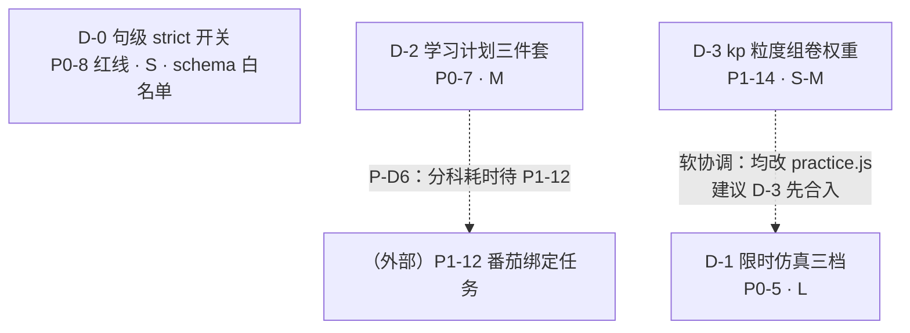
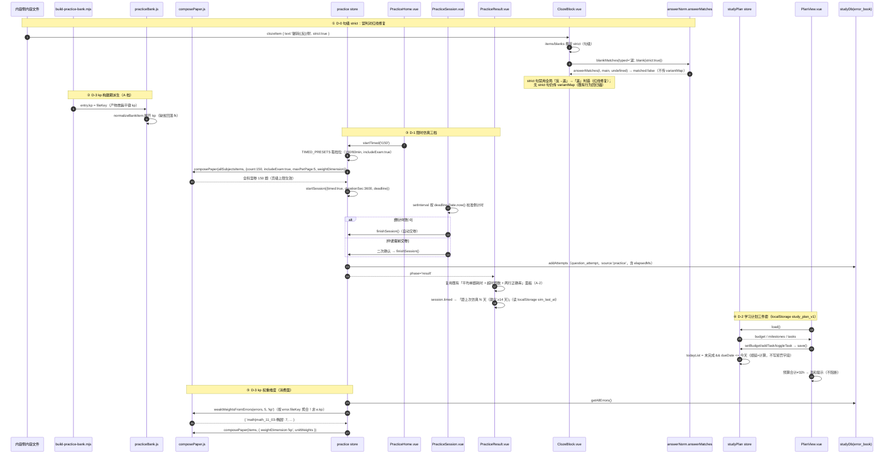

# 批 D 任务列表（仿真 · 计划 · kp 组卷 · 句级 strict）—— 工程师照单实现版

> 状态：**规划定稿（未写代码）**。本文是 `implementation-roadmap.md` §2「批 D」的**细化落地版**，不推翻原分解，只把它拆到「可直接开工」的粒度（文件、接口、测试点、验收条、commit 划分）。
> 角色：架构师（高见远 / Gao）产出；供工程师直接照单实现，供 team-lead / 用户拍板 §7 的遗留点。
> 上游（已读并内化）：
> - `docs/proposals/implementation-roadmap.md` §0.2 硬约束 / §2 批 D / §4 里程碑 M3 / §5 数据结构变更 / §6 拍板结果
> - `协同交流/02_功能侧回函/2026-10-10_批C交付通告与内容侧四件回执（kp取向+反返口径+入库确认）.md`（**今日对外回函：§四 kp 取向 A 档 / §五 句级 `strict` / §六 practice-bank 宽区间已重设**）
> - `协同交流/01_内容侧来件/2026-10-10_kp标签体系草案（面向批D·P1-14）.md`（A 档预演数据：kp 覆盖率 100%/171 页）
> - `协同交流/03_共同决策/D-001_三项实现形态共识.md`（共识二：错题归因 `kp` 与题目标签 `kp` **不同源**）
> - `docs/功能与布局改进需求_内容侧提出.md:101-134`（P0-5 四条验收 / P0-7 四条验收）
> - 批 A / B / C 先例（复用模式，不重造）：`batch-a-tasks.md`、`batch-b-tasks.md`、`batch-c-tasks.md` 全文
>
> **两条纪律贯穿全文**：① 数字、行号、接口一律以**本次实际读码**为准（关键校验一律 Python 脚本复核 —— 本环境 grep 漏命中，结论以 Python 为准），不确定处标「待核实」；② 不写实现代码，只给「关键函数签名 + 伪代码级要点」。
> **任务数 = 4**（`D-0 / D-1 / D-2 / D-3`），≤ 5 硬上限；按**功能模块**分组（一项需求 = 一个模块 = 一个任务），不按单文件拆。四任务**近乎互不依赖**（唯一软协调点见 §1.2）。

---

## 0. 开工前必读：本次核查对上游的**更正与补充**（务必以本节为准）

> 以下为本次只读核查的实测结论（HEAD = `809f9a1`；工作树**干净**）。**更正 1–4 直接改变任务分解**：照抄路线图会重复派一批 A-2 已完成的活，或踩到「两类 `kp` 同名不同源」的错配陷阱。

| # | 上游写法 | 实测事实 | 处理 |
|---|---|---|---|
| **更正 1** | 路线图 §5 数据结构表：「（D-3）`kp` / schema 增 `kp`（走白名单 H5）」+ 路线图 §2.D-3「schema：`quizItem`/`examItem` 增 `kp` + `validateBlock.js`」 | 那是**B 档**方案；今日回函 §4.1 已拍板 **A 档**：`kp(题目) := fileKey`，**构建期派生，零 schema 变更、零内容改动**；B 档仅「按需启动」 | **以 A 档为准**：D-3 **不触碰 schema**（H5 不触发）、不改任何内容文件。路线图 §5 该行与 §2.D-3 的「schema 增 kp」作废（见 §0.1 与 §7 P-D2） |
| **更正 2** | 路线图 §2.D-1「改结算页：正确率 + **平均单题耗时** + **超时题数**（**依赖 A-2**）」 | 批 A-2 **已上线**，`PracticeResult.vue:26-45` **已实现**「单题耗时」面板（平均 `avgMs` / 超时 `timeouts` / 最长 Top3 / 一键归因超时）；`:12-16` 已实现**两行**「正确率」（自动判 / 自评，判分二分 H3） | D-1 **不重复实现结算统计**。净新增 = **限时机制**（三档 + 倒计时 + 自动/提前交卷）+ **「≤14 天」温和提示**（见 §0.2） |
| **更正 3** | team-lead：「kp 口径 = fileKey，产物增 `kp` 键」 | 题库产物条目**已有** `fk: fileKey`（`build-practice-bank.mjs:231`），A 档下 `kp === fk`（同值） | 仍**显式新增 `kp` 紧凑键**：B 档（页内考点）落地时复用该键位改语义即可，**不必二次改产物形状**；代价仅一处字符串冗余，换取前向兼容（见 §0.1） |
| **更正 4** | 路线图 §2.D-3 / team-lead：「`weakWeightsFromErrors` 口径扩展（unit → unit｜kp）」 | `weakWeightsFromErrors`（`composePaper.js:47-62`）现按 `subject\|unitNum` 聚合；而 `error_book` 的 **`kp` 是用户自由文本**（A-3 归因，`ReasonChips` 六选一之外的自由输入），**不是**题目的 kp（`fileKey`） | ⚠️ **本批最大陷阱**：kp 维度权重必须按 error 的 **`fileKey`** 聚合（= 题目 kp 同源），**绝不能**用 `e.kp`（否则「归因标签串味组卷权重」）。见 §0.1 |
| **更正 5** | 路线图 §2.D-1「复用 `ExamBlock` 的计时/交卷骨架」 | `ExamBlock.vue` 是**单页多题**（`:42-110` 一次渲染全部题、滚动作答）；练习会话 `PracticeSession.vue` 是**一屏一题**（`:10-133`） | 复用的是**时序骨架**：`deadline` 毫秒时间戳 + `setInterval` 每秒按 `deadline - Date.now()` 校准（`ExamBlock.vue:290-310`）+ 到点自动 `submit`/提前交卷二次确认（`:447-458`）。**不是** DOM 复用 |
| **更正 6** | 路线图 §2.D-2「存储：IndexedDB 新仓库或 localStorage（**待定**）」 | `studyDb.js` 无 `study_plan`；`exportAllData` 已把 localStorage 键 `['pomodoro_state','math_theme']` 纳入备份（`studyDb.js:862`）；全库**无任何** `studyPlan` / `study_plan` 代码 | 给出**明确推荐**（§7 P-D1）；若选 localStorage 须把新键加进 `studyDb.js:862` 备份清单 |
| **更正 7** | 需求 P0-7 验收 3「实际耗时**对比预算**」（分科） | 全库**无分科耗时**：`usePomodoro` 只累加全局 `daily_stats.studyMinutes`（`usePomodoro.js:179`）；分科归集是 **P1-12** 才做 | D-2 先做**今日实际总耗时 vs 每日预算目标**；分科耗时标「**等待 P1-12**」，不阻塞（见 §7 P-D6） |
| **更正 8** | 路线图 §2.D-1「150 题档需足够可判分题」 | 实测可判分 **1251**（含 exam）/ **1153**（不含 exam）；`composePaper` 已有**会话内去重**（fileKey+question）+ 稳定排序（`:155-171`），但**无页/单元抽取上限** | 150 档**可行**（下节给抽样口径）；但弱单元可被堆满（unit 03 有 **107** 道可判分）→ 补 **per-page 上限**（§7 P-D4） |
| 补充 1 | 未提 | D-0 的判分链现状：`ClozeBlock.blankMatches`（`:165-171`）**返回布尔**，内部读 `answerMatches(...).matched`；`answerMatches` 本身返回 **`{ matched, mode }`** | D-0 只改 `blankMatches` 里的 `opts`（传不传 `variantMap`），**不动** `answerMatches` 的返回契约（team-lead 明确约束） |
| 补充 2 | 未提 | 练习会话题量档来自 `draft.count`（`PracticeConfig.vue:133-135`：unit/weak=5/10/20，custom=10/20/30/50），**与限时三档（25/50/150）不一致** | 限时用**独立档位来源** `TIMED_PRESETS`，不复用 `countOptions`，避免两套题量口径互相污染 |
| 补充 3 | 未提 | 模拟冲刺入口现状：`PracticeHome.vue:63-80`「模拟冲刺」子面板已列真题卷 + 「自定义组卷」二级入口 | D-1 的限时入口落点需定（新增第四入口 vs 并入模拟冲刺），见 §7 P-D3 |
| 补充 4 | 未提 | `tests/practice-bank.test.js` 宽区间**今天已重设**：`RATIO_MAX 0.55→0.70`（`:43`）、`MIN_TOTAL 1393→2000`（`:35`）、基线 2102/1251/404/144（`:29-32`） | 与 team-lead 描述一致。**D-3 写测试时沿用「结构不变量 + 宽区间」范式，勿再新增会被内容增长顶破的硬锚点** |
| 补充 5 | 未提 | 组件级测试先例：`tests/cloze-input.test.js:27-56` 用 `@vue/test-utils` mount `ClozeBlock` 并断言 DOM；`tests/review-session.test.js` / `tests/stuck-card.test.js` 同理 | D-0 / D-1 的 UI 行为走同款组件级测试（含 `mount + fake-indexeddb`） |

### 0.1 `kp` 口径：两类 `kp` 不同源 + 产物键位设计（本批最易埋雷点）

**两类 `kp` 必须分清（D-001 共识二 + 批 A A-3）**

| 类型 | 归属 | 存储 | 取值 | 谁在用 |
|---|---|---|---|---|
| **错题归因 `kp`** | 用户数据 | `error_book.kp`（自由文本，`ReasonChips` 填写） | 任意文本（如「一元二次」） | 错题本归因分布；**不进**组卷权重 |
| **题目标签 `kp`** | 内容数据（本次派生） | 题库产物条目 `kp` 键（**= `fileKey`**） | 形如 `math_11_03-椭圆` | **组卷权重维度**（D-3） |

**⚠️ 组卷权重聚合的键必须一致**：`error_book` 行**同时**有 `unitNum` 与 `fileKey`（`studyDb.js:743-785` 写入）。题目侧 `kp := fileKey`。故 **kp 维度权重的聚合键 = `error.fileKey`**（与题目 `kp` 同源），**不是** `error.kp`：

```
kp 维度：  weightKeyOf(item, 'kp')  =  `${item.subject}|${item.kp}`      // item.kp = fileKey
          weakWeightsFromErrors(errors, topN, 'kp') 聚合键 = `${e.subject}|${e.fileKey}`
                                                     ⚠️ 不是 `${e.subject}|${e.kp}`
```

用 `e.kp` 会得到「用户当年随手写的归因标签」当权重键，与题目 kp（fileKey）**永不匹配** → 权重恒 1、组卷行为**静默退化**为均匀抽取（最难发现的一类 bug）。D-3 单测必须**反向锚定**这一点（§2 D-3 测试 ④）。

**产物 `kp` 键位设计（更正 3 的落地）**

- A 档下 `kp === fk`（同值）。为何仍**显式加键**而非运行时从 `fk` 派生？——**为 B 档前向兼容**：B 档把 `kp` 改为「页内考点」时，只需改**一个字段的写入**（内容补标 → 构建期直读），产物形状、`normalizeBankItem`、`composePaper` 的 `kp` 维度**全部不用改**。若现在从 `fk` 别名派生，B 档就要同时改产物形状 + 别名逻辑两处，漂移面更大。
- `normalizeBankItem` 仍做**兜底**：`raw.kp` 缺失时回落 `raw.fk`（兼容旧产物 / 手写 mock），保证「kp 覆盖率 100%」不被旧格式破坏。

### 0.2 D-1 结算现状：确认「不可重复派活」的边界（更正 2 + 更正 5）

`PracticeResult.vue` **已具备** P0-5 验收 3 的**全部**结算要素（批 A-2 产出）：

| P0-5 验收 3 要求 | 现状实现 | 行号 |
|---|---|---|
| 正确率 | 两行：`自动判 X 题，正确 Y` + `自评 A 题，会 B`（**判分二分，H3，不合并**） | `PracticeResult.vue:12-16` |
| 平均单题耗时 | `平均 {{ fmtSec(avgMs) }}`（`avgElapsedMs`） | `:29-31`、`:107` |
| 超时题数 | `超时 {{ timeouts }} 题（≥ {{ timeoutSec }} 秒）`（`timeoutCount`，阈值 `TIMEOUT_MS=45000`） | `:30-31`、`:106` |
| （加分项）最长 Top3 + 一键归因超时 | `topSlowest(...,3)` + `attributeTimeouts()` → 回写 `question_attempt.reason` 与 `error_book.reason` | `:32-45`、`:113-123` |

→ **D-1 结算侧只剩两件事**：① 让限时会话**流入同一结算页**（`startSession` 带 `timed` 标记即可复用）；② 新增**「≤14 天间隔」温和提示**（P0-5 验收 4）。**禁止**在结算页另写一套正确率/耗时口径（H7：`resultStats` / `practiceMetrics` 是单一真相源）。

---

## 1. 总览：任务编号 / 依赖 / 顺序 / 预估

### 1.1 任务一览表

| 任务 | 对应需求 | 内容 | 依赖 | 预估 | 触碰 DB / schema |
|:--:|---|---|:--:|:--:|---|
| **D-0** | **P0-8 判分红线**（`反/返` 误判对） | 句级 `strict` 开关：`schema` 加字段 + `validateBlock` 语义规则 + `ClozeBlock` 判分支（strict 句禁用通假映射）+ 测试 | 无 | **S** | **schema（H5 白名单，`clozeItem` 加 `strict`）** |
| **D-1** | **P0-5** 限时仿真三档 | `TIMED_PRESETS` 三档 + 限时会话（全科混卷 + `includeExam`）+ 倒计时/到点自动交卷/提前交卷 + 结算「≤14 天」提示 + per-page 上限 | 无（**A-2 `elapsedMs` 已上线**） | **L** | 否 |
| **D-2** | **P0-7** 学习计划三件套 | `studyPlan` store + `PlanView.vue` + 路由/入口 + 存储（预算 32h 校验 / 里程碑倒计时 / 每日清单「漏一天顺延」） | 无 | **M** | **否**（若 §7 P-D1 选 IndexedDB 则**首次功能升版 v8**） |
| **D-3** | **P1-14** `kp` 粒度组卷权重 | 构建期派生 `kp:=fileKey` → 产物 `kp` 键 → `composePaper` 权重维度 `unit｜kp`（按 `error.fileKey` 聚合）+ 接线 | 无 | **S–M** | **否**（A 档零 schema；H5 不触发） |

> **批 D 全程不改 `error_book` / `engine.js` / `site.js` / 内容页**（D-3 是 A 档构建期派生，零内容改动）。D-0 是唯一的 schema 变更（走 H5 白名单，功能侧动作）。DB 停在 **v7**（`studyDb.js:33`），**除非** §7 P-D1 拍板 D-2 走 IndexedDB。

### 1.2 依赖图



> **读图**：四任务**近乎互不依赖**（无硬依赖边）。唯一的软协调是 **D-3 与 D-1 都修改 `src/stores/practice.js`**（D-3 加 `weightDimension` 透传、D-1 加限时模式）——建议 D-3 先合入，D-1 在其上 rebase，避免同一文件的两处改动互相覆盖。D-2 的分科耗时依赖外部 P1-12（虚线，非本批阻塞）。

### 1.3 实现顺序建议（详见 §6）

```
① D-0（S，红线修复 + schema 白名单，可第一时间独立上线）
   → ② D-3（S–M，构建 + 纯函数，无 UI，先把权重地基铺好）
   → ③ D-1（L，限时会话，复用 D-3 的权重维度）
   → ④ D-2（M，全新隔离模块，可并行）
```

- **D-0 排最前**：它是**唯一的安全红线修复**（「辗转返侧」当前会被误判对），成本最低、风险最小，且是 H5 白名单流程的**入口动作**（schema 先行，内容侧才能收口）。
- **D-3 早于 D-1**：二者都改 `practice.js`；D-3 是纯函数/构建层，先落地可减少 D-1 的冲突面。
- **D-2 完全独立**：新建 store + view，与其余三者零交集，可在任一时点并行。

---

## 2. 逐任务卡

### 任务 D-0 · 句级 `strict` 开关（P0-8 判分红线）

**目标**：给 `clozeItem` 加**句级布尔** `strict`；`strict === true` 时该句**禁用全局通假映射**（只按正解 + 本句 `alts` 比对）。修复「辗转**返**侧」被判对的红线（全局表 `反→返` 会把「返」折成「反」的等价形，而该句正解是「反」、非通假义）。**本任务是 schema 白名单动作本身**（H5），零 DB 风险、零内容文件改动。

**涉及文件**

| 动作 | 路径 | 说明 |
|---|---|---|
| 改 | `schema/content-schema.json` | `definitions.clozeItem.properties` 增 `strict`（boolean）；description 写明用途与边界 |
| 改 | `src/utils/validateBlock.js` | `case 'cloze'`（`:298-337`）增 `strict` 语义规则（非布尔 → human-readable 报错） |
| 改 | `src/components/blocks/ClozeBlock.vue` | `items`（`:104-113`）与 `blanks`（`:128-136`）携带 `strict`；`blankMatches`（`:165-171`）据 `strict` 决定是否传 `variantMap` |
| 新增 | `tests/cloze-strict.test.js` | strict 判分支 + schema/validator 语义 + 既有键回归锚 |

**数据结构与接口签名**

```jsonc
// ---- schema/content-schema.json · definitions.clozeItem.properties 新增 ----
"strict": {
  "type": "boolean",
  "description": "句级开关：true = 该句禁用全局通假映射（只按正解 + 本句 alts 比对）。用于「反/返」这类全局表会误判对的句子（如「辗转反侧」）。缺省/false = 既有行为（应用 clozeVariants）。"
}
```

```js
// ---- src/utils/validateBlock.js · case 'cloze' 内（紧跟 alts 校验 :334 之后）----
// 句级 strict（D-0）：schema 已拦类型，这里补 human-readable 文案（与 block.mode :300-302 同款）。
// 防「字符串 'true'」这类 truthy 误传（内容侧手写内容时常见）。
if (it.strict !== undefined && typeof it.strict !== 'boolean') {
  errors.push(`挖空[${ii}] strict 应为布尔（true 禁用该句通假映射）`)
}
```

```js
// ---- src/components/blocks/ClozeBlock.vue ----

// ① items computed（:104-113）：透传入参的 strict（句级）
.map((it) => ({
  text: String(it.text ?? ''),
  segments: parseCloze(String(it.text ?? '')),
  alts: Array.isArray(it.alts) ? it.alts.filter((a) => typeof a === 'string' && a) : [],
  strict: it.strict === true   // ← 新增：句级 strict（D-0）
}))

// ② blanks computed（:128-136）：空位表携带所属句的 strict
if (seg.blank) list.push({ gi: list.length, i, si, main: seg.answer, alts: it.alts, strict: it.strict })

// ③ blankMatches（:165-171）—— 判分支唯一改动点
/** 单空比对：主答案命中或任一 alts 命中即算对（判分唯一入口 answerMatches，H7）。
 *  strict 句（D-0）：**不传 variantMap** → 只按正解 + 本句 alts 比对，
 *  避免全局「反→返」把「辗转返侧」误判对。返回契约不变（仍返回布尔，内部读 .matched）。 */
function blankMatches(typed, blank) {
  const t = typeof typed === 'string' ? typed : ''
  if (!t.trim()) return false
  const opts = blank.strict ? undefined : { variantMap: CLOZE_VARIANTS }
  if (answerMatches(t, blank.main, opts).matched) return true
  return blank.alts.some((a) => answerMatches(t, a, opts).matched)
}
```

**关键实现要点**

1. **只改 `opts`，不改返回契约**：`answerMatches` 仍返回 `{ matched, mode }`（`answerNorm.js:245`），`blankMatches` 仍返回布尔 —— team-lead 明确要求「别破坏这个契约」。`opts === undefined` 时 `answerMatches` 内部 `opts && opts.variantMap`（`answerNorm.js:111`）自然跳过映射，**无需**给 `answerMatches` 加分支。
2. **`strict` 是句级（`clozeItem`），不是块级**：同一 `cloze` 块里可以只有「辗转反侧」那一句 `strict:true`，其余句照常应用通假表。故 `strict` 挂在 `items[i]` 上，随空位透传。
3. **`alts` 在 strict 句仍生效**：strict 只关通假表；内容侧若认定「等价写法」，仍走该句 `alts`（共享知识：通假/异体走表，内容侧认定的等价写法走 `alts`）。
4. **既有键不可移除**：`tests/cloze-variants.test.js:41-45` 锚定 `说→悦 / 反→返 / 惠→慧` 必须仍在。**禁止**用「删掉 `反→返`」来解决本红线（那会连带影响「寒暑易节，始一反焉」的合法通假）。
5. **H1 自查**：无动态 import、无 eval；`ClozeBlock` 纯渲染 + 数据流。
6. **注释只写「为什么」**：在 `blankMatches` 的注释里写清「strict 句为何禁通假表」（红线句例 + 不删全局键的理由）。

**测试要点（`tests/cloze-strict.test.js`，参考 `tests/cloze-input.test.js` 的 mount 模式）**

- ① **strict 生效**：`mode:'input'` + `items:[{ text:'辗转{{反}}侧，寤寐思服。', strict:true }]`，输入 `返` → 提交 → 该空判 **错**（DOM `.cloze-input.is-wrong`，`0/1 空正确`）。
- ② **回归锚（无 strict = 既有行为）**：同句去掉 `strict`，输入 `返` → 该空判 **对**（`is-correct`）。反向锚定：防后人把通假表整体关掉。
- ③ **strict 仍认 `alts`**：`items:[{ text:'辗转{{反}}侧', strict:true, alts:['覆'] }]`，输入 `覆` → 判对；输入 `返` → 判错。
- ④ **schema 关卡**：`JSON.parse(schema).definitions.clozeItem.properties.strict.type === 'boolean'`（白名单已落入 schema）。
- ⑤ **validator 语义**：`createBlockValidator(schema)({ type:'cloze', items:[{ text:'{{甲}}', strict:'yes' }] })` 含「strict 应为布尔」；`strict:true` 零报错。
- ⑥ **既有键回归**：`tests/cloze-variants.test.js` **必须仍全绿**（`反→返` 等键未被移除）；`CLOZE_VARIANTS['反'] === '返'`。
- ⑦ **reveal 模式不受影响**：`mode` 缺省（reveal）时 `strict` 字段被忽略，点击揭晓行为不变。

**验收标准**

- 内容侧红线「辗转**返**侧被判对」→ ①（strict 句判错）。
- H5 白名单：schema 增字段 + validator 语义规则 → ④ + ⑤。
- 不破坏既有契约：`cloze-variants.test.js` 全绿 → ⑥；`answerMatches` 返回 `{matched,mode}` 契约不变 → 由既有 `cloze-input.test.js` / `answer-norm.test.js` 全绿间接锚定。
- `npm run validate:content` 零新增报错（无内容使用 `strict`，天然通过）。

---

### 任务 D-1 · 限时仿真三档（P0-5）

**目标**：新增**限时仿真**模式，三档 **25 题/10 分钟 · 50 题/20 分钟 · 150 题/60 分钟**（150 档允许 `includeExam`）；倒计时 + 到点自动交卷 + 中途提前交卷（复用 `ExamBlock` 的 deadline 时序骨架）；结算复用既有耗时/正确率面板，新增**「≤14 天间隔」温和提示**。

**涉及文件**

| 动作 | 路径 | 说明 |
|---|---|---|
| 改 | `src/stores/practice.js` | 导出 `TIMED_PRESETS`；`draft` 增 `timed` 字段；新增 `startTimed(presetId, scope)`；`startSession` 增 `timed/durationSec/deadline` |
| 改 | `src/utils/composePaper.js` | `composePaper` 增 `maxPerPage`（页级抽取上限，防弱单元堆满） |
| 改 | `src/views/practice/PracticeHome.vue` | 「限时仿真」入口（三档 chip 或入口卡，落点见 §7 P-D3） |
| 改 | `src/views/practice/PracticeSession.vue` | 顶栏倒计时（`deadline` 校准）+ 到点自动 `finishSession` + 提前交卷（二次确认） |
| 改 | `src/views/practice/PracticeResult.vue` | 限时会话「≤14 天」温和提示（`v-if session.timed`） |
| 新增 | `tests/practice-timed.test.js` | 三档数值 / 组卷扩池 / per-page 上限 / 倒计时与交卷 / ≤14 天提示 |

**数据结构与接口签名**

```js
// ---- src/stores/practice.js（顶层导出，单一真相源）----
/**
 * 限时仿真三档（P0-5）。单一来源 —— 禁止视图另写 25/50/150 或 10/20/60。
 * 150 档允许 includeExam（仿真需含真题卷）；25/50 档默认排除真题卷（去重规则 2）。
 */
export const TIMED_PRESETS = [
  { id: 't25',  count: 25,  durationMin: 10, includeExam: false, maxPerPage: 3, label: '25 题 · 10 分钟' },
  { id: 't50',  count: 50,  durationMin: 20, includeExam: false, maxPerPage: 4, label: '50 题 · 20 分钟' },
  { id: 't150', count: 150, durationMin: 60, includeExam: true,  maxPerPage: 5, label: '150 题 · 60 分钟（仿真）' }
]
// maxPerPage 初值为提案（§7 P-D4）；count 恒 ≤ 三档阈值，不参与 UI 二次编辑。

/**
 * 开始限时仿真会话（P0-5）
 *  - 默认**全科混卷**（concat 三学科分片；150 档尤其必要——语文可判分仅 200 题）
 *  - 单元权重沿用 weakWeightsFromErrors（D-3 后为 kp 维度）
 * @param {string} presetId TIMED_PRESETS[].id
 * @param {{ subject?: string|null, seed?: number }} [scope] subject=null → 全科混卷
 */
async function startTimed(presetId, scope = {})
```

```js
// ---- startSession 扩展（:105-132）----
function startSession({ mode, title, subject, unitNums, questions, compose, timed = false, durationSec = 0 }) {
  session.value = {
    /* …既有字段全保留… */
    timed,                                        // 是否限时（结算页据此出 ≤14 天提示）
    durationSec,                                  // 限时总秒数（0 = 不限时）
    deadline: timed ? Date.now() + durationSec * 1000 : null // 毫秒截止戳（校准基准）
  }
  phase.value = 'session'
}
```

```js
// ---- src/utils/composePaper.js · composePaper opt 扩展（:128-139 / :140-200）----
// @param {number|null} [opt.maxPerPage=null] 同一 fileKey 最多抽几题（null = 不限，既有行为）
//   实现：在池过滤阶段按 fileKey 计数，超过上限的条目从该档位候选池剔除；
//   剔除只减候选、不新增 → 只会让分布更均匀，不改判分/去重/难度配额口径。
```

```js
// ---- PracticeSession.vue 顶栏（:12-18）新增限时显示（伪代码）----
// <span v-if="store.session?.timed" class="ps-timer" :class="{ 'is-warn': timeLeft <= 60 }">
//   <AppIcon name="timer" :size="14" /> {{ fmtTime(timeLeft) }}
// </span>
// onMounted：if (store.session?.timed) 启动 setInterval(() => {
//   timeLeft = Math.max(0, Math.ceil((session.deadline - Date.now()) / 1000))
//   if (timeLeft <= 0) store.finishSession()   // 到点自动交卷
// }, 1000)
// footer 增「交卷」按钮（v-if session.timed）：未答完 → 二次确认 → store.finishSession()
```

**关键实现要点**

1. **复用 deadline 时序骨架**（更正 5）：`setInterval` 每秒按 `deadline - Date.now()` **重算**剩余时间（后台/切标签回来自动修正，避免节流漂移）—— 与 `ExamBlock.vue:301-309` 完全同款。**不用** `timeLeft--` 累减。
2. **自动交卷 = 直接 `finishSession()`**：`finishSession`（`practice.js:289-296`）已 settle 最后一题耗时 + 置 `phase='result'` + 批写 `question_attempt`。**未答题**（`assess` 为 null）不计入 `attempts` 与 `resultStats`（既有口径），结算页照实显示「未答 N」。**不要**在超时分支另写一套收尾逻辑（H7）。
3. **150 档全科混卷**：`ensureBank` 是**单学科**加载（`practiceBankClient.js:33`），需 `Promise.all([ensureBank('math'), ensureBank('chinese'), ensureBank('computer')]).flat()` 后组卷。单科 150 题对语文（可判分 200）占比过高 → 全科混卷是 150 档的**推荐口径**（§7 P-D3）。实测扩池：**1251**（含 exam）/ **1153**（不含）。
4. **per-page 上限**（补充 8）：`composePaper` 的权重是按 unit 的，弱单元可被抽满（unit 03 有 107 道可判分）。`maxPerPage` 保证「150 题不堆在一页/一单元」。**只删候选不新增**（与 `extractCandidates` 的多解闸门同向），不改变去重/难度配额/排序。
5. **限时档位独立于 `draft.count`**（补充 2）：`countOptions`（`PracticeConfig.vue:133-135`）是 unit/weak/custom 的题量档，**不复用**；限时走 `TIMED_PRESETS`。
6. **结算复用**（更正 2）：`PracticeResult.vue:26-45` 的耗时/正确率面板**原样复用**，只新增 ≤14 天提示。**禁止**另写正确率/平均耗时口径。
7. **「≤14 天」提示的落点**：读/写 `localStorage['sim_last_at']`（毫秒时间戳）。**会话开始**时把当前时间写入（本次即「上次」），结算页读**上一次**值（写入前先读旧值 → 计算 `距上次 N 天`）。提示文案温和、非强制、可关闭语义（不阻断）。理由：低风险、零 DB、可逆（§7 P-D5）。
8. **离开保护**：限时会话沿用 `PracticeSession.vue` 既有三层（`beforeunload :242-247` + 路由守卫 `:234-239` + 退出二次确认）。限时且**有作答**时按既有逻辑拦；**倒计时走到 0 自动交卷**时不弹确认（直接进结算）。
9. **H1 自查**：计时用 `setInterval`（非动态 import）；无 eval。
10. **H3 二分**：仿真结算仍是「自动判 / 自评」两行（复用 `resultStats`），**不合成为单一百分比**（P0-5 文案里的「正确率」须落在两行口径内）。

**测试要点（`tests/practice-timed.test.js`）**

- ① `TIMED_PRESETS` 三档数值正确：`[{25,10},{50,20},{150,60}]`，仅 150 档 `includeExam===true`。
- ② **扩池**：`startTimed('t150')` 组卷调用时 `includeExam:true`；`questions.length === 150`（全科混卷池 ≥150）。
- ③ **per-page 上限**：`composePaper(items,{ count:150, includeExam:true, maxPerPage:5 })` → 任一 `fileKey` 出现次数 ≤5。
- ④ **限时不串 `draft.count`**：改 `draft.count` 不影响 `startTimed` 的题量。
- ⑤ **到点自动交卷**：组件级 mount `PracticeSession`（`vi.useFakeTimers`），把 `session.deadline` 设为过去 → 推进计时器 → `store.phase === 'result'`。
- ⑥ **提前交卷**：有未答题时点「交卷」→ 二次确认 → `phase === 'result'`（未答题按未答计入）。
- ⑦ **≤14 天提示**：造 `localStorage['sim_last_at'] = now - 5d` → 结算含「距上次仿真 5 天」「建议间隔 ≥14 天」类文案；设 `now - 20d` → 提示「可进行仿真」。
- ⑧ **H3 回归**：仿真结束后 `resultStats` 仍分 `autoCount/selfCount` 两行（未被合并）。
- ⑨ **结算复用**：mount `PracticeResult` 时 `session.timed` 为真才出 ≤14 天块（非限时会话不出）。

**验收标准**

- P0-5 验收 1「三档预设」→ ① + ②。
- P0-5 验收 2「倒计时结束自动交卷 / 中途可提前交卷」→ ⑤ + ⑥。
- P0-5 验收 3「正确率 + 平均单题耗时 + 超时题数」→ **既有面板**（`PracticeResult.vue`）+ ⑧ 回归。
- P0-5 验收 4「≥14 天间隔建议（温和提示）」→ ⑦。
- 路线图 M3「限时仿真 25/50 档可用 + 结算展示平均耗时与超时题数」。
- 150 档不堆题 → ③。

---

### 任务 D-2 · 学习计划三件套（P0-7）

**目标**：新增 `studyPlan` store + `PlanView.vue`：**① 周预算表**（科目 × 小时，手填，合计=32h 校验提示不阻断）；**② 里程碑倒计时**（11/30 操作考 · 次年 4 月理论考 · 6/7 语数）；**③ 每日清单**（今日复习 + 本周该科任务 + 实际耗时对比预算）。**关键行为：漏一天自动顺延、不惩罚、不清零**（不做排课算法）。

**涉及文件**

| 动作 | 路径 | 说明 |
|---|---|---|
| 新增 | `src/stores/studyPlan.js` | Pinia setup store：预算 / 里程碑 / 每日清单 + 存储读写 + 顺延计算 |
| 新增 | `src/views/PlanView.vue` | 三件套页面（预算表 / 倒计时 / 清单） |
| 改 | `src/router/index.js` | 新增 `/plan` 路由（二级入口，无 `meta.tab`） |
| 改 | `src/views/HomeView.vue` | 工具入口（`tool-grid`，`:83-105`）增「学习计划」卡 → `/plan` |
| 改 | `src/stores/studyDb.js` | **仅当 §7 P-D1 选 localStorage**：`exportAllData` 的 `lsKeys`（`:862`）增 `'study_plan_v1'` |
| 新增 | `tests/study-plan.test.js` | 预算校验 / 顺延 / 存储 round-trip / 倒计时 |

**数据结构与接口签名**

```js
// ---- src/stores/studyPlan.js（Pinia setup store，与 practice.js 同形态）----

/** 周预算目标（P0-7 验收 1：用户周预算 32 小时）。单一来源，禁止视图另写 32 */
export const WEEKLY_BUDGET_HOURS = 32

/**
 * 里程碑（P0-7 验收 2）：日期为**可编辑默认值**（需求只给「11/30 / 次年 4 月 / 6、7 月」，
 * 精确日由用户在页面改；默认填当下最合理的锚点）。倒计时 = 目标日 - 今天（天）。
 */
export const MILESTONES = [
  { id: 'op',       label: '技能操作考', date: '2026-11-30' },
  { id: 'theory',   label: '理论考',     date: '2027-04-15' },
  { id: 'academic', label: '语数考试',   date: '2027-06-07' }
]

const STORAGE_KEY = 'study_plan_v1' // §7 P-D1 推荐 localStorage（零升版、可逆）

export const useStudyPlanStore = defineStore('studyPlan', () => {
  // 预算：科目 × 小时（手填）
  const budget = ref({ math: 10, chinese: 8, computer: 14, other: 0 })
  const budgetTotal = computed(() => Object.values(budget.value).reduce((s, h) => s + (Number(h) || 0), 0))
  const budgetValid = computed(() => budgetTotal.value === WEEKLY_BUDGET_HOURS) // false → 温和提示，不阻断

  // 里程碑（date 可编辑）
  const milestones = ref(MILESTONES.map((m) => ({ ...m })))
  const countdowns = computed(() =>
    milestones.value.map((m) => ({ ...m, days: daysUntil(m.date) })) // days<0 = 已过
  )

  // 每日清单：[{ id, subject, title, dueDate(YYYY-MM-DD), done, doneAt }]
  const tasks = ref([])
  const today = ref(getDateStr())
  /**
   * 今日清单（P0-7 验收 4「漏一天自动顺延」的唯一实现点）：
   * = 未完成 且 dueDate <= 今天 的任务（含往期顺延下来的）。
   * 顺延是**计算**出来的，不写回数据 → 天然「不惩罚、不清零、无 streak 字段」。
   */
  const todayList = computed(() =>
    tasks.value
      .filter((t) => !t.done && (t.dueDate || '') <= today.value)
      .sort((a, b) => (a.dueDate || '').localeCompare(b.dueDate || ''))
  )
  const overdue = (t) => !t.done && (t.dueDate || '') < today.value // 用于「顺延」角标

  function load()   // 从 localStorage 读（损坏 → 回落默认，不抛）
  function save()   // 写 localStorage（仅在用户交互后触发，防每次计算写盘）
  function setBudget(subject, hours)
  function addTask({ subject, title, dueDate })
  function toggleTask(id)
  function removeTask(id)
  function setMilestoneDate(id, date)

  return { budget, budgetTotal, budgetValid, milestones, countdowns, tasks, today,
           todayList, overdue, load, save, setBudget, addTask, toggleTask, removeTask, setMilestoneDate }
})

function getDateStr(d = new Date()) { /* YYYY-MM-DD 本地时区，与 studyDb 同口径 */ }
function daysUntil(dateStr) { /* Math.ceil((target - today)/86400000) */ }
```

**关键实现要点**

1. **顺延是「计算」不是「存储」**（P0-7 验收 4 的唯一落地）：`todayList = 未完成 && dueDate <= 今天`。漏一天 → 任务自然出现在明天/今天的清单里。**不写** `streak` / `penalty` / `missedDays` 之类字段（避免羞辱式设计 + 避免「清零」语义）。
2. **预算校验**：`budgetTotal !== 32` → 页面**温和提示**（如「当前合计 X h，与目标 32 h 不符」），**不阻断**保存与使用（验收 1 明确「不符给提示，不阻断」）。
3. **存储方案 = localStorage（推荐，§7 P-D1 待用户确认）**：与既有 `pomodoro_state` / `math_theme` 同款（`usePomodoro.js:19`）。若走 localStorage **必须**把 `study_plan_v1` 加进 `studyDb.js:862` 的 `exportAllData` 备份清单（否则备份/迁移丢计划数据）。
4. **不做排课算法**（需求原文）：只呈现「预算 / 倒计时 / 清单」三块，**不**自动分配学科任务、**不**自动排期。
5. **「实际耗时对比预算」分科维度延后**（更正 7）：当前只有全局 `daily_stats.studyMinutes`（`usePomodoro.js:179`）。D-2 先展示 **今日实际总耗时（studyMinutes/60）vs 每日预算目标（32/7≈4.6h）**；**分科**耗时标「等待 P1-12」（§7 P-D6）。**不要**在 D-2 内自造分科计时（会与 P1-12 打架）。
6. **`/plan` 是二级入口**（补充 4 邻域）：`AppTabBar` 固定 4 Tab（`AppTabBar.vue:78-83`），不新增 Tab；入口放 `HomeView` 工具卡 + 可选 `ProfileView`。路由**不带** `meta.tab`（进二级页隐藏底部 pill，与 `/dashboard`、`/error-book` 同款）。
7. **`load()` 容错**：JSON 解析失败 / 结构缺失 → 回落默认值并 `console.warn`（不抛，不阻塞页面）。
8. **H1 自查**：无动态 import、无 eval；纯数据 + computed。

**测试要点（`tests/study-plan.test.js`，`fake-indexeddb` 不必需，可用 `localStorage` mock）**

- ① 预算：`setBudget('math',10)` 等 → `budgetTotal===32` 时 `budgetValid===true`；改成 31 → `false`（且 `save()` 仍写入，**不阻断**）。
- ② **顺延**：`addTask({dueDate:'2026-10-08'})`（昨天）未完成 → 出现在 `todayList`（today=2026-10-09）；`toggleTask` → 移出 `todayList`，但行**仍在 `tasks`**（不清零）。
- ③ **不惩罚**：连续多天未完成 → 无新增惩罚字段、任务不丢失（`tasks.length` 不变）。
- ④ 倒计时：`daysUntil('2026-11-30')`（today=2026-10-09）=== 52；已过日期 → 负值。
- ⑤ 存储 round-trip：`save()` 后新建 store `load()` → `budget/tasks/milestones` 一致；损坏 JSON → 回落默认不抛。
- ⑥ 备份完整性（**仅 localStorage 方案**）：`studyDb.exportAllData()` 结果含 `localStorage['study_plan_v1']`。
- ⑦ 组件级：mount `PlanView`，断言三区块渲染；预算合计 ≠32 时出现提示文案（不阻断）。

**验收标准**

- P0-7 验收 1「周预算表 + 合计=32h 校验提示（不阻断）」→ ① + ⑦。
- P0-7 验收 2「里程碑倒计时」→ ④。
- P0-7 验收 3「每日清单」→ ②（今日清单）+ 组件渲染。
- P0-7 验收 4「漏一天自动顺延、不惩罚、不清零」→ ② + ③。
- 存储方案与备份完整性 → §7 P-D1 拍板后由 ⑤/⑥ 锚定。

---

### 任务 D-3 · `kp` 粒度组卷权重（P1-14）

**目标**：按 **A 档**（今日回函拍板）——`kp(题目) := fileKey`，**构建期派生**（零 schema、零内容改动）；题库产物增 `kp` 键；`composePaper` 的权重维度由 `unit` 扩到 `unit｜kp`（`weakWeightsFromErrors` 口径扩展）。**综合页（复习测验/易错专项/模拟卷）各成独立 kp，不做特例**（回函 §4.2）。

**涉及文件**

| 动作 | 路径 | 说明 |
|---|---|---|
| 改 | `scripts/build-practice-bank.mjs` | 产物条目增扁平紧凑键 `kp`（= `fileKey`），`collectBank` 内一条赋值 |
| 改 | `src/content/practiceBank.js` | `BANK_ITEM_KEYS` 增 `kp: 'kp'`；`normalizeBankItem` 展开 `kp`（缺失回落 `fk`） |
| 改 | `src/utils/composePaper.js` | 新增 `weightKeyOf(item, dim)` + `WEIGHT_DIMENSIONS`；`weakWeightsFromErrors` 增维度参数（kp 维度按 `error.fileKey` 聚合）；`composePaper` 增 `weightDimension` |
| 改 | `src/stores/practice.js` | `startFromDraft` / `againSameConfig`（`:147`、`:473`）改传 `weightDimension` + 对应权重 |
| 改 | `tests/practice-bank.test.js` | kp 覆盖率 100% 结构不变量（宽区间范式） |
| 新增 | `tests/compose-paper-kp.test.js` | kp 维度权重聚合正确性 / 同单元不同 kp 不串味 / 反向锚定「不得用 e.kp」 |

**数据结构与接口签名**

```js
// ---- scripts/build-practice-bank.mjs · collectBank 的 entry（:225-240）新增一行 ----
const entry = {
  k: practiceKeyOf(info, blockIndex, itemIndex),
  s: info.subject, u: info.unitNum, ut: info.unitTitle, fi: info.fileIndex,
  fk: fileKey,                                  // 既有
  kp: fileKey,                                  // ← A 档：kp := fileKey（构建期派生；B 档时改此处语义即可）
  ft: info.title, bt: block.title || '', q: qCap.text, a: aCap.text,
  d: item.difficulty || '', it: itemType, g: gradable, sr: source
}
```

```js
// ---- src/content/practiceBank.js ----
export const BANK_ITEM_KEYS = {
  /* …既有键… */
  kp: 'kp' // D-3：页级考点（A 档 = fileKey；B 档 = 页内考点）
}

export function normalizeBankItem(raw) {
  /* …既有展开… */
  // kp：产物优先，旧产物/mock 缺 kp 时回落 fk（保证「kp 覆盖率 100%」不被旧格式破坏）
  item.kp = typeof raw.kp === 'string' && raw.kp ? raw.kp : (raw.fk || '')
  return item
}
```

```js
// ---- src/utils/composePaper.js ----

/** 加权维度（D-3）：unit 单元级（既有）/ kp 考点级（P1-14）。单一来源。 */
export const WEIGHT_DIMENSIONS = { UNIT: 'unit', KP: 'kp' }

/**
 * 权重键（维度决定分组键）。kp 维度用 item.kp（构建期 = fileKey）。
 * @param {{subject:string, unitNum?:string, kp?:string}} item
 * @param {'unit'|'kp'} dimension
 */
export function weightKeyOf(item, dimension = WEIGHT_DIMENSIONS.UNIT) {
  if (dimension === WEIGHT_DIMENSIONS.KP) return `${item.subject}|${item.kp}`
  return `${item.subject}|${item.unitNum}`
}
// 保留 unitWeightKeyOf(item)（既有导出）转调 weightKeyOf(item, 'unit')，避免破坏既有引用

/**
 * 由错题聚合权重（Top5，按错题数加权；非 Top5 权重缺省 1）。
 * ⚠️ kp 维度的聚合键 = **error.fileKey**（= 题目 kp 同源）；
 *    **不是** error.kp（那是 A-3 用户自由文本归因）—— 用错会让权重恒 1、静默退化。
 * @param {Array} errors error_book 行
 * @param {number} [topN=5]
 * @param {'unit'|'kp'} [dimension='unit']
 */
export function weakWeightsFromErrors(errors, topN = 5, dimension = WEIGHT_DIMENSIONS.UNIT) {
  const keyOf = dimension === WEIGHT_DIMENSIONS.KP
    ? (e) => `${e.subject}|${e.fileKey}`     // ← kp 维度：按 error 的 fileKey 聚合
    : (e) => `${e.subject}|${e.unitNum}`
  /* …聚合 + Top5 截断逻辑不变（:47-62）… */
}

// composePaper opt 增：@param {'unit'|'kp'} [opt.weightDimension='unit']
// weightedPick(bucket, weights, rng) 内改用 weightKeyOf(item, weightDimension)
```

**关键实现要点**

1. **A 档红线：不改 schema、不改内容文件**（更正 1）。路线图 §5「schema 增 kp」作废；D-3 **不触发 H5**。
2. **聚合键陷阱（§0.1）**：kp 维度权重按 `error.fileKey` 聚合。单测**反向锚定**：构造两行「`e.kp` 相同但 `fileKey` 不同」→ 权重**必须分开**；构造「`e.kp` 不同但 `fileKey` 相同」→ 权重**必须合并**。这两条用例是防「误用 `e.kp`」的锚。
3. **综合页不做特例**（回函 §4.2）：`复习测验 / 易错专项 / 模拟卷` 页各成独立 kp（其 `fileKey` 即 kp），**不**归并到单元。理由（写注释）：① 一条规则零特例；② 综合页答错 = 综合运用薄弱，给更多综合题才对；③ 日后要归并只是权重计算层一行映射，**可逆**。
4. **默认维度保持 `unit`**（向后兼容）：`composePaper` / `weakWeightsFromErrors` 的 `dimension` 缺省 `'unit'`，**既有测试与调用零变动**。是否把默认切成 `kp` 由 `draft.weightDimension` 决定（§7 P-D2）。
5. **产物需重建**：改 `collectBank` 后必须 `npm run build:practice` 重建 `public/practice-bank/*.json`（`kp` 键才会落盘）；`tests/practice-bank.test.js` 的 `collectBank()` 是**实时读工作树**（不经产物），故覆盖率断言走 `collectBank`。
6. **`kp` 覆盖率 100%**：每道题（全部 2102，不限可判分）都能派生 `kp === fk` 且非空。内容侧预演数据（回函/来件）已证：171 页、覆盖率 100%。
7. **H7**：`weightKeyOf` / `WEIGHT_DIMENSIONS` 是权重键的**唯一来源**，视图与 store 不得内联 `'unit'` / `'kp'` 字符串比较。
8. **H1**：纯函数、零 import 变更（`composePaper.js` 仍只依赖 `practiceBank.paperKeyOf`）。

**测试要点**

- ① **kp 覆盖率 100%（`tests/practice-bank.test.js`）**：`flat(collectBank().shards).every(it => it.kp === it.fk && it.kp)` → true（用 `collectBank` 实时读，宽区间范式，不新增硬锚点）。
- ② **产物形状**：任取一题 `it.kp === it.fk`；`normalizeBankItem({fk:'x'}).kp === 'x'`；`normalizeBankItem({kp:'y',fk:'x'}).kp === 'y'`。
- ③ `weightKeyOf(item, 'kp') === `${item.subject}|${item.kp}``；`weightKeyOf(item,'unit')` = 既有 `unitWeightKeyOf`。
- ④ **反向锚定「不得用 e.kp」**：
  - 两行 `{ subject:'math', fileKey:'math_11_a', kp:'一元二次' }` 与 `{ subject:'math', fileKey:'math_11_b', kp:'一元二次' }` → kp 维度权重键**不同**（两条独立）；
  - 两行 `{ subject:'math', fileKey:'math_11_a', kp:'甲' }` 与 `{ subject:'math', fileKey:'math_11_a', kp:'乙' }` → 权重键**相同**（合并计数 +2）。
- ⑤ **同单元不同 kp 不串味**：同一 `unitNum` 下两个 `fileKey`，仅其一有错题 → `composePaper(...,{weightDimension:'kp'})` 抽出的题中该 kp 占比高于另一 kp（同 seed 对照）。
- ⑥ **unit 维度回归**：`weightDimension` 缺省（'unit'）时行为与改造前完全一致（既有 `tests/compose-paper.test.js` 全绿）。
- ⑦ **综合页各成独立 kp**：构造 `复习测验` 页错题（`fileKey` 形如 `math_11_复习测验`）→ 其在 kp 维度权重独立（不并入 `math_11` 单元）。

**验收标准**

- P1-14「权重维度由 unit 扩到 unit｜kp」→ ③ + ⑤。
- A 档「构建期派生、零 schema、零内容改动」→ ②（产物键）+ ⑥（schema 未动）。
- kp 覆盖率 100% → ①。
- 反向锚定「两类 kp 不同源」→ ④。
- 综合页零特例 → ⑦。

---

## 3. 关键程序调用流（sequenceDiagram）



## 3.5 关键结构（classDiagram）

```mermaid
classDiagram
    direction TB

    class ClozeItem {
        <<schema · clozeItem · D-0 句级 strict>>
        +text : string
        +alts? : string[]
        +strict? : boolean(句级：true 禁用全局通假映射)
    }
    class ClozeBlock {
        <<src/components/blocks/ClozeBlock.vue>>
        +items : {文本,空位,alts,strict}
        +blankMatches(typed, blank) boolean
        +submitDictation()
    }
    class AnswerNorm {
        <<src/content/answerNorm.js · 判分唯一入口>>
        +answerMatches(user, expect, opts) {matched,mode}
        +normalizeAnswer(raw, opts)
        +extractCandidates(expect, opts)
        +opts.variantMap 缺省 → 不应用通假映射(strict 分支靠此)
    }
    class ClozeVariants {
        <<src/content/clozeVariants.js · 纯数据>>
        +CLOZE_VARIANTS : 反→返 / 说→悦 / …
    }

    class BankItem {
        <<public/practice-bank/{subject}.json>>
        +k / s / u / ut / fi / fk
        +kp : fileKey(=fk) · D-3 A 档构建期派生
        +q / a / d / it / g / dv / vf / nz / sr
    }
    class PracticeBank {
        <<src/content/practiceBank.js · 形状单一来源>>
        +BANK_ITEM_KEYS : 含 kp
        +normalizeBankItem(raw) : 展开 kp(缺省回落 fk)
        +paperKeyOf(item)
    }
    class ComposePaper {
        <<src/utils/composePaper.js · 纯函数>>
        +WEIGHT_DIMENSIONS : unit|kp
        +weightKeyOf(item, dim)
        +weakWeightsFromErrors(errors, topN, dim)
        +composePaper(items, opt) : 含 weightDimension/maxPerPage
    }
    class PracticeStore {
        <<src/stores/practice.js>>
        +TIMED_PRESETS : 25/10 · 50/20 · 150/60
        +draft / session{timed,durationSec,deadline}
        +startTimed(presetId, scope)
        +finishSession()
    }
    class PracticeSession {
        <<src/views/practice/PracticeSession.vue>>
        +倒计时(deadline 校准)
        +到点自动交卷 / 提前交卷
    }
    class PracticeResult {
        <<src/views/practice/PracticeResult.vue>>
        +两行正确率(自动判/自评)
        +平均单题耗时 / 超时题数（既有 A-2）
        +≤14 天提示(v-if timed)
    }

    class StudyPlanStore {
        <<src/stores/studyPlan.js · localStorage study_plan_v1>>
        +WEEKLY_BUDGET_HOURS = 32
        +budget / budgetValid
        +milestones / countdowns
        +tasks / todayList(顺延=计算)
        +addTask/toggleTask/setBudget/save/load
    }
    class PlanView {
        <<src/views/PlanView.vue>>
        +周预算表 / 里程碑倒计时 / 每日清单
    }
    class StudyDb {
        <<src/stores/studyDb.js · v7>>
        +getAllErrors()
        +exportAllData() : localStorage 备份键
    }

    ClozeBlock ..> AnswerNorm : blankMatches 调用
    ClozeBlock ..> ClozeVariants : 非 strict 句传 variantMap
    AnswerNorm --> ClozeItem : 判分契约 {matched,mode}
    PracticeBank ..> BankItem : 形状定义
    ComposePaper ..> PracticeBank : paperKeyOf
    PracticeStore --> ComposePaper : composePaper/weakWeightsFromErrors
    PracticeStore ..> BankItem : 组卷条目（含 kp）
    PracticeSession --> PracticeStore : 会话编排
    PracticeResult --> PracticeStore : resultStats/attempts
    PracticeStore ..> StudyDb : addAttempts / getAllErrors
    ComposePaper ..> StudyDb : errors 按 fileKey 聚合（kp 维度）
    PlanView --> StudyPlanStore : 三件套
    StudyPlanStore ..> StudyDb : exportAllData 备份（localStorage）
```

---

## 4. 跨任务共享知识（工程师必读，防漂移）

1. **两类 `kp` 不同源（H7 + D-001 共识二）**：错题归因 `kp`（`error_book.kp`，用户自由文本）≠ 题目标签 `kp`（产物 `kp` = `fileKey`）。**组卷权重的 kp 维度按 `error.fileKey` 聚合**，绝不用 `e.kp`。判据只此一份：`composePaper.weightKeyOf` / `weakWeightsFromErrors`。
2. **判分唯一入口 `answerMatches`**（`src/content/answerNorm.js`）：返回 `{ matched, mode }`。`strict`（D-0）只影响**是否传 `variantMap`**，不新增返回字段、不改调用侧契约。
3. **全局通假表不可删键**：`CLOZE_VARIANTS` 的 `反→返 / 说→悦 / 惠→慧` 被 `tests/cloze-variants.test.js:41-45` 锚定。红线句子用**句级 `strict`** 解决，不动全局表。
4. **限时档位单一来源 `TIMED_PRESETS`**（`practice.js`）：视图 / 测试一律引用，禁止内联 `25/50/150` 或 `10/20/60`。与 `draft.count`（unit/weak/custom 题量档）**互不干扰**。
5. **结算口径单一来源**：正确率两行来自 `resultStats`（`practice.js:409-439`，H3 二分不可合并）；耗时/超时来自 `practiceMetrics`（`TIMEOUT_MS=45000` / `topSlowest` / `timeoutCount` / `avgElapsedMs`）。D-1 **只新增「≤14 天」提示**，不重写统计。
6. **`kp := fileKey`（A 档）**：构建期派生、零 schema、零内容改动。综合页（复习测验/易错专项/模拟卷）**各成独立 kp，不做特例**（回函 §4.2，理由见 D-3 要点 3）。
7. **H5（schema 白名单）只由 D-0 触发**：D-0 是功能侧动作（加 schema 字段 + validator 语义规则）；上线后**须发 schema 白名单知会**给内容侧，内容侧再逐句打开 `strict`（回函 §5 承诺）。D-1/D-2/D-3 **不触碰 schema**。
8. **移动端输入/按钮约定**（批 B/C 共享知识，D-1/D-2 沿用）：输入类 `autocapitalize/autocorrect/spellcheck/autocomplete` 全关、`font-size ≥ 16px`、容器 `data-no-swipe`、触控目标 ≥ 44px、focus `scrollIntoView({block:'center'})`。
9. **DB 零升版（默认）**：D-1/D-3 不动 DB；D-2 推荐 localStorage（零升版）。DB 停在 **v7**（`studyDb.js:33`）。**仅当** §7 P-D1 选 IndexedDB，才升 v8 并同步扩 `engine.js` 的 `ENTITIES`（本项目**首次**为功能升版）。
10. **硬约束自查**：H1（无运行时动态 import / eval / `new Function`；计时用 `setInterval`）、H2（不动 `site.js`）、H3（判分/自评二分，D-1 结算两行不合并）、H4（Node v22 跑测：`/Users/iras17514/.workbuddy/binaries/node/versions/22.22.2-6/bin/node`；系统 v24 会让 vitest SIGKILL 137）、H5（见 7）、H6（`validate:content` + `lint --max-warnings 0` 每 commit 必跑；超限必报告）、H7（见 1/2/4/5/6）。
11. **内容侧立场（回函 §七）**：「能用现有结构零改动解决的，不新增字段；确需新增的，先走白名单再批量写」—— D-3 用 A 档（零改动）与 D-0（先白名单）都是按这条办的。

---

## 5. 风险表（每任务 1–3 条 + 缓解）

| 任务 | 风险 | 影响 | 缓解 |
|:--:|---|---|---|
| **D-0** | 后人用「删掉全局 `反→返`」绕过红线 | 「寒暑易节，始一反焉」等**合法通假**连带失效 | 任务卡显式禁止；`cloze-variants.test.js:41-45` 键锚定；`strict` 只关**该句** |
| **D-0** | `strict` 误判为块级（写成 `block.strict`） | 同块所有句失通假，行为面过大 | schema 只加在 `clozeItem`；单测锚「同块仅一句 strict，其余句照常映射」 |
| **D-0** | 改动波及 `answerMatches` 返回契约 | 选择/填空/考试多落点判分链断裂 | 只改 `blankMatches` 的 `opts`；契约由既有 `answer-norm` / `fill-grading` / `cloze-input` 测试全绿兜底 |
| **D-1** | 倒计时用 `timeLeft--` 累减 | 后台/切标签后节流漂移，到时不准 | 强制 `deadline` 时间戳校准（`ExamBlock.vue:301-309` 同款）；单测 `vi.useFakeTimers` |
| **D-1** | 150 档把题堆在同一页/单元 | 训练价值低、近似重复 | `maxPerPage` 上限（§7 P-D4）；单测 ③ |
| **D-1** | 超时分支另写一套收尾，与 `finishSession` 分叉 | 耗时/错题/答题数口径分裂（H7） | 超时 = 直接 `finishSession()`；结算复用既有面板 |
| **D-1** | 单科 150 题对语文（可判分 200）占比过高 | 大量重复、体验差 | 150 档**全科混卷**（§7 P-D3）；单测 ②（池 ≥150） |
| **D-1/D-3** | 二者都改 `src/stores/practice.js`，并行冲突 | 合并丢失改动 | §1.2 软协调：建议 D-3 先合入，D-1 在其上 rebase |
| **D-2** | 顺延被做成「写回数据 / 清 streak」 | 违反「不惩罚、不清零」，且写放大 | 顺延只 `computed`（`todayList`）；无惩罚/streak 字段；单测 ②③ |
| **D-2** | 选 localStorage 若漏加备份键 | 备份/迁移丢失计划数据 | 加进 `studyDb.js:862` `lsKeys`；单测 ⑥ |
| **D-2** | D-2 内自造分科计时，与 P1-12 打架 | 双真相源（H7） | 分科耗时标「等待 P1-12」；只展示全局 `studyMinutes`（§7 P-D6） |
| **D-3** | kp 维度误用 `e.kp`（自由文本）聚合 | 权重恒 1、组卷静默退化为均匀（最难发现） | §0.1 显式警示 + 单测 ④ 反向锚定 |
| **D-3** | 综合页「归并到单元」被当成需求 | 引入特例、长期漂移 | 回函 §4.2 已拍板零特例；注释写明三条理由 + 可逆性 |
| **D-3** | 改了 `collectBank` 但忘记重建产物 | `kp` 键不落盘，运行时不生效 | commit 内 `npm run build:practice`；测试走 `collectBank`（实时读） |

---

## 6. 给工程师的实现顺序建议（commit 划分）

| commit | 内容 | 任务 | 关卡（提交前本地必跑，Node v22） |
|:--:|---|---|---|
| **D1** | 句级 `strict` 开关（schema + validator + ClozeBlock 判分支 + 测试） | **D-0** | `npx vitest run tests/cloze-strict.test.js tests/cloze-variants.test.js tests/cloze-input.test.js --pool=threads --maxWorkers=1` → `npm run validate:content` → `npm run lint` |
| **D2** | `kp` 构建期派生 + 产物键 + `composePaper` 权重维度 + 接线 + 重建产物 | **D-3** | `npm run build:practice` → `npx vitest run tests/practice-bank.test.js tests/compose-paper-kp.test.js tests/compose-paper.test.js --pool=threads --maxWorkers=1` → `npm run lint` |
| **D3** | 限时仿真三档（store + 入口 + 会话计时/交卷 + 结算 ≤14 天提示 + per-page 上限） | **D-1** | `npx vitest run tests/practice-timed.test.js tests/practice-store.test.js --pool=threads --maxWorkers=1` → `npm run lint` |
| **D4** | 学习计划三件套（studyPlan store + PlanView + 路由/入口 + 存储） | **D-2** | `npx vitest run tests/study-plan.test.js --pool=threads --maxWorkers=1` → `npm run lint` |

- **D1 单独成 commit**：它是**唯一的 schema 变更**（H5 白名单流程），独立后便于「先发白名单知会、内容侧再收口」，与其余三任务解耦。
- **D2 先于 D3**：二者都改 `practice.js`；D-3 是纯函数/构建层地基，先合入可缩小 D-1 的冲突面（§1.2）。
- **D3、D4 顺序无关**：D-2 与其余零交集，可任意次序或并行。
- 每个 commit 后**全量** `npm test --pool=threads --maxWorkers=1` + `npm run lint --max-warnings 0` + `npm run validate:content`。
- **沙箱提示**：vitest 必须带 `--pool=threads --maxWorkers=1`（本沙箱 forks 池坏，报 `Failed to start forks worker` 不是测试失败）；跑测前 `node --version` 确认 v22。
- **未经 team-lead 明确批准不得 git commit / push。**

---

## 7. 待 team-lead / 用户拍板的点（本文件收敛，非阻塞开工）

| # | 事项 | 建议 | 触发谁 |
|:-:|---|---|---|
| **P-D1** | **D-2 存储方案**：localStorage vs IndexedDB 新仓库 | **推荐 localStorage（`study_plan_v1`）**。理由：① 数据量极小（预算 3–4 个数 + 里程碑 3 日期 + 清单几十行），写频低；② **零升版** —— IndexedDB 需 **v8**（本项目**首次**为功能升版）+ 同步扩 `engine.js` 的 `ENTITIES`，成本高一个量级；③ 已有先例（`pomodoro_state` / `math_theme`，`usePomodoro.js:19`）；④ **可逆**：持久化封装在 `studyPlan.js` 单模块内，日后要同步改一处即可（同 kp A 档的可逆选择思路）。**代价（须让用户知情）**：计划**不跨设备同步**。**必做配套**：把 `study_plan_v1` 加进 `studyDb.js:862` 的 `exportAllData` 备份清单 | **用户**（存储形态影响跨设备体验） |
| **P-D2** | **`kp` 组卷权重的默认维度**：`unit` vs `kp`；是否加 UI 切换 | **默认 `unit`（保持既有行为与既有测试零变动），在 PracticeConfig 加一枚「加权：单元 / 考点」chip，初始选 `kp`（让 P1-14 生效）**。纯函数 `composePaper` 缺省恒 `'unit'`（向后兼容）；「生效」由 store 传参控制 | team-lead 确认即可 |
| **P-D3** | **限时仿真入口形态 + 150 档取样口径** | 入口：**新增第四入口「限时仿真」**（`PracticeHome` 三入口旁），优于并入「模拟冲刺」（后者面向真题卷）；150 档：**全科混卷**（单科语文可判分仅 200，150 占比过高） | team-lead 确认即可 |
| **P-D4** | **per-page 抽取上限 `maxPerPage` 的取值** | 提案 **25 档=3 / 50 档=4 / 150 档=5**（保证 150 题覆盖 ≥30 页；164 页非 exam 池足够）。缺省 `null`（不改既有行为） | team-lead 确认即可 |
| **P-D5** | **「≤14 天」提示的存储落点** | **localStorage `sim_last_at`（毫秒戳）**：会话开始时写入、结算页读上次值。零 DB、可逆；若日后要跨设备，随 P-D1 一并迁移 | team-lead 确认即可 |
| **P-D6** | **D-2「实际耗时对比预算」的分科维度是否本批做** | **本批只做全局**（今日 `studyMinutes` vs 每日预算 32/7），**分科标「等待 P1-12」**。理由：全库无分科耗时（`usePomodoro.js:179`），自造会与 P1-12 双真相源冲突 | team-lead 确认即可 |
| **P-D7** | **`strict` schema 白名单知会的时机** | D-0 合入后**立即**发白名单知会（回函 §5 承诺）；知会前内容侧**不得**在内容文件写 `strict`（H5） | team-lead 确认即可 |

> **裁决记录（team-lead 回填，2026-10-10）**：
> - **P-D1 → 采纳 localStorage（`study_plan_v1`）**。**已上报用户并获拍板**（会中明示代价：计划不跨设备同步）。**必做配套**：把 `study_plan_v1` 加进 `studyDb.js:862` 的 `exportAllData` 备份清单——漏了它会导致「导出备份不含学习计划」。
> - **P-D2 → 采纳**：纯函数 `composePaper` 缺省恒 `'unit'`（既有测试零变动）；`store` 传 `kp` 生效；`PracticeConfig` 加「加权：单元 / 考点」chip 且**初始选 `kp`**（否则 P1-14 等于没上线）。
> - **P-D3 → 采纳**：新增**第四入口「限时仿真」**；150 档**全科混卷**（单科语文可判分仅 200，150 占比 75% 会退化）。
> - **P-D4 → 采纳**：`maxPerPage` 提案 25 档=3 / 50 档=4 / 150 档=5，缺省 `null`（不改既有行为）。
> - **P-D5 → 采纳**：`localStorage sim_last_at`（毫秒戳），会话开始写入、结算读上次值。
> - **P-D6 → 采纳**：D-2 本批**只做全局**耗时对比；分科标「等待 P1-12」，不自造第二真相源。
> - **P-D7 → 采纳**：D-0 合入后**立即**发 `strict` 白名单知会（回函 §5 承诺）；知会前内容侧不得写入。

---

## 附：本文件核对过的代码事实（行号为本次实测 HEAD=`809f9a1`，可能随后续提交漂移）

| 事实 | 证据 |
|---|---|
| schema `clozeItem` 现仅 `text`(required) + `alts` | `schema/content-schema.json#/definitions/clozeItem`（Python 实测） |
| `ClozeBlock` 判分链：`blankMatches` 返回布尔，内部读 `answerMatches(...).matched` | `src/components/blocks/ClozeBlock.vue:165-171`；`items` `:104-113`；`blanks` `:128-136`；import `:73` |
| `answerMatches` 返回 `{ matched, mode }`；`opts.variantMap` 缺省即不映射 | `src/content/answerNorm.js:245-271`、`:109-121` |
| 全局通假表 `反→返` / `说→悦` / `惠→慧` 被键锚定 | `src/content/clozeVariants.js:22-57`（`反:返` `:26`）；`tests/cloze-variants.test.js:41-45` |
| `validateBlock` 的 `cloze` 分支（mode `:300`、alts `:322-334`） | `src/utils/validateBlock.js:298-337` |
| 产物条目 `fk: fileKey`（D-3 将并列 `kp`） | `scripts/build-practice-bank.mjs:225-240`（`:231`） |
| `BANK_ITEM_KEYS` / `normalizeBankItem` | `src/content/practiceBank.js:59-79`、`:86-101` |
| `unitWeightKeyOf` / `weakWeightsFromErrors`（现按 `subject\|unitNum`） | `src/utils/composePaper.js:37-62` |
| `weightedPick` / `composePaper`（含去重 `:155-171`、难度配额） | `src/utils/composePaper.js:103-117`、`:140-200` |
| `ExamBlock` 计时骨架：`deadline` + `setInterval` 校准 + 到点 `submit` | `src/components/blocks/ExamBlock.vue:290-310`、`:461-466`、提前交卷 `:447-458` |
| `PracticeResult` 已实现耗时面板 + 两行正确率 + 一键归因超时 | `src/views/practice/PracticeResult.vue:12-16`、`:26-45`、`:103-123` |
| `practiceMetrics` 单一来源（`TIMEOUT_MS=45000` 等） | `src/utils/practiceMetrics.js:15`、`:30`、`:42`、`:52` |
| `practice.js` 的 `draft`（含 `count/includeExam`）/`startFromDraft`/`startSession`/`finishSession`/`resultStats`/`againSameConfig` | `src/stores/practice.js:46-53`、`:138-159`、`:105-132`、`:289-296`、`:409-439`、`:461-484` |
| `PracticeConfig` 题量档 `countOptions`（unit/weak 5/10/20；custom 10/20/30/50） | `src/views/practice/PracticeConfig.vue:133-135` |
| `PracticeHome` 三入口 +「模拟冲刺」子面板 | `src/views/practice/PracticeHome.vue:28-44`、`:63-80` |
| `db` 版本 v7 | `src/stores/studyDb.js:33` |
| `exportAllData` 备份的 localStorage 键 `['pomodoro_state','math_theme']` | `src/stores/studyDb.js:862` |
| `recordError` 写入 `unitNum`/`fileKey`/`kp`（归因自由文本） | `src/stores/studyDb.js:743-785`、`attributeError :456-465` |
| `usePomodoro` 只累加全局 `studyMinutes`（无分科） | `src/composables/usePomodoro.js:179`、`:268` |
| 路由无 `/plan`；`AppTabBar` 固定 4 Tab | `src/router/index.js`（全量）；`src/components/AppTabBar.vue:78-83` |
| 题库实测：2102 / 可判分 1251 / 派生 404 / 可规整 144；kp 预演 171 页覆盖率 100% | `public/practice-bank/index.json`（Python 实测）；回函 §二 / kp 来件 §二 |
| 150 档扩池：含 exam **1251**（171 页）/ 不含 **1153**（164 页）；最大单元可判分 107（computer 03） | `public/practice-bank/*.json`（Python 实测） |
| `practice-bank.test.js` 宽区间今天已重设 | `tests/practice-bank.test.js:29-45`（`MIN_TOTAL=2000`、`RATIO_MAX=0.7`） |
| 组件级测试先例（mount + fake-indexeddb） | `tests/cloze-input.test.js:27-56`、`tests/review-session.test.js`、`tests/stuck-card.test.js` |

> 本文件为功能实现侧的技术规划，不构成对考试成绩或录取结果的承诺；考试内容、结构与分值以浙江省教育考试院当年发布为准。
