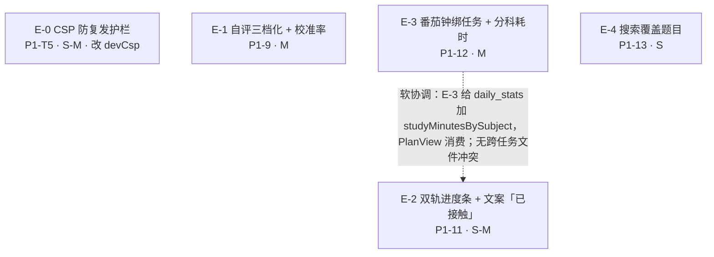
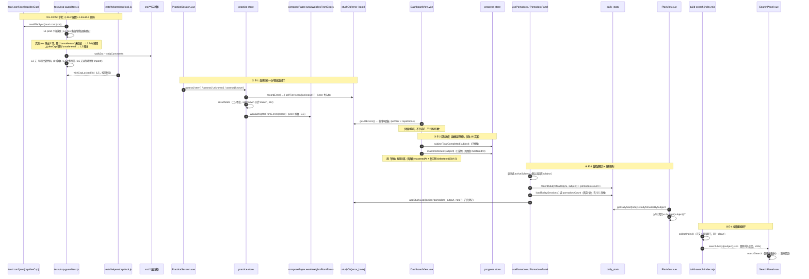

# 批 E 任务列表（CSP 护栏 · 自评三档 · 双轨进度 · 番茄绑任务 · 搜索覆盖题目）—— 工程师照单实现版

> 状态：**规划定稿（未写代码）**。本文是 `implementation-roadmap.md` §2「批 E」的**细化落地版**，不推翻原分解，只把它拆到「可直接开工」的粒度（文件、接口、测试点、验收条、commit 划分）。
> 角色：架构师（高见远 / Gao）产出；供工程师直接照单实现，供 team-lead / 用户拍板 §7 的遗留点。
> 上游（已读并内化）：
> - `docs/README.md`（**文档地图**：权威源对照表——内容字段形状以 schema 为准、**代码事实以源码为准**）
> - `docs/proposals/implementation-roadmap.md` §0.2 硬约束 / §2 批 E / 进度看板 / §3 内容侧依赖表
> - `docs/csp-guard-plan.md` 全文（**E-0 的设计依据**：L1–L5 五层不变量 + 测试骨架 + §2.1 与 QA 守卫的分工）
> - `docs/system_design.md` §10 P1-T5 行（`:861`）、§13（CSP 护栏处置结论）、§5.7.7（「标记已掌握」三语义命名）
> - `docs/功能与布局改进需求_内容侧提出.md:150-159`（P1-9/11/12/13 需求原文与验收要点）
> - `docs/proposals/batch-c-tasks.md` / `batch-d-tasks.md` 全文（复用格式与模式，不重造）
> - `协同交流/02_功能侧回函/2026-10-10_schema白名单知会（句级strict开关）.md`（内容侧已拿到 `strict` 白名单知会）
>
> **两条纪律贯穿全文**：① 数字、行号、接口一律以**本次实际读码**为准（关键校验一律 Python 脚本复核 —— 本环境 grep 漏命中，结论以 Python 为准），不确定处标「待核实」；② 不写实现代码，只给「关键函数签名 + 伪代码级要点」。
> **任务数 = 5**（`E-0 / E-1 / E-2 / E-3 / E-4`），等于 ≤5 硬上限；按**功能模块**分组（一项需求 = 一个模块 = 一个任务），不按单文件拆。五任务**近乎互不依赖**（唯一软协调点见 §1.2）。
> **行号基准**：本文全部行号**实测于 HEAD=`1a26e3a`**（工作树干净）。

---

## 0. 开工前必读：本次核查对上游的**更正与补充**（务必以本节为准）

> 以下为本次只读核查的实测结论（HEAD = `1a26e3a`；工作树**干净**）。**更正 1–4 直接改变任务落点或护栏首轮预期**：照抄 `csp-guard-plan.md` §4 会误判 L4 的首轮结果，照抄路线图 §2 批 E 的行内落点会去改错组件。

| # | 上游写法 | 实测事实 | 处理 |
|---|---|---|---|
| **更正 1** | `csp-guard-plan.md` §1/§4/§5：「实例② GeoGebra CDN 回退」「**截至 2026-10-07 D10 尚未实施**（组件与 4 处引用仍在）」「L4 首轮 1 条 fail → 落实 D10 后 0 违规」 | **D10 已落地**：`src/components/blocks/DesmosBlock.vue`、`src/components/GeoGebraPlayground.vue`、`public/vendor/` 目录**均不存在**；全仓含 `geogebra/desmos` 的文件只剩 `scripts/fetch-geogebra.mjs` 与 `package.json` 的 `geogebra` script（保留供将来重拉）。**L4 首轮不再命中 `www.geogebra.org`** | E-0 的 L4 **首轮预期改写**：不再是 geogebra 而是**新的 1 处内容主机**（见更正 2）。方案 §4 那张表作废，以本文件 §2 E-0 为准 |
| **更正 2** | `csp-guard-plan.md` L4：「源码引用的外部主机必须被 prod CSP 覆盖」，扫描根 `walkSrc(src)`（含 `src/content`） | 实测 L4 命中 **1 处**：`src/content/computer/03-计算机网络技术/08-网页设计基础.js` → `www.example.com`（`:121`/`:142`/`:143`/`:236`，是**教学示例 HTML 的 `href`**，App 运行期**从不加载**）。这不是「生产不可用路径」，而是**内容数据里的示例文本** | E-0 需处置 L4 扫描边界（§7 **P-E1**）：推荐 **L4 扫描根排除三学科页面内容目录** `src/content/{math,chinese,computer}/**`（非执行代码），保留 `src/content/*.js` 真代码在范围内 |
| **更正 3** | 路线图 §2 批 E「P1-9 …改 `QuizBlock.vue`/`ExamBlock.vue` 的自评区」 | **`QuizBlock.vue` 无自评**（头注 `:8`「不记错题本、不计正确率」，是自主学习版）；`ExamBlock.vue` 的自评是**布尔「答对了/答错了」**（`:99-100`/`:107-108`，`selfAssess(i,true/false)` `:338-348`），与练习的 `known/unknown` **不同源**。**三档自评 UI 实际在 `PracticeSession.vue:100-115`**（底部动作条「我还不会 / 我会了」） | E-1 的自评区落点 = **`PracticeSession.vue`**（+ `practice.js` 的 `assess`）；`ExamBlock`/`QuizBlock` **不在** E-1 落点（语义不同源，不合并） |
| **更正 4** | 路线图 §2 批 E「P1-11 …现状两者语义混淆」（`visited` vs `masteredAt`） | `progress.js` **数据层已经双轨**：`buildSnapshot`（`:19-68`）同时算 `completed`（`:24`，判定 `visited && (非测验页 \|\| testScore!=null)`）与 `mastered`（`:26`，判定 `masteredAt != null`），且 `isPageMastered`（`:116-120`）已暴露。**混淆只在 UI 与文案**：`DashboardView.vue:35` 把 `overview.totalVisited` 标成「已学页面」，学科进度 `subjPct`（`:137-142`）= `visited/total` 单轨 | E-2 定性修正 = **「数据层已双轨、UI/文案未拆」**，落点收敛为 `DashboardView.vue`（双轨渲染）+ 文案排查（不改 `progress.js` 的双轨结构，只需补一个按学科聚合的 `masteredCount`） |
| **更正 5** | 批 E 任务书：「番茄数不再用 `studyMinutes/25` 反推（`usePomodoro.js:268` 附近）」 | 实测 `usePomodoro.js:268` **正是** `sessionsCompleted.value = Math.floor((stat.studyMinutes \|\| 0) / 25)`（在 `loadTodaySessions()` `:264-270` 内）。**行号与描述一致**（非更正，登记）。另核实：`PomodoroPanel.vue` 路径正确，且**仅挂载于 `src/views/UnitView.vue:126`**（`usePomodoro()` 在 `UnitView.vue:181`），**非全局** | E-3 的「选任务/选科目」交互落在**内容页内的悬浮面板**（能拿到当前页 subject/unit 上下文），无需新增全局入口 |
| **更正 6** | 批 E 任务书：「⚠️ 索引体积：全量题干入索引会让 `public/search-*` 显著变大」 | 实测题库 **2102** 题、题干总字符 **96,837**（题均 46 字）。全量题干入索引新增 **≈109 KB（+9%）**；仅可判分题新增 ≈47 KB；题干前 80 字封顶 ≈99 KB。现行 `search-body/*` 合计 **1,269,775 B** | E-4 **不需要**「只索引前 N 字」的降级（+9% 可接受）；**全量题干**为主口径，体积按 §2 E-4 给的**预算闸门**锚定 |
| **更正 7** | 批 D QA 判决（转述）：「路由懒加载属构建期分割、非运行时动态 import，H1 显式豁免」 | 实测 `src/router/index.js` 有 **10** 处 `()=>import('@/views/*.vue')`，**全部是字面量路径**；另有 `src/content/loadPage.js:21` 用**模板字面量** `import(\`@/content/${subject}/${folder}/${name}.js\`)`（Vite 静态分析为 glob，构建期确定**候选集**）；**全仓无裸变量 / 字符串拼接的 `import()`** | H1 口径落成护栏的**三档判定**（§2 E-0 的 **L6**）：字面量/带静态前缀的模板 glob 豁免；裸变量或 `+` 拼接 → **违规** |
| **更正 8** | `csp-guard-plan.md` §4：L2 首轮「2 条 fail」、L3「全绿」、L1「全绿」 | 实测一致：**L2 命中 2 条**（`devCsp.script-src` 含孤儿 `'unsafe-eval'`：①「dev 多出未登记」1 条 ②「dev `script-src` 不得含 unsafe-eval」1 条）；**prod 无倒挂**；**L3 去注释后 0 命中**（白名单为空即通过） | 护栏首轮预期 = **L1/L3/L5 绿；L2 2 条 fail（预期，待清理 devCsp）；L4 1 条 fail（待 §7 P-E1 定边界）**。清理 `devCsp` 的 `'unsafe-eval'` 是 E-0 的转绿动作 |
| **补充 6** | 未提（批 E 任务书只说 E-4 落点含 `scripts/build-search-index.mjs`） | **实测 `package.json`：无 `build:search` script**；搜索索引由 `prebuild`/`prebuild:tauri`（`node scripts/build-search-index.mjs`）执行，而 **`build:practice` 是独立脚本、未接入 `prebuild`** → 搜索索引与题库产物**当前无先后保证** | E-4 必须显式建立「题库产物先于搜索索引」的顺序（§2 E-4 要点 6 + §7 P-E5）；构建关卡命令用 `node scripts/build-search-index.mjs`，**不是** `npm run build:search` |

### 0.1 E-1 的两个口径前提（最容易埋雷点）

**（a）三档自评的中间态需要一个字段承载「权重减半」**

- 现状 `practice.js` 的 `assess(kind)`（`:329-367`）只有 `'known' | 'unknown'`；`'unknown'` → `recordError`（`:347-355`）入错题本。
- 三档化后，**「看答案才会」也要入错题本**（验收要点原文：「中间态入错题但权重减半」），故需要一个字段标明该错题行的来源档位。**推荐在 `recordError` 的 `extra` 里加 `selfTier`（值域 `'known' | 'seen' | 'unknown'`）**——行内加字段、零迁移、`engine.js` 零改动（对齐 A-3 的 `reason/kp` 先例 `studyDb.js:743-785`）。
- ⚠️ **「减半」的作用层是「聚合排名」，不是「单卡抽签」**：`composePaper.weightedPick`（`:136-150`）有一行 `const w = Math.max(1, Number(weights[key]) \|\| 1)` —— **权重地板为 1**。所以「seen 记 0.5」的效果体现在 `weakWeightsFromErrors` 的**分组计数**上（影响谁进 Top5、谁排前），而不是把单张 seen 卡的权重压到 0.5。E-1 单测必须锚定**聚合值**（见 §2 E-1 测试 ④），不要期望 `weightedPick` 收到 <1 的权重。

**（b）H3：三档自评**仍然只是自评**，不得与自动判分混算**

- `resultStats`（`practice.js:514-544`）现按 `picked!==null || autoMatched===true` 判「自动判」、其余判「自评」，自评里 `r.assess === 'known'` 计「会」。三档化后**保持二分口径不变**：新增的 `'seen'` 仍落在「自评」侧，`selfKnown` **只计 `'known'`**（`'seen'` 不计入「会」）。
- `PracticeResult.vue:13-14` 的两行正确率（批 A-2 产出）**不得重写**。`'seen'` 的展示放在**新校准率面板**（及可选的、纯展示的追加文案），不塞进结算页两行口径。

### 0.2 E-2 的两个「掌握」必须分辨（本批最易概念打架点）

**这是两个**不同表、不同粒度、不同信号**的「掌握」，本批**有意保持分离**，不合并：**

| 概念 | 归属 | 存储 / 判据 | 粒度 | 谁在用 | 建议 UI 文案 |
|---|---|---|---|---|---|
| **页面级「已掌握」** | 学习进度侧 | `page_progress.masteredAt`（手动标注）｜`progress.isPageMastered`（`progress.js:116-120`） | 页 | `ReaderFooter.vue:19`、`ReaderTopbar.vue:34`、`ContentSidebar.vue:47`、`UnitView.vue:418-430` | **「已掌握（手动标注）」** |
| **复习侧「已掌握」** | 复习侧 | `error_book` 的 `isMastered()`（`useSpacedReview.js:115-119`：SM-2 `reps>=3 && interval>=7` OR `legacyMastered`） | 卡 | `ReviewView.vue:88/196`、`ErrorBookView.vue:42/241` | **「已牢固掌握（SM-2）」** |

**为什么**有意分离**（理由，写进 E-2 任务卡注释）**：① **粒度不同**（页 vs 卡）；② **信号不同**（用户主观「这页我学会了」vs 算法客观「这张卡按遗忘曲线记住了」）；③ **合并会造第二真相源**（H7），并把「进度」模块与「复习」模块交叉耦合（违反高内聚）。两队各自保留自己的判据，**只在 UI 文案上区分措辞**。

---

## 1. 总览：任务编号 / 依赖 / 顺序 / 预估

### 1.1 任务一览表

| 任务 | 对应需求 | 内容 | 依赖 | 预估 | 触碰 DB / schema / CSP 配置 |
|:--:|---|---|:--:|:--:|---|
| **E-0** | **P1-T5**（CSP 防复发护栏） | `tests/csp-guard.test.js`（L1–L4 + 新增 L6 import 口径）+ `tests/helpers/csp-lock.js`（L5）+ **`devCsp` 清理孤儿 `'unsafe-eval'`** + L4 扫描边界处置 | 无 | **S–M** | **CSP 配置**（`src-tauri/tauri.conf.json` 的 `devCsp`） |
| **E-1** | **P1-9** 自评三档化 + 校准率 | `assess` 三档（`known/seen/unknown`）+ 中间态入错题（`selfTier`）+ 组卷权重减半 + 题干行为化 + 校准率面板 | 无 | **M** | 否（`error_book` 行内加字段，零迁移） |
| **E-2** | **P1-11** 双轨进度条 + 文案「已接触」 | `DashboardView` 学科进度双轨（已接触 vs 已掌握）+ 全站文案排查（「已学页面」→「已接触」等） | 无 | **S–M** | 否 |
| **E-3** | **P1-12** 番茄钟绑任务 + 分科耗时归集 | 启动选科目/任务 + 结束登记产出 + 时长按科目归集（`daily_stats.studyMinutesBySubject`）+ **番茄数真实计数**（去 `studyMinutes/25` 反推）+（跨模块小接线）`PlanView` 分科对比 | 无 | **M** | 否（`daily_stats` 行内加字段，零迁移） |
| **E-4** | **P1-13** 搜索覆盖题目 | 构建期把题库**题干**并入搜索索引（标题级 + 题干子串）+ 面板在题库命中时的跳转 | 无 | **S** | 否 |

> **批 E 全程不改 `engine.js` / `site.js` / 内容页 / `schema`。** DB 停在 **v7**（`studyDb.js:33`），本批**零升版**（E-1 的 `selfTier`、E-3 的 `studyMinutesBySubject` 都是**行内加字段**，`engine.js` 按整行 LWW 自动携带）。**唯一改配置的是 E-0**（`tauri.conf.json` 的 `devCsp`）。

### 1.2 依赖图



> **读图**：五任务**无硬依赖边**（可任意次序或并行）。唯一的软关联是 **E-3 的「分科耗时」会顺带升级 `PlanView` 的耗时对比**——这与 E-2 都读 `dashboard`/`plan` 类页面，但**改的是不同区块**（E-2 改学科进度条；E-3 改学习计划今日耗时块），**不冲突**。E-0 与其余四项零交集（它只碰 `tests/` 与 `tauri.conf.json`）。

### 1.3 实现顺序建议（详见 §6）

```
① E-0（S–M，安全红线加固 + 配置清理，独立可上线）
   → ② E-2（S–M，低风险、纯前端文案与一个双轨条，先清口径）
   → ③ E-4（S，构建期 + 纯函数，无 UI 风险）
   → ④ E-1（M，判分链敏感，需回归 H3）
   → ⑤ E-3（M，跨 store 接线，含 PlanView 升级）
```

- **E-0 排最前**：它是**安全不变量**（把用户的 CSP 决策固化下来），且与其余四项**零文件交集**，可第一时间独立合入；清理 `devCsp` 需 `tauri:dev` 实测（§2 E-0 要点 6）。
- **E-2 / E-4 次之**：低风险、改动面窄，先落可减少后面 rebase 面。
- **E-1 放中后**：它碰**判分链**（`assess` 是错题入库唯一触发器，D11），必须带 H3 回归；`selfTier` 一旦写入就是数据契约，宜在口径稳定后落地。
- **E-3 放末**：跨 `usePomodoro` / `studyDb` / `PomodoroPanel` / `PlanView` 四处接线，且含跨批（批 D 留给本批）的 PlanView 升级，放最后便于吸收前面任务对 `daily_stats` 的既有读取口径。

---

## 2. 逐任务卡

### 任务 E-0 · CSP 防复发护栏（P1-T5）

**目标**：落地 `docs/csp-guard-plan.md` 的 5 层机器不变量（`tests/csp-guard.test.js` 的 L1–L4 + **新增 L6 import 口径**；`tests/helpers/csp-lock.js` 的 L5），并**清理 `devCsp` 的孤儿 `'unsafe-eval'`** 让 L2 转绿。**核心不是「找 eval」，而是「dev 相对 prod 多出的每一项授权都必须显式登记理由」**——因为这类 bug 的根因从来不是 eval，而是 `devCsp` 可以**静默地**比生产 CSP 宽松。**本任务零新依赖**（只用 `node:fs` + `vitest` + 自写 CSP 解析器）。

**为什么本任务独立成一批第一项**：它是**唯一把用户 CSP 决策固化成测试**的动作（L1），且与其余四项零交集。

**涉及文件**

| 动作 | 路径 | 说明 |
|---|---|---|
| 新增 | `tests/csp-guard.test.js` | L1 生产 CSP 不得放宽 / L2 dev/prod 能力差登记 / L3 全仓无「字符串转代码」/ L4 外部主机被 prod CSP 覆盖 / **L6 无运行时拼接 `import()`** |
| 新增 | `tests/helpers/csp-lock.js` | L5 `withCspLocked(fn)`（运行时把 `Function`/`eval` 置为抛 `EvalError`），供画板/内容类测试**按需复用**（非验收项，见 plan §3.2） |
| 改 | `src-tauri/tauri.conf.json` | `devCsp` 去掉 `script-src` 的 `'unsafe-eval'`（**保留** `'unsafe-inline'`——Vite HMR 正当需要） |

**关键数据结构与接口签名**

```js
// ---- tests/csp-guard.test.js（骨架照抄 csp-guard-plan.md §3.1，本处只列差异与新增）----
// ① parseCsp / isKeyword / isScheme / isHost / walkSrc / stripComments —— 原样照抄 plan §3.1
// ② L1/L2/L3 原样照抄 plan §3.1（白名单 EVAL_ALLOWLIST / DEV_ONLY_ALLOWED 保持为登记表）
// ③ L4 扫描根「更正 2」修正（见 §7 P-E1 裁决）：
const CONTENT_PAGE_DIRS = ['math', 'chinese', 'computer'] // 三学科页面内容目录（数据，非代码）
function isContentPageFile(rel) {
  // rel 形如 'src/content/math/01-.../01-....js'
  return /^src[\\/]content[\\/](math|chinese|computer)[\\/]/.test(rel)
}
// SRC_FILES 在 walkSrc 后过滤掉 isContentPageFile —— 参见 §7 P-E1

// ④ 【新增 L6】H1 口径：无「运行时拼接」import()
const IMPORT_SCAN_FILES = SRC_FILES // 与 L3 同一份（含 .vue）
/** 判定一个 import() 实参是否为「构建期可静态分析」——真值为豁免，假值为违规 */
function isStaticImportArg(arg) {
  const a = arg.trim()
  if (/^['"]/.test(a)) return true                    // 字面量 import('@/views/X.vue')
  const m = /^`([^`$]*)`$/.exec(a)                     // 模板字面量：取首个 ${ 前的静态前缀
  if (m) return m[1].includes('/')                     // 前缀含 '/'（如 `@/content/`）→ 构建期 glob 豁免
  return false                                         // 裸变量 / x + y 拼接 → 违规
}
// 断言：对每个 import( 命中，取其第一个实参文本，isStaticImportArg 必须为真；否则 fail
// 附加锚（防回退）：router 的懒加载 10 处必须全是字面量（`@/views/` 前缀）
```

**关键实现要点**

1. **L2 是核心，不是 L3**：`DEV_ONLY_ALLOWED`（plan §3.1 `:176-181`）只允许登记**网络侧**正当差异。实测（更正 8）dev 相对 prod 多出 5 项：`script-src 'unsafe-inline'`、`script-src 'unsafe-eval'`、`connect-src ws://localhost:5173`、`connect-src http://localhost:5173`、`connect-src http://127.0.0.1:3000`。**前 4 项是正当的**（HMR / dev server / 本地代理）；**`script-src 'unsafe-eval'` 是孤儿授权**（B1′ 后 `src/` 去注释零 eval，更正 8 的 L3 实测）。
2. **清理 `devCsp` 的 `'unsafe-eval'`**：这一项当初是为让 `GeometryBlock` 在 dev 下能跑才加的（plan §4 要点），**现在已无用武之地**。移除后 **L2 转绿**。⚠️ **移除后必须在 `npm run tauri:dev` 下实测一次 20 张画板**（`src/geometry/boards/*.js`）；若 dev 下出现异常，说明还有别的东西依赖 eval —— **那是有价值的发现，不要退回加回**（plan §4 警示）。
3. **L1/L3/L5 原样照抄 plan**，不重写：L1 断言 `csp` 非空 + `script-src` 不含 `unsafe-*`/`blob:`/`data:`/`filesystem:`/`*` + `object-src 'none'`/`base-uri 'self'`/`frame-ancestors 'none'` + `dangerousDisableAssetCspModification` 未开；L3 白名单目标为空（现状 0 命中）；L5 helper 供按需复用（**非验收项**，见 plan §3.2）。
4. **与 QA 守卫分工不重叠**（plan §2.1）：`tests/jsxgraph-eval-guard.test.js`（`6427673`，已入库）是**单库级语义精查**；本护栏是**仓库 + 配置级**。L3（全仓粗扫）归本文件，L5 helper 归本文件 —— **不要动 QA 守卫，也不要重写它的桩逻辑**。
5. **L4 扫描边界**（更正 2，§7 P-E1）：推荐**排除三学科页面内容目录**（`src/content/{math,chinese,computer}/**`，教学数据，URL 是示例文本），保留 `src/content/*.js`（`loadPage.js`/`practiceBank.js` 等真代码）在扫描范围内。**不要**用「把 `www.example.com` 记进 `HOST_ALLOWLIST`」——那会给出「此主机是生产不可用路径」的**误导性**理由，而它其实永不被加载。
6. **L6 是新增层**（plan 之外，因批 D 路由懒加载 + H1 口径要求而加）：判定三档 —— **字面量**（`'@/...'`）豁免、**模板字面量且静态前缀含 `/`**（`\`@/content/${a}/${b}.js\``）豁免、**裸变量 / `+` 拼接** 违规。**不得放宽成「任何 `import()` 都行」**。附带锚定 `src/router/index.js` 的 10 处懒加载均为字面量（防后人把路由改成变量拼接）。
7. **注释只写「为什么」**：在 `DEV_ONLY_ALLOWED`、`isStaticImportArg`、L4 排除处写清「为什么这样登记 / 为什么排除内容数据 / 为什么模板 glob 豁免」。
8. **零新依赖 + H1 自查**：只用 `node:fs`（`readFileSync/readdirSync/statSync`）+ `node:path` + vitest 内建；测试自身不含 eval/`new Function`。

**测试要点（`tests/csp-guard.test.js` 自身即"测试的测试"，首轮结果如下）**

- ① **L1 全绿**：prod CSP 未被放宽。
- ② **L2 清理后全绿**：`devCsp` 不再含 `'unsafe-eval'`；`dev 相对 prod 多出的授权` 全部命中 `DEV_ONLY_ALLOWED`（4 项）；`prod 不得授予 dev 没有的能力`（倒挂）= 0。
- ③ **L3 全绿**：去注释后命中 0（白名单为空）。
- ④ **L4 全绿**：排除内容目录后 0 命中；**反向锚**：构造一个含 `https://evil.example` 的假 `src` 代码文件 → L4 必须命中（证明排除的只是数据目录，不是"整类主机"）。
- ⑤ **L6 全绿**：`router` 10 处懒加载 + `loadPage.js` 模板 glob + `registry.js`/`useKatex`/`useMermaid`/`main.js`/`JsxGraphBoard` 的字面量 import 全豁免；**反向锚**：注入一段 `const n='x'; import(n)` → L6 必须 fail。
- ⑥ **L5 helper 单测**：`withCspLocked(() => { throw ... })` 后 `globalThis.Function`/`eval` 复原（finally 保证）。
- ⑦ **不破坏既有**：`tests/jsxgraph-eval-guard.test.js` / `tests/geometry-board.test.js` 全绿（分工边界，plan §2.1）。

**验收标准**

- P1-T5 落地 = `tests/csp-guard.test.js` + `tests/helpers/csp-lock.js` 两文件存在（当前**均不存在**，更正 8）。
- L1/L2/L3/L4/L6 全绿 → ①②③④⑤。
- **`devCsp` 孤儿 `'unsafe-eval'` 已清理** → ②；`tauri:dev` 实测 20 张画板无副作用（人工验收条）。
- 零新依赖（`package.json` 的 `dependencies`/`devDependencies` 无新增）→ 人工核对。
- `npm run lint --max-warnings 0` 通过。

---

### 任务 E-1 · 自评三档化 + 校准率（P1-9）

**目标**：把自评从**二档**（我会了 / 我还不会）改为**三档**（**会 / 看答案才会 / 不会**）：中间态**入错题本但组卷权重减半**；**题干行为化**（把「你会了吗」改成「不看答案、能否独立做对」这类行为化表述）；新增**自评校准率面板**（用复习再测正确率**反推**，**仅作相对排序**，**不得包装成预测分数**，符合项目「不构成成绩承诺」口径）。⚠️ **H3：三档自评仍然只是自评，不得与自动判分混算**；`PracticeResult.vue` 两行正确率口径（批 A-2）**不得重写**。

**涉及文件**

| 动作 | 路径 | 说明 |
|---|---|---|
| 改 | `src/stores/practice.js` | `assess(kind)` 支持三档（`known/seen/unknown`）；`recordError` 的 `extra` 增 `selfTier`；`resultStats` 保持二分（`selfKnown` 只认 `known`）；`redoErrors` 的"错题"判据纳入 `seen` |
| 改 | `src/views/practice/PracticeSession.vue` | 自评区（`:100-115`）由两按钮改**三按钮**（会 / 看答案才会 / 不会），题干行为化文案；`assess(kind)` 本地包装（`:199-210`）支持三档 |
| 改 | `src/utils/composePaper.js` | `weakWeightsFromErrors`（`:72-91`）按 `selfTier==='seen' ? 0.5 : 1` 计数（中间态权重减半） |
| 改 | `src/views/DashboardView.vue` | 新增**自评校准率面板**（读 `overview.allErrors` 的 `selfTier` + SM-2 复测信号） |
| 改 | `src/views/practice/PracticeResult.vue` | **仅可选**：自评那行**追加**「· 看答案才会 C」的**纯展示**文案（**不改** auto 行、**不改** auto/self 二分口径）；见 §7 P-E2 |
| 新增 | `tests/self-assess-tiers.test.js` | 三档自评 / 中间态入本但权重减半 / 校准率口径 / H3 回归 |

**关键数据结构与接口签名**

```js
// ---- src/stores/practice.js ----
/**
 * 自评档位（P1-9 三档）—— 唯一取值来源，禁止视图内联 'known'/'seen'/'unknown'。
 *  - known  会：只记答题数，**不入错题本**
 *  - seen   看答案才会：入错题本，组卷权重 ×0.5（中间态）
 *  - unknown 不会：入错题本，权重 ×1
 * resultStats 的二分口径不变：三档均属「自评」侧，selfKnown 只计 'known'（H3）。
 */
export const SELF_TIERS = { KNOWN: 'known', SEEN: 'seen', UNKNOWN: 'unknown' }

async function assess(kind) {              // :329（签名不变，取值域扩到三档）
  const s = session.value
  if (!s) return
  const q = s.questions[s.index]
  const rec = s.records[s.index]
  if (rec.assess || !rec.revealed) return
  rec.assess = kind
  await db.recordAnswered(1, { fileKey: q.fileKey })
  if (kind === SELF_TIERS.SEEN || kind === SELF_TIERS.UNKNOWN) {
    // seen 也入本（中间态）——selfTier 透传，供组卷权重减半与校准率面板消费
    const r = await db.recordError(/* …原参数不变… */, {
      fileKey: q.fileKey, fileTitle: q.fileTitle, unitTitle: q.unitTitle,
      difficulty: q.difficulty || '',
      selfTier: kind                            // ← 新增：'seen' | 'unknown'
    })
    rec.errorId = r.id
    if (!r.duplicated) s.newErrorIds.push(r.id)
    pendingAttribution.value = { index: s.index } // 归因层对 seen/unknown 都弹（可跳过）
  }
}
```

```js
// ---- src/stores/studyDb.js · recordError 去重分支（:751-772）小改（行内字段，零迁移）----
// 重复入本：若本次档位比既有更"差"（unknown > seen），升级档位；永不降级。
// 例：先 seen 后 unknown → selfTier 变 'unknown'（更严重的信息优先保留）。
if (dup) {
  const worse = (a, b) => (a === 'unknown' ? 2 : a === 'seen' ? 1 : 0) > (b === 'unknown' ? 2 : b === 'seen' ? 1 : 0)
  await dbPut('error_book', {
    ...dup,
    wrongCount: (dup.wrongCount || 1) + 1,
    selfTier: extra?.selfTier && worse(extra.selfTier, dup.selfTier) ? extra.selfTier : dup.selfTier,
    /* …repetitions/interval/reviewed/legacyMastered/nextReviewDate 归零逻辑不变… */
  })
  return { id: dup.id, success: true, duplicated: true }
}
```

```js
// ---- src/utils/composePaper.js · weakWeightsFromErrors（:72-91）----
// 中间态（selfTier==='seen'）权重减半：聚合计数 +0.5（而非 +1）。
// 注意（§0.1a）：weightedPick 的 Math.max(1, w) 使**单卡**减半不生效，
// 但 Top5 的**分组计数**与排序会被减半影响 —— 那正是「减半」要起作用的地方。
for (const e of errors || []) {
  if (!e || !e.subject) continue
  const key = keyOf(e)
  const w = e.selfTier === 'seen' ? 0.5 : 1
  counts.set(key, (counts.get(key) || 0) + w)
}
```

```js
// ---- src/views/practice/PracticeSession.vue · 自评区（:99-119）三档 + 行为化 ----
// <template v-else>
//   <button class="ps-btn ps-btn--ok"   :disabled="!!rec.assess" @click="assess('known')">不看答案也能做对</button>
//   <button class="ps-btn ps-btn--mid"  :disabled="!!rec.assess" @click="assess('seen')">看答案后能理解</button>
//   <button class="ps-btn ps-btn--no"   :disabled="!!rec.assess" @click="assess('unknown')">看答案也不懂</button>
//   <button class="ps-btn ps-btn--next" :disabled="!store.canNext" @click="store.next()">…</button>
// </template>
// 题干行为化：在自评区上方加一行提示 ——「不看答案，你能独立、在合理时间内做对吗？」
```

```js
// ---- src/views/DashboardView.vue · 校准率面板（新增区块，读 allErrors）----
/**
 * 自评校准率（P1-9「用复习再测正确率反推」）——仅作**相对排序**，不构成成绩预测。
 * 口径（写进注释）：在**带 selfTier 的错题行**中，
 *   复测召回率 = 该档 `repetitions>=1` 的行数 / 该档 `reviewCount>0` 的行数。
 *   相对比较：'seen'（看答案才会）的复测召回率**应高于** 'unknown'（不会）；
 *   若不高于 → 说明用户的"中间态"没有区分度（面板给出中性提示，不下结论、不评分）。
 * ⚠️ 局限（写进注释）：`repetitions` 是**当前快照**（会被后续 fail 归零），非历史轨迹；
 *   面板是"相对排序"用途，不承诺绝对准确。
 */
const calibration = computed(() => {
  const tiers = ['seen', 'unknown']
  const rows = (overview.value?.allErrors || []).filter((e) => e.selfTier)
  return tiers.map((tier) => {
    const g = rows.filter((e) => e.selfTier === tier)
    const reviewed = g.filter((e) => (e.reviewCount || 0) > 0)
    const recalled = reviewed.filter((e) => (e.repetitions || 0) >= 1)
    return { tier, n: g.length, reviewed: reviewed.length,
             rate: reviewed.length ? Math.round((recalled.length / reviewed.length) * 100) : null }
  })
})
```

**关键实现要点**

1. **三档 → 二分不破（H3）**（§0.1b）：`resultStats`（`:514-544`）的 auto/self 二分**原样**；`selfKnown` 只计 `'known'`；`'seen'` 落自评侧但不计「会」。**禁止**把三档合并成一个百分比。
2. **中间态入本 + 权重减半**（§0.1a）：`seen` 走 `recordError`（带 `selfTier`）；`weakWeightsFromErrors` 聚合 +0.5。**不要**期望 `weightedPick` 收到 <1 权重（它有 `Math.max(1,…)` 地板）。
3. **`seen` 也算"错题"**：`redoErrors`（`:555-558`）与 `reviewTargetRoute`（`:608-611`）现以 `r.assess === 'unknown'` 判「错题」——三档化后应改为 `r.assess === 'unknown' || r.assess === 'seen'`（否则中间态题不进"重做错题"）。**H3 不受影响**（这只列题，不改统计口径）。
4. **归因层对 seen/unknown 都弹**：`pendingAttribution`（`:359`）在 `seen` 时也置位（可跳过）。理由：中间态同样是"需要开处方"的信号。
5. **`ExamBlock` 不在本任务范围**（更正 3）：它的自评是布尔「答对/答错」，语义不同源，**不合并**。（如需一致化，另立小项，见 §7 P-E3。）
6. **校准率"仅作相对排序"**：面板**不出绝对分数、不写"你预计能得 X 分"**（对齐 `功能与布局改进需求` §6.6「不承诺结果」与路线图纪律）。文案模板：「看答案才会」档的复测召回率 X% vs「不会」档 Y% —— 相对强弱，不下结论。
7. **H1 自查**：无动态 import、无 eval；纯 computed + 数据。
8. **注释只写「为什么」**：`selfTier` 为什么行内加字段（零迁移 + engine LWW）、为什么 `seen` 权重取 0.5、校准率为什么只做相对排序。

**测试要点（`tests/self-assess-tiers.test.js`，参考 `tests/practice-store.test.js` 的 store 直测 + `tests/cloze-input.test.js` 的 mount 模式）**

- ① **三档自评落点**：mount `PracticeSession`，点「看答案后能理解」→ `rec.assess === 'seen'`；点「不看答案也能做对」→ 不入错题本（`error_book` 无该行）。
- ② **中间态入本**：`assess('seen')` 后 `error_book` 新增行且 `selfTier === 'seen'`；`assess('unknown')` → `selfTier === 'unknown'`。
- ③ **权重减半（聚合层）**：构造 `errors=[{subject:'math',unitNum:'01',selfTier:'seen'} × 4]` 与 `[{subject:'math',unitNum:'02',selfTier:'unknown'} × 2]` → `weakWeightsFromErrors(...)` 中 `math|01` 与 `math|02` 权重**相等（均 2.0）**（4×0.5 == 2×1）；再各减一 → 排序翻转。
- ④ **H3 回归**：构造含 `known/seen/unknown` 的会话 → `resultStats.selfKnown` **只计 known**；`autoCount/selfCount` 二分不变；**不得**出现合并百分比。
- ⑤ **校准率口径**：造 `allErrors` 含 `{selfTier:'seen',reviewCount:2,repetitions:2}` 与 `{selfTier:'unknown',reviewCount:2,repetitions:0}` → 面板 `seen.rate===100`、`unknown.rate===0`；无 `reviewCount` 的行 → `rate===null`（不参与）。
- ⑥ **`seen` 计入错题动作**：`redoErrors` / `reviewTargetRoute` 把 `seen` 题当错题列出。
- ⑦ **dup 升档**：先 `seen` 后 `unknown` 同题重复入本 → 行 `selfTier` 升为 `'unknown'`；反向（unknown→seen）**不降级**。
- ⑧ **既有回归**：`tests/practice-store.test.js` / `tests/review-consistency.test.js` / `tests/compose-paper.test.js` 全绿（二分口径与 unit 维度未破）。

**验收标准**

- P1-9「改三档」→ ① + ②。
- P1-9「中间态入错题但权重减半」→ ③（聚合权重）。
- P1-9「题干行为化」→ ①（断言按钮文案为行为化短语，非「我会了」）。
- P1-9「自评校准率看板（反推、仅相对排序）」→ ⑤ + 人工核对面板文案无绝对分数。
- H3 判分/自评不混算 → ④。
- `PracticeResult.vue` 两行口径未重写 → ⑧（既有结算测试全绿）+ 人工 diff 确认。

---

### 任务 E-2 · 双轨进度条 + 文案「已接触」（P1-11）

**目标**：学科进度做**双轨**（**已接触** `visited` vs **已掌握** `masteredAt`）；文案把「已学页面」等 **"访问即完成"的措辞改成「已接触」**；**测验页以 `testScore` 为主口径**。⚠️ 与批 C 的复习侧「已掌握」(`isMastered()`) **不打架**——两者**有意分离**（§0.2）。

**涉及文件**

| 动作 | 路径 | 说明 |
|---|---|---|
| 改 | `src/stores/progress.js` | 新增按学科聚合的 `masteredCount(subject)`（getter）——`mastered` 快照已存在（`:26`），只缺学科级计数 |
| 改 | `src/views/DashboardView.vue` | 学科进度（`:74-92`）改**双轨**渲染（已接触 vs 已掌握）；`:35` 「已学页面」→「已接触页面」 |
| 改 | `src/views/HomeView.vue` | 单元「已完成页面数」（`:236`）文案排查为「已接触」 |
| 改 | `src/components/ContentSidebar.vue` | `:164` 「已完成」、答题卡文案排查（凡"访问即完成"处改「已接触」） |
| 改 | `tests/progress.test.js` | 双轨计数（contactedCount / masteredCount）断言 |

**关键数据结构与接口签名**

```js
// ---- src/stores/progress.js · 新增 getter（数据层已有 mastered 快照，只补聚合）----
/**
 * 某学科「已掌握」页数（页面级 masteredAt，v4 页脚主行动）。
 * ⚠️ 与复习侧 isMastered()（error_book SM-2）是**两个不同概念**：本 getter 数的是
 *   **页面**（progress.mastered 快照），不是**卡片**。有意分离，勿合并（§0.2）。
 */
masteredCount: (state) => (subject) => { /* 遍历 state.mastered[subject] 计 true 数 */ },
// 「已接触」页数沿用既有 subjectTotalCompleted(state)(subject)（= state.completed 计数，语义已对齐"访问即接触"）
// —— 建议：把 getter 名与注释口径统一为「已接触」，避免"completed=完成"的旧措辞残留。
```

```html
<!-- ---- src/views/DashboardView.vue · 学科进度双轨（替换 :83-88 现有的单轨条）---- -->
<div class="subject-progress-bars">
  <!-- 已接触（visited/testScore，主轨） -->
  <div class="spb-row">
    <span class="spb-label">已接触</span>
    <div class="subject-progress-bar"><div class="subject-progress-fill" :style="{ width: contactedPct(key)+'%' }"></div></div>
    <span class="spb-num">{{ overview.subjects[key].visited }}/{{ subjectTotals[key] }}</span>
  </div>
  <!-- 已掌握（masteredAt，次轨） -->
  <div class="spb-row">
    <span class="spb-label">已掌握</span>
    <div class="subject-progress-bar spb-bar--mastered"><div class="subject-progress-fill spb-fill--mastered" :style="{ width: masteredPct(key)+'%' }"></div></div>
    <span class="spb-num">{{ progress.masteredCount(key) }}/{{ subjectTotals[key] }}</span>
  </div>
</div>
<!-- 顶部核心卡（:35）：label「已学页面」→「已接触页面」（数据仍是 overview.totalVisited，语义对齐） -->
```

**关键实现要点**

1. **数据层已双轨，别重造**（更正 4）：`progress.js` 的 `completed`（`:24`）与 `mastered`（`:26`）快照都在。本任务**只**：① 补 `masteredCount(subject)` 聚合；② 改 UI 为双轨；③ 排查文案。**不要**新增第三种状态字段。
2. **「已接触」= 既有 `completed` 语义**：内容页 `visited`、测验页 `visited && testScore!=null`（`progress.js:42`）。**测验页以 `testScore` 为主口径** → 测验页的"已接触"必须要求已交卷（既有 `done` 判据已如此），保持不变。
3. **两个「掌握」不合并**（§0.2）：Dashboard 的次轨 = **页面级 masteredAt**（`progress.masteredCount`）；**不要**去读 `error_book` 的 `isMastered()`。二者 UI 文案区分：「已掌握（手动标注）」vs 复习页的「已牢固掌握（SM-2）」。
4. **文案排查范围**（更正 4 实测清单）：`DashboardView.vue:35`（已学页面）、`HomeView.vue:236`（已完成页面数）、`ContentSidebar.vue:164`（已完成）、`progress.js:6` 注释（完成语义 = 访问即完成 → 改述为「已接触」）。**保留**：`ReaderFooter/ReaderTopbar/ContentSidebar` 的「标记已掌握」（那是**页面级手动掌握**动作，措辞正确，**不改**）。
5. **H7**：学科进度百分比由 `progress` store 聚合，视图只渲染，**不内联重算**已接触/已掌握。
6. **H1 自查**：无动态 import、无 eval。

**测试要点（`tests/progress.test.js`）**

- ① **双轨计数**：造 `page_progress` 行 `{visited:true, masteredAt:null}` ×3 与 `{visited:true, masteredAt:123}` ×2 → `subjectTotalCompleted(subject)===5`（已接触）、`masteredCount(subject)===2`（已掌握）。
- ② **测验页主口径**：quiz 页 `{visited:true, testScore:null}` → 不计入"已接触"（需交卷）；`{visited:true, testScore:80}` → 计入。
- ③ **两概念不串**：错题本有 10 条 `isMastered()` 的卡**不**影响 `masteredCount(subject)`（页面级）。
- ④ **文案锚**：DashboardView 组件级 mount 断言含「已接触」且**不再含**「已学页面」（防回退）。
- ⑤ 既有 `tests/progress.test.js` 全绿。

**验收标准**

- P1-11「学科进度双轨」→ ① + ③。
- P1-11「文案改『已接触』」→ ④ + 人工全站排查（§2 要点 4 清单）。
- P1-11「测验页以 `testScore` 为主口径」→ ②。
- 与复习侧「已掌握」不打架 → ③（有意分离的口径锚）。
- DB 零升版（纯 getter + 视图）。

---

### 任务 E-3 · 番茄钟绑定任务 + 分科耗时归集（P1-12）

**目标**：番茄钟**启动时选科目/任务**；**结束登记产出**（做了什么 / 卡在哪，一点即完成、可跳过）；**时长按科目归集**（`daily_stats` 行内增 `studyMinutesBySubject`）；**番茄数改为真实计数**（不再 `studyMinutes/25` 反推）。**跨批（批 D 留给本批）**：批 D 的学习计划（`studyPlan.js` + `PlanView.vue`）目前只做**全局**耗时对比（`PlanView.vue:167`），本批落地分科归集后**升级为分科对比**（评估结论：**做**，属跨模块小接线）。

**涉及文件**

| 动作 | 路径 | 说明 |
|---|---|---|
| 改 | `src/composables/usePomodoro.js` | 增 `activeSubject`；`recordStudyMinutes` 按科目归集 + 增 `pomodoroCount`；`loadTodaySessions` 改**真实计数**（去 `:268` 反推）；`completePhase` 落 `pomodoroCount` |
| 改 | `src/stores/studyDb.js` | `getDailyStat` 默认结构补 `studyMinutesBySubject` / `pomodoroCount`；`updateDailyStat` 支持分科 delta |
| 改 | `src/components/PomodoroPanel.vue` | 启动前**科目选择**（默认当前页 subject）；focus 完成后**产出登记**（一行输入，可跳过） |
| 改 | `src/views/UnitView.vue` | 透传当前页 `subject/unitNum/unitTitle` 给 `PomodoroPanel`（作为默认任务上下文） |
| 改 | `src/views/PlanView.vue` | 「今日耗时」块升级为**分科对比**（读 `studyMinutesBySubject` vs 各科日预算） |
| 新增 | `tests/pomodoro-subject.test.js` | 分科归集 / 真实番茄数 / 产出登记 / PlanView 分科 |

**关键数据结构与接口签名**

```js
// ---- src/stores/studyDb.js · daily_stats 行内加字段（零迁移，engine LWW 自动携带）----
// getDailyStat 默认结构（:342）：
return r || {
  date, filesVisited: 0, questionsAnswered: 0, studyMinutes: 0,
  studyMinutesBySubject: { math: 0, chinese: 0, computer: 0, other: 0 }, // P1-12 分科耗时
  pomodoroCount: 0                                                       // P1-12 真实番茄数
}
// updateDailyStat（:613-621）扩展：delta 支持 { studyMinutesBySubject:{...}, pomodoroCount }
//  - studyMinutesBySubject 逐科累加；pomodoroCount 直接累加
//  - studyMinutes（全局）继续累加（向后兼容：Dashboard / getLearningOverview 仍读它）
// ⚠️ 缺字段的旧行：读取时按默认 0 兜底（下不为例，不回填历史行，零迁移）
```

```js
// ---- src/composables/usePomodoro.js ----
const activeSubject = ref('other')   // 启动时选定；默认由 UnitView 传入当前页 subject
const SUBJECTS = ['math', 'chinese', 'computer', 'other']

/** 记录学习时长（分科）+ 真实番茄数（:175-184 扩展） */
async function recordStudyMinutes(minutes, subject = activeSubject.value) {
  await db.init()
  const stat = await db.getDailyStat(getDateStr())
  stat.studyMinutes = (stat.studyMinutes || 0) + minutes
  const bySub = { ...(stat.studyMinutesBySubject || {}) }
  bySub[subject] = (bySub[subject] || 0) + minutes
  stat.studyMinutesBySubject = bySub
  await db.saveDailyStat(stat)
}

/** 加载今日番茄数：真实计数，不再 studyMinutes/25 反推（:264-270 改写） */
async function loadTodaySessions() {
  try {
    await db.init()
    const stat = await db.getDailyStat(getDateStr())
    sessionsCompleted.value = stat.pomodoroCount || 0   // ← 真实计数（去 Math.floor(studyMinutes/25)）
  } catch (e) { sessionsCompleted.value = 0 }
}

/** completePhase（:189-224）：focus 完成时 → recordStudyMinutes(25, activeSubject) + pomodoroCount++ */
// if (rewarded) { await recordStudyMinutes(FOCUS_DURATION / 60, activeSubject.value)
//                 await bumpPomodoroCount()   // daily_stats.pomodoroCount++
//                 await loadTodaySessions() }
```

```js
// ---- src/components/PomodoroPanel.vue · 启动前选科目 + 结束后登记产出（伪代码）----
// 未运行时：段控选科目（默认 currentSubject）
//   <select v-model="subject"><option v-for="s in SUBJECTS" :value="s">{{ name(s) }}</option></select>
//   on change → pomodoro.setSubject($event.target.value)
// focus 完成（watch pomodoro.mode 由 'focus'→'break' 且 rewarded）→ 弹「本次产出」一行输入：
//   提交 → db.addStudyLog({ action:'pomodoro_output', subject, note, date })  // 复用既有 study_log 时间线，零新表
//   跳过 → 不写
```

```js
// ---- src/views/PlanView.vue · 今日耗时块升级分科（替换 :14-24 单行 + :167-181 读取）----
// 读 stat.studyMinutesBySubject → 逐科 实际 vs 周预算/7（budget[s.key]/7）
// 文案：去掉「分科耗时待 P1-12」（:22），改为分科行：「数学 1.2h / 目标 1.4h」…
// DAILY_BUDGET_HOURS 仍是「全局目标」（studyPlan.js:24）；分科目标 = budget[subject]/7
```

**关键实现要点**

1. **番茄数真实计数（去反推）**：`:268` 的 `Math.floor(studyMinutes/25)` 是**反推**，会因"手动/其它来源的 studyMinutes"或"暂停后补算"而虚高/虚低。改为 `daily_stats.pomodoroCount`（每次 focus 真实完成 +1，`rewarded===false` 的 skip **不计**）。**旧数据不回填**（历史 studyMinutes 无法反推真实番茄数，默认 0 起步）。
2. **分科归集落 `daily_stats` 行内字段**（不是新仓库）：`studyMinutesBySubject` 行内加字段、零迁移、`engine.js` 按整行 LWW 自动携带（对齐 `masteredAt` 先例 `studyDb.js:547-554` / `:670`）。**全局 `studyMinutes` 继续累加**（Dashboard `:67` 与 `getLearningOverview` `:839` 仍读它，**不改**）。
3. **产出登记复用 `study_log`**（`:322-325` 的 `addStudyLog`）：不加新表、天然进同步与导出。`action:'pomodoro_output'`；`note` 存"做了什么/卡在哪"一行文本。
4. **默认任务上下文来自当前页**（更正 5）：`PomodoroPanel` 仅挂载于 `UnitView.vue:126`，天然有 `subject/unitNum/unitTitle`。启动番茄时默认 `activeSubject = 当前页 subject`、产出登记预填「当前页标题」。**不新增全局入口**。
5. **跨批升级 PlanView（评估结论：做）**：批 D 明确「分科耗时等待 P1-12」（`PlanView.vue:22` 还挂着"待 P1-12"提示）。本批有了 `studyMinutesBySubject` 后，**PlanView 的今日耗时块升级为分科对比**是**小接线**（读一个新字段 + 一行渲染），**值得做**；若拍板不做，则至少**删掉「待 P1-12」提示**并说明（§7 P-E4）。
6. **科目取值域单一来源**：`['math','chinese','computer','other']`（与 `studyPlan` 的 `budget` 键 `:67` 对齐）。视图不得内联。
7. **H1 自查**：无动态 import、无 eval；音效用既有 `Web Audio`（无 eval）。
8. **注释只写「为什么」**：为什么按科目归集在 `daily_stats` 行内（零迁移）、为什么抛弃 `studyMinutes/25`（反推不可靠）。

**测试要点（`tests/pomodoro-subject.test.js`）**

- ① **分科归集**：mock `daily_stats` 空行 → `recordStudyMinutes(25,'math')` → `studyMinutes===25` 且 `studyMinutesBySubject.math===25`；再来 `(25,'chinese')` → math 25 / chinese 25 / 全局 50。
- ② **真实番茄数**：`pomodoroCount` 初始 0 → focus 完成（rewarded）→ 1；`skip`（rewarded=false）→ **不变**；`loadTodaySessions()` 读回 == 真实值（**不等于** `Math.floor(studyMinutes/25)` 当两者不一致时）。
- ③ **产出登记**：`addStudyLog({action:'pomodoro_output'})` 后 `study_log` 含该行；跳过 → 不写。
- ④ **默认科目**：UnitView 传入 subject='math' → `activeSubject` 初值 'math'。
- ⑤ **PlanView 分科**：造 `studyMinutesBySubject:{math:60,chinese:30}` → 面板显示「数学 1.0h / 目标 …」「语文 0.5h / …」；不再出现「待 P1-12」文案。
- ⑥ **兼容**：旧 `daily_stats` 行（无 `studyMinutesBySubject`）→ 读取不抛，按 0 兜底。
- ⑦ 既有 `tests/pomodoro-ball.test.js` / `tests/studyDb.test.js` 全绿。

**验收标准**

- P1-12「启动选任务/科目」→ ④ + 组件渲染。
- P1-12「结束登记产出」→ ③。
- P1-12「时长按科目归集」→ ①。
- P1-12「番茄数不再用 `studyMinutes/25` 反推」→ ②。
- 跨批（批 D 遗留）「PlanView 分科对比」→ ⑤（**做**）。
- DB 零升版（行内加字段）。

---

### 任务 E-4 · 搜索覆盖题目（P1-13）

**目标**：搜索索引从「页面标题级 + 正文分片」**扩展到题库题干**（**标题级 + 题干子串**）。⚠️ 体积预算实测（更正 6）：**全量题干入索引仅 +≈109 KB（+9%）**，**不需要**「只索引前 N 字」的降级；给**预算闸门** + 实测锚定。

**涉及文件**

| 动作 | 路径 | 说明 |
|---|---|---|
| 改 | `scripts/build-search-index.mjs` | 把题库题干并入既有正文分片（或新增题库分片）——见下选型 |
| 改 | `src/content/searchIndex.js` | 若新增题库分片：补路径/键/上限常量（三方共用单一来源） |
| 改 | `src/utils/search.js` | 命中题库条目时的 `snippet` 取题干；结果条目带"题目"标记与跳转坐标 |
| 改 | `src/components/SearchPanel.vue` | 题库命中渲染（图标/副标题标「题目」）+ 点击跳转来源页 |
| 改 | `tests/search.test.js` / `tests/search-index.test.js` | 题干命中 / 体积闸门 / 形状 |

**关键实现要点（含体积预算与选型）**

1. **选型（推荐 A）**：**把题干拼入既有 `search-body/{subject}.json` 的正文**（同一 `bodyKeyOf` 键下追加题干文本），而非新增第三份分片。理由：① 复用现有「两级 + 按学科按需加载」机制，`SearchPanel` 零改动加载逻辑；② 题干与页面正文同属"该页可检索内容"，合并后**同一页命中只出一条**（避免"标题页 + 题目"重复两条）；③ 体积可控（+9%）。**结果条目加 `fromQuestion:true` 标记**（构建期在文本里附加标记段，或运行时按命中位置判断）。
   - **备选 B**：新增 `search-questions/{subject}.json` 分片（题目独立），命中更精确、跳转更细，但需 `SearchPanel` 多一套加载分支，复杂度上升。**不推荐**（收益不抵复杂度）。
2. **体积预算闸门**（写进 `build-search-index.mjs` 构建日志，对齐"超限必报告" `scripts/build-practice-bank.mjs:221-230` 纪律）：
   - 预算：`search-body/*` 合计 **≤ 1.6 MB**（现行 1.27 MB + 题干 0.11 MB ≈ 1.38 MB，留 15% 余量）。
   - 超限 → `console.warn` 点名（不静默），并在 `tests/search-index.test.js` 断实测值 ≤ 预算。
   - **实测锚（本文档记录，供回归）**：`search-body` 合计现行 1,269,775 B；题干总量 96,837 字符（2102 题，题均 46）。
3. **题干清洗复用**：`build-search-index.mjs` 已有 `clean()`（`:51-57`，去 LaTeX / 空白）；题干走**同一 `clean`**，不要另写一套清洗（H7）。
4. **题干上限**：复用 `capBody`（`:65-68`，`BODY_LIMIT=12000`）对**单页聚合文本**裁剪；题干本身不需要再裁剪（题均 46 字）。
5. **面板跳转**：题库命中的结果，点击跳转到**来源页**（`/study/:subject/:unitNum/:fileIndex`，与既有 `go(r)` `SearchPanel.vue:243-249` 一致）——因为题库条目本就是按页面来源产出的（`fileKey` = `subject_unitNum_fileName`，`fi` = fileIndex）。**不新增题目详情路由**。
6. **构建顺序**：`build-search-index` 需在题库产物（`public/practice-bank/*.json`）之后运行（题干来自题库产物，不是重新解析内容页）。核对 `package.json` 的 build 脚本顺序（若题库后置则调整，见 §7 P-E5）。
7. **H1 自查**：产物仍是 JSON，运行时 `fetch + JSON.parse`（不 import 产物）；无 eval。
8. **注释只写「为什么」**：为什么合并进正文分片（去重 + 零加载改动）、为什么给体积闸门。

**测试要点（`tests/search.test.js` / `tests/search-index.test.js`）**

- ① **题干命中**：`prepareSearchIndex` + `matchSearch` 对一条**只在题干出现**的关键词（如某题专有名词）→ 命中该来源页，`snippet` 含题干片段。
- ② **标题级仍命中**：既有标题/单元/副标题命中不退化。
- ③ **体积闸门**：`collectIndex()` 产出的 `bodies` 序列化后合计 ≤ 1.6 MB（宽区间，用 `BODY_LIMIT` 常量与实测基线，勿写死到字节）。
- ④ **形状一致**：`bodies[subject][bodyKeyOf(meta)]` 键仍与 `searchIndex.js` 定义一致（三方共识未破）。
- ⑤ **清洗一致**：题干含 LaTeX（如 `\(\{1,2\}\)`）→ 入索引后经 `clean` 去标记（断言不含 `\(`）。
- ⑥ 既有 `tests/search.test.js` / `tests/search-panel.test.js` 全绿。

**验收标准**

- P1-13「扩展到题库题干（至少标题级 + 题干子串）」→ ① + ②。
- 体积纪律（项目对包体积有纪律）→ ③ + 构建日志超限点名。
- 三方形状共识未破 → ④。
- 零新依赖、产物仍纯 JSON（H1）→ 人工核对。

---

## 3. 关键程序调用流（sequenceDiagram）



## 3.5 关键结构（classDiagram）

```mermaid
classDiagram
    direction TB

    class TauriSecurity {
        <<src-tauri/tauri.conf.json · app.security>>
        +csp : 生产 CSP(script-src 'self')
        +devCsp : dev CSP(含 HMR 授权)
    }
    class CspGuardTest {
        <<tests/csp-guard.test.js · P1-T5>>
        +L1 生产 CSP 不得放宽
        +L2 dev/prod 能力差登记(核心)
        +L3 全仓无「字符串转代码」
        +L4 外部主机被 prod CSP 覆盖
        +L6 无运行时拼接 import()(新增)
        +DEV_ONLY_ALLOWED / EVAL_ALLOWLIST / HOST_ALLOWLIST
    }
    class CspLock {
        <<tests/helpers/csp-lock.js · L5>>
        +withCspLocked(fn)
    }

    class PracticeStore {
        <<src/stores/practice.js>>
        +SELF_TIERS : known|seen|unknown
        +assess(kind) : 三档
        +resultStats : 二分不变(H3)
        +redoErrors() : 含 seen
    }
    class PracticeSession {
        <<src/views/practice/PracticeSession.vue>>
        +自评区三按钮(行为化文案)
        +assess(kind) 三档
    }
    class ComposePaper {
        <<src/utils/composePaper.js · 纯函数>>
        +weakWeightsFromErrors(errors, topN, dim)
        +seen 档聚合 +0.5(中间态权重减半)
        +weightKeyOf(item, dim)
    }
    class CalibrationPanel {
        <<DashboardView.vue · 新增区块>>
        +selfTier × repetitions 复测召回率
        +仅相对排序(不出绝对分数)
    }
    class ClozeItemOld {
        <<（批 D 已达）clozeItem.strict — 本批不动>>
    }

    class ProgressStore {
        <<src/stores/progress.js>>
        +completed : 已接触快照
        +mastered : 页面级已掌握快照(masteredAt)
        +subjectTotalCompleted(subject) : 已接触计数
        +masteredCount(subject) : 已掌握计数(新增)
    }
    class DashboardView {
        <<src/views/DashboardView.vue>>
        +学科进度双轨(已接触/已掌握)
        +校准率面板
    }

    class UsePomodoro {
        <<src/composables/usePomodoro.js>>
        +activeSubject
        +recordStudyMinutes(min, subject)
        +loadTodaySessions() : pomodoroCount 真实计数
    }
    class PomodoroPanel {
        <<src/components/PomodoroPanel.vue>>
        +选科目(默认当前页)
        +产出登记(可跳过)
    }
    class StudyDb {
        <<src/stores/studyDb.js · v7>>
        +getDailyStat(date) : 含分科/番茄数兜底
        +updateDailyStat(delta)
        +recordError(..., extra) : 透传 selfTier
    }
    class DailyStats {
        <<daily_stats 行 · 行内加字段零迁移>>
        +studyMinutes : 全局(不变)
        +studyMinutesBySubject : P1-12 分科
        +pomodoroCount : P1-12 真实番茄数
    }
    class PlanView {
        <<src/views/PlanView.vue>>
        +今日耗时: 分科 实际 vs 预算
    }

    class BuildSearchIndex {
        <<scripts/build-search-index.mjs>>
        +collectIndex() : 正文 + 题库题干
        +clean() / capBody() 复用
    }
    class SearchIndex {
        <<src/content/searchIndex.js · 形状单一来源>>
        +BODY_LIMIT / META_FILE / bodyShardPath / bodyKeyOf
    }
    class SearchPanel {
        <<src/components/SearchPanel.vue>>
        +题库命中渲染 + 跳来源页
    }

    CspGuardTest ..> TauriSecurity : 读 csp/devCsp
    CspGuardTest ..> CspLock : L5 复用(可选)
    PracticeSession --> PracticeStore : assess(kind)
    PracticeStore ..> StudyDb : recordError(selfTier)
    PracticeStore --> ComposePaper : weakWeightsFromErrors
    CalibrationPanel ..> StudyDb : getAllErrors(selfTier × SM-2 快照)
    DashboardView --> ProgressStore : 双轨计数
    PomodoroPanel --> UsePomodoro : activeSubject / 产出登记
    UsePomodoro ..> StudyDb : recordStudyMinutes / loadTodaySessions
    StudyDb --> DailyStats : 行内加字段
    PlanView ..> StudyDb : getDailyStat.studyMinutesBySubject
    BuildSearchIndex ..> SearchIndex : 形状常量
    SearchPanel ..> SearchIndex : bodyKeyOf / bodyShardPath
```



---

## 4. 跨任务共享知识（工程师必读，防漂移）

1. **H1 动态 import 口径（E-0 落地、全批遵守）**：`import()` 只在**构建期可静态分析**时允许 —— **字面量**（`import('@/views/X.vue')`）与**静态前缀含 `/` 的模板字面量**（`import(\`@/content/${a}/${b}.js\`)`，Vite 静态 glob）**豁免**；**裸变量 / `+` 拼接**（`import(x)`）**禁止**。运行时消费产物一律走 `fetch + JSON.parse`（`practiceBankClient` / 搜索分片）。
2. **三档自评只动"自评侧"（H3）**：`assess` 取值扩到 `known/seen/unknown`，但 `resultStats` 的「自动判 / 自评」**二分不变**；`selfKnown` 只计 `known`；`PracticeResult.vue` 两行口径**不得重写**。
3. **`selfTier` 是 error_book 行内新字段**（值域 `known|seen|unknown`，实践只落 `seen|unknown`）：经 `recordError` 的 `extra` 透传、零迁移、`engine.js` 零改动；`weakWeightsFromErrors` 按 `seen` 记 0.5。
4. **「权重减半」作用在聚合层**：`composePaper.weightedPick` 有 `Math.max(1, w)` 地板，单卡不会 <1；减半影响的是 `weakWeightsFromErrors` 的**分组计数与排序**（谁进 Top5）。
5. **两个「掌握」有意分离（E-2）**：页面级 = `page_progress.masteredAt`（`progress.masteredCount`）；复习侧 = `error_book.isMastered()`（SM-2）。**不同表、不同粒度、不同信号，不合并**；UI 文案区分措辞。
6. **「已接触」= 既有 `completed` 语义**：内容页 `visited`；测验页 `visited && testScore!=null`（**测验页以 `testScore` 为主口径**）。文案把"已学/已完成（访问即完成处）"统一为「已接触」；**不改**「标记已掌握」动作措辞。
7. **`daily_stats` 行内加字段（E-3）**：`studyMinutesBySubject` / `pomodoroCount` 都是行内加字段 → **零迁移、`engine.js` 零改动**（整行 LWW）。**全局 `studyMinutes` 继续累加**（Dashboard / getLearningOverview 仍读）。旧行无新字段 → 读取按 0 兜底。
8. **番茄数用真实计数**：`daily_stats.pomodoroCount`（focus 真实完成 +1，`skip` 不计）；**禁止**回到 `studyMinutes/25` 反推。
9. **搜索索引三方共识（E-4）**：正文上限、分片路径、正文键只在 `src/content/searchIndex.js` 定义一次（构建脚本 / 搜索工具 / 面板共用）；题干走**同一 `clean`**；产物仍纯 JSON（H1）。
10. **DB 零升版（本批）**：停在 **v7**（`studyDb.js:33`）。E-1 的 `selfTier`、E-3 的 `studyMinutesBySubject` 都是行内加字段。**唯一改配置的是 E-0**（`tauri.conf.json` 的 `devCsp`）。
11. **零新依赖**：五任务都不引入新包（E-0 只用 `node:fs`；E-1/E-2/E-3/E-4 用既有依赖）。
12. **硬约束自查**：H1（无运行时动态 import / eval）、H2（不动 `site.js`）、H3（判分/自评二分，E-1 不破）、H4（Node v22 跑测：`/Users/iras17514/.workbuddy/binaries/node/versions/22.22.2-6/bin/node`）、H5（**本批不触发 schema 白名单**）、H6（`validate:content` + `lint --max-warnings 0` 每 commit 必跑）、H7（形状/判据/派生单一来源）。
13. **移动端输入/按钮约定**（批 B/C/D 共享，E-1/E-3 沿用）：输入类 `autocapitalize/autocorrect/spellcheck/autocomplete` 全关、`font-size ≥ 16px`、容器 `data-no-swipe`、触控目标 ≥ 44px。
14. **自评三档的适用边界「有意不一致」（E-1 落地，勿当缺陷修）**：三档自评（`known/seen/unknown`）**只**作用于 `practice` 练习链路（`PracticeSession.vue`）。`ExamBlock.vue` 的自评是布尔「答对/答错」，`QuizBlock.vue` 页内自评同理 —— 二者**语义来源不同**（考试/题型内的即时对错，≠ 练习会话的「不看答案能否独立做对」），**本批有意不三档化**（P-E3）。后续若见「这里有 known/seen/unknown、那里只有对/错」，那是**有意分离**，不是漏改；如需一致化请另立需求，勿在 E-1 里顺手合并。

---

## 5. 风险表（每任务 1–3 条 + 缓解）

| 任务 | 风险 | 影响 | 缓解 |
|:--:|---|---|---|
| **E-0** | 移除 `devCsp` 的 `'unsafe-eval'` 后，某处 dev-only 路径仍依赖 eval | dev 下画板/页面异常 | 移除后 `tauri:dev` 实测 20 张画板（plan §4）；若异常是**有价值的发现**，**不退回**加回，而是定位 |
| **E-0** | L4 扫描根收窄过头（排除内容目录后漏掉真实的运行时加载主机） | 护栏出现盲区 | 排除仅限 `src/content/{math,chinese,computer}/**`（数据）；**反向锚**：注入含 `https://evil.example` 的**代码**文件 → L4 必须命中（测试 ④） |
| **E-0** | 后人把 L6 放宽成「任何 `import()` 都行」 | 运行时拼接 import() 漏网 → 违反 H1 | L6 三档判定 + **反向锚**：注入 `import(变量)` → 必须 fail（测试 ⑤）；注释写明三档理由 |
| **E-1** | 三档被合并成一个百分比，破坏 H3 | 判分/自评口径污染 | `resultStats` 二分**原样**；`selfKnown` 只计 `known`；测试 ④ 反向锚定（不得出现合并百分比） |
| **E-1** | `seen` 期望在 `weightedPick` 收到 <1 权重 | 单测误判「减半没生效」 | 注明地板 `Math.max(1,…)`；减半在**聚合层**断言（测试 ③：4×seen == 2×unknown） |
| **E-1** | `redoErrors`/归因只认 `unknown`，`seen` 题被漏 | 中间态题不进"重做错题"/不弹归因 | 测试 ⑥ 覆盖 `seen`；归因层对 `seen`/`unknown` 都弹 |
| **E-1** | 校准率被包装成"预测分数" | 违反"不构成成绩承诺"口径 | 面板**仅相对排序**、不出绝对分数；文案模板固定；人工核对 |
| **E-2** | 把两个「掌握」合并（读 `isMastered()` 当页面掌握） | 第二真相源（H7）+ 进度/复习耦合 | §0.2 表格 + 注释写明有意分离；测试 ③ 锚定两概念不串 |
| **E-2** | 文案漏改（"已学/已完成（访问即完成处）"残留） | 「访问即完成」误导 | 测试 ④ 组件级断言；人工按 §2 要点 4 清单全站排查 |
| **E-2** | 误改「标记已掌握」动作措辞 | 页面级手动掌握语义被破坏 | 明确保留清单（ReaderFooter/ReaderTopbar/ContentSidebar 的「标记已掌握」不动） |
| **E-3** | `daily_stats` 分科字段与全局 `studyMinutes` 双写不一致 | 分科之和 ≠ 全局 | 二者**同源**（同一 `recordStudyMinutes` 同时累加）；测试 ① 锚定 `ΣbySubject == studyMinutes`（来自番茄钟的部分） |
| **E-3** | 产出登记写放大（每番茄一次写） | study_log 膨胀 | 可跳过 + 单行文本；`study_log` 本就是增量时间线（非新表） |
| **E-3** | 旧 `daily_stats` 行缺新字段导致 NaN | 页面显示异常 | `getDailyStat` 默认结构兜底 + 读端 `|| 0`；测试 ⑥ |
| **E-3** | PlanView 分科与 studyPlan 预算口径分叉 | 双目标 | 分科目标**复用** `budget[subject]/7`（`studyPlan.js` 单一来源），视图不内联 |
| **E-4** | 题干入索引后体积"静默"膨胀 | 违反包体积纪律 | 构建日志超限点名 + 测试 ③ 预算闸门（≤1.6 MB，宽区间） |
| **E-4** | 题干清洗另写一套，与正文漂移 | 命中口径不一致（H7） | 复用同一 `clean()`；测试 ⑤ |
| **E-4** | 构建顺序错（题库产物未先于搜索索引） | 题干为空 | 核对 build 脚本顺序（§7 P-E5）；构建日志断言题库条目数 > 0 |

---

## 6. 给工程师的实现顺序建议（commit 划分）

| commit | 内容 | 任务 | 关卡（提交前本地必跑，Node v22） |
|:--:|---|---|---|
| **E1** | CSP 护栏（`csp-guard.test.js` + `csp-lock.js`）+ `devCsp` 清理 `'unsafe-eval'` | **E-0** | `npx vitest run tests/csp-guard.test.js tests/jsxgraph-eval-guard.test.js tests/geometry-board.test.js --pool=threads --maxWorkers=1` → `npm run lint` → `npm run tauri:dev` 实测 20 张画板（人工） |
| **E2** | 双轨进度条（`progress.masteredCount` + Dashboard 双轨）+ 全站文案「已接触」 | **E-2** | `npx vitest run tests/progress.test.js --pool=threads --maxWorkers=1` → `npm run lint` |
| **E3** | 搜索覆盖题干（构建脚本 + searchIndex + search.js + SearchPanel）+ 体积闸门 | **E-4** | `node scripts/build-search-index.mjs`（无 `build:search` script；即 `npm run prebuild`）→ `npx vitest run tests/search.test.js tests/search-index.test.js tests/search-panel.test.js --pool=threads --maxWorkers=1` → `npm run lint` |
| **E4** | 自评三档化（`SELF_TIERS` + 三档 UI + `selfTier` + 权重减半 + 校准率面板） | **E-1** | `npx vitest run tests/self-assess-tiers.test.js tests/practice-store.test.js tests/compose-paper.test.js tests/review-consistency.test.js --pool=threads --maxWorkers=1` → `npm run lint` |
| **E5** | 番茄绑任务 + 分科耗时（usePomodoro + studyDb + PomodoroPanel + PlanView 分科） | **E-3** | `npx vitest run tests/pomodoro-subject.test.js tests/studyDb.test.js --pool=threads --maxWorkers=1` → `npm run lint` |

- **E1 单独成 commit**：它是**唯一改配置**（`devCsp`）且**唯一新增 tests 层文件**的任务，独立后便于"先固化 CSP 决策、再清理授权"两步可分开审。
- **E2/E3 低风险前置**：文案与构建期改动，冲突面小。
- **E4（E-1）在 E5（E-3）之前**：E-1 碰判分链，先稳定；E-3 跨 store 接线放最后。
- 每个 commit 后**全量** `npm test --pool=threads --maxWorkers=1` + `npm run lint --max-warnings 0` + `npm run validate:content`。
- **沙箱提示**：vitest 必须带 `--pool=threads --maxWorkers=1`（本沙箱 forks 池坏，报 `Failed to start forks worker` 不是测试失败）；跑测前 `node --version` 确认 v22。
- **未经 team-lead 明确批准不得 git commit / push。**

---

## 7. 待 team-lead / 用户拍板的点（本文件收敛，非阻塞开工）

| # | 事项 | 建议 | 触发谁 |
|:-:|---|---|---|
| **P-E1** | **E-0 的 L4 扫描边界**（内容文件 `www.example.com`） | **推荐：L4 扫描根排除三学科页面内容目录** `src/content/{math,chinese,computer}/**`（教学数据，URL 是示例文本、App 从不加载），保留 `src/content/*.js` 真代码在范围内；**不推荐**把 `www.example.com` 记进 `HOST_ALLOWLIST`（会给出"生产不可用路径"的错误理由）。代价：未来内容页若真加载外部资源不会被 L4 抓到（可接受：内容层由 S1–S5 双轨统一治理） | team-lead 确认即可 |
| **P-E2** | **E-1 结算页是否展示 `seen` 档** | **推荐：`PracticeResult.vue` 自评行"追加"「· 看答案才会 C」纯展示文案，不改 auto 行、不改 auto/self 二分口径**。理由：三档结果在结算页完全不可见是 UX 缺口；追加是**展示增强**而非口径重写（守住"不得重写两行口径"的约束）。若 team-lead 认为追加也属"重写"，则 `seen` 只在校准率面板展示 | team-lead 确认即可 |
| **P-E3** | **E-1 是否顺带把 `ExamBlock` 的自评也三档化** | **推荐：本批不做**。`ExamBlock` 自评是布尔「答对/答错」（语义 ≠ practice 的 known/seen/unknown，更正 3），强行三档化会引入"考试自评档位"新语义且无需求来源。**若要做，另立小项**，不塞进 E-1 | team-lead 确认即可 |
| **P-E4** | **E-3 是否升级 PlanView 为分科耗时对比**（批 D 留给本批的跨批项） | **推荐：做**（跨模块小接线：读 `studyMinutesBySubject` + 一行渲染 + 删「待 P1-12」提示）。理由：批 D 明确"等待 P1-12"，本批正是 P1-12；不做则留下"提示永久挂着"的悬空。若不做，**至少删提示**并说明 | team-lead 确认即可 |
| **P-E5** | **E-4 的构建顺序**（`build-search-index` 是否在 `build-practice` 之后） | **推荐：核对并确保题库产物先于搜索索引**（题干来自 `public/practice-bank/*.json`）。**实测 `package.json`**：搜索索引由 `prebuild` / `prebuild:tauri`（`node scripts/build-search-index.mjs`）执行；**`build:practice`（`node scripts/build-practice-bank.mjs`）是独立脚本、未接入 `prebuild`** —— 故当前**无先后保证**，E-4 必须显式建立顺序（在 `prebuild` 前置 `build:practice`，或让 `build-search-index.mjs` 在产物存在时才并入题干并在缺失时 warn 点名）。**无 `build:search` script** | 工程师核实 + team-lead 确认 |
| **P-E6** | **E-0 是否同时删 `scripts/codemod-initcode.mjs`**（plan §5 第 4 步） | **推荐：本批顺带删除**（其文件头自带"跑完即可删除"，留着是噪音；当前有 `EXPECTED=20` 段数闸门，重复运行安全但无意义）。属清理小项，与 E-0 同批 | team-lead 确认即可 |

---

## 附：本文件核对过的代码事实（行号为本次实测 HEAD=`1a26e3a`，可能随后续提交漂移）

| 事实 | 证据 |
|---|---|
| `tests/csp-guard.test.js` / `tests/helpers/csp-lock.js` **均不存在**；仅 `tests/jsxgraph-eval-guard.test.js` 存在 | Python 实测（`tests/` 文件名扫描） |
| prod `csp`：`script-src 'self'`；dev `devCsp`：`script-src 'self' 'unsafe-inline' 'unsafe-eval'`；dev 多出 5 项，prod 无倒挂 | `src-tauri/tauri.conf.json:23`（csp）/ `:24`（devCsp）；Python 解析实测 |
| L3 全仓去注释后「字符串转代码」**0 命中** | Python 扫描 `src/**/*.{js,vue,ts}`（stripComments） |
| L4 命中 **1 处**：`src/content/computer/03-计算机网络技术/08-网页设计基础.js` → `www.example.com`（教学示例 `href`） | Python 扫描；该文件 `:121`/`:142`/`:143`/`:236` |
| D10 已落地：`DesmosBlock.vue` / `GeoGebraPlayground.vue` / `public/vendor/` **不存在**；仅留 `scripts/fetch-geogebra.mjs` + `package.json` script | Python `os.path.exists` + 全仓文件名扫描 |
| router 懒加载 **10** 处全为字面量 `'@/views/*.vue'` | `src/router/index.js:16,24,31,37,49,55,61,68,75,82` |
| `loadPage.js` 用模板字面量 `import(\`@/content/${subject}/${folder}/${name}.js\`)`（构建期 glob） | `src/content/loadPage.js:21`（头注 `:14-18` 说明必须保持字面量前缀） |
| `composePaper.weightedPick` 权重地板 `Math.max(1, …)` | `src/utils/composePaper.js:140` |
| `weakWeightsFromErrors` 现按 subject\|unitNum（unit 维度）/ subject\|fileKey（kp 维度）计数，每条 +1 | `src/utils/composePaper.js:72-91` |
| `practice.assess(kind)` 现二档 `known/unknown`；`unknown` → `recordError`（`extra` 透传） | `src/stores/practice.js:329-367`（recordError 调用 `:347-355`） |
| `resultStats` 二分：auto=`picked!=null \|\| autoMatched===true`，self 余；`selfKnown` 计 `assess==='known'` | `src/stores/practice.js:514-544` |
| 自评 UI 在 `PracticeSession.vue`（"我还不会/我会了"两按钮），**非** QuizBlock/ExamBlock | `src/views/practice/PracticeSession.vue:100-115`（本地 `assess(kind)` `:199-210`） |
| `ExamBlock` 自评是布尔「答对/答错」；`QuizBlock` 无自评 | `ExamBlock.vue:99-100,107-108,338-348`；`QuizBlock.vue` 头注 `:8` |
| `PracticeResult.vue` 两行正确率（批 A-2） | `PracticeResult.vue:13-14`；`userAnswer` 用 `r.assess==='known'` `:190-198` |
| `progress.js` **已双轨**：`completed`（visited/testScore）与 `mastered`（masteredAt）快照 | `progress.js:19-68`（`:24` / `:26`）；`isPageMastered` `:116-120` |
| Dashboard「已学页面」用 `overview.totalVisited`；学科进度 `subjPct=visited/total` | `DashboardView.vue:35`、`:137-142`、`:74-92` |
| 复习侧「已掌握」= `isMastered()`（SM-2 reps>=3 && interval>=7 OR legacyMastered），与页面级 masteredAt 不同源 | `useSpacedReview.js:115-119`；`progress.js:26` 注释「与 completed 互不派生」 |
| `usePomodoro.js:268` 用 `Math.floor(studyMinutes/25)` 反推番茄数；`:175-184` 只累加全局 `studyMinutes` | `usePomodoro.js:264-270`、`:175-184` |
| `PomodoroPanel.vue` 仅挂载于 `UnitView.vue:126`；`usePomodoro()` 在 `UnitView.vue:181` | Python 扫描 |
| `daily_stats` 行结构 `{date,filesVisited,questionsAnswered,studyMinutes}`；`getDailyStat` 默认结构 | `studyDb.js:339-343`、`updateDailyStat :613-621` |
| `recordError` 的去重分支（wrongCount 自增 / repetitions 归零 / extra 透传） | `studyDb.js:743-785`（dup `:751-772`） |
| `exportAllData` 备份 localStorage 键含 `study_plan_v1` | `studyDb.js:863` |
| 搜索索引两级（meta + body 分片），正文上限 `BODY_LIMIT=12000` | `scripts/build-search-index.mjs:89-120`；`src/content/searchIndex.js:18,27,36` |
| 搜索清洗 `clean()` / 裁剪 `capBody()` 可复用 | `build-search-index.mjs:51-57`、`:65-68` |
| 无 `build:search` script；搜索索引由 `prebuild`/`prebuild:tauri` 跑；`build:practice` 为**独立未接线**脚本 | `package.json:9,11,20` |
| 题库实测：总 **2102** / 可判分 **1251** / 派生 404 / 可规整 144；题干总字符 **96,837**（题均 46） | `public/practice-bank/index.json` + `*.json`（Python 实测） |
| 现行 `search-body` 合计 **1,269,775 B**；题干入索引新增 **≈109 KB（+9%）** | Python 实测 |
| DB 版本 v7 | `studyDb.js:33` |

> 本文件为功能实现侧的技术规划，不构成对考试成绩或录取结果的承诺；考试内容、结构与分值以浙江省教育考试院当年发布为准。
