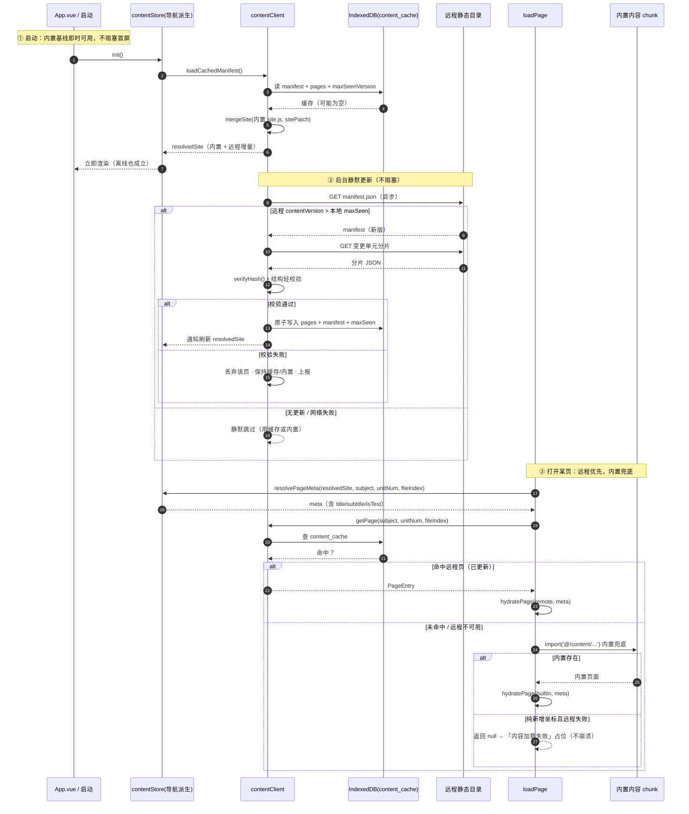
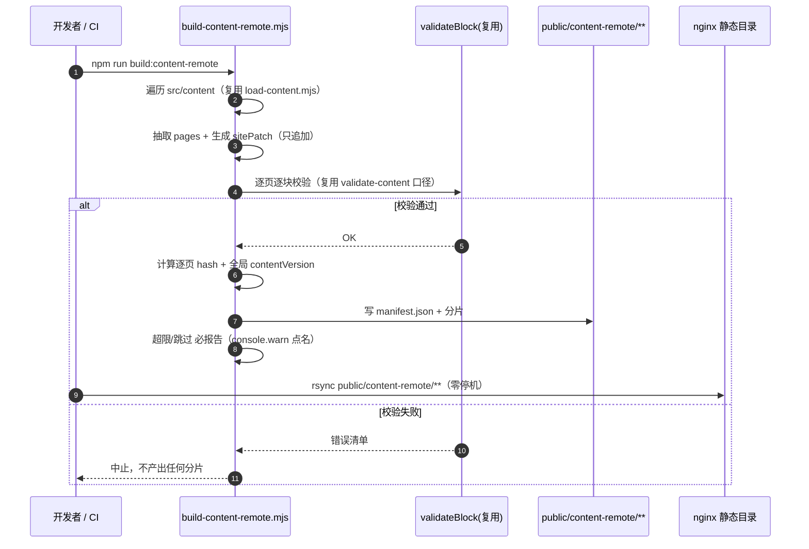

# 内容扩展双轨方案（内置基线 + 远程增量层）与排期

> 状态：**方案已定稿（未写代码）**。基于对当前代码库的只读核查，标注「已验证」的事实均附 `文件:行`，可直接引用。
> 决策背景：用户提问「当前如果想扩展内容怎么办？只能更新应用吗？」→ 现有内容随应用打包，扩展内容必须重装/重发版。用户拍板：「**两者要并存，先写方案排期**」。
> 本方案的落点是「**轨道 A 内置基线不动，轨道 B 远程增量层叠加其上**」，核心难点是两者的**合并策略**与**永不变砖**的兜底。
> **决策状态**：原 6 个待拍板决策点已由用户**全部拍板**（见 §8 已拍板清单）——子形态 = **B1**、服务器 = **静态目录**、顺序 = **内容层优先（S1–S4 先于 P5，S5 与 P5 合并）**、搜索/题库 = **协议共用设计一次到位、实现延后（S5+）**，外加回滚 = **前进式**、更新触发 = **启动检查 + 后台静默**。全文相关的「🔴 待用户拍板」标记已改为「✅ 已拍板」。

---

## 0. 现状核查（轨道 A 的既成事实，直接引用）

| 事实 | 证据 | 对本方案的意义 |
|---|---|---|
| 内容源 = 139 个「纯数据 ESM」（零 import，`export default { blocks }`） | `src/content/{math,chinese,computer}/{unit}/*.js`；`src/content/pageMeta.js:1-13` | 快照 JSON 可**逐字承载** blocks，无需转译 |
| 页面注册在 `site.js` 的 `files[]`，**数组顺序即 fileIndex**，直接决定 URL 与历史进度 | `CLAUDE.md:75`；`src/content/pageMeta.js:31-53` | 远程**只能追加、绝不可重排/插入**，否则 fileIndex 漂移、进度/URL 断裂 |
| 页面元信息（title/subtitle/isTest）唯一真相源是 `site.js`，内容文件**禁止**手写 | `src/content/pageMeta.js:22`；`scripts/validate-content.mjs:109-117` | 远程若新增页面，元信息补丁必须走 `site.js` 合并层，不能塞进 blocks |
| 22 种区块类型由 `schema/content-schema.json` 约束，validator 白名单从 schema 派生 | `schema/content-schema.json`；`scripts/validate-content.mjs:15-29` | 远程内容复用**同一份**校验器，不重写 |
| 已有**运行时加载 JSON 的先例**：题库 `public/practice-bank/{subject}.json` → `src/utils/practiceBankClient.js`（fetch+JSON.parse+内存缓存） | `scripts/build-practice-bank.mjs`；`src/utils/practiceBankClient.js:1-42` | 远程内容层**直接复用这套模式**，无需新范式 |
| 搜索索引同模式：`public/search-meta.json` + `public/search-body/{subject}.json` 分片 | `scripts/build-search-index.mjs`；`src/content/searchIndex.js` | 与内容层**同构**，可共用一套 manifest 机制 |
| 成熟纪律：分片、键名瘦身、**超限必报告**（console.warn 点名，禁止静默失败） | `scripts/build-practice-bank.mjs:221-230`；`scripts/build-search-index.mjs:134-143` | 远程发布脚本必须继承此纪律 |
| 服务端：Fastify + PGlite，已有 `/api/auth`（JWT）+ `/api/sync` + `/api/admin`（含 admin 鉴权） | `server/src/app.js:48-50`；`server/src/admin.js:7-21` | 远程内容可挂同一服务器；管理 API 有现成鉴权可复用 |
| **CSP 红线**：`script-src 'self'`——**禁止远程 ESM 动态 import**；`fetch + JSON.parse` 是唯一合规加载方式 | `src-tauri/tauri.conf.json:23`；`src/utils/practiceBankClient.js:4-7` | 远程内容**只能**是 JSON 数据，禁止远程代码 |
| 双端地址链：`apiBase.js` 读 `VITE_API_BASE`，distinguish 相对路径（Web/dev）与绝对地址（Tauri） | `src/sync/apiBase.js:18-24`；`.env.tauri:16`（`https://520305.top/api`） | 远程内容基址**从同一来源派生**，Tauri 端已具备条件 |
| Tauri CSP 已放行线上后端域名 `https://520305.top` 的 `connect-src` | `src-tauri/tauri.conf.json:23` | 远程内容与同步**共用同一域名**，无需再改 CSP（若同域） |
| 离线优先：IndexedDB 是唯一事实来源，网络只是通道（`study_game_db` v6） | `CLAUDE.md:92`；`src/sync/engine.js:8` | 远程内容缓存天然落在 IndexedDB |
| 导航派生消费 `site.js`：`SUBJECTS` / `getSubjectConfig` 被首页/侧栏/仪表盘/错题本/练习/UnitView 等 **9+ 处**消费 | `src/content/index.js:11-43`；grep 命中 `HomeView/DashboardView/ErrorBookView/UnitView/ProfileView/practice/*` | ⚠️ 若远程**新增单元/页面**，导航派生层需改造——这是轨道 B 的成本分水岭（见 §1.4） |
| 阶段路线图：**P5 = Android 打包**（依赖 P1-P3 + Android 工具链，工具链当前缺）；**P6 = 练习聚合层** | `docs/system_design.md:584-596` | 决定远程内容层与 P5 的先后（见 §7） |

---

## 1. 双轨模型定义

### 1.1 两条轨道各司其职

| | **轨道 A：内置基线** | **轨道 B：远程增量层** |
|---|---|---|
| 载体 | `src/content/**`（纯数据 ESM，139 页）经 Vite 打成独立懒加载 chunk | 「内容快照 JSON」发布到服务器，运行时 `fetch + JSON.parse` |
| 保证 | **开箱即有完整内容 + 离线可用 + 构建期校验兜底** | **不重装即可扩展/更新内容** |
| 变更方式 | 改代码 → 重新构建 → 发版（Web 部署 / APK 重装） | 发布新快照 → 客户端下次启动后台拉取 |
| 定位 | **永远存在的下限**（保底，绝不被裁掉） | **可选叠加的上限**（拿不到就退内置） |
| 本次改动 | **零改动**（`import.meta.glob` 的 139 chunk 机制原样保留，见 `CLAUDE.md:74`） | 全部新增 |

一句话：**轨道 A 是地板，轨道 B 是天花板；天花板塌了，人还站在地板上——永不变砖。**

### 1.2 并存的核心 = 合并策略（本方案最关键的决策）

内容有两类可合并的东西，必须分开处理：

**(1) 站点配置（`site.js`：单元列表 `units[]` + 页面列表 `files[]` = 导航与 fileIndex 的来源）**

- 内置 `site.js` 是唯一真相源（`CLAUDE.md:66`）。
- 远程 `sitePatch` 只能以 **append** 语义叠加：追加新单元、追加新页面。
- **硬约束（继承既有纪律）**：远程**只允许在 `files[]` 尾部追加**，**禁止插入/重排/删除**任何已发布坐标——因为 `fileIndex` 是 URL 与历史进度的身份（`CLAUDE.md:75`），一旦位移，所有用户的历史进度与分享链接全部错位。

**(2) 页面内容（某坐标的 `blocks[]`）**

- 以坐标 `(subject, unitNum, fileIndex)`（等价键 `fileKey = pageFileKeyOf(meta)`，`src/content/pageMeta.js:63-65`）为键做 **upsert**：
  - 坐标已存在 → 远程页**覆盖**内置页（远程代表「更新」）；
  - 坐标是远程新增的 → 纯新增。
- `blocks` 结构与内置**完全同构**，直接交给现有 `hydratePage` + `BlockRenderer` 渲染（`src/content/pageMeta.js:77-79`）。

**(3) 优先级与冲突裁决**

- **页面级**：同坐标时 **远程 > 内置**。
- **版本级闸门**：只认「更新的那一版」。客户端本地记录 `maxSeenContentVersion`；仅当 `远程 contentVersion > 本地 maxSeen` 时才整批替换缓存。**旧的/等值的快照一律不写**——这从根上杜绝「旧快照覆盖新内容」的**回退事故**（见 §3.3）。
- **兜底**：远程路径任何一步失败（网络/解析/哈希/结构非法）→ **该坐标回退内置**；纯新增坐标若失败 → 该页显示「内容加载失败」占位，**不崩溃**。

### 1.3 「永不变砖」的兜底链（三层保险）

1. **内置永远是地板**：`loadPage` 在内置层走 Vite 动态 import（`import('@/content/...')`），这是**打包在应用里**的资源，离线、无网、服务端全挂都能加载。
2. **缓存降级**：有远程缓存用缓存，没缓存/缓存损坏就跳过，直接内置。
3. **发布前置校验 + 客户端哈希兜底**：非法内容进不了发布产物（§3.1），万一漏网，客户端哈希/结构校验拦下并回退（§3.2）。

### 1.4 两种并存的「子形态」（✅ 已拍板：选 B1，成本差一个量级）

| | **B1：仅更新既有内容** ✅ **本轮选定** | **B2：可新增单元/页面**（协议预留，实现延后） |
|---|---|---|
| 远程能力 | 只能 upsert **已有坐标**的 `blocks` | 还能 append 新单元 / 新页面的 `files[]` |
| 合并改造面 | **仅加载层**：`loadPage` + 新 loader + 新缓存；`site.js`、导航派生层**零改动** | **+ 导航派生层**：`SUBJECTS`/`getSubjectConfig` 需改为「内置 + patch」的响应式合并，波及 9+ 消费方（`src/content/index.js:11-43`） |
| 解决的问题 | 用户痛点「**改内容要重装**」 | + 「**加单元/科目**」 |
| 风险 | 低（渲染链路不变） | 中高（fileIndex 位移纪律、导航一致性、跨端缓存迁移） |
| 落地 | **本轮实现（S1–S4）** | **协议预留 `op: 'append'`、实现延后（S5+）** |

> **✅ 已拍板（用户确认）**：本轮**只做 B1**——协议层仍一次性把 `op: 'upsert' | 'append'` 设计进去（**避免以后改协议导致老客户端不兼容**），但**实现先交付 B1**，最小闭环先解决用户真实痛点；**B2（远程新增单元/页面）作为第二个增量延后**，届时再动导航派生层。

---

## 2. 数据与接口设计

### 2.1 内容快照格式（Content Snapshot，复用区块结构）

**页面级粒度**，`blocks` 与内置逐字同构；含坐标、内容哈希。分片存放（一单元一片），避免每次启动全量拉取（继承题库/搜索的分片纪律）。

```jsonc
// 单片：public/content-remote/{subject}/{unitNum}.json
{
  "schemaVersion": 1,
  "contentVersion": 3,                 // 内容代次（全局单调递增，见 manifest）
  "unitKey": "math/01",
  "pages": [
    {
      "subject": "math",
      "unitNum": "01",
      "fileIndex": 6,                  // 坐标（与内置同一语义）
      "fileKey": "math_01_量词与命题否定", // pageFileKeyOf 产物，去重/进度键，必须携带
      "op": "upsert",                  // upsert（覆盖既有坐标） | append（新坐标，需 sitePatch 配合）
      "hash": "sha256:9f1c…",         // 该页 blocks 规范化 JSON 的哈希（客户端兜底校验用）
      "blocks": [ /* 与内置完全同构的区块数组，22 种类型之一 */ ]
    }
  ]
}
```

> **为什么纯 JSON 能完整承载**：区块结构含 mermaid / LaTeX 等**模板字符串**（见 `src/content/math/02-不等式/02-一元二次不等式.js:11` 的 `mermaid: "graph LR\n…"`），JSON 天然表达字符串（`\n` 转义即可），**无信息损失**——这正是「题库/搜索产物已是 JSON」验证过的同一事实。

### 2.2 清单文件（Manifest）

小文件、常驻；**客户端据此判断是否有更新**，不拉取分片正文。

```jsonc
// public/content-remote/manifest.json
{
  "schemaVersion": 1,
  "contentVersion": 3,                 // ★ 全局代次：客户端与本地 maxSeen 比对，决定是否更新
  "generatedAt": "2025-10-09T12:00:00Z",
  "sitePatchHash": "sha256:…",         // sitePatch 的哈希（导航增量是否有变）
  "sitePatch": {                       // 站点增量（只追加）；B1 阶段可以省略/为空
    "units": {
      "math": [
        { "op": "appendUnit",
          "unit": { "num": "13", "title": "…", "folder": "…", "phase": 3,
                    "files": [ { "name": "01-…", "title": "…", "subtitle": "…" } ] } }
      ]
    },
    "fileMetaUpdates": [               // 可选：仅更新既有页的 title/subtitle（不改身份）
      { "subject": "math", "unitNum": "01", "fileIndex": 6, "title": "新标题" }
    ]
  },
  "units": {                           // 每单元一片：哈希 + 时间戳 + 分片路径 + 页数
    "math/01": { "hash": "sha256:…", "updatedAt": "2025-…", "path": "content/math/01.json", "count": 8, "version": 3 },
    "math/02": { "hash": "sha256:…", "updatedAt": "2025-…", "path": "content/math/02.json", "count": 6, "version": 3 }
  }
}
```

**形状定义收敛**：仿 `searchIndex.js` / `practiceBank.js`，新增一个**纯 ESM、零 import** 的 `src/content/contentManifest.js`，把「`schemaVersion` / `contentVersion` / manifest 键 / 分片路径 / `pageKeyOf`」定义**一次**，Node 发布脚本与浏览器 loader **两端共用**（避免第二处漂移源）。

### 2.3 客户端加载优先级链

```
远程缓存(IndexedDB content_cache)  >  远程拉取(fetch manifest+分片)  >  内置打包(dynamic import)
        └── 命中即用，零阻塞 ──┘        └── 有更新才拉，后台静默 ──┘     └── 永远兜底，离线可用 ──┘
```

- **启动**：先用**内置基线**即时渲染（不阻塞首屏）→ 读本地缓存 manifest → **后台异步**拉远程 manifest，比对 `contentVersion`，有更新才下载变更单元分片 → 原子写缓存 → 通知导航/内容层刷新。
- **打开某页**：`loadPage(subject, unitNum, fileIndex)` 先查远程缓存/远程，命中则用；未命中走**内置 import 兜底**。
- **更新触发时机**（✅ **已拍板：启动检查 + 后台静默更新**）：启动时检查 + 后台静默更新；网络不可用则静默跳过（沿用 `practiceBankClient.js:19-23` 的「首次 fetch 后不再重复请求」缓存纪律，扩展为持久化缓存）。

**`studyDb.js` 演进**：新增 object store `content_cache`（`{ key: 'unitKey'|'manifest', version, payload, hash, updatedAt }`）与 `content_meta`（`{ key:'main', manifest, maxSeenVersion }`）。
- `DB_VERSION` 由 **6 → 7**，按既有 `oldVersion` 分支模式在 `onupgradeneeded` 追加（`src/stores/studyDb.js:29,50-118`），`DB_NAME` 不变以兼容旧数据。
- ⚠️ **内容缓存刻意不进 `sync` 引擎**（`src/sync/engine.js:18-25` 的 `ENTITIES` 只覆盖用户学习数据）——内容是**只读共享资源**，不属于「用户私有数据」的 LWW 同步语义，各设备各自从服务器拉取即可（也避免把大块内容塞进 `sync_items`）。

### 2.4 服务器侧：静态目录（✅ 已拍板）vs 管理 API（备选）

| | **方案 A：静态目录托管** ✅ **本轮选定** | **方案 B：管理 API（上传/校验/发布）**（延后） |
|---|---|---|
| 形态 | 发布脚本产出 `public/content-remote/**` → `rsync` 到 nginx 静态目录（与前端同机反代） | `server/` 新增 `/api/content/{manifest,upload,publish}`，复用 `requireAdmin` 鉴权（`server/src/admin.js:7-21`） |
| 后端代码 | **零新增** | 需 CRUD + 存储 + 并发发布 + 校验端点 + 回滚端点 |
| 部署 | 复用现有 CI 零停机 rsync 链（`CLAUDE.md:53`） | 需扩 CI、多加一套接口测试 |
| 适用者 | 开发者/CI 发布内容（当前场景） | 非技术人员经管理 UI 发布（未来场景） |
| 成本 | **S** | **L** |
| 风险 | 无并发写、无鉴权面 | 大文件上传、发布原子性、鉴权/越权面 |

> **✅ 已拍板（用户确认）**：本轮采用**方案 A 静态目录**——本地脚本生成快照 + 上传命令，**零后端代码**，复用现成 rsync 部署链。**方案 B（管理 API）延后**——等内容编辑常态化、非技术人参与时再立项（届时复用已有 admin 鉴权，接口设计已在本表预留）。

### 2.5 远程内容基址（复用 `apiBase` 策略）

- **Web 生产**：与前端同源，`/content-remote/…`（nginx 直接静态服务）。
- **Tauri 桌面/Android**：无转发层，用**绝对地址** —— 从 `VITE_API_BASE`（`https://520305.top/api`）的**源**派生 `https://520305.top/content-remote/…`（复用 `src/sync/apiBase.js:24` 的 `IS_ABSOLUTE_API` 判定分支）。
- **dev**：默认走内置（无需远程内容）；如需联调，给 `vite.config.js` 的 `proxy` 加一条 `/content-remote` 条目（`vite.config.js:63-68`）。
- 域名若与后端一致，**Tauri CSP 无需再改**（`connect-src` 已放行 `https://520305.top`，`src-tauri/tauri.conf.json:23`）。

---

## 3. 质量门（发布前校验 / 客户端兜底 / 回滚）

### 3.1 发布前校验（把 CI 关卡前移到发布脚本）

新增 `scripts/build-content-remote.mjs`，**复用**现有校验资产，不重写：

- 直接 `import` `src/utils/validateBlock.js` 的 `createBlockValidator` + `schema/content-schema.json`（与 `scripts/validate-content.mjs:15-29` 同一份），对快照逐页逐块校验。
- 复用 `scripts/lib/load-content.mjs` 的遍历 / 元信息推导（保证与内置同一套算法，`load-content.mjs:6-13` 已声明此纪律）。
- **校验不通过 → 不产出任何分片**（CI/发布脚本硬关卡）。
- 继承**超限必报告**：任何截断/跳过/异常，`console.warn` 点名具体页（`scripts/build-practice-bank.mjs:221-230` 同款）。

### 3.2 客户端兜底校验（轻量，够用即可）

- **哈希比对**：分片逐页 `hash` 必须与 manifest 一致，才写入缓存；不一致 → 丢弃该页 + 回退内置 + 上报（`console.warn`）。
- **结构校验（轻量）**：`blocks` 必须是数组、每块须有 `type` 字符串——只做「防崩溃」的最低检查，**不做**完整 schema 校验（体积/性能不值当，因为服务端已把关 + 内置兜底）。
- 依据：CSP 已保证远程内容是**纯数据**（无脚本），JSON.parse 无 XSS 面；渲染层是声明式（无 `v-html` 注入原始 HTML），内容无法突破渲染白名单。

### 3.3 内容版本回滚

- `contentVersion` **全局单调递增**。
- **✅ 已拍板：采用「前进式回滚」**：要回滚时，**发布一个 contentVersion 更高、但内容等于旧好版本**的新快照。客户端永远只向前走，**无需任何回退逻辑**——最干净，也避免 B1/B2 各写一套降版本分支。
- **备选（不采用）**：客户端降版本覆盖。需引入 `force` 标记 + 版本回退特判，复杂度高、易出「设备间版本打架」，故选前进式方案。

---

## 4. CSP / 安全 / 离线

| 关注点 | 结论 | 依据/动作 |
|---|---|---|
| CSP 合规 | **fetch + JSON.parse 是唯一合规链路**，远程内容只能是 JSON，禁止远程 ESM `import()` | `src-tauri/tauri.conf.json:23`（`script-src 'self'`）；复用 `practiceBankClient.js` 模式 |
| 内容注入 | 远程只承载 `blocks` 结构；渲染声明式、无 `v-html`，内容无法注入脚本/HTML | 渲染链路现状（`BlockRenderer` 分发，`CLAUDE.md:81-82`） |
| 传输安全 | 走 HTTPS 同域（`https://520305.top`），CSP `connect-src` 已放行，无新增信任面 | `tauri.conf.json:23`；`.env.tauri:16` |
| 离线 | **缓存优先 + 内置兜底**；无网/服务端挂 → 用缓存或内置，功能不中断 | 承接既有「离线优先」原则（`CLAUDE.md:115`） |
| Tauri 端 | 同一条加载链；基址从 `apiBase` 派生绝对地址；CSP 免改（同域） | `src/sync/apiBase.js:18-24` |
| 内容版本一致性 | manifest 全局 `contentVersion` 保证跨端「同一版内容」；导航/内容/（未来）搜索题库同代次发布 | 见 §5 |

---

## 5. 对既有搜索 / 题库的影响

**问题（必须正视）**：`search-index` 与 `practice-bank` 现在是**构建期产物、随应用打包**（`scripts/build-search-index.mjs`、`scripts/build-practice-bank.mjs`）。若远程内容更新后二者不更新，就会出现**「看得到新页面，却搜不到、也练不到」的分裂**。

**方案（推荐）**：**共用同一套 manifest 机制**——内容发布脚本**一次构建、同代次**产出三份产物：
```
build-content-remote.mjs（同一个 contentVersion）
  ├── public/content-remote/**   （轨道 B 内容主体）
  ├── public/search-remote/**    （正文分片，形状复用 src/content/searchIndex.js）
  └── public/practice-remote/**  （题库分片，形状复用 src/content/practiceBank.js）
```
客户端 `search.js` / `practiceBankClient.js` 同样接入「远程缓存 > 远程拉取 > 内置」优先级链——**改造点完全同构**（三者的 loader 结构与缓存层一致）。

**落地节奏（✅ 已拍板）**：
- **协议层一次到位**：manifest 预留 `search` / `practice` 两个子清单（避免以后改协议）。
- **实现分两批**：S1–S4 **只做内容主体**；搜索/题库接入放 **S5+**（过渡期新远程内容搜不到/练不到，可接受）。
- **备选（不采用）**：搜索/题库**本期完全不动**作为独立后续项——取舍上，协议共用设计成本极低（一张表）、返工成本高，故**设计上共用**。
- **✅ 已拍板（用户确认）**：**协议共用设计一次到位，实现延后到 S5+**。

---

## 6. 排期建议（相对工作量 S/M/L，**不承诺具体天数**）

> 遵循「每阶段可独立上线、非大爆炸」的既有路线（`docs/system_design.md:584-596`），并让**轨道 A 全程零回归**。

| 阶段 | 交付物 | 主要文件（新增/改动） | 依赖 | 工作量 | 风险 |
|---|---|---|---|---|---|
| **S1 快照格式 + 构建脚本** | 快照/manifest 形状定义；发布脚本产出 `content-remote/**`；含 sitePatch 生成；单测 | 新增 `src/content/contentManifest.js`、`scripts/build-content-remote.mjs`；复用 `load-content.mjs` / `validateBlock.js` | 无 | **M** | 低（纯构建期，零运行时影响） |
| **S2 客户端加载层 + 缓存** | 优先级链 loader；IndexedDB 缓存 store；`loadPage` 接入（**B1：仅加载层，不含导航合并**） | 新增 `src/utils/contentClient.js`、`src/content/mergeContent.js`；改 `src/content/loadPage.js`、`src/stores/studyDb.js`（v7） | S1 | **L** | **最高**（运行时核心路径，须内置兜底万无一失） |
| **S3 服务器发布脚本 + 上传** | 静态目录 rsync 发布流程 + CI 集成（**已拍板方案 A**） | 新增发布脚本/CI 步骤；nginx 静态目录约定 | S1（产物） | **S** | 低（复用现成 rsync 链）；可与 S2 并行 |
| **S4 校验与回滚** | 发布前校验关卡内嵌；客户端哈希兜底；**前进式回滚**流程文档化 | 改 `scripts/build-content-remote.mjs`；`contentClient.js` 校验分支 | S1（+S2 联调） | **S–M** | 低 |
| **S5 Android 侧验证（+ search/practice 接入）** | Tauri/Android 真机验证远程加载；**搜索/题库远程化（已拍板纳入 S5+）** | 改 `search.js`/`practiceBankClient.js`；真机验证 | S2、S3 | **M** | 中（真机网络/CSP/缓存行为需实测） |

**关键路径**：S1 → S2 是最长链。S3/S4 相对独立、可并行收口。

**全程红线（每阶段自查）**：
- 轨道 A **零回归**：139 chunk 懒加载、内置内容、构建期校验**全部不动**。
- `validate:content` + `lint --max-warnings 0` 仍为硬关卡；新脚本纳入 CI 同款校验。
- 单一来源：形状定义只在 `contentManifest.js` 一份；合并逻辑只在 `mergeContent.js` 一份；**不新写第二套序列化器**（`CLAUDE.md:63`）。
- 超限必报告、CSP、高内聚低耦合、注释写「为什么」。

---

## 7. 与 P5（Android 打包）的关系

**背景**：P5 = Android 打包（`docs/system_design.md:593`），依赖 P1–P3 + Android 工具链（工具链当前缺，`docs/system_design.md:202`）。

**判断：远程内容层应在 P5 打包之前先做（至少 S1–S3）**，理由：
1. **APK 发版后内置内容即冻结**——没有远程层，改内容 = 让**所有 Android 用户重装 APK**，分发/成本/体验都差；而 Web 刷新即最新，痛点小得多。远程层正是让「Android 发版后内容可迭代」的关键能力。
2. **远程层不依赖 P5 工具链**：它只依赖**已具备**的 CSP/`fetch`/`apiBase` 能力，可独立先做，不与 P5 抢工具链。
3. **两者天然合流于 S5**：S5 的「Android 真机验证」本身就是「远程内容层在 Android 生效」的验证——建议 **S5 与 P5 合并**（首个 APK 就带上远程内容层）。

**顺序建议（✅ 已拍板：内容层优先）**：
- **✅ 已拍板（用户确认）**：S1 → S2 → S3 → S4 在 P5 之前完成；**S5 与 P5 合并**（Android 真机一并验证远程加载）。
- **备选（不采用）**：若 P5 工具链先就绪想抢发版 → 可先发一个**纯内置 APK**，远程层随后补；但**首版 APK 内容即锁死**，需尽快补上远程层。

---

## 8. 决策点清单（✅ 已全部拍板）

> 用户已对全部 6 项拍板，结论如下。文中对应章节的「待拍板」表述已同步改为「已拍板」。

| # | 决策点 | ✅ 拍板结论 | 备选（未采用） | 影响 |
|---|---|---|---|---|
| 1 | 并存子形态 | **B1**：本轮只支持「更新既有页面内容」；新增单元/页面走**协议预留 `op: 'append'`**、实现延后 | B2 可新增单元/页面 | B2 需导航派生层改造，工作量 +1 档；本轮不动 |
| 2 | 服务器形态 | **静态目录（方案 A）**：本地脚本生成快照 + 上传命令，零后端代码，复用现成 rsync 部署链 | 管理 API（方案 B） | B 需后端 CRUD/鉴权/并发，工作量 L；延后 |
| 3 | 搜索/题库 | **协议共用设计一次到位、实现延后（S5+）** | 本期完全不动 / 一并做 | 影响「搜不到新内容」过渡期长度 |
| 4 | 回滚策略 | **前进式回滚**（发一版新的旧内容，客户端永远向前） | 客户端降版本 | 客户端无需回退逻辑，最简 |
| 5 | 更新触发 | **启动检查 + 后台静默** | 仅手动刷新 | 影响流量/时效 |
| 6 | 与 P5 顺序 | **内容层优先**：S1–S4 先于 P5，S5 与 P5 合并 | 并行 | 首个 APK 即带远程内容层 |

---

## 附 A：核心数据结构（classDiagram）

```mermaid
classDiagram
    direction TB

    class BuiltinContent {
        <<轨道A 内置基线·零改动>>
        +139 页纯数据 ESM
        +export default { blocks }
    }
    class SiteConfig {
        +subject : string
        +units : Unit[]
        +files[] 顺序即 fileIndex
    }
    class Unit {
        +num : string
        +title : string
        +folder : string
        +phase : number
        +files : FileRef[]
    }
    class FileRef {
        +name : string
        +title : string
        +subtitle : string
        +isTest? : boolean
    }

    class ContentManifest {
        <<轨道B 清单·常驻>>
        +schemaVersion : int
        +contentVersion : int
        +generatedAt : ISO8601
        +sitePatchHash : string
        +sitePatch : SitePatch?
        +units : Map~unitKey, UnitRef~
    }
    class UnitRef {
        +hash : string
        +updatedAt : ISO8601
        +path : string
        +count : int
        +version : int
    }
    class SitePatch {
        <<只追加>>
        +units : AppendUnit[]
        +fileMetaUpdates? : FileMetaUpdate[]
    }
    class ContentSnapshot {
        <<轨道B 分片·按需>>
        +schemaVersion : int
        +contentVersion : int
        +unitKey : string
        +pages : PageEntry[]
    }
    class PageEntry {
        +subject : string
        +unitNum : string
        +fileIndex : int
        +fileKey : string
        +op : upsert|append
        +hash : string
        +blocks : Block[]
    }

    class contentManifestJs {
        <<纯ESM 零import·两端共用>>
        +SCHEMA_VERSION
        +manifestPath() : string
        +snapshotPath(unitKey) : string
        +pageKeyOf(meta) : string
    }
    class contentClient {
        <<浏览器运行时>>
        +loadManifest() : ContentManifest
        +getPage(subject,unitNum,fileIndex) : PageEntry|null
        +refresh() : void
        +getResolvedSite(subject) : SiteConfig
    }
    class mergeContent {
        <<纯函数·易测>>
        +mergeSite(builtin, sitePatch) : SiteConfig
        +pickPage(builtin, remote) : Page
        +verifyHash(page, expected) : bool
    }
    class ContentCache {
        <<IndexedDB v7>>
        +content_cache : {key,version,payload,hash}
        +content_meta : {key,manifest,maxSeenVersion}
    }
    class loadPage {
        <<唯一加载入口>>
        +loadPage(subject,unitNum,fileIndex)
        +importPageModule() 内置兜底
    }
    class buildContentRemote {
        <<Node 发布脚本>>
        +collectSnapshot()
        +validateAll()
        +emitManifest() + emitShards()
    }

    SiteConfig "1" *-- "*" Unit
    Unit "1" *-- "*" FileRef
    ContentManifest "1" *-- "*" UnitRef
    ContentManifest "0..1" *-- "1" SitePatch
    ContentSnapshot "1" *-- "*" PageEntry

    contentManifestJs ..> ContentManifest : 定义形状
    contentManifestJs ..> ContentSnapshot : 定义形状
    contentClient --> ContentManifest : 加载/缓存
    contentClient --> ContentSnapshot : 拉取/缓存
    contentClient --> ContentCache : 读写
    contentClient --> mergeContent : 复用
    contentClient --> contentManifestJs : 复用路径/键
    loadPage --> contentClient : 远程优先
    loadPage --> BuiltinContent : 兜底 import
    mergeContent ..> SiteConfig : 产出
    buildContentRemote --> ContentSnapshot : 产出
    buildContentRemote --> ContentManifest : 产出
    buildContentRemote ..> SiteConfig : 读取内置
```

## 附 B：程序调用流（sequenceDiagram）



## 附 C：发布链（构建/发布侧）


