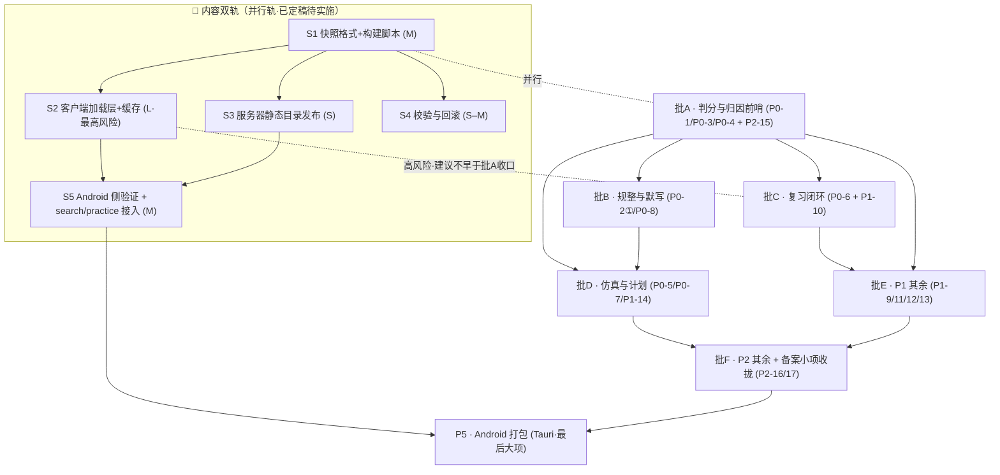

# 实施路线图（内容侧 17 项 + 功能侧存量方案 · 批次与依赖编排）

> 状态：**执行中**（2026-10-10 更新）——批 A/B/C/D 已完成并推送，见下方「进度看板」。
> 本文件是**排期的单一真相源**；每批开工前由架构师细化为 `batch-?-tasks.md` 任务卡（本文件只到「批次」粒度）。
> 角色：架构师（高见远 / Gao）产出；供用户拍板后进入实施。
> 文档地图见 `docs/README.md`。

---

## 进度看板（2026-10-10）

| 批次 | 内容 | 状态 | 证据 |
|:--:|---|:--:|---|
| **批 A** | 判分与归因前哨（判断题派生 / 逐题耗时 / 错题归因 / 人审白名单） | ✅ **已完成** | commit `4e3df6e`…`e6d2f4f` |
| **批 B** | 填空规整判分 + cloze 输入默写（两轮红线攻防） | ✅ **已完成** | commit `bd0a71b`…`43b3707` |
| **批 C** | 复习闭环（`/review` 复习器 + 卡点本 + due 判据收敛 + `reviewed` 语义拆分） | ✅ **已完成** | commit `dabc0aa`…`2f586ab`，QA 三轮 |
| **批 D** | 限时仿真三档 + 学习计划三件套 + kp 组卷权重 + 句级 `strict` | ✅ **已完成** | commit `35f0027`…`dabcd5e`，QA 两轮 |
| **批 E** | P1 其余四项（见 §2 批 E） | ⏳ **下一批** | — |
| **P1-T5** | CSP 护栏（`system_design.md` §10；**方案已有**，见 `csp-guard-plan.md`） | ⏳ **待做** | 2026-10-10 实测两个产物文件均不存在 |
| **批 F** | P2 其余 + 备案小项收拢 | ⏳ 待做 | — |
| **S1–S5** | 内容扩展双轨（方案已定稿） | ⏳ 待做 | `content-extension-dual-track.md` |
| **P5** | Android 打包（Tauri） | ⏳ 待做 | 依赖 S5 + F |

> **当前基线（2026-10-11 更新）**：题库 **2226** 题 / 可判分 **1363**（61.2%）/ 派生 477 / 可规整 147 / 内容页 **181**；
> 分科：数学 1073(492) · 计算机 718(612) · 语文 435(259)；kp 覆盖率 **100%**；DB **v7**。
> （上一版基线：2102 / 1251 / 179 页 —— 内容侧第 8/9 批补密后更新）
> **已落地的硬约束变化**：无（H1–H7 全部仍然有效）。批 A–D 期间**唯一**新增 schema 字段是 `clozeItem.strict`（批 D·D-0，走 H5 白名单）。

---

> 以下为原始规划正文，**批次划分未变**，但「待实施」类描述请以上方看板为准。

> 上游输入：
> - 《对内容侧 17 项需求的评审回应》`协同交流/02_功能侧回函/2026-10-09_对内容侧17项需求的评审回应.md`（17 项**全部受理**，3 处调整建议）
> - 《内容扩展双轨方案》`docs/proposals/content-extension-dual-track.md`（S1–S5 **方案已定稿**，6 个决策点已全部拍板）
> - 《功能与布局改进需求（内容侧提出）》`docs/功能与布局改进需求_内容侧提出.md`（需求原文，编号权威）
>
> **两条纪律贯穿全文**：① 不承诺日期，工作量只用 **S/M/L**，功能侧对内容侧的依赖一律标「**等待内容侧**」；② 数字与事实以代码/文档为准，不确定处标「待核实」。

---

## 0. 背景与约束（开工前必须内化的既成事实）

### 0.1 用户是 2027 届考生，节奏锚点（仅供排批次时权衡「近期价值」，不作日期承诺）

| 节点 | 时间 | 距今 | 对规划的含义 |
|---|---|---|---|
| 技能操作考 | 2026-11-30 | 约 52 天 | **近端最强约束**：P0-1/3/4 与复习器闭环对当前冲刺价值最高 |
| 理论考 | 约次年 4 月 | — | P0-5 限时仿真（150 题/60 分钟）落地的收益窗口 |
| 语数 | 约 6/7 月 | — | P0-2、P0-8（默写）价值窗口 |

> 内容侧评估已明确：**P0-1 / P0-3 / P0-4「小而快」，复习器单页对错题闭环关键**。本规划据此把这三项与前哨复习器（批 C）排在序列前端，均不依赖内容侧交付。

### 0.2 硬约束（违规即返工，任何批次都不得触碰）

| # | 约束 | 出处 |
|---|---|---|
| H1 | CSP `script-src 'self'`——远程/本地内容只能是 `fetch + JSON.parse` 的**纯数据**，禁止动态 `import()` 消费产物、禁止 `eval` | `src-tauri/tauri.conf.json:23`；`src/utils/practiceBankClient.js:4-7` |
| H2 | `site.js` 的 `files[]` **顺序即身份**（决定 `fileIndex`/URL/历史进度/错题 fileKey），**只允许末尾追加**，禁止插入/重排/删除——内容侧与功能侧同守 | `CLAUDE.md:75`；`src/content/pageMeta.js:31-53` |
| H3 | **判分与自评二分，禁止合并统计** | 内容侧 §6.4；`src/stores/practice.js:239-271` |
| H4 | 测试跑 **node v22**（`npm test` = Vitest node 环境，`tests/**/*.test.js`） | `CLAUDE.md:30` |
| H5 | **schema 白名单流程**：内容结构新字段先经功能侧加入 `schema/content-schema.json` 白名单，内容侧再批量补写 | 评审回应 §6.1 |
| H6 | `validate:content` + `lint --max-warnings 0` 是 CI 硬关卡；「超限必报告」（禁止静默失败） | `CLAUDE.md:124`；`scripts/build-practice-bank.mjs:221-230` |
| H7 | 单一真相源纪律：形状定义/合并逻辑/派生规则各只有一份，**不再新写第二套序列化器** | `CLAUDE.md:63` |

### 0.3 存量代码事实（本规划的文件级落点依据）

| 事实 | 证据 |
|---|---|
| IndexedDB 当前 **v6**，仓库：`study_log / daily_stats / page_progress / error_book / notes / bookmarks`（`user_progress` 已退役） | `src/stores/studyDb.js:29,92,103` |
| 同步引擎 `ENTITIES` 覆盖 6 个仓库，**按整行 + `updatedAt` LWW** 采集；`error_book` 行内**加字段零迁移、引擎零改动** | `src/sync/engine.js:18-25,54-81` |
| `recordError` 已支持 `extra` 对象**透传任意字段**（`Object.assign(error, extra)`）到 `error_book` 行 | `src/stores/studyDb.js:642` |
| 错题本「已掌握」**写死 `calculateSM2(err, 4)`**（伪参数根因） | `src/views/ErrorBookView.vue:227` |
| due 口径分裂：Dashboard `!e.reviewed && nextReviewDate <= 今天`；composable `dueReviews` 含「从未复习」分支 | `src/views/DashboardView.vue:160`；`src/composables/useSpacedReview.js:92-96` |
| 题库产物 `public/practice-bank/{subject}.json` + `index.json`，**紧凑键**（`BANK_ITEM_KEYS`）、`gradable = 有 options 且 correctIndex` | `scripts/build-practice-bank.mjs`；`src/content/practiceBank.js:59-94` |
| 搜索索引两级：`search-meta.json`（标题级）+ `search-body/{subject}.json`（正文分片） | `src/content/searchIndex.js`；`src/utils/search.js` |
| 1150 断点分裂：`reader.css` 同一文件内 **1150 与 1151 混用**；`UnitView.vue` 亦 1150/1151 并存 | `src/assets/css/reader.css:55,123,132,321,331,334`；`src/views/UnitView.vue:664,703` |
| `formula` 校验兼容 **`formulas` 与 `lines` 双字段名**（旧写法 19 处） | `src/utils/validateBlock.js:94-97` |
| `solve` 题型来自 quiz/exam **并集**（白名单在运行时拼接，非 schema 单一来源） | `src/utils/validateBlock.js:37-43` |

---

## 1. 总览：批次图与批次表

### 1.1 批次依赖图（Mermaid）

> **读图**：`A–F` 是内容需求实施主线；`S1–S5` 是**并行的内容扩展轨道**（只碰加载层，不碰判分）；`P5` 收尾。虚线是「建议的先后关系」，非硬依赖——留待 §6 拍板。

### 1.2 批次一览表

| 批次 | 内容 | 依赖 | 预估 | 状态 | 对近期备考价值 |
|:--:|---|---|:--:|---|---|
| **A** | P0-1 判断题客观化 · P0-3 `elapsedMs` · P0-4 归因首字段 · P2-15 `verified` 框架 | 无（内容侧仅需守句式约定） | **M** | 待开工（已受理） | ★★★ 小而快，直接抬高判分率 |
| **B** | P0-2 填空规整（**第一批**）· P0-8 `cloze` 输入默写 | A（复用判分/自评链路）；P0-8 需内容侧默写专项 | **M–L** | 待开工 | ★★ 数学/语文提分 |
| **C** | P0-6 复习器单页 · P1-10 卡点本接 SM-2 | A（归因字段）；P0-6 → P1-10 | **L** | 待开工 | ★★★ 错题闭环关键 |
| **D** | P0-5 限时仿真 · P0-7 学习计划三件套 · P1-14 `kp` 组卷权重 | D 内 P0-5 依赖 P0-3；P1-14 依赖 A 的**题目侧 kp 沉淀**+内容侧补标 | **L** | 待开工 | ★★ 理论考窗口（次年 4 月） |
| **E** | P1-9 自评三档化 · P1-11 双轨进度条 · P1-12 番茄钟绑任务 · P1-13 搜索覆盖题目 | A；P1-13 依赖已有题库产物 | **M** | 待开工 | ★ |
| **F** | P2-16 志愿填报（仅流程+官方入口）· P2-17 作品训练卡三遍法 · **备案小项收拢** | E 之后可选 | **M** | 待开工（含部分已定稿小项） | ☆（6 月填报考季用） |
| **S** | 内容双轨 S1→S2→S3/S4→S5 | 见 1.1；用户已拍板「内容层优先于 P5」 | S1 M / S2 **L** / S3 S / S4 S–M / S5 M | **已定稿待实施** | ★（能力建设，非即时提分） |
| **P5** | Android 打包（Tauri） | S5 + F；依赖 Android 工具链（当前缺，待核实） | **L** | 待开工 | ☆（分发形态） |

---

## 2. 批次任务分解（文件级）

> 约定：`新增` = 建新文件；`改` = 修改既有文件。每条含**关键数据结构变更 / 测试要点 / 风险**。

### 批 A —— 判分与归因前哨（第一梯队，三独立小项并行 + P2-15 同批设计）

#### A-1 判断题自动客观化（P0-1）

- **改** `scripts/build-practice-bank.mjs`：新增**派生步骤**——对 `type:'judge'` 且 `answer` 以「`**正确。`/`**错误。`」开头的题，构建期生成 `o:['正确','错误']` + `ci`（0/1），并标 `dv:true`（derived）。派生前**全量扫描**并输出「首句匹配失败/例外句式」清单（给内容侧确认，非阻塞）。
- **改** `src/content/practiceBank.js`：`BANK_ITEM_KEYS` 增紧凑键 `dv:'derived'`；`normalizeBankItem` 展开 `derived`。**产物格式变更 → 需重建 `npm run build:practice`**。
- **新增** `src/content/judgeDerive.js`（纯 ESM、零 import，构建脚本与浏览器两端共用；H7 单一真相源）+ `tests/judge-derive.test.js`。
- **数据结构**：题库条目新增 `derived:boolean`；`gradable` 判定在派生后自然为真。
- **测试要点**：① 匹配成功派生 T/F；② 匹配失败保持原样不判分；③ `validate:content` **零新增报错**（派生只在题库产物，不动 `src/content/**`）；④ 结算/统计能按 `derived` 区分（H3 二分）。
- **风险**：低。**待定**：页面内 `QuizBlock` 是否同步派生（见 §6 待拍板 3）——若只在题库产物派生，则内容页 `QuizBlock` 判断题仍不可点选。

#### A-2 单题耗时 `elapsedMs`（P0-3）

- **改** `src/stores/practice.js`：`session.records[]` 增 `enterAt/elapsedMs`（进入下一题时结算上一题耗时）。
- **改** `src/components/blocks/ExamBlock.vue`：每题进入时间戳 → 结算 `elapsedMs`（复用现有 `deadline` 时间戳校准时序）。
- **改** `src/stores/studyDb.js`：**存储落点待定**（见 §6 待拍板 2）——① 挂到 `error_book` 行（零迁移、引擎零改动，但只覆盖错题）；② `study_log` 增收题级记录（覆盖面全，但写放大）；③ 新仓库 `question_attempt`（需 `DB_VERSION` 升版 + `engine.js` 加 `ENTITIES`）。
- **改** 结算页（`PracticeResult` / `ExamBlock` result）：耗时最长 **Top N** + **45s 超时**标记 + 「一键归因超时」（联动 A-3）。
- **同步**：`elapsedMs` 随同步上传（评审 §3.3 明确要求）。
- **测试要点**：45s 阈值可配置；超时题数/平均耗时口径（供 D 的 P0-5 复用）。
- **风险**：中。**若选方案③，务必与内容缓存的 `v7` 合并为一次升版**（见 §2.S2）。

#### A-3 错题归因字段（P0-4 用户侧）

- **改** `src/stores/practice.js` + `src/components/blocks/ExamBlock.vue`：自评「不会」后弹**二级归因层**（≤6 chip，一点即完成，可跳过）。
- **新增** `src/components/ReasonChips.vue`（reason 六选一 + `kp` 自由文本）。
- **改** `src/stores/studyDb.js`：`recordError` 的 `extra` 通路已存在（`:642`），预期**零改动**或仅补默认值；`wrongCount` 去重命中时自增（评审 §4.2）。
- **改** `src/views/ErrorBookView.vue`：按 `reason` 筛选 + **归因分布**区块。
- **数据结构**：`error_book` 行新增 `reason(六选一) / kp(自由文本) / wrongCount(用户数据字段)`——**行内加字段，零迁移、`engine.js` 零改动**（对照 `masteredAt` 先例 `studyDb.js:547-554`）。
- **测试要点**：`reason` 与自动判分结果**分别统计不合并**（H3）；跳过归因不阻塞；`wrongCount` 重复入本自增。
- **风险**：低。与**题目侧 `kp` 标签**是两条独立路径（评审 §4.2）。

#### A-4 派生题 `verified` 人审框架（P2-15）

- **改** `scripts/build-practice-bank.mjs`：`verified` 标记纳入产物（与 A-1 同批设计——派生结果可被人工查看）。人审通道首选**脚本 + 抽检清单**（H1 下不引管理 UI）。
- **改** `src/content/practiceBank.js`：紧凑键增 `vf:'verified'`。
- **测试要点**：`verified:true` 后与人工题**同权统计**；未 verified 的派生态可区分。
- **风险**：低。

### 批 B —— 规整与默写（P0-2 第一批 + P0-8，共用规整逻辑）

#### B-1 填空规整判分（P0-2 第一批）（P0-2）

- **新增** `src/utils/answerNorm.js`（纯函数，两端共用，H7）+ `tests/answer-norm.test.js`：数值容差 / 分数↔小数 / LaTeX 剥离（`\(...\)`、`$$...$$`）/ 全半角 + 空格容错。
- **改** `src/stores/practice.js`：`fill` 题接入规整判分（**匹配失败回落自评，不判错**）。
- **改** `scripts/build-practice-bank.mjs`：可选为 `fill` 预生成 `answerNorm`（**优先靠规整器，不改存量内容**）。
- **schema（可选，走白名单 H5）**：`schema/content-schema.json` `quizItem` 增 `answerNorm` 字段 + `validateBlock.js` 语义规则。
- **测试要点**：`0.5`==`1/2`==`0.500`；`{x|-1≤x≤3}`==`[-1,3]`（**第二批**，本批可不含集合/区间）；回落自评不阻塞。
- **风险**：中（正则边界多，需穷举用例）。**第二批**（集合/区间归一）另立小项，可并入批 D 或独立。

#### B-2 `cloze` 输入默写（P0-8）

- **改** `src/components/blocks/ClozeBlock.vue`：新增 `input` 模式——空位可输入 → 提交**逐空比对**（复用 `answerNorm`）→ 标对错；支持「全部重默」「只看错的那句」；**存量默认保持「点击揭晓」不变**（向后兼容）。
- **schema（走白名单 H5）**：`schema/content-schema.json` `clozeItem` 增输入模式标记（如 `mode: 'reveal' | 'input'`）+ `validateBlock.js`。
- **移动端**：输入体验专门处理（软键盘、逐空焦点、防误触）。
- **改** `src/stores/practice.js` / `studyDb`：默写结果进错题/复习队列（与 SM-2 打通）。
- **依赖**：**等待内容侧** `chinese/07-默写专项/`（评审 §5 明确同迭代）。
- **风险**：中（移动端输入 + 向后兼容边界）。

### 批 C —— 复习闭环（P0-6 → P1-10）

#### C-1 复习器单页（P0-6）

- **新增** `src/views/ReviewView.vue`（单卡会话：先自答 → 翻面 → **四档评分** → 下一题；参考 `PracticeSession` 一屏一题骨架）。
- **改** `src/router/index.js`：新增 `/review`。
- **改** `src/composables/useSpacedReview.js`：确立为 **due 口径唯一真相源**；四档评分**真实传入 `calculateSM2`**（不再写死）。
- **改** `src/views/DashboardView.vue`：`todayDue` 改调 `useSpacedReview`（**合并两处口径**，数字必须一致）。
- **改** `src/views/ErrorBookView.vue`：移除写死 `grade=4`（`:227`），改走统一评分入口。
- **改** `src/views/HomeView.vue` / `src/components/AppTabBar.vue`：复习入口**前置首页顶部**，先复习后学新。
- **关键行为**：单次上限 20–30；空队列显示「**今日已清零**」并引导新内容（不显示空态）。
- **测试要点**：`tests/useSpacedReview.test.js` 扩四档；两处 due 数值一致性；四档→间隔映射真实变化。
- **风险**：中（口径合并会改动 Dashboard 既有数字，需回归）。

#### C-2 卡点本接入 SM-2（P1-10）

- **新增** 卡点本存储（**待定**：复用 `error_book` 加 `kind` 字段 vs 新仓库——见 §6 待拍板 5）。
- **改** `src/composables/useSpacedReview.js`：支持 `kind`（错题 / 卡点）混合队列。
- **新增** 卡点卡组件（**操作名/路径默写形态**：只显示操作名、隐藏路径）。
- **依赖**：P0-6 队列先落地（评审 §3 确认）。
- **风险**：中。

### 批 D —— 仿真与计划 + `kp` 组卷（P0-5 / P0-7 / P1-14）

#### D-1 限时仿真三档（P0-5）

- **改** `src/stores/practice.js`：新增限时模式（**25 题/10 分钟 · 50 题/20 分钟 · 150 题/60 分钟**；仿真档允许 `includeExam`）。
- **改** `src/views/practice/*`：倒计时 + 结束自动交卷 + 中途提前交卷（复用 `ExamBlock` 计时/交卷骨架）。
- **改** 结算页：正确率 + **平均单题耗时** + **超时题数**（**依赖 A-2**）+ 「≤14 天间隔」温和提示。
- **依赖**：**等待内容侧**补题库量——150 题档需足够可判分题（评审 §4.3：P0-1/P0-2 落地后显著扩容）。
- **风险**：中。

#### D-2 学习计划三件套（P0-7）

- **新增** `src/stores/studyPlan.js` + `src/views/PlanView.vue`（预算表 32h 校验提示 / 里程碑倒计时 / 每日清单）。
- **存储**：IndexedDB 新仓库或 localStorage（**待定**，见 §6 待拍板 2 的升版合并）。
- **关键行为**：**不做排课算法**；「漏一天自动顺延、不惩罚、不清零」。
- **风险**：低。

#### D-3 `kp` 粒度组卷权重（P1-14）

- **依赖**：A 的**题目侧 `kp` 沉淀**（内容侧先自由文本、后成字典）+ 内容侧补标（**等待内容侧**）。
- **schema（走白名单 H5）**：`quizItem`/`examItem` 增 `kp` + `validateBlock.js`。
- **改** `scripts/build-practice-bank.mjs` + `src/content/practiceBank.js`：产物增 `kp` 键。
- **改** `src/utils/composePaper.js`：权重维度由 `unit` 扩到 `unit｜kp`（`weakWeightsFromErrors` 口径扩展）。
- **风险**：中（依赖外部补标进度）。

### 批 E —— P1 其余

| 项 | 落点文件 | 要点 | 风险 |
|---|---|---|---|
| **P1-9 自评三档化+校准率** | 改 `src/stores/practice.js`、`QuizBlock.vue`/`ExamBlock.vue` 自评区；新增校准率面板 | 三档「会 / 看答案才会 / 不会」；中间态**入错题权重减半**；题干行为化；校准率仅作相对排序 | 中 |
| **P1-11 双轨进度条+文案「已接触」** | 改 `src/views/DashboardView.vue`、`src/stores/progress.js`、全站文案排查 | 已接触（visited）vs 已掌握（`masteredAt`）双轨；测验页以 `testScore` 为主口径 | 低 |
| **P1-12 番茄钟绑定任务** | 改 `src/composables/usePomodoro.js`、`PomodoroPanel.vue` | 启动选任务；结束登记产出；时长按科目归集；**番茄数不再用 `studyMinutes/25` 反推**（`:268` 需改） | 中 |
| **P1-13 搜索覆盖题目** | 改 `scripts/build-search-index.mjs`、`src/utils/search.js`、`SearchPanel.vue` | 扩展至题库题干（标题级 + 题干子串） | 低 |

### 批 F —— P2 其余 + 备案小项收拢

| 项 | 落点 | 要点 | 风险 |
|---|---|---|---|
| **P2-16 志愿填报** | 新增内容页（走 site.js 末尾追加，H2）+ 官方入口链接 | **仅流程说明 + 浙江省教育考试院官方入口**，不固化任何院校录取结论（硬约束） | 低 |
| **P2-17 作品训练卡三遍法** | 新增 block 类型或内容页；第三遍复用现有倒计时组件 | 一张卡三勾（对照做 / 只看成品还原 / 限时独立做） | 中 |
| **备案小项收拢** | 见 §2.F-3 | 见下 | 低 |

#### F-3 备案小项清单（收拢执行，避免长期化）

1. **1150 断点统一化**：`reader.css` 同文件内 1150/1151 混用（`:55/123/132/321/331/334`）；`UnitView.vue` 亦 1150/1151 并存（`:664/703`）。统一到 `--bp-lg:1150px`（`main.css:206`）。
2. **`ContentSidebar` 抽屉锁归属感知**（QA 观察项）。
3. **schema 口径差异 5 处**：
   - `formula` 的 `formulas`/`lines` 双字段名，**19 处旧写法**（`validateBlock.js:94-97`）——收敛为单一字段名；
   - `table` 的 `headers` **语义未强制**（schema 要求但 validator 只查 `rows`，`validateBlock.js:109-111`）；
   - `solve` 白名单为 quiz/exam **并集**（运行时拼接，非 schema 单一来源，`validateBlock.js:37-43`）；
   - `columns` 的 `cols` **未强校验**（长度与 `cols` 一致未强制）；
   - **几何字段未入 schema**（`diagram` 仅 `boardId`，其余走注入）。
4. **`AGENT_BROWSER_ARGS` 传参查证**（**测试工具，非产品**）——独立小任务，不占产品批次。

### 批 S —— 内容扩展双轨（并行轨，已定稿待实施）

> 完整设计见 `docs/proposals/content-extension-dual-track.md`。此处只给**与主线的接口点**。

| 阶段 | 关键文件 | 与主线的接口 | 预估 | 状态 |
|---|---|---|:--:|---|
| **S1 快照格式+构建脚本** | 新增 `src/content/contentManifest.js`、`scripts/build-content-remote.mjs` | **零运行时影响**，可与批 A 并行 | M | 已定稿待实施 |
| **S2 客户端加载层+缓存** | 新增 `src/utils/contentClient.js`、`src/content/mergeContent.js`；改 `src/content/loadPage.js`、`src/stores/studyDb.js`（**v7**） | **最高风险**：动 `loadPage` 运行时核心路径；`DB_VERSION 6→7` **须与 A-2/D-2 的存储变更合并为一次升版** | **L** | 已定稿待实施 |
| **S3 服务器静态目录发布** | 发布脚本 + CI（rsync，零后端代码） | 复用现成部署链，可与 S2 并行 | S | 已定稿待实施 |
| **S4 校验与回滚** | 改 `scripts/build-content-remote.mjs`；`contentClient.js` 校验分支 | **前进式回滚**（发一版新的旧内容） | S–M | 已定稿待实施 |
| **S5 Android 侧验证 + search/practice 接入** | 改 `src/utils/search.js`、`practiceBankClient.js`；真机验证 | **与 P5 合并**（首个 APK 即带远程内容层） | M | 已定稿待实施 |

> **与批 A 的关系（关键拍板点）**：S2 是「改运行时核心加载路径」的最高风险大件；批 A 是「小而快、直接提分」的前哨。用户已拍板「内容层优先于 P5」，但**未裁 S2 与批 A 的先后**——见 §6 待拍板 1。

### 批 P5 —— Android 打包（Tauri，最后大项）

- **依赖**：S5（远程内容层就绪）+ F；**当前缺 Android 工具链**（`docs/system_design.md:202`，待核实）。
- **风险**：L（真机网络/CSP/缓存行为需实测）。
- **纪律**：S5 与 P5 合并，**首个 APK 即带远程内容层**（评审/双轨方案一致）。

---

## 3. 内容侧依赖表（功能侧每批次需要内容侧配合什么）

> 原则：功能侧对内容侧**一律标「等待内容侧」，不硬编码日期**。内容侧交付时间不确定，故只约定**配合事项与建议节奏**。

| 功能批次 | 需内容侧配合 | 性质 | 建议节奏 |
|---|---|---|---|
| **A-1 P0-1** | ① 保持新增判断题「`**正确。**`/`**错误。**`」句式；② **确认功能侧出具的历史例外清单** | 硬约定 + 一次性确认 | 功能侧先出清单 → 内容侧确认（不阻塞派生的存量部分） |
| **A-3 P0-4** | 无需（`kp` 为自由文本用户数据） | — | — |
| **A-4 P2-15** | 抽检确认派生题 | 参与 | 随 A-1 产物产出后 |
| **B-1 P0-2** | 可选补 `answerNorm`（**优先级低于规整器**，不阻塞） | 可选 | 规整器覆盖不到时再补 |
| **B-2 P0-8** | **`chinese/07-默写专项/` 内容**（依赖 P0-8 才有训练价值） | **强关联** | **与 P0-8 同一迭代** |
| **C P0-6** | 无 | — | — |
| **D-1 P0-5** | **补题库量**（新增单元时同步补**可判分题**：选择/判断优先） | 硬需求（150 题档） | 「新增单元」同时为既有单元补可判分题 |
| **D-3 P1-14** | ① 题目侧 `kp` 标签（**先通知功能侧走 schema 白名单 H5，勿直接写入内容文件**）；② 先自由文本、后成字典 | **强依赖** | 功能侧先开 schema 白名单 → 内容侧再批量补标 |
| **E P1-11** | 无（文案在功能侧） | — | — |
| **F P2-16** | 志愿填报**流程文案** | 提供内容 | 6 月填报考季前 |
| **F P2-17** | 作品训练卡内容（PS/PR 步骤） | 提供内容 | 随批 F |
| **全批次** | ① `site.js` **只追加末尾**（内容侧新增单元须同步知会，避免与 S2 导航合并打架）；② 新结构化字段**先走 schema 白名单**（H5）；③ 新增单元同步考虑「可判分性」 | 硬约束 | 持续 |

> **⚠️ 双轨 S2 期间的额外约束**：S2 落地期间，内容侧对 `site.js` 的**新增单元（`files[]` 追加）** 会改变导航派生面；虽然 append 语义兼容，但 S2 联调期建议**冻结 site.js 结构变更**（见 §6 待拍板 7）。

**内容侧将新增的单元（会改变环境，规划中一律视为「等待内容侧」）**：`computer/00-理论基础/`、`computer/06-组装与维护/`、`computer/07-数据库基础/`、网络补网页设计、`chinese/07-默写专项/`、数媒概念卡、应用文拆 3 页、全页目标 ABCD 改写。

---

## 4. 里程碑建议（功能性，非日期）

| # | 里程碑 | 达成的标志（可验收） | 依赖批次 |
|:--:|---|---|:--:|
| **M1** | **判分覆盖率显著提升** | P0-1 派生落地 + P0-2 第一批后，产物 `gradableTotal` 相对基线 **286 题（20.5%）** 明显上升；具体目标值**待核实**（以判断题存量 + 填空可规整量测算） | A + B |
| **M2** | **错题闭环可用** | 错题采集（`reason`/`kp`/`elapsedMs`）→ 复习器四档评分**真实驱动 SM-2** → 两处 due 口径**数字一致** → 空队列「今日已清零」 | A + C |
| **M3** | **近考冲刺可用** | 限时仿真 **25/50 档**（150 档待题库量）+ 学习计划里程碑倒计时可用；结算展示平均单题耗时与超时题数 | A + D |
| **M4** | **内容可热更新（永不变砖）** | 双轨 S1–S4 上线：内置基线零回归、远程缓存优先级链生效、前进式回滚可用 | S |
| **M5** | **Android 发版** | 首个 APK 带远程内容层，真机验证远程加载 + 离线兜底 | S5 + P5 |

---

## 5. 关键数据结构变更汇总（跨批次，防冲突）

| 数据面 | 变更 | 影响 | 协调点 |
|---|---|---|---|
| **IndexedDB 版本** | v6 → **v7** | 新增 `content_cache` / `content_meta`（S2）；**可能**含 `question_attempt`（A-2 方案③）或 `study_plan`（D-2） | **所有需升版的批次必须合并为一次 v7**，避免多次升级；`DB_NAME` 不变 |
| **`error_book` 行** | 增 `reason` / `kp` / `wrongCount` /（可选）`elapsedMs` / `kind`（卡点） | **零迁移、`engine.js` 零改动**（行内加字段，`updatedAt` LWW 自动携带） | A-3 / C-2 |
| **`sync` 协议** | 新字段随整行上传；**协议字段无枚举白名单**，行内字段自动同步 | 无新增实体则 `ENTITIES` 不动 | A-2（若新实体则需加 `ENTITIES`） |
| **题库产物** | 紧凑键增 `dv:derived` / `vf:verified` /（D-3）`kp` /（B-1）`answerNorm` | `BANK_ITEM_KEYS` 单一来源；产物需重建 | A-1 / A-4 / B-1 / D-3 |
| **内容 schema** | `answerNorm` / `cloze.mode` / `kp` 等**新字段走白名单 H5** | `validateBlock.js` 语义规则同步（schema ≠ 校验口径，见 `CLAUDE.md:70`） | B / D-3 |
| **搜索索引** | 纳入题库题干 | 复用现有两级分片 | E（P1-13） |

---

## 6. 待用户拍板的事项

> 以下每项都会影响批次顺序或数据结构，**建议按序拍板后再开工**。

### ✅ 拍板结果（2026-10-09，全部已定）

| # | 事项 | 拍板结论 |
|:-:|------|---------|
| 1 | S2 与批 A 的优先级 | **A 先收口，S2 随后启动**（不并行——S2 改加载核心路径，需批 A 后的稳定基线） |
| 2 | `elapsedMs` 存储落点 | **方案③ 专用表 `question_attempt`**（全题覆盖；与 S2 的 `v7` 升版合并，只升一次） |
| 3 | P0-1 派生范围 | **题库产物 + 页面内 `QuizBlock` 双落点**（同一纯函数两处复用，学习页判断题也点选判分） |
| 4 | P0-5 / P0-7 是否前移 | **P0-7 学习计划前移至批 B/C 之间**；P0-5 限时仿真保持批 D（等题库量 + P0-3 耗时先行） |
| 5 | P1-10 卡点本存储 | **复用 `error_book`（加 `kind` 字段，零迁移）** |
| 6 | 批 E 内部顺序 | **P1-11 / P1-13 低风险项提前**到高价值批次之间填空 |
| 7 | S2 联调期 site.js 冻结 | **与内容侧约定：S2 联调期暂缓新增单元/页面**（经协同交流区知会） |

> 以下为原始待拍板条目（存档备查）：

1. **S2 与批 A 的优先级关系**——S2（改 `loadPage` 运行时核心路径，最高风险）是否**让路**给批 A（小而快、直接提分），即 A 先收口、S2 后启动？还是并行推进（S2 需更强回归兜底）？
2. **`elapsedMs` 存储落点**（A-2）——① `error_book` 行（零迁移，仅覆盖错题）/ ② `study_log` 题级记录（全覆盖，写放大）/ ③ 新仓库 `question_attempt`（需 v7 + `ENTITIES`）。**若选③，须与 S2 的 v7 合并为一次升版**。
3. **P0-1 派生范围**——是否只落**题库产物**（练习/组卷可判分），还是**页面内 `QuizBlock` 判断题也同步派生**（点选判分）？后者需在渲染期或快照期复用同一 pure function。
4. **P0-5 / P0-7 是否前移**——二者对「11/30 操作考」近端价值较高，是否从批 D 前提到批 B/C 之间？
5. **P1-10 卡点本存储**——复用 `error_book`（加 `kind` 字段，零迁移）vs 新仓库（语义更清晰，需 v7）。
6. **批 E 内部顺序**——P1-11（文案/双轨，低风险）与 P1-13（搜索，低风险）是否提前到高价值批次之间「填空」？
7. **S2 期间是否冻结 `site.js` 结构变更**——S2 联调期建议与内容侧约定「暂停新增单元/页面」，避免导航派生面与远程合并联调互相干扰。

**待拍板事项数：7。**

---

## 附：本规划未决 / 需开工时复核的「待核实」项

- M1 里程碑的**判分覆盖率目标值**：需先测算判断题存量与填空可规整量，再定阈值。
- Android 工具链现状（`docs/system_design.md:202` 标注「当前缺」）：P5 开工前复核。
- 内容侧新增单元的**具体页数与可判分题占比**：影响 D-1 的 150 题档可行性。
- schema 口径 5 处的**修复影响面**：`formulas`/`lines` 19 处旧写法的迁移脚本工作量待评估。
