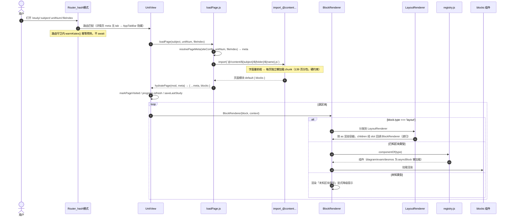
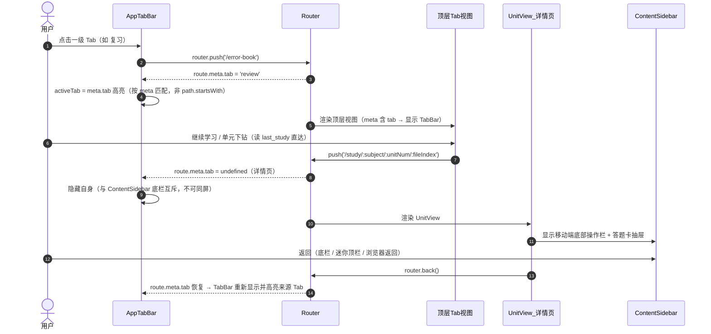

# 移动端体验大改造 · 系统设计 v1

> 状态：**v1.5（翻页口径定档 380ms + 「已掌握」数据落点定论 + `data-kind` 映射定稿，2026-10-07）**。
> **v1.5 本轮变更**：①翻页时长**定档**：`--swipe-overlap: 100ms`，总时长 **380ms**（此前 120/400 口径差统一，全文档唯一口径；调试口径改为"整档缩放 `--swipe-out/in`，不动 overlap 语义"，§5.7.6）；②新增 **§5.7.7「标记已掌握」数据落点定论**：`page_progress` 行内加 `masteredAt`（毫秒时间戳）、`engine.js` 零改动（ENTITIES 已含 page_progress）、三个「掌握」语义命名表（completed / mastered / masteredAt+isPageMastered），落地清单并入 P4-T4，页脚主行动定为「标记已掌握」；③**`data-kind` 映射定稿**（§5.6.2：concept/point/example/practice/note 五值域 + 覆盖 16/22 类型，其余缺省不输出；与 `iconOf` Lucide 契约同批，P4-T3 已更新依赖）；④§5.6.3 补「桌面端 `.reading-progress` 渐变改纯色 `--primary`」（橙色渐变违规，PM 发现）；⑤§11-15/16/20 关闭，删除头部重复的 v1.3 残段。
> v1.4 记录：**翻页并行档 + 进度条双端策略**——出场 100ms 入场（总 380ms）落 `reader.css` 三 token；§5.3 新增「两档转场时长」对照表（R2 ≤300ms 只约束路由级转场、不放宽）；移动端只留页眉 2px 分段刻度、删除 `.reading-progress`（不挂载），桌面端保留（§5.6.1 / §5.6.3 / §5.7.0-3，P4-T4 按断点拆渲染分支）。
> v1.3 记录：**新增 §5.7 学习页 v4**（页眉/页脚可插拔功能条 + 滑动翻页转场），回答六个技术问题：手势实现选型（自写 Pointer Events，**不引库**）、边缘右滑返回与内容右滑翻页的判定规则（起手 x 阈值 24px）、View Transitions **不适用于**本场景（改手动三态机）、backdrop root 解耦写法（并列 + 玻璃条恒常）、性能/降级/`prefetchPage` 时机；并入 D15/D16；更新 §5.2 分层与 §5.3 两条硬规则；§10 更新 P4-T4、新增 P4-T5；§11 新增 16-20。
> v1.2 记录：①并入 **D11-D14**（练习自评强制 / 自动组卷 / 署名块 / 克制+关键处加强）与 **v2 风格细则**（玻璃 30-42% + 内侧高光、TabBar 液态悬浮 pill、陶土橙加至 ~6 处）；②新增 §5.6 学习页视觉改进（玻璃迷你顶栏可行性、区块差异化最小改动路径、进度条统一）；③**正确性体检**（§12）：修正「147 页」→ **139 页**（147 = 139 数据页 + 3 site.js + 5 基建文件）等多处数字/表述；④§13 给出 `docs/csp-guard-plan.md` 处置结论。
> v1.1 记录：复核结论「无失真」；更正 geogebra「已无 src 引用」不实；精化 §5.1 WebKit bug 触发条件；补 §2 `/practice` 路由；补全 §9 / §10。

---

## 1. 决策记录（ADR 摘要）

| #  | 决策       | 结论                                                          | 依据                                                                                             |
| -- | -------- | ----------------------------------------------------------- | ---------------------------------------------------------------------------------------------- |
| D1 | 技术栈      | **保留 Vue 3，不迁 React**                                       | 四条样式诉求 Vue 全部可做且三条已在用；真正的约束是内容模型，迁栈不解决；迁栈成本 4-8 周且需重趟风险点                                       |
| D2 | 目标载体     | **桌面窗口 + Android 包**，自适应优先（一份布局两端，不写两套）                     | 用户拍板                                                                                           |
| D3 | 底部导航     | **4 Tab：学习 / 练习 / 复习 / 我的**                                 | 采纳 PM 建议；"练习"为新增聚合层                                                                            |
| D4 | 内容模型     | **方案 A：布局原语**（排布自由度）                                        | 存量 **139 个数据页**零改动；"任意自定义组件"仅在极少数页面作逃生舱                                                         |
| D5 | 动效       | **丰富，分级降级**（高端丰富/低端精简）                                      | WebView + 移动端性能硬约束                                                                             |
| D6 | 视觉       | 导航页玻璃拟态+柔光渐变；学习页 Claude 纸质阅读；**全面禁用 emoji，改 Lucide SVG 图标** | 用户拍板                                                                                           |
| D7 | 编辑器      | **删除**（使用频率 0）                                              | 用户拍板                                                                                           |
| D8 | Tailwind | **不引入**                                                     | 与现有 2000+ 行 token CSS 并存会风格漂移                                                                  |
| D9 | 图标       | **Lucide**（`lucide-vue-next`）                               | 24.8k star、ISC、编译期内联 SVG、CSP 零风险；排除 Iconify 运行时模式（connect-src 拦截）与 Phosphor（6 权重易花哨，与降 AI 味相悖） |
| D10 | GeoGebra 演练场 | **下线**：移除 desmos 区块实例与全部入口，`vendor/geogebra` 随之 `git rm`（保留 `scripts/fetch-geogebra.mjs` 供将来重拉）；`stash@{0}` 重写方案保留，P4 阶段用 layout 原语体系重做 | 桌面端白屏已实测（C7）；单页锦上添花功能不占大改造预算；GWT 运行时内联注入属第三方行为不可控 |
| **D11** | 练习自评 | **强制**：看答案后必须选「我会了 / 我还不会」才能进下一题，不可跳过。自评是错题入库的**唯一触发器** | **架构师实测复核一致**：全库 `question` 键共 **1393** 处，`correctIndex` 共 **286** 处 → 仅 **20.5%** 可机器判分，79.5% 只有自由文本答案，无自评则错题本无输入源 |
| **D12** | 模拟冲刺 | **支持自动组卷**（按难度/单元从 1393 题组卷），不止现有 4 套真题卷 | 实测：exam 区块仅 4 个文件（`math/12-模拟冲刺/02、03`、`chinese/06-模拟冲刺/02`、`computer/05-模拟冲刺/02`），覆盖极薄 |
| **D13** | 署名块 | **仅保留一处**（「我的」页，墨色小字，去紫红渐变文字与 ❤️ emoji）；其余页脚署名卡全删 | 用户拍板 |
| **D14** | 视觉方向 | **克制为主 + 关键处加强**：整体 Claude 纸质克制高级感，首页/入口等少数位置加强视觉冲击 | 用户拍板；导航页渐变**保持克制**（用户明确选此项） |
| **D15** | 学习页结构（v4） | **页眉/页脚压缩为可插拔功能条**（页眉 ~44px、页脚 ~52px，阅读区 330→376px）+ **左右滑动翻页带转场**（`translateX(±22px)` + fade，出 260ms / 入 280ms，`cubic-bezier(.22,.61,.36,1)`，只动 transform/opacity，reduced-motion 降级） | 用户拍板 v4；PM 正在写入 `docs/prd-mobile.md` §7；技术侧可行性与落地写法见 **§5.7** |
| **D16** | 手势归属 | **层级分开**：屏幕边缘 0-24px 的右滑**交系统返回**（应用不注册）；内容区右滑 = 上一页、左滑 = 下一页。手势**自写（Pointer Events），不引第三方手势库** | ①Android 10+ 手势导航的返回手势即"从左右边缘向内滑"（官方文档已核实），系统优先消费，应用申索需 `View.setSystemGestureExclusionRects()`（Tauri 侧能力 **待确认**）②项目 runtime deps 仅 6 个、无 @vueuse，且第三方库在 `script-src 'self'` 下的 eval 安全性未核实（§5.7.1） |

**CSP 硬约束**（贯穿所有选型）：`script-src 'self'`（禁 eval/内联脚本）；`style-src 'self' 'unsafe-inline'`（内联样式允许）；`font-src 'self' data:`（字体必须自托管）；`connect-src` 不含第三方域。

---

## 1.5 工程原则（贯穿全部实施阶段，2026-10-06 用户新增）

### 高内聚低耦合

| 原则 | 含义 | 落地方式 |
|---|---|---|
| **高内聚** | 一个模块/组件只负责一件事，相关状态与逻辑就近放置 | 延续 registry 模式（`blocks/registry.js` 集中注册）；通用逻辑抽 composable（`useKatex`/`useMermaid` 先例）；layout 原语与区块组件**正交**（互不感知，正交组合是内聚的） |
| **低耦合** | 模块间只通过明确接口通信，消灭隐式依赖 | 组件间只用 props/emits 显式契约（禁 provide/inject 滥用）；样式只经 CSS token（禁跨组件选择器穿透）；**"耦合检查"列为每阶段验收项** |

**已知耦合点（重构时必须处理）**：
- `ContentSidebar` 的底栏与 `UnitView` 深度绑定（互斥逻辑分散在两处）
- 悬浮番茄钟（`UnitView.vue:144`）与内容页状态耦合
- `iconOf(type)` 返回字符串被 TOC/HomeView 直接消费（契约脆弱，Lucide 迁移时已计划改为 `<AppIcon>` 组件）

### 中文注释规范

- **精简**：只注释"为什么"（决策原因、陷阱提醒、契约说明），不复述代码"是什么"
- **新手友好**：关键路径有步骤说明；魔法值与复杂时序有解释（正面示范：`main.css:16-48` 的迁移策略注释、`ColumnsBlock.vue` 的"不 import BlockRenderer 避免循环依赖"）
- **语言**：中文
- **范围**：所有新增代码必须遵守；存量代码在被触碰时顺手补齐，**不做专项补注释**（避免无意义的 diff 噪音）
- 反面示例：`// 设置为 true`、`// 遍历数组` 这类复述型注释

---

## 2. 信息架构

### 现状问题（PM 诊断，代码证据）

- Web 式 IA：首页 4 张卡做导航中心 + 页脚 nav + 面包屑；全站 grep 不到 tabbar/bottom-nav
- `App.vue` 常驻站点式顶部 header；`.app-main { max-width: 960px }` 桌面居中列
- Dashboard/ErrorBook/Profile 均带面包屑（纯 Web 惯用法）

### 目标 IA：底部 Tab Bar（移动）+ 侧栏（桌面）

| Tab    | 收录现有页面                                                      | 归并理由                                       |
| ------ | ----------------------------------------------------------- | ------------------------------------------ |
| **学习** | HomeView（继续学习卡、学科切换、阶段分组、搜索）                                | 内容导航最高频；"继续学习"卡天然是首屏                       |
| **练习** | **新增聚合层**：模拟冲刺 + 按学科/单元题目聚合（quiz/exam 区块提取）                 | "刷题"是独立任务流（进题→对错→结算），现 quiz/exam 埋在页内无聚合入口 |
| **复习** | ErrorBookView + useSpacedReview（SM-2 到期队列）+ Dashboard 薄弱点洞察 | 错题+间隔复习+薄弱点是同一"补漏"闭环                       |
| **我的** | ProfileView + DashboardView（进度/统计）+ 主题 + 管理后台(admin) + 退出   | "账号+数据+设置"标准"我的"Tab                        |

**二级下钻**：学习 → 学科 → 单元 → **内容页**（UnitView 保留）；练习 → 做题会话（全屏）→ 结算；复习 → 到期队列 → 错题详情 → 跳回来源页。

**路由 meta 结构**（架构师设计，入口清单已定）：

```
每个一级入口 = 顶层路由，meta: { tab: '<id>', tabOrder: n }
/           → meta {tab:'study'}（学习：现 HomeView）
/practice   → meta {tab:'practice'}（练习：新增聚合层，交互稿待 PM 细化）
/error-book → meta {tab:'review'}（复习）
/profile    → meta {tab:'me'}（我的）
/study/...  → 详情页不带 tab meta（push 进入，隐藏 TabBar）
/admin      → 非 tab（仅 admin）
```

- active 高亮按 `route.meta.tab` 匹配（非 path.startsWith），避免详情页误点亮
- **互斥规则**：详情页（ContentSidebar 底栏）与 AppTabBar 不可同屏——详情页隐藏 TabBar

---

## 3. 内容模型重构（核心）

### 现状证据

- 22 类型硬白名单：`schema/content-schema.json:27`；`validateBlock.js:70` 未知类型报错
- **容器区块已支持递归**（`ColumnsBlock.vue:13-15`、`GroupBlock.vue:22-24` 用 slot 避免循环依赖）——本仓库最有价值的既有资产
- **校验器已是递归实现**（`validateBlock.js:154-177`）→ 扩展成本低

### 三个候选方案

| 方案           | 做法                                                                                                                                        | 存量兼容                  | 作者工作流              | 工作量                         | 定位              |
| ------------ | ----------------------------------------------------------------------------------------------------------------------------------------- | --------------------- | ------------------ | --------------------------- | --------------- |
| **A 布局原语** ⭐ | `columns/group` 泛化为 `{type:'layout', as:'grid'\|'stack'\|'split'\|'hero'\|'bleed'\|'rail', props, children:[block\|layout]}`，允许 layout 嵌套 | ✅ 100%（新增类型，**139 个数据页零改动**） | 手写声明式 .js 数据（已是现状） | 中（6-10 个原语 + 校验 + 注册表 + 测试） | **主力**          |
| B 逃生舱        | 页面可 `export default { component: () => import('...Xxx.vue') }`                                                                            | ✅ 100%（默认走 blocks 分支） | 写 Vue SFC，门槛陡      | 小                           | 仅极少数页面，**不作默认** |
| C 版式变体       | 22 类型加 `layout/span/tone/align` props                                                                                                     | ✅ 100%                | 改字段                | 极小                          | A 的低成本子集        |

**推荐：A 为主 + B 逃生舱 + C 作为 A 的子集**。明确反对"放弃数据模型、每页写组件"——会让 139 个数据页 + 搜索索引（`build-search-index.mjs` 按 blocks 形状抽取）+ 未来任何批量改动全部失守。

> 📏 **页数口径（正确性体检修正，2026-10-07）**：`src/content/**/*.js` 共 **147 个 .js 文件**，其中**数据页 139 个**，其余 8 个是基建文件（3 个 `site.js` + 根目录 `index.js`/`loadPage.js`/`pageMeta.js`/`serializePage.js`/`searchIndex.js`）。先前文档多处写「147 页」**不准确**，本文档统一按 **139 个数据页**计（与 `CLAUDE.md` 的「139 个页面」一致）。§9.2 时序图注释中的「139 页分包」是**正确**的，无需改。

**实现要点**：

- layout 与 block **共用 `type` 单键**（不引 `kind`）
- 校验器**统一递归**（复用 `validateBlock.js:154-177` 骨架）+ **递归深度上限**（防深嵌套）
- 渲染新增 `LayoutRenderer.vue`，复用现有 slot 递归模式
- 矛盾 A 回答：作者写**结构化布局数据**（非代码、非模板语言——禁 eval 符合 CSP），**可接受**

---

## 4. 移动端架构

### 4.1 TabBar —— 纯手写 `AppTabBar.vue`（v2：**圆角液态悬浮 pill**）

**v2 形态（用户已定，取代 v1 的「贴底栏 + 中间凸起 fab」）**：

| 项 | v2 参数 |
|---|---|
| 形态 | 四周留白、**不贴底**的悬浮胶囊；`border-radius: 28px`（高 56px 时正好胶囊形） |
| 玻璃底 | `rgba(255,255,255,.42)` + `backdrop-filter: blur(12px) saturate(1.2)` |
| 投影 | 暖可可 `0 8px 24px rgba(88,46,29,.10)` |
| 激活项 | 底色 `rgba(201,100,66,.10)`（陶土橙）+ 内圆角 `22px` |
| 显示条件 | 仅 `< var(--bp-lg)`（1150px）；桌面端为侧栏 |

**悬浮 pill 的安全区公式（v2 新增，与 v1 贴底不同）**：

```css
/* pill 自身：不贴底，但仍必须让开系统手势条 */
.app-tabbar {
  position: fixed;
  bottom: calc(var(--space-3) + var(--sab));          /* 12px + 安全区 */
  left:  calc(var(--space-4) + var(--sal));           /* 16px + 横屏左安全区 */
  right: calc(var(--space-4) + var(--sar));
}
/* 内容区让位：pill 高度 + 上下留白 + 安全区 */
.app-main { padding-bottom: calc(var(--tabbar-h, 56px) + var(--space-3) + var(--sab) + var(--space-2)); }
```

- ⚠️ **悬浮 pill 同样受 §5.1「祖先不可有 transform/filter/will-change」约束**（否则玻璃静默失效）；它是 `position: fixed`，父级链上任何 transform 都会同时破坏 fixed 定位与 backdrop root
- ⚠️ 圆角玻璃在 WebKit 上圆角处可能出现模糊溢出/锯齿 → 把 `backdrop-filter` 放到**同圆角的伪元素层**（父级 `border-radius` + `overflow: hidden`）
- 高频直达入口保留「读 `last_study` → `router.push('/study/...')`，无历史降级为默认页」；**形态改为 pill 内的一个强调项**（取消 v1 的中间凸起 fab，避免凸起处破坏胶囊轮廓与 backdrop root）
- 信息架构统一：App.vue 顶部 header、详情页 ContentSidebar 底栏、悬浮番茄钟——**三者不得与 pill 同屏打架**

### 4.2 响应式 —— 容器查询为主

**决定性依据**：项目大量"同一区块被放进不同宽度容器"（桌面侧栏里的区块其实很窄但视口很宽）→ **媒体查询按视口判断会误判**。容器查询按实际可用宽度判定。

- 用法：`container-type: inline-size` + 尺寸查询；**避开 `cqw/cqh` 单位（老 Safari bug）与 style queries（Safari 18 才支持）**
- 支持：WebView Android 105+ / Safari iOS 16+ / WKWebView macOS 13+ → 满足
- 兜底：`@supports not (container-type: inline-size)` → 退回媒体查询

### 4.3 断点收敛（现有 6 个碎片值 → 4 级阶梯）

| 名称        | 值      | 语义                    | 归并          |
| --------- | ------ | --------------------- | ----------- |
| `--bp-sm` | 600px  | 手机竖屏                  | ← 600（10 处） |
| `--bp-md` | 900px  | 平板/横屏                 | ← 640/768   |
| `--bp-lg` | 1150px | **桌面↔移动分界**（侧栏↔底栏切换线） | ← 1150/1151 |
| `--bp-xl` | 1280px | 宽桌面（**新增档**，现有代码无对应） | — |

> 修正说明：`1024px`（`ColumnsBlock.vue:65`）与 `768px`（`CompareBlock.vue:98`）**不是全局断点**，它们是区块级宽度判断，按 §4.2 应**迁到容器查询**，不并入本阶梯（v1 表格曾把 1024 归入 xl，表述不准）。

### 4.4 哪些组件需要结构性两套排布（仅 3 处）

| 类别                          | 组件                                                                            |
| --------------------------- | ----------------------------------------------------------------------------- |
| **结构性**（元素位置真的变，同一数据两个容器）   | `ContentSidebar.vue`（侧栏↔底栏+抽屉）、`UnitView.vue`（内容+侧栏↔迷你顶栏）、`AppTabBar.vue`（新增） |
| **布局变体**（props 表达意图，CSS 降级） | `ColumnsBlock.vue`（多栏↔单列）、`CompareBlock.vue`（左右↔上下）                           |
| **仅密度/排版**（不改结构，token 切换）   | 其余全部                                                                          |

### 4.5 安全区 —— 已就绪，只需规范化

`main.css:252-258` 已定义 `--sat/--sab/--sal/--sar`；`index.html:6` 已 `viewport-fit=cover`。规范：底栏 `calc(8px + var(--sab))`，sticky 顶栏 `calc(8px + var(--sat))`。

### 4.6 Tauri Android 前置条件（当前未装）

已具备：`lib.rs:5` `mobile_entry_point`、crate-type 含 staticlib/cdylib、android 脚本、icons/android+ios。  
尚缺：① Android Studio + SDK + NDK + JDK 17（`ANDROID_HOME`/`NDK_HOME`）② Rust target `aarch64-linux-android` ③ `npm run tauri:android:init` ④ keystore 签名 ⑤ 移动端缺失能力用 `#[cfg(desktop)]` 隔离。

---

## 5. 视觉与动效

### 5.1 玻璃拟态 —— 手写 CSS（无成熟库，Vue 侧空白）

**v2 参数（2026-10-07 用户已定，取代 v1 的 55-72% 半透明）**：

```css
/* 玻璃三要素必须 token 化：暗色主题与降级各需一份取值 */
:root {
  --glass-bg: rgba(255, 255, 255, 0.42);   /* v2：30-42%（v1 为 55-72%，偏"闷"） */
  --glass-hl: rgba(255, 255, 255, 0.9);    /* 内侧高光：模拟折射 */
  --glass-shadow: 0 8px 24px rgba(88, 46, 29, 0.10);  /* 暖可可投影 */
}
:root[data-theme="dark"] { --glass-bg: rgba(28, 28, 26, 0.42); }

.glass {
  background: var(--glass-bg);
  -webkit-backdrop-filter: blur(12px) saturate(1.2);   /* 必写前缀 */
  backdrop-filter: blur(12px) saturate(1.2);
  box-shadow: inset 0 1px 0 var(--glass-hl),           /* 内侧高光边 */
              var(--glass-shadow);
}
.glass-pill { border-radius: 28px; }                   /* 见 4.1 液态 TabBar */
```

**约束（v1/v2 均成立，v2 新增两条）**：

- **blur 上限 8-16px**（v2 沿用）。引用已核实（bugs.webkit.org）：#316769 触发条件是**极大 stdDeviation（~200px 级）**导致 paint >10s（已并入 #315118 修复钳制），对本项目的 12px 不构成直接威胁；但 **#322045** 证实**中等半径（64px）下「blur 元素 + 内联 SVG 同帧首绘」仍会卡死首帧**——本项目玻璃层与 Lucide 内联 SVG 图标同屏是常态，故除钳制 blur 外：**首帧避免「玻璃 + 大量内联 SVG」同现**（hero 图标延后一帧挂载，或装饰性发光改用 CSS 渐变/mask 替代 blur）
- **头号陷阱**：祖先有 `transform`/`filter`/`will-change`/`contain:paint` → 创建新 backdrop root → **玻璃效果静默消失**。玻璃层不可被"动画 transform 的祖先"包住
- **v2 新增**：**液态 pill 形态同样受上条约束**，且因 `position: fixed` + 不贴底，父级链上任何 transform 会同时破坏固定定位与 backdrop root
- **v2 新增**：**圆角玻璃**在 WebKit 上圆角处可能模糊溢出/锯齿 → `backdrop-filter` 挂在与 pill 同圆角的伪元素层，父级 `border-radius` + `overflow: hidden`
- 降级：`@supports not (backdrop-filter)` → 不透明背景（token 换值即可，与 §5.5「只换 token 不换写法」一致）

**陶土橙加量（v2）**：v1 仅 3 处偏少 → v2 **约 6 处**：①激活 Tab ②两个数据数字 ③进度条 ④chip 标签 ⑤主行动按钮 ⑥（学习页）当前位置/关键强调。仍须满足 D14「克制为主」，加量集中在**入口与关键数据**，不铺满内容区。

### 5.2 动效 —— ⚠️ 需正式反转 `main.css:182-186` 的既有哲学

该处明确写"动效克制…不做路由过渡/stagger/滚动视差"。用户新需求要求反转，需同步改注释与策略。

**分层选型**：

| 层     | 方案                                                       | 依赖                                   |
| ----- | -------------------------------------------------------- | ------------------------------------ |
| 微交互   | Vue `<Transition>`/`<TransitionGroup>` + CSS             | 0 依赖                                 |
| 页面转场  | **View Transitions API**（`document.startViewTransition`） | Chrome111+/Safari18+；不支持则直接切换；<500ms |
| **内容换页**（v4 新增，见 §5.7.3） | **手动 CSS 动画类 + 三态机**（`useSwipePaging`），**不用 VT、也不用 `<Transition>`** | 0 依赖；因新内容异步到达，`<Transition>` 的同步假设与 VT 的快照开销都不合用 |
| 滚动/手势 | **@vueuse/motion**（<25KB，自动尊重 reduced-motion）            | 轻量；不引 GSAP（25-35KB、命令式）。⚠️ 滑动翻页**不走这一层**（自写，见 §5.7.1） |

**动效清单**：

- ✅ 值得：Tab 指示器滑动、卡片按压 `scale(.97)`、区块进入 fade+rise（IntersectionObserver 一次）、阅读进度条（已有）、浮层进出、页面转场
- ⚠️ 陷阱：滚动视差（易掉帧，仅少量元素+低端机关闭）、一屏几十个同时动画、**对 backdrop-filter 元素做 transform 动画（破坏玻璃）**、长转场阻塞输入

### 5.3 性能预算与降级（用户已接受分级）

- **只动 `transform`/`opacity`**（compositor-only）；禁动 `width/height/top/left/box-shadow/blur`
- `will-change` 生命周期：进入前加、`animationend` 后移除
- 三层降级：`prefers-reduced-motion`（已有）→ 能力分级（hardwareConcurrency/deviceMemory 或首帧 FPS 采样）→ 低端机仅 opacity 或全关
- 验收：低端安卓真机 + `chrome://inspect` Performance 面板必测
- **⚠️ 转场时长有两档口径，禁止混用（2026-10-07 已定）** —— 见下表

| 档 | 适用范围 | 时长约束 | 落地位置 |
| --- | --- | --- | --- |
| **路由级转场** | P3-T2，接在 `router-view` 上，跨路由记录（Tab 切换、进/出详情页） | **≤ 300ms**（R2 验收项，**不因内容换页放宽**） | `src/utils/viewTransition.js` + `App.vue` |
| **内容换页** | P4-T5，`UnitView` 内部三态机，同路由记录的 `fileIndex` 变化 | **并行档：出启动后 100ms 入场，总时长 = 100+280 = 380ms**（调试时整档缩放，不动 overlap 语义，见 §5.7.6） | `useSwipePaging.js` + `reader.css` 的 `--swipe-out/in/overlap` |

- 上表两档是**不同层级**：路由级转场在内容换页时**根本不会被触发**（§5.7.3），因此内容换页的 380ms **不违反** R2。真机实测后若内容换页仍偏钝，**只调 `--swipe-out/in`（整档缩放），不动 R2 的 300ms**
- **⚠️ 硬规则（v4 新增，跨阶段生效）**：**路由级转场（P3-T2）不得对 `router-view` 包裹元素做 `transform`**。该包裹元素是 `AppTabBar` / 学习页页眉 / 页脚三条 `position: fixed` 玻璃层的祖先，一旦带 `transform` 会同时破坏 backdrop root（玻璃静默失效）与固定定位（§5.1）。路由级转场**只用 `opacity`**；需要位移感的场合用 View Transitions 或把位移放到页面内部元素上
- **⚠️ 硬规则（v4 新增）**：任何被动画（transform/opacity/`will-change`）的容器内**不得**放 `backdrop-filter` 玻璃层；玻璃层必须是被动画元素的**兄弟**而非后代（§5.7.4）

### 5.4 图标迁移（Lucide）

- 迁移点：`blockTypes.js:16-38`（22 个 icon）、`content/index.js:41-45`（SUBJECT_META 📐✍️💻）、各 View 硬编码 emoji
- **契约变更**：`iconOf(type)` 现返回字符串 → 改返回 Lucide name + 新增 `<AppIcon :name>` 组件统一渲染；同步 `tests/block-registry.test.js`

### 5.5 Claude 纸质阅读风 —— 规范要点

纸白 `#f8f8f6`（非纯白）、墨色 `#1a1a1a`（非纯黑）、陶土橙 `#c96442` 极克制点缀、暖灰分隔线、暖可可色阴影；衬线标题（Source Serif 4 自托管，font-src 'self' 限制禁 CDN）单一中等字重 500；正文 16-17px / 行高 1.6-1.7；行宽 65-75ch（**中文 30-40 汉字**，需覆盖 prose 默认度量）；圆角阶梯 6/8/12/16。**现有 main.css token 已大体符合**，本轮是增强而非推翻。
> ⚠️ 口径差异（体检标注）：现有 token 圆角阶梯是 **8/12/16/20/24**（`main.css:92-97`：`--radius-sm/md/`、`--radius/lg/xl`），与本节提议的 **6/8/12/16** 不同 → 这是一次**有意的收敛**（PM 侧提案），实施时须同步改这 5 个 token 并全量回归视觉，不是"增强"而是**改基数**。

---

### 5.6 学习页视觉改进（用户："还需要继续改进"）

> PM 从产品侧给区块级差异化方案（概念/要点/例题/练习/小结 各自形态）；本节是**技术侧补**：可行性、最小改动路径、与 v2 视觉的统一。
>
> **⚠️ 与 v4 的关系（2026-10-07 更新）**：用户已拍板学习页 **v4（§5.7）**，页眉改为**常驻 ~44px 功能条**，因此 §5.6.1 的「滚动 >200px 后才出现的迷你顶栏」这一**触发方式被取代**（常驻）。§5.6.1 的可行性结论（顶栏已用 `backdrop-filter`、`z-index` 正确、属改造而非新建）继续有效，但其中「滚动后出现 → 天然避开首帧」**这条失效**：常驻页眉意味着首帧即出现「玻璃 + Lucide 内联 SVG 图标」，必须按 §5.1 的 #322045 规避策略处理（图标延后一帧挂载，或首帧页眉用不透明背景、第二帧再切玻璃）。

#### 5.6.1 玻璃质感迷你顶栏（阅读页）—— 可行性：✅ **已有基础，属改造而非新建**（⚠️ v4 下触发方式改为**常驻**，见 §5.7）

**现状（已核实）**：`UnitView.vue` 已有移动端迷你顶栏——模板 `UnitView.vue:19-25`（`v-if="showTopbar && page"`，滚动 >200px 后出现，带 `<transition name="topbar">`），样式 `UnitView.vue:574-584` **已经用了 `backdrop-filter: blur(10px)` + `color-mix` 半透明背景**。所以 v2 只需**按新规范改参数**，不需要新建组件。

**职责承载（TabBar 在阅读页隐藏时）**：返回首页（现有 `.topbar-back`，`UnitView.vue:21`）+ 页面标题（`.topbar-title`）+ 阅读进度（`.topbar-progress`）——三者现成，缺的是**目录/书签/笔记**入口（移动端已收进 ContentSidebar 底栏，不重复放顶栏）。

**⚠️ 进度承载按已定双端策略执行（见 §5.6.3 / §5.7.0 第 3 条）**：v4 顶栏的进度区——**移动端只放「2px 分段刻度 + 页码数字」**（单元内第几页），**不再放页内滚动进度**（`.topbar-progress` 的百分比在移动端移除）；**桌面端保留**页内滚动进度。即：移动端顶部只出现**一条**进度指示。

**v2 改造点**：半透明降到 30-42% + 内侧高光边 + 圆角（改为**悬浮胶囊**，与底部 pill 呼应：顶栏也可做成 28px 圆角的悬浮条，`top: calc(var(--space-3) + var(--sat))`）+ 陶土橙用于进度数字。

**`backdrop-filter` 在滚动时的表现与降级（⚠️ 必须实测）**：

| 风险 | 说明 | 处置 |
|---|---|---|
| 滚动时每帧重采样 | iOS WebKit 不缓存模糊结果，滚动时逐帧重跑高斯模糊 → 移动端可能掉帧 | ①blur 钳制 ≤12px ②顶栏不做滚动视差/位移动画 ③低端机（§5.3 能力分级）降级为**不透明背景** |
| 与 View Transitions 叠加 | 转场快照含 blur 层时，合成器负担叠加 | 转场期间给顶栏加 `data-transitioning` 临时关闭 backdrop-filter |
| 首帧「玻璃 + 内联 SVG 图标」 | §5.1 已述 #322045 陷阱：顶栏图标（Lucide 返回箭头）与玻璃同帧首绘可能卡首帧 | 顶栏在滚动 >200px 后才出现 → **天然避开首帧**，风险低于底部 pill；底部 pill 仍需按 §5.1 处理 |
| 祖先 transform 破坏 backdrop root | 顶栏若被 `<transition>` 的 transform 动画包裹（现有 `topbar-enter` 用 `translateY`）→ 玻璃会静默失效 | **动画只作用于子元素/伪层**，或对玻璃层改用 `opacity` 过渡（不用 transform） |

#### 5.6.2 区块差异化 —— 最小改动路径：**CSS 属性选择器（`data-kind`）为主，不引入新容器原语**

**结论**：**不需要**新容器原语，也**不改**渲染链路（`UnitView → BlockRenderer → registry` 完全不动）。分三层递进，按需要取用：

| 层 | 做法 | 改动面 | 适用 |
|---|---|---|---|
| **L1 纯 CSS（推荐先做）** | `UnitView.vue` 的 `.block-anchor`（`UnitView.vue:100-110`）加 `data-kind="<语义类>"`；`src/assets/css/blocks.css` 用 `[data-kind="concept"] h3 { ... }` 之类写差异化（字号/留白/左侧色条/底色/圆角） | 1 个模板属性 + 1 个 CSS 文件；**零 schema、零组件、零存量改动** | 概念/要点/小结 的视觉层次（PM 的「≥2 级视觉层次」） |
| **L2 组件内形态调整** | 各 block 组件内部改模板（如「要点」卡片化、「例题」渐进折叠） | 仅涉及被改的 2-5 个 block 组件 | PM 的「例题渐进 / 练习专注」这类形态差异 |
| **L3 布局原语（方案 A）** | 用 P0 的 layout 原语重排页面 | 需 P0 完成 | 真正不同的**排布**（非样式差异） |

**`data-kind` 映射表 —— ✅ 已定稿（2026-10-07，值域用英文，PRD 侧跟随此命名）**：

| `kind` 值 | 内容角色 | 覆盖的 `type` |
|---|---|---|
| `concept` | 概念 | knowledge / objectives / vocab / strategy / mindmap |
| `point` | 要点 | formula / table / summary / compare / steps / cloze |
| `example` | 例题 | example |
| `practice` | 练习 | quiz |
| `note` | 小结 / 警示 | warning / tip / errorfocus |
| （无 `kind`） | 布局原语与功能区块 | columns / group（布局类无语义角色）；exam / diagram 等功能区块默认不出 `data-kind` |

- 覆盖 22 种 `type` 中的 **16 种**；其余（布局原语与 asyncBlock 功能区块）**缺省不输出 `data-kind` 属性**，CSS 只按 `[data-kind=...]` 匹配、无缺省样式 → 未列出的 type 自动"无角色"，不会被误样式化。实施时以 `blockTypes.js` 现有 22 项逐一核对归入
- **落点与依赖**：映射放 `src/components/blocks/blockTypes.js` 的 **`kind` 字段**（该文件已有 `label`/`icon` 元信息，是唯一真相源），**与 §5.4 的 `iconOf` → Lucide 契约变更同批修改，避免两次改同一张表**（任务依赖已写入 **P4-T3**）；沿用 `tests/block-registry.test.js` 的守卫模式加"22 项必有 kind 或显式豁免"的测试

#### 5.6.3 阅读进度条与 v2 统一

> **✅ 双端策略已定（2026-10-07 用户拍板，与 PM 产品侧结论一致）**：
> - **移动端（< 900px）只留分段条**——v4 页眉内底边的 2px 分段刻度（"单元内第几页"）；`.reading-progress` 滚动进度线**删除**（不挂载，非仅隐藏）。理由：同屏两个进度指示读数冲突，且移动端的"第几页"比"页内滚动百分比"更有位置感
> - **桌面端（≥ 900px）保留 `.reading-progress`**（页内滚动进度），分段条同时显示
> - 完整口径见 §5.7.0 第 3 条；`UnitView` 的渲染分支要求见 **P4-T4**

**现状**：`UnitView.vue:465-473` —— `.reading-progress` 固定顶部 `height: 3px`；`.reading-progress__bar` 用 `linear-gradient(90deg, var(--primary), var(--accent))`（`--primary` 已是陶土橙 `brand-500`，见 `main.css:76`）。**已基本符合 v2**，只需三点（**第 1 点按上表分端**）：

1. 与悬浮顶栏**合并承载**：进度条移到顶栏内/紧贴顶栏底部，避免顶部出现两条横线；`z-index` 需高于顶栏玻璃层（现 `.reading-progress` 为 100、`.mobile-topbar` 为 99 → 已正确）。⚠️ **仅桌面端需要这条**（移动端该元素不渲染）；移动端的位置感由页眉的 2px 分段条承担
2. 圆角与 token 化：进度条端点圆角 `var(--radius-full)`；颜色改**纯色 `var(--primary)`** —— 现有 `linear-gradient(90deg, var(--primary), var(--accent))`（`UnitView.vue:470`）是**橙色渐变**，违反 v2「禁用橙色渐变」（PM 已发现此违规），桌面端保留时必须改为纯色
3. 动效统一：进度条宽度过渡**只动 `width` 会触发布局** → 改为 `transform: scaleX()` + `transform-origin: left`（§5.3「只动 transform/opacity」）；`prefers-reduced-motion` 下直接跳变。⚠️ 移动端不渲染该元素后，`updateReadProgress()` 里的进度计算也应跳过（否则白算一遍）

---

### 5.7 学习页 v4 —— 可插拔功能条 + 滑动翻页转场（用户已拍板；本节为**技术侧可行性**）

> PM 正在把产品侧规范写入 `docs/prd-mobile.md` §7；本节只补技术侧结论与落地写法，不重复产品描述。用户要求"写进去，暂时不开工"。

#### 5.7.0 已定参数与技术侧补充约束

| 项 | 用户定值 |
|---|---|
| 页眉 | ~44px；玻璃 `rgba(255,255,255,.38)` + 内侧高光，**不加投影**；结构 `[返回][标题][页码] + 右侧插槽`；2px 分段进度（段数自适应） |
| 页脚 | ~52px；`[主行动] + [次级图标插槽 ×N]` |
| 空间账 | 页眉 76→44、页脚 130→52，阅读区 330→376 |
| 翻页 | 左右滑动；`translateX(±22px)` + fade；出 260ms / 入 280ms；`cubic-bezier(.22,.61,.36,1)`；只动 transform/opacity；reduced-motion 降级 |

技术侧补充（不冲突，只是补实现口径）：

1. **"不加投影"与 §5.1 的 `.glass` 默认冲突** → 页眉用 `.glass--flat` 变体：只保留 `inset 0 1px 0 var(--glass-hl)`，去掉外投影（`--glass-shadow`）。页脚是否加投影由 PM 定，技术侧建议**也不加**（底部已有系统导航栏/手势区，加投影会与系统视觉打架）
2. **分段进度的"段数自适应"实现口径**：段数 `segs = min(unit.files.length, 12)`；超过 12 页时每段代表 `ceil(n / 12)` 页（保证每段视觉宽度 ≥8px 可辨）。用 `display:flex` + `flex:1` 的 `<i>`，当前段 `--primary`、已完成段 `--primary` 40% 透明、未完成段 `--line`。**放在页眉内底边**（`position:absolute; bottom:0; height:2px`），不另起 fixed 元素 → 少一个层叠上下文，也避免与页眉玻璃层的叠放顺序问题
3. **两条进度条的双端策略 —— ✅ 已定（2026-10-07 用户拍板，与 PM 产品侧结论一致）**：`UnitView.vue:465-473` 的 `.reading-progress` 是**页内滚动**进度，v4 页眉的 2px 分段条是**单元内第几页**；语义不同，**同屏并存会读数冲突**（PM 从产品侧独立得出同一结论）。已定口径：**移动端（< 900px，§4.3 断点）只显示分段条，`.reading-progress` 删除（不挂载，不是仅 `display:none`）；桌面端（≥ 900px）分段条与 `.reading-progress` 同时保留**（长文页内定位仍有价值）。实施要求已写入 **P4-T4**：`UnitView` 需按断点拆出两条进度条各自的渲染分支，移动端**不挂载** `.reading-progress`（避免它继续参与滚动监听与 `scaleX` 计算）。另见 §5.6.1 / §5.6.3
4. **`[返回]` 按钮是唯一可靠的返回通道**（见 5.7.2），必须常驻且触控区 ≥44×44

#### 5.7.1 手势实现方案（Q1 结论）：**原生 Pointer Events + `touch-action: pan-y` + 自写方向锁，不引库**

**三选一对比**：

| 方案 | 结论 | 理由 |
|---|---|---|
| 原生 `touchstart/touchmove/touchend` | ❌ 不推荐 | 要阻止纵向滚动必须 `preventDefault`，而 `touchmove` 在 window/document 上默认为 passive → 需 `{ passive: false }` 注册，会削弱滚动性能；且与鼠标/触控笔不能统一 |
| **原生 Pointer Events** | ✅ **推荐** | ①`touch-action: pan-y` 让**纵向滚动继续由浏览器原生处理**、水平位移交给我们，**全程不需要 `preventDefault`**，滚动零损耗；②`pointerType` 可区分 touch/mouse/pen，桌面端天然不启用；③`pointercancel` 明确表示"浏览器接管了手势"，复位逻辑有标准落点 |
| 引手势库（`@vueuse/gesture` / `use-gesture`） | ❌ 不引入 | ①项目 runtime deps 仅 **7 个**（`package.json` 已核实：jsxgraph / katex / mermaid / pinia / pinia-plugin-persistedstate / vue / vue-router，**无 @vueuse 全家桶**），为一个判定加整套生态不划算；②**CSP `script-src 'self'` 下该库是否含 eval 未核实**（待实测）；③v2.0.0 已约 3 年未发布，维护风险；④它默认也走 Pointer Events，官方文档自己也提示"触摸设备上用户开始滚动时 pointer 事件会被 cancel"、需 `useTouch` 切回 touch 事件——**同样的坑还要再处理一遍**；⑤只需要约 80-120 行判定逻辑 |

**阈值表（建议值，P5-T3 真机需调）**：

| 参数 | 建议值 | 说明 |
|---|---|---|
| 方向锁判定阈值 `SLOP` | **8px** | 移动未超过 8px 不判定方向（低于此属触控抖动） |
| 轴向判定 | `\|dx\| > \|dy\| × 1.2` | 判为水平才继续；否则**本次手势作废**（交还浏览器滚动） |
| 成功距离 | `\|dx\| ≥ 56px`（建议写作 `min(72px, 18vw)`） | 慢速长划也翻页 |
| 成功速度 | `\|vx\| ≥ 0.35 px/ms` **且** `\|dx\| ≥ 24px` | 快速短划也翻页 |
| 时长上限 | `≤ 500ms` | 超过视为"慢速拖动"，不翻页 |
| 跟手位移上限 | **22px**（与用户定值一致） | 到顶后不再增加，避免整页被拖跑 |
| 边界阻尼 | `× 0.35` 且**不翻页** | 首页右滑 / 末页左滑时只做橡皮筋回弹 |

**方向锁流程（4 步）**：

1. `pointerdown`：仅当 `pointerType === 'touch' | 'pen'` 且通过排除名单（见下）时记录 `startX/startY/t0`，**此时不做任何捕获**
2. `pointermove`：累计位移超过 `SLOP` 后**一次性判定轴向**（此后本次手势不再改变判定）
3. 判定为水平后**才调用 `setPointerCapture`** —— 顺序反了会把内部按钮的正常点按吞掉（这是最容易出的 bug）
4. `pointerup` 判定阈值 → 翻页或回弹；`pointercancel` → 一律回弹（浏览器接管）

**排除名单（必须在方向锁之前检查，否则必出冲突）**：

- `pointerType === 'mouse'` → 不启用（桌面保留按钮翻页）
- 命中**可横向滚动的祖先**（`scrollWidth > clientWidth + 4`）→ 放弃（移动端宽表格、代码块、超长 KaTeX 公式都会这样）
- 命中 `[data-no-swipe]` → 放弃（jsxgraph 画板等自处理指针的区块）
- 起手点落在页眉 / 页脚 / 侧栏 / 浮层内 → 不注册（手势只在 `.reader-content` 上注册）
- `examState.active`（测验作答中）→ 不启用，复用现有 `guardLeave` 保护（`UnitView.vue:419-424`，`onBeforeRouteLeave` + `onBeforeRouteUpdate` 双挂号已覆盖页内翻页）

#### 5.7.2 与「边缘右滑返回」的优先级冲突（Q2 结论）—— 明确判定规则

**先说硬约束（已核实官方文档）**：Android 10（API 29）起手势导航的**返回手势 = 从屏幕左/右边缘向内滑**，该区域系统优先消费；应用若要申索须调用 `View.setSystemGestureExclusionRects()`（Android 10 引入）。**Tauri Android 是否暴露该能力待确认**（大概率需写 Kotlin 插件），因此**不能把产品功能建立在"应用能接管边缘手势"之上**。另：底部 home / quick-switch 手势区**应用不可申索**（与返回手势不同，官方明确 "apps can't opt out"）→ 影响页脚，见 5.7.5。

**判定规则（起手 x = `pointerdown.clientX`，W = 视口宽）**：

| 起手位置 | 方向 | 行为 | 归属 |
|---|---|---|---|
| `x < 24px`（`EDGE`） | 右滑 | **应用不注册任何手势**，交系统返回（回上一路由 / 单元列表） | 系统 |
| `24px ≤ x ≤ W-24px` | 右滑 | **上一页** → 调 `goPrev()` | 应用 |
| `24px ≤ x ≤ W-24px` | 左滑 | **下一页** → 调 `goNext()` | 应用 |
| `x > W-24px` | 左滑 | 保留区，本期不响应（预留"下一单元 / 书签"） | 应用（预留） |
| 起手 y 落在页眉（`< 44px`）或页脚（`> H-52px`）内 | 任意 | 不注册 | 让位给按钮 |

**为什么不是"统一右滑 = 上一页、靠起手位置区分层级"**：把"换页"和"返回"压进同一个手势，用户在边缘误触时无法预判自己退到了哪一层；且系统手势优先级更高、行为不可控（老设备三键导航下边缘根本没有手势，同一次滑动结果不同）。**结论：层级分开 —— 边缘 = 系统返回路由，内容区 = 应用换页。**

配套两条：

- **`[返回]` 按钮必须是唯一可靠返回通道**，不能依赖边缘手势。它在 v4 页眉中已常驻，满足
- **翻页仍走路由**（复用 `goPrev/goNext` → `router.push`）→ 自动继承现有的 `onBeforeRouteLeave` / `onBeforeRouteUpdate` 作答保护、`markPageVisited` 访问记录、`saveLastStudy` 续学位置、`watch` → `loadPage` 链路。**手势层只负责"判定意图并调用 goPrev/goNext"，不自己换数据**（§1.5 低耦合）
- ⚠️ 保持 `push` 的代价是历史条目累积（单元内连翻 20 页要按 20 次返回才能离开），好处是**返回键 = 上一页**符合 Android 心智。取舍列 §11-18

#### 5.7.3 与 View Transitions API 的关系（Q3 结论）：**不适用，改手动三态机**

**事实澄清**：`fileIndex` 变化**是路由参数变化，但不是路由记录切换**——`name: 'unit'` 是同一条路由记录，Vue Router **不会卸载重建** `UnitView`，内容靠 `UnitView.vue:455-460` 的 `watch([route.params...]) → loadPage()` 异步替换。因此 P3-T2 接在 `router-view` 上的路由转场**根本不会触发**，必须在 `UnitView` 内部自己做。

**同文档 VT 技术上可用**（`document.startViewTransition` 只要求"回调内同步改 DOM"，与是否换路由无关），但**本场景不推荐**，四条理由：

1. **异步数据**：新页面来自 `import()`；VT 要求 DOM 变更在回调内**同步**完成 → 必须先 await 数据、再在回调里赋值，时序复杂且期间不能有其他 DOM 变更
2. **全屏快照开销**：VT 对整屏（含长内容）做位图快照再合成；低端安卓上比"22px transform + opacity"贵一个量级，而后者是纯合成器动画
3. **WebView 版本不可控**：Tauri Android 用系统 WebView，VT 需 Chromium 111+，设备 WebView 版本不由应用决定（**待实测**，见 §11-19）
4. **与玻璃层交互不确定**：快照会把 `backdrop-filter` 结果冻成位图，翻页瞬间玻璃条可能出现"模糊内容不跟随"的瑕疵（**待实测**）

**结论**：内容换页单列为一层（§5.2 新增的「内容换页」行），实现 = **手动 CSS 动画类 + 三态机**（既不用 VT，也不用 `<Transition>`）。VT 继续只服务于 P3-T2 的**路由级**转场。

**为什么不用 `<Transition>`**：它假设 leave→enter 的 DOM 替换是**同步**的，而本场景新内容**异步到达**；若用 `:key="pageKey"` 触发，key 一变就立即渲染——此时 `page.value` 可能还是旧数据（会出现"新元素显示旧内容"）。要用 `<Transition>` 就得配 JS 钩子 + 手动 `done`，绕一圈更难读。`<Transition>` **继续用于同步的小元素**（页眉标题/页码文本 120ms 淡入淡出、浮层进出等）。

**三态机**：

```
idle ──(手势判定成功)──> leaving(260ms) ──(路由已确认 且 数据就绪)──> entering(280ms) ──> idle
  └──(未达阈值 / pointercancel / 被作答保护拦截)──> springBack(160ms) ──> idle
```

- `leaving` 期间**并发**进行数据加载（此时下一页通常已被预取，见 5.7.5）
- 数据超过 **400ms** 未就绪 → 不再等，直接进 `entering` 显示骨架屏（R9），避免长空白
- **快速连划**：新手势到达时若处于 `leaving/entering`，**立即结束当前动画并接管**，不排队（排队会让连续翻页明显发涩）

#### 5.7.4 backdrop root 解耦的具体写法（Q4 结论）：**并列 + 玻璃条恒常**

**硬事实（§5.1）**：祖先链上出现 `transform` / `filter` / `opacity < 1` / `will-change: transform` / `contain: paint`，都会创建 backdrop root，玻璃**静默失效**。内容层的翻页动画必然同时带 `transform` 与 `opacity` → **两条功能条绝不能是内容层的后代**。

**组件结构（示意）**：

```
.unit-view                        <!-- 无 transform / 无 filter / 无 will-change -->
├── ReaderTopbar   (fixed)        <!-- 玻璃；常驻；全程不参与翻页动画 -->
├── main.reader-content           <!-- 唯一被 transform/opacity 的元素 -->
│     :class="phase"              <!-- idle | leaving | entering | springBack -->
│     :style="{ '--swipe-dx': dx + 'px' }"
│     └─ ...blocks...
└── ReaderFooter   (fixed)        <!-- 玻璃；常驻；不参与翻页动画 -->
```

**四条落地规则**：

1. **并列，不嵌套**：两条功能条与内容层是**兄弟节点**
2. **玻璃条恒常**：翻页时功能条**完全不动**——不位移、**也不做 opacity 过渡**。给玻璃层做 opacity 过渡会因"祖先 `opacity < 1`"自断 backdrop root，玻璃在动画期间会"变实"再"变透"，视觉上就是闪一下。只有**标题与页码文本**用 `<Transition>` 做 120ms 淡入淡出（纯文字，不碰玻璃层）
3. **内容层内部的玻璃元素要临时降级（最容易漏的一条）**：内容层 `opacity < 1` 期间，其内部任何 `.glass` 区块的 backdrop 都会失效 → 翻页时给内容层加 `data-paging`，内部 `.glass` 临时切不透明背景（CSS 变量换值，复用 §5.1 的降级写法）
4. **横向溢出用 `overflow-x: clip` 裁剪**，不要用 `overflow: hidden`（会退化成 auto 产生滚动容器）更不要 `contain: paint`（直接创建 backdrop root）。⚠️ WebKit 上 `overflow-x: clip` 对 `position: fixed` 子元素的裁剪行为**待实测**；若出问题，退路是把裁剪上移到 `App.vue` 层，或接受极小的横向溢出（22px 且无滚动条时通常不可见）

**跨阶段提醒**：P3-T2 的路由级转场若对 `router-view` 包裹元素做 `transform`，同样会一次性破坏 TabBar + 页眉 + 页脚三条 fixed 玻璃层 → 已在 §5.3 立为硬规则（路由级转场只用 opacity）。

#### 5.7.5 性能、降级与预取（Q5 结论）

**22px slide + fade 的开销评估**：两者都是合成器属性，不触发布局与重绘，理论廉价。真实成本只有两处：

- **把长内容层提升为合成层的纹理内存** —— 现代 Chromium 对合成层做分块（tiling）光栅化、只光栅化可见瓦片，风险可控；但低端安卓 GPU 内存有限，因此**长页面（>3 屏）在中/低档位应去掉位移**
- **与 `backdrop-filter` 同帧**（玻璃逐帧重采样）—— 已由 5.7.4 的"玻璃条恒常、不在动画层内"**彻底规避**，这是本方案最大的性能收益点

**rAF 合并（复用 `UnitView.vue:309-316` 既有模式）**：`pointermove` 里**只把 `clientX` 存进局部变量**，用与滚动进度完全相同的 `if (raf) return` 守卫在 rAF 回调里算 `dx`，然后**直写 CSS 变量** `el.style.setProperty('--swipe-dx', dx + 'px')`，由 CSS 的 `transform: translateX(var(--swipe-dx, 0px))` 消费。这样完全绕开 Vue 响应式与 VDOM diff —— 这是本项目**已经验证过的省法**（阅读进度就是这么做的），不要改成响应式 ref。

**`will-change` 生命周期**：`pointerdown` 时给内容层加 `will-change: transform, opacity`，`entering` 的 `animationend` 后立即移除。常驻 `will-change` 既占合成层内存，又因其本身是 backdrop root 成因会持续影响玻璃层。

**降级阶梯**（与 §5.3 能力分级一致）：

| 档 | 表现 |
|---|---|
| 高 | `translateX(±22px)` + fade，出 260 / 入 280 |
| 中 | 去掉位移，仅 fade（出 160 / 入 200） |
| 低（低端安卓 / `prefers-reduced-motion`） | **不播动画**，直接换页（`prefers-reduced-motion` 全局兜底已有，`main.css:320-327`） |

**预取时机（关系到 `loadPage` 的动态 import）**：

- 现状：`src/content/loadPage.js:20-22` 的 `` import(`@/content/${subject}/${folder}/${name}.js`) `` 中 **`` @/content/ `` 字面量前缀**由 Vite 静态分析生成 **139 个独立懒加载 chunk**（该文件注释已明确警告不得改成变量拼接）。同一模块的 `import()` 命中模块缓存，**天然幂等**
- 建议①：**进入页面后空闲预取下一页**（`requestIdleCallback`，无则 `setTimeout(..., 1200)`），**只预取 1 页**。不预取更多：139 个 chunk 全拉对移动端流量与内存无意义
- 建议②：**方向锁判定为水平的瞬间**再触发一次预取 —— 从锁定到抬手通常有 150-250ms，多数情况下足够
- 建议③：跨单元（`unitNum` 变化）不预取，并清空已预取集合
- 落地：在 `src/content/loadPage.js` 新增 `prefetchPage(subject, unitNum, fileIndex)`（内部调 `importPageModule`，用 Set 去重）；`UnitView` 只调用，不碰导入细节（§1.5 低耦合）

**⚠️ 页脚与 Android 底部系统手势区**：底部 home / quick-switch 手势位于屏幕底部，**应用不可申索**（与返回手势不同）。52px 页脚若 `position: fixed` 贴底会与之重叠 → 建议 `padding-bottom: max(var(--sab), var(--sys-gesture-bottom, 24px))`；`--sys-gesture-bottom` 由 P5-T3 真机实测定值（Android 的 `WindowInsets.getMandatorySystemGestureInsets()` 能否经 Tauri 拿到**待确认**，拿不到就用保守值 24px）。同时：**不要把唯一的主行动按钮放在最底部 24px 内**。

#### 5.7.6 翻页时长 —— ✅ 已定：并行档，`--swipe-overlap: 100ms`，总时长 380ms（2026-10-07 定档）

**结论**：采用并行档 —— **出场动画启动后 100ms 入场**，**总时长 = 100 + 280 = 380ms**（原串行 260+280 = 540ms 作废）。三个时长全部 token 化，写在 `src/assets/css/reader.css`：

```css
:root {
  --swipe-out: 260ms;      /* 旧页出场 */
  --swipe-in: 280ms;       /* 新页入场 */
  --swipe-overlap: 100ms;  /* 入场相对出场的延迟（>0 即并行） */
  /* 总时长 = --swipe-overlap + --swipe-in = 380ms */
}
```

**调试口径（唯一，不留待定项）**：真机实测若仍感钝，**整体下调 `--swipe-out` / `--swipe-in`（如 220 / 240）**，**但不改变并行结构与 overlap 关系**——即 `--swipe-overlap` 保持为"入场延迟"语义，随整档等比缩放，**不再单独调 overlap 去凑总时长**。串行档（把 `--swipe-overlap` 设为等于 `--swipe-out`）保留为可调，不删。

**⚠️ 与 R2「转场 ≤300ms」不冲突（两条口径，禁止混用）**：

- **R2 的 ≤300ms = 路由级转场**（P3-T2，接在 `router-view` 上，跨路由记录），该约束**继续有效、不放宽**
- **内容换页（并行档，总时长 380ms）是另一档**（P4-T5，`UnitView` 内部三态机，同路由记录的 `fileIndex` 变化）；路由级转场在内容换页时**根本不会被触发**（§5.7.3），两者不在同一条时间线上
- 适用范围对照表见 **§5.3**，两处表述必须一致

#### 5.7.7 页脚主行动「标记已掌握」—— 数据落点定论（2026-10-07，架构师）

**背景（PM 已查证，架构师复核一致）**：现有完成语义**完全自动**——`src/stores/progress.js:1-7` 文件头「内容页打开即完成；测验页需交卷」「旧版手动勾选完成 / user_progress.completed 已完成迁移，不再使用」；判定式 `progress.js:31`：`done = !!(row && row.visited && (!file.isTest || row.testScore != null))`。因此「已掌握」必须是**新增的独立语义**，不能复用「已完成」。

**四问结论**：

**Q1 落点：进 `page_progress` 现有行加字段，不建独立表。**
- IndexedDB 是行式存储、无列 schema：行内加字段**零迁移**（`studyDb.js:68-69` 的 objectStore 结构不变，不加索引就不动 `onupgradeneeded`）；旧行读出该字段为 `undefined`，`masteredAt != null` 判定天然向后兼容
- 「已完成 / 已掌握」是**同一页面的两种状态**，同主键（`subject_unitNum_fileName`）一行承载是内聚（§1.5）；独立表会造成两表按同一 key 双读双写，且要在 `engine.js` ENTITIES、`studyDb.js:686-687` 导入导出清单、服务端**三处重复登记**
- 独立表唯一的"语义干净"优势，抵不过三处登记的耦合成本

**Q2 类型：`masteredAt: number | null`（毫秒时间戳），不用 `0/1`。**
- `masteredAt != null` 即布尔判定，不损失 0/1 能力；反向则丢掉"**何时掌握**"——这是 P6 薄弱专项权重（错题复现、练习推荐）的必要输入
- 取消掌握 = 置回 `null`（不记历史；"何时掌握/取消"的时间线由 `study_log` 事件承担：写入 `action: 'master_page' / 'unmaster_page'`，复用 `markPageVisited` 的既有写法 `studyDb.js:538-543`）；**不进 `daily_stats`**（统计口径不扩，等 PM 提需求再加）

**Q3 同步：`src/sync/engine.js` 零改动，字段自动随行同步。**
- `engine.js:19-27` 的 `ENTITIES` 已含 `{ entity: 'page_progress', store: 'page_progress', keyPath: 'key' }`，同步按**整行**采集、按 `updatedAt`（`dbPut` 自动盖章，`studyDb.js:205-208`）与服务端 LWW 裁决 → 新字段随行推送，学生换设备自动保留
- 唯一连带登记点：`src/types/store.d.ts` 的 `PageProgress` 类型加可选字段 `masteredAt?: number`
- ⚠️ **待确认（一项）**：服务端对 `page_progress` 实体是否做字段白名单过滤——若整行透传则零改动；若白名单制需服务端加字段。实施前用一次真实同步验证

**Q4 三个「掌握」语义的统一命名（代码与文案，全文档唯一口径）**：

| 语义 | 触发方式 | 代码命名 | 文案 | 状态 |
|---|---|---|---|---|
| ① 页面自动完成 | 访问即完成；测验页交卷 | `isCompleted` / 快照 `completed`（`progress.js` 现有，**不改名**） | 「已完成」 | 存量 |
| ② 错题 SM-2 掌握 | `repetitions`/`interval` 达阈值（复习算法） | `mastered`（`src/types/composable.d.ts:120` 现有，**不改名**） | 「复习掌握」 | 存量 |
| ③ 页面手动已掌握 | 用户点页脚主行动按钮 | 存储 `page_progress.masteredAt`；UI 派生 `isPageMastered`（progress store 新增 getter） | 「已掌握」 | **v4 新增** |

三者**互不派生**：①不是③的前置，③也不回写①；②只作用于错题卡片（error_book 的 SM-2 字段），与页面级③无外键关系。仪表盘若要"掌握率"，按 `masteredAt != null` 计数。

**落地清单（并入 P4-T4）**：改 `src/stores/studyDb.js`（新增 `markPageMastered / unmarkPageMastered` 两个方法，内部 `getPageProgress` + 补 `masteredAt` + `savePageProgress` + 写 study_log）；改 `src/stores/progress.js`（新增 `isPageMastered` getter，随 `refresh()` 重建快照）；改 `src/types/store.d.ts`；`src/sync/engine.js` **不动**。

---

## 6. 需求池（PM 产出，R1-R9）

| ID | 需求              | 优先级   | 验收要点                                                 |
| -- | --------------- | ----- | ---------------------------------------------------- |
| R1 | 底部 Tab Bar 一级导航 | P0    | 4 Tab 触控 ≥44×44；内容页自动隐藏；任意一级页 1 次点击可达其余 3 个          |
| R2 | 路由转场 + 返回手势     | P0    | ≤300ms 转场（**仅指路由级转场**，P3-T2，不放宽；内容换页 380ms 是另一档，见 §5.3 两档对照表）；边缘右滑返回（§5.7.2：边缘交系统，页眉返回按钮为唯一可靠通道）；reduced-motion 兜底                   |
| R3 | 去 Web 味         | P0    | 删 960px 居中 / 面包屑 / 页脚 nav+版权 / 站点 header；有转场；触控原生反馈  |
| R4 | 页面级布局自由度        | P0    | ≥3 种 layout 模板落真实页面；同数据不同排布；缺省回退 reading             |
| R5 | 内容差异化（三轴）       | P0-P1 | 题型（例题渐进/练习专注/错题对比）、学科（三科调性）、层次节奏（≥2 级视觉层次）           |
| R6 | 动效系统            | P1    | 全站 :active 反馈；视差；手势切题；统一 token；reduced-motion 兜底     |
| R7 | 视觉现代化           | P1    | 字号/圆角/色阶层级提升；对比度 WCAG AA。⚠️ 与 Claude 调性冲突，按"增强不推翻"处理 |
| R8 | 删除编辑器           | P0    | 全仓 grep 无残留；路由不含 /editor；构建通过                        |
| R9 | 加载与首屏感知         | P0    | 骨架屏替代"加载中…"文字；无白屏空帧                                  |

**用户旅程**（PM 产出）：J1 系统性学习闭环（打开→薄弱点→做题→错题→复习→掌握）、J2 碎片续学（打开→继续→换科）。痛点：答错无即时引导、换科后重新找单元、概念页长瀑布无节奏。

---

## 7. 实施路线（每阶段可独立上线，非大爆炸）

| 阶段                | 交付                                                                       | 依赖               | 可独立上线 |
| ----------------- | ------------------------------------------------------------------------ | ---------------- | ----- |
| **P0 内容模型**       | LayoutRenderer + layout 原语 + schema 分支 + 递归校验（含深度上限）+ 注册表 + 测试；**存量零改动** | 无                | ✅ 纯增量 |
| **P1 移动端骨架**      | AppTabBar + 容器查询基础设施 + 断点收敛(600/900/1150/1280) + 安全区规范 + 信息架构统一          | 无（可与 P0 并行）      | ✅     |
| **P2 视觉**         | token 微调 + `<AppIcon>` 统一 + 玻璃层规范 + emoji 清零 + Lucide                    | 无（可并行）           | ✅     |
| **P3 动效**         | 三级递进（CSS → View Transitions → @vueuse/motion），每级独立开关+降级                  | P2（玻璃规范先行）       | ✅ 逐级  |
| **P4 内容差异化**      | 用 P0 能力重排高价值页（导航 hero、重点页定制布局）                                           | P0               | ✅ 逐页  |
| **P5 Android 打包** | 工具链 → tauri android init → 真机验证                                          | Android 工具链（当前缺） | ✅     |
| **P6 练习聚合层**（D11/D12） | 题源索引（区分可判分/需自评）→ 会话 store → 自动组卷 → 会话页+结算页；**强制自评** | P0 + PM 交互稿 | ✅ 独立 |

**顺序要点**：P0/P1/P2 互不依赖可并行；P3 依赖 P2；P4 依赖 P0；P6 依赖 P0 与 PM 交互稿；P5 依赖 P1-P3 与工具链；全程不阻断存量。

---

## 8. 诚实评估（架构师，基于 139 个数据页的区块类型覆盖度统计）

> ⚠️ 下列页数是 **grep 粗计**（按每个类型出现在多少个文件里统计，非精确区块实例数），**仅用于定性判断量级**，不要当作精确指标引用。

| 页面类型             | 手机端      | 缓解                                 |
| ---------------- | -------- | ---------------------------------- |
| 纯阅读型（约 1/3）      | ✅ 两端 90+ | 单列窄栏正是阅读最佳形态                       |
| 含思维导图（96 页 ≈65%） | ⚠️ 80-88 | 纵向 flowchart 变体 / 触摸平移+双指缩放 / 全屏入口 |
| 含宽表（73 页 ≈50%）   | ⚠️ 80-88 | 横向滚动 + 首列 sticky（card 化会改变语义，不推荐）  |
| 含几何画板（14 页）      | ⚠️ 75-85 | 全屏化                                |
| 模拟卷（4 页）         | 🟡 82-88 | 可用                                 |
| 多栏/对照（<2%）       | ✅ 影响极小   | 降级单列                               |

**没有任何页面需要两套代码**——差异全部收敛为"布局变体 + token + 结构性重排（仅 3 处）"。  
**约束**：内容重页（导图/表）的"丰富感"必须让位于可读性。

---

## 9. 核心设计图

### 9.1 classDiagram —— 内容模型（方案 A）与渲染/校验/导航分层


**关系要点**：`LayoutBlock` 与 `ContentBlock` 共用 `type` 单键（不引 `kind`）；`LayoutRenderer ↔ BlockRenderer` 经 slot 互递归（沿用 `ColumnsBlock/GroupBlock` 既有模式，双方都不得 import 对方，由 BlockRenderer 内部分发）；校验器递归复用 `columns/group` 既有骨架并加**深度上限**。

### 9.2 sequenceDiagram ① 内容页加载与渲染链路（含 layout 分发）



### 9.3 sequenceDiagram ② TabBar 高亮与详情页互斥



---

## 10. 细粒度任务分解（P0-P6，文件路径级）

> 规则：任务按功能分组（非单文件拆分）；每阶段验收项含 **§1.5 耦合检查**；所有新增代码遵守中文注释规范。

### P0 内容模型（方案 A 地基）—— 存量零改动，可独立上线

| 任务 | 内容与文件 | 依赖 | 可并行 |
|---|---|---|---|
| P0-T1 schema + 校验 | `schema/content-schema.json`（加 `layout` allOf 分支 + `LayoutKind/LayoutProps` definitions）；`src/utils/validateBlock.js`（layout 分支：递归校验 children + `as`/`props` 白名单 + **深度上限**） | 无 | — |
| P0-T2 渲染分发 | 新增 `src/components/LayoutRenderer.vue`；改 `src/components/BlockRenderer.vue`（layout 分支）；改 `src/components/blocks/registry.js`（layout→LayoutRenderer 绑定） | P0-T1 | — |
| P0-T3 布局原语族 | 新增 `src/components/layouts/`（GridLayout / StackLayout / SplitLayout / HeroLayout / BleedLayout / RailLayout）+ `src/assets/css/layouts.css`（容器查询驱动降级） | P0-T2（联调）；组件编写可与 T2 并行 | ✅ 与 T4 |
| P0-T4 类型与守卫 | 同步 `src/types/content.d.ts`；扩展 `tests/block-registry.test.js`；新增 `tests/validate-layout.test.js`（含深度上限用例） | P0-T1、T2 | ✅ 与 T3 |

### P1 移动端骨架（自适应优先）—— 可独立上线

| 任务 | 内容与文件 | 依赖 | 可并行 |
|---|---|---|---|
| P1-T1 token 与断点收敛 | `src/assets/css/main.css`（`--bp-sm/md/lg/xl`、容器查询基础设施 + `@supports` 兜底、密度 token 移动端覆盖） | 无 | ✅ 与 P0 并行 |
| P1-T2 TabBar + 路由 | 新增 `src/components/AppTabBar.vue`（玻璃底 + 中间凸起直达 + meta.tab 高亮）；改 `src/router/index.js`（meta.tab/tabOrder、`/practice` 占位路由）；改 `src/App.vue`（挂载 TabBar、顶部 header 收敛） | P1-T1；入口清单已定（D3） | — |
| P1-T3 结构性重排 | `src/components/ContentSidebar.vue`（与 TabBar 互斥协调）；`src/views/UnitView.vue`（详情页隐藏 TabBar）；`src/views/HomeView.vue`（学习 Tab 改造：去 960px 居中 / 面包屑 / 页脚 nav） | P1-T2 | — |
| P1-T4 容器查询迁移 | `src/components/blocks/ColumnsBlock.vue`、`src/components/blocks/CompareBlock.vue`（媒体查询 → 容器查询） | P1-T1 | ✅ 与 T2/T3 |
| P1-T5 CSP 护栏（防复发，见 §13） | 新增 `tests/csp-guard.test.js`（L1-L4）+ `tests/helpers/csp-lock.js`（L5 `withCspLocked`）；零新依赖（`node:fs` + vitest + 自写 CSP 解析器） | 无 | ✅ 全程可并行 |

### P2 视觉 —— 可独立上线

| 任务 | 内容与文件 | 依赖 | 可并行 |
|---|---|---|---|
| P2-T1 AppIcon + 图标数据 | 新增 `src/components/AppIcon.vue`；改 `src/components/blocks/blockTypes.js`（icon → Lucide name）；改 `src/content/index.js`（SUBJECT_META）；同步 `tests/block-registry.test.js` | 无 | ✅ 与 P0/P1 并行 |
| P2-T2 emoji 清零 | `src/App.vue`、`src/views/*.vue`（Home/Dashboard/ErrorBook/Login/Profile/Admin/Unit）、`src/components/blocks/asyncBlock.js`（加载文案）、`src/components/BlockRenderer.vue` | P2-T1 | — |
| P2-T3 玻璃层与阅读风（**v2 参数**） | `src/assets/css/main.css`（token 化 `--glass-bg/hl/shadow` + `.glass`/`.glass-pill` + `@supports` 降级 + blur 钳制 ≤12px）；`src/components/AppTabBar.vue`（液态 pill 玻璃底）；`src/views/HomeView.vue`（hero 玻璃+渐变，导航页渐变**保持克制** per D14）。⚠️ 遵守 §5.1 首帧「玻璃+内联SVG」规避与圆角伪层做法 | P2-T1、P1-T1 | — |
| P2-T5 陶土橙加量 + 署名块（D13/D14） | `src/assets/css/main.css`（橙色落点收敛到 ~6 处：激活 Tab / 数据数字 / 进度条 / chip / 主行动 / 学习页强调）；`src/views/ProfileView.vue`（**唯一保留**的署名块，墨色小字）；删除其余页脚署名卡（HomeView/DashboardView 等） | P2-T1 | ✅ 与 T4 |
| P2-T4 删除编辑器（R8，**无依赖可随时先行**） | 删除 `src/views/editor/`（EditorView.vue / BlockForm.vue / schemaForm.js）、`src/utils/contentWrite.js`、`src/utils/contentSchema.js`、`scripts/vite-plugin-content-write.mjs`、测试 `tests/block-form.test.js` / `tests/editor-schema-form.test.js` / `tests/content-write.test.js`；改 `src/router/index.js`（删 /editor）、`src/views/HomeView.vue`（删编辑器入口卡）。⚠️ **保留** `src/content/serializePage.js`（迁移脚本仍用）与 `src/utils/validateBlock.js`（CI 仍用） | 无 | ✅ 全程可并行 |

### P3 动效（三级递进，每级独立开关+降级）

| 任务 | 内容与文件 | 依赖 | 可并行 |
|---|---|---|---|
| P3-T1 微交互层 | `src/assets/css/main.css`（扩 `--dur-*/--ease-*`、:active 反馈、反转 §5.2 所述「克制」注释）；`src/components/AppTabBar.vue`（指示器滑动）；卡片按压 scale | P2-T3 | — |
| P3-T2 页面转场层 | 新增 `src/utils/viewTransition.js`（`document.startViewTransition` 封装 + 降级）；改 `src/App.vue`（router-view 转场接线）；改 `src/router/index.js` | P3-T1 | — |
| P3-T3 滚动/手势 + 能力分级 | 新增 `src/composables/useMotionPrefs.js`（reduced-motion + hardwareConcurrency/deviceMemory 分级）；改 `src/views/UnitView.vue`（区块进入动效）；`package.json` 引入 `@vueuse/motion`。⚠️ R2 边缘右滑返回：Tauri Android WebView 手势能力**待验证**，标注风险 | P3-T1 | ✅ 与 T2 |

### P4 内容差异化（依赖 P0）

| 任务 | 内容与文件 | 依赖 | 可并行 |
|---|---|---|---|
| P4-T1 layout 落地 ≥3 页 | `src/content/` 高价值页改用 layout 原语（导航 hero、重点页定制布局）；schema 不变 | P0 | — |
| P4-T2 三轴差异化 + 骨架屏（R9） | 新增 `src/components/SkeletonBlock.vue`；改 `src/views/UnitView.vue`（加载骨架）；区块 tone/variant 扩展（schema + 对应 block 组件） | P0、P2 | — |
| P4-T3 区块差异化（data-kind，映射已定稿见 §5.6.2） | 改 `src/views/UnitView.vue`（`.block-anchor` 加 `data-kind`，值取 `blockTypes.js` 的 `kind`）；改 `src/components/blocks/blockTypes.js`（新增 `kind` 字段，**值域已定**：concept/point/example/practice/note，22 项逐一归入或显式豁免）；改 `src/assets/css/blocks.css`（`[data-kind=...]` 差异化）；扩展 `tests/block-registry.test.js` 守卫（每项必有 `kind` 或显式豁免 + `kind` 值域校验）。**必须与 `iconOf` → Lucide 契约变更同批**（同一张表） | P0-T1、P2-T1（`iconOf` 契约变更先行或同批） | ✅ 与 T4/T5 |
| **P4-T4 学习页 v4 功能条（取代原「迷你顶栏 v2」，见 §5.7.0 / §5.7.7）** | 新增 `src/components/reader/ReaderTopbar.vue`（~44px 玻璃 `.glass--flat` 不加投影；`[返回][标题][页码] + 右侧插槽`；2px 分段进度 `segs = min(n,12)`）；新增 `src/components/reader/ReaderFooter.vue`（~52px；**`[标记已掌握]` 主行动 + 次级图标插槽 ×N**；底部 `max(--sab, --sys-gesture-bottom, 24px)` 留白）；新增 `src/assets/css/reader.css`；改 `src/views/UnitView.vue`（拆出两条功能条、移动端去掉旧 `page-header`/`page-nav` 呈现、桌面端保留）；改 `src/assets/css/main.css`（新增 `.glass--flat` 变体 + `--sys-gesture-bottom`）。**「已掌握」数据落点（定论见 §5.7.7）**：改 `src/stores/studyDb.js`（`markPageMastered / unmarkPageMastered` + 写 `study_log`）、`src/stores/progress.js`（`isPageMastered` getter）、`src/types/store.d.ts`（`masteredAt?`）；`engine.js` 不动。**⚠️ 进度条按断点拆两条渲染分支**（已定，§5.6.3）：移动端（<900px）**不挂载** `.reading-progress` 并跳过 `updateReadProgress()` 的进度计算，只渲染页眉 2px 分段条 + 页码数字；桌面端（≥900px）保留 `.reading-progress`（渐变改纯色 `--primary`）并改为 `scaleX`。⚠️ §5.6.1 的「滚动 >200px 才出现」改为**常驻**，须按 §5.1 处理首帧「玻璃 + 内联 SVG」 | P2-T3（玻璃 token 先落地） | ✅ 与 T3 |
| **P4-T5 滑动翻页 + 转场（见 §5.7.1-5.7.5）** | 新增 `src/composables/useSwipePaging.js`（Pointer Events + 方向锁 + 阈值 + 三态机 `idle/leaving/entering/springBack`，阈值导出为常量便于测试）；改 `src/views/UnitView.vue`（内容层 `.reader-content` + `--swipe-dx` CSS 变量 + 接 `goPrev/goNext` + 空闲预取）；新增 `src/assets/css/reader.css` 追加（`@keyframes page-out/page-in`；`--swipe-out: 260ms` / `--swipe-in: 280ms` / `--swipe-overlap: 100ms` 三 token，**并行档：入场延迟 = `--swipe-overlap`，总时长 = 100+280 = 380ms**；调试时整档缩放 out/in，不动 overlap 语义；中/低档与 `prefers-reduced-motion` 降级）。⚠️ 这三个 token **只管内容换页**，路由级转场仍受 R2 ≤300ms 约束（§5.3 两档口径表）；改 `src/content/loadPage.js`（新增 `prefetchPage`，用 Set 去重，不碰字面量前缀）；新增 `tests/use-swipe-paging.test.js`（方向锁 / 距离 / 速度 / 排除名单的纯函数用例，jsdom 可测）。⚠️ 遵守 §5.7.4 的并列结构与 §5.3 两条硬规则 | P4-T4（内容层结构先定）、P3-T1（动效 token） | ✅ 与 P4-T1/T2/T3 |

### P5 Android 打包（依赖 P1-P3 + 工具链）

| 任务 | 内容 | 依赖 |
|---|---|---|
| P5-T1 工具链 | Android Studio + SDK + NDK + JDK 17；`ANDROID_HOME`/`NDK_HOME`；`rustup target add aarch64-linux-android`（环境，非代码） | — |
| P5-T2 init 与配置 | `npm run tauri:android:init`（生成 `src-tauri/gen/android`，**纳入版本控制**）；`src-tauri/tauri.conf.json`（`bundle.android.minSdkVersion` 等）；keystore 签名 | P5-T1、P1-P3 |
| P5-T3 真机验证 | 真机冒烟 + `chrome://inspect` Performance（§5.3 预算）+ CSP violation 扫描 + §8 妥协项（导图/表/画板）逐项确认。**v4 追加四项必测**：①边缘 24px 阈值与系统返回手势的实际边界（含三键导航老设备）②页脚与底部系统手势区是否抢触摸（定 `--sys-gesture-bottom`）③`overflow-x: clip` 对 fixed 子元素的裁剪行为（WebKit）④系统 WebView 版本（决定 VT 是否可用，仅影响备选方案） | P5-T2 |

### P6 练习聚合层（D11 强制自评 + D12 自动组卷）—— 新增阶段，依赖 PM 交互稿

| 任务 | 内容与文件 | 依赖 |
|---|---|---|
| P6-T1 题源提取与索引 | 新增 `scripts/build-practice-index.mjs`（复用 `scripts/build-search-index.mjs` 的 blocks 遍历模式：聚合 quiz/exam 的 `items`，按 学科/单元/难度 建索引）。⚠️ 仅 **286/1393（20.5%）** 有 `options`+`correctIndex` 可机器判分，其余只有自由文本答案 → **索引必须区分「可判分 / 需自评」两类** | P0（blocks 结构稳定后） |
| P6-T2 做题会话 store | 新增 `src/stores/practice.js`（Pinia：会话队列、当前题、作答/自评状态）；自评结果写入既有 `studyDb` 的 `error_book`（**D11：自评是错题入库唯一触发器**） | P6-T1 |
| P6-T3 自动组卷（D12） | 新增组卷器（按 难度/单元 从 P6-T1 索引抽题，支持「真题卷」与「自动组卷」两种来源）；复用 `ExamBlock` 的计时/计分语义 | P6-T1、P6-T2 |
| P6-T4 会话页 + 结算页 UI | 新增 `src/views/practice/`（会话页全屏、结算页）；`src/router/index.js`（`/practice` 由占位转正）。**强制自评**：看答案后必须选「我会了/我还不会」才允许下一题（不可跳过） | P6-T2、P6-T3；**PM 交互稿** |

---

## 11. 待确认 / 遗留

1. ~~Tab 划分~~ ✅ 已定（学习/练习/复习/我的）
2. ~~布局自由度含义~~ ✅ 已定（方案 A 排布自由度）
3. ~~动效降级~~ ✅ 已定（分级）
4. ~~手机平台~~ ✅ 已定（Android only）
5. ⬜ **"练习"Tab 的刷题聚合层是全新功能**——**D11（强制自评）/ D12（自动组卷）已拍板**（架构师已实测复核基础数据：1393 题 / 286 可判分 / exam 仅 4 套），仍**缺 PM 的做题会话与结算页交互稿**，是 P6 的前置
6. ⬜ R7 视觉现代化的边界：在 Claude 调性上"增强"的具体设计稿
7. ~~架构师复核本文档~~ ✅ **v1.1 已完成（2026-10-07）**：复核结论「无失真」；更正第 8 条 geogebra 事实错误；精化 §5.1 引用；补 §2 `/practice` 路由；补全 §9 / §10
8. ✅ **GeoGebra 演练场已拍板下线（D10，2026-10-07）**：移除 desmos 区块实例（`03-二次函数.js` 全站唯一）、`DesmosBlock.vue` + `GeoGebraPlayground.vue` 组件、registry/schema/blockTypes 注册、HomeView/UnitView 入口；随后 `git rm -r public/vendor/geogebra`（48MB，**保留 `scripts/fetch-geogebra.mjs` 与 `npm run geogebra` 脚本**供将来重拉）；`stash@{0}` 重写方案保留（P4 用 layout 原语重做）；`lib.rs` 两条 warning
9. ⬜ PM 的 PRD 文件**未落盘到仓库**（`docs/` 下无 PRD 文件）——本复核基于 §6 已收录的 R1-R9 与用户旅程做遗漏检查。建议 PM 将 PRD 落盘（如 `docs/prd-mobile.md`）以便追溯
10. ⬜ 可选第 5 Tab「数据」：**架构师建议不设**（D3 已定 4 Tab；Dashboard 数据洞察已并入「我的」）。若后续要加，架构零阻碍——路由 meta 加一项 + `AppTabBar` 数组加一项（约 0.5 天），无需改容器
11. ⬜ 「练习」聚合层：**已升级为 P6 阶段**（见 §10），**估 1-2 周**，含 P6-T1~T4（题源索引 / 会话 store / 自动组卷 / 会话页+结算页）。⚠️ 关键约束：**索引必须区分「可判分（286 题）」与「需自评（1107 题）」两类**，因为 79.5% 无 `options`+`correctIndex`。**前置**：PM 交互稿。风险：题目去重、exam 计分语义复用
12. ⬜ `tests/jsxgraph-eval-guard.test.js`（QA 复核中）：与 P0-P6 **无耦合**，不影响本设计实施
13. ⬜ `docs/csp-guard-plan.md`（411 行）：**架构师结论 = 保留不删**，并入本文档 §13（L1-L5 仍有效，D10 下线后 L4 归零）；已失效段落（演练场相关）列出待更新项；落地任务见 **P1-T5**。最终归档/更新由 team-lead 决定（**未删文件**）
14. ⬜ v2 风格参数**尚未真机验证**：玻璃 30-42% 不透明度、液态 pill 的 `backdrop-filter` 在滚动时的表现、圆角玻璃在 WebKit 的锯齿——三项均列为 **P5-T3 真机验证必测项**（低端安卓机优先）
15. ✅ **`data-kind` 语义映射表已定稿（2026-10-07）**：22 个 `type` → 5 个内容角色（英文值域）写死在 **§5.6.2**，PM 侧（PRD）跟随此命名；落点 = `blockTypes.js`，与 `iconOf` 的 Lucide 契约变更**同批修改**（任务依赖已写入 P4-T3）
16. ✅ **v4 翻页时长已定档（2026-10-07）**：**并行档，`--swipe-overlap: 100ms`，总时长 = 100 + 280 = 380ms**（原串行 540ms 作废；此前 120/400 口径差已统一为 100/380，全文档唯一口径）。调试口径：真机实测若仍感钝，**整体下调 `--swipe-out/in`（如 220/240），不改变并行结构与 overlap 语义**（§5.7.6）。**与 R2「≤300ms」不冲突**：R2 约束的是**路由级转场**（P3-T2，不放宽），内容换页是另一档（P4-T5，同路由 `fileIndex` 变化，路由级转场在此不触发），对照表见 §5.3 —— 本条**关闭**
17. ⬜ **Tauri Android 的系统手势能力待确认**：能否申索边缘区域（`View.setSystemGestureExclusionRects()`，Android 10/API 29）、能否读到 `WindowInsets.getMandatorySystemGestureInsets()`。**当前设计不依赖这两项**（边缘完全交系统、页脚用保守 24px 留白），故不阻塞 P4；若将来要做"应用内边缘返回"则需写 Kotlin 插件
18. ⬜ **翻页路由用 `push` 还是 `replace`**：暂定 `push`（返回键 = 上一页，符合 Android 心智），代价是历史条目累积（单元内连翻需多次返回才能离开）。是否改为 `replace` 或"跨单元时 replace"待定
19. ⬜ **系统 WebView 版本与 View Transitions 可用性：待实测**（Tauri Android 用系统 WebView，VT 需 Chromium 111+）。**不阻塞**：§5.7.3 已定主方案不依赖 VT
20. ✅ **两种进度条已定（2026-10-07 用户拍板，与 PM 产品侧结论一致）**：**移动端只留 v4 页眉的 2px 分段刻度**（"单元内第几页"），**删除** `.reading-progress` 滚动进度线（不挂载，非仅隐藏）；**桌面端保留** `.reading-progress`（须把橙色渐变改**纯色 `--primary`**，见 §5.6.3）。理由：同屏两个进度指示读数冲突。已写入 §5.6.1 / §5.6.3 / §5.7.0 第 3 条，实施分支要求见 **P4-T4** —— 本条**关闭**。
    ✅ **原遗留两项也已定（2026-10-07）**：①"段数自适应"口径 = **`segs = min(n, 12)`**（超过 12 页时每段代表 `ceil(n/12)` 页，§5.7.0 第 2 条），PM 侧跟随此口径不再另写；②页脚主行动 = **「标记已掌握」**，其数据落点已由架构师定论（**§5.7.7**：`page_progress.masteredAt` 时间戳、`engine.js` 零改动、三语义命名表）。**唯一待确认**：服务端对 `page_progress` 是否做字段白名单过滤（§5.7.7 Q3，实施前一次真实同步验证）

---

## 12. 正确性体检记录（2026-10-07，架构师）

用户要求「细致、逻辑清晰、**不出错**」→ 对文档内全部数字/行号/API 名逐条复核。

### 12.1 已修正的错误

| # | 原表述 | 复核结果 | 处置 |
|---|---|---|---|
| 1 | 内容页 **147 页**（§3 ×2、§8 标题） | ❌ 错。`src/content/**/*.js` 共 147 个 .js，其中**数据页 139 个**（另 3 个 `site.js` + 5 个根级基建文件） | ✅ 全文档统一改为 **139 个数据页**，并在 §3 加口径说明；§9.2 的「139 页分包」本来就是对的 |
| 2 | `--bp-xl 1280px ← 1024 归并`（§4.3） | ❌ 逻辑错。1024（`ColumnsBlock.vue:65`）与 768（`CompareBlock.vue:98`）是**区块级**宽度判断，按 §4.2 应迁容器查询，不应并入全局断点 | ✅ 改为「xl 为新增档，现有代码无对应」并加修正说明 |

### 12.2 复核通过（表述准确，无需改）

| 条目 | 文档表述 | 复核证据 |
|---|---|---|
| **D11 题目数** | 1393 题 / 286 题可判分 / 20.5% | ✅ 实测完全一致：`grep -o 'question' ` = **1393**，`correctIndex` = **286**（286÷1393 = 20.53%） |
| **D12 真题卷** | exam 仅 4 套 | ✅ 实测 4 个文件：`math/12-模拟冲刺/02、03`、`chinese/06-模拟冲刺/02`、`computer/05-模拟冲刺/02` |
| **§5.1 WebKit bug** | #316769 = ~200px 级 stdDeviation、paint >10s、已并入 #315118；#322045 = 64px blur + 内联 SVG 同帧首绘卡死 | ✅ 表述准确（bugs.webkit.org 原文：#316769 reported 2026-06-10，dup 到 #315118，修复为「钳制 blur stdDeviation」；#322045 实测 `blur(64px)` + 内联 SVG 首绘卡顿 10s） |
| **§4.2 容器查询** | Android WebView 105+ / Safari iOS 16+ / WKWebView macOS 13+；避开 `cqw/cqh` 与 style queries | ✅ 准确（Baseline 2023；`container` 属性 Chrome105/Safari16/Firefox110/WebView Android105/WebView iOS16；style queries Safari **18** 才支持） |
| **§4.3 断点** | 600 / 900 / 1150 与代码对应 | ✅ 逐条核对：`main.css:298`=600、`App.vue:152`=600、`HomeView:483`=600、`Dashboard:299`=600、`ErrorBook:363`=600、`GeoGebra:341`=600、`ExampleBlock:104`=600、`QuizBlock:198`=600、`ExamBlock:585`=600、`UnitView:664`=600（共 10 处）；`ErrorFocusBlock:75`=640、`CompareBlock:98`=768、`ColumnsBlock:65`=1024、`ContentSidebar:480`=1150、`UnitView:568/758`=1150、`UnitView:559`=1151-1456 |
| **§5.2 View Transitions** | `document.startViewTransition`；Chrome111+/Safari18+；不支持则直接切换 | ✅ 准确（同文档过渡 2025-10 Baseline；Safari 18.0+；渐进增强用法即 `if (document.startViewTransition)`） |
| **§3 行号** | `schema/content-schema.json:27`（22 类型枚举）、`validateBlock.js:70`（未知类型报错）、`ColumnsBlock.vue:13-15` / `GroupBlock.vue:22-24`（slot 递归）、`validateBlock.js:154-177`（递归校验） | ✅ 全部核对一致 |
| **§4.5 / §4.6 行号** | `main.css:252-258`（安全区变量）、`index.html:6`（viewport-fit=cover）、`lib.rs:5`（mobile_entry_point） | ✅ 一致 |
| **§5.2 / §5.4 / §1.5 行号** | `main.css:182-186`（动效哲学注释）、`blockTypes.js:16-38`（22 个 icon）、`content/index.js:41-45`（SUBJECT_META）、`UnitView.vue:144`（番茄钟） | ✅ 一致 |
| **§5.6 新增引用** | `UnitView.vue:19-25`（迷你顶栏模板）、`:574-584`（含 `backdrop-filter`）、`:465-473`（进度条）、`main.css:92-97`（圆角 token） | ✅ 一致（本节为本次新增，逐条比对源文件后写入） |
| **§5.7 新增引用（v1.3）** | `UnitView.vue:455-460`（`watch(route.params) → loadPage`）、`:419-424`（`guardLeave` + 双挂号）、`:309-316`（rAF 合并模式）、`loadPage.js:20-22`（字面量前缀 import，实际 import 语句在 21 行）、`package.json` runtime deps **7 个**且无 @vueuse | ✅ 全部逐条比对源文件后写入（v1.3 新增，写完即复核） |
| **§5.7.2 Android 手势导航** | Android 10（API 29）起返回手势 = 从左右边缘向内滑；应用申索需 `View.setSystemGestureExclusionRects()`；底部 home/quick-switch 手势**应用不可申索**（提供 `WindowInsets.getMandatorySystemGestureInsets()`） | ✅ 已核对 developer.android.com 官方《Ensure compatibility with gesture navigation》原文，表述与原文一致。⚠️ 官方文档**未给出固定的边缘保留宽度数值** → 本文档的 24px 是**架构师建议值**（标注待实测），未伪造成官方数字 |

### 12.3 需读者注意的口径差异（非错误，但易误读）

- **§8 页数是 grep 粗计**（按"该类型出现在多少个文件里"统计，非区块实例数），已在 §8 顶部加警示，**不得作为精确指标引用**
- **§5.5 圆角阶梯 6/8/12/16** 与**现有 token 8/12/16/20/24**（`main.css:92-97`）不同 → 属**有意改基数**，已在 §5.5 标注，实施须全量回归视觉
- **§1 D9 的 "24.8k star"** 来自工程师库调研（外部数据，随 star 数变化），非架构师实测项

---

## 13. `docs/csp-guard-plan.md`（411 行）处置结论

### 结论：**保留（不删），并入本文档作为系统级防复发策略；新增 P1-T5 任务落地**

**保留的三条理由**：

1. **它防的失败类与本轮大改造正交**。该方案防的是「dev 能跑、prod 被 CSP 拦」（本仓库已发生 3 次：`GeometryBlock` 的 `new Function`、GeoGebra CDN 回退、以及将来再抄这两种模式）。大改造只改 UI/内容模型，不解决这类问题。
2. **它是唯一把「用户的 CSP 决策」固化成机器不变量的文档**。L1 直接把「`script-src` 不得含 `unsafe-eval`/`unsafe-inline`/`blob:`/`data:`」写成断言；L2 的核心是「dev 相对 prod 多出的每一项授权必须显式登记理由」——这正是 §1 CSP 硬约束的**可执行版本**。
3. **D10（GeoGebra 下线）反而让它更干净**：L4 原先唯一的违规项（`www.geogebra.org` CDN 回退）随下线消失，护栏首轮即可通过。

**与 QA 复核中的 `tests/jsxgraph-eval-guard.test.js` 的关系（不重复，但需对齐）**：前者是**仓库级 + 配置级**（扫 `src/` 全部源码 + 比对 `csp` 与 `devCsp`），后者是**单库级**（jsxgraph 是否走 eval）。互补；建议经 team-lead 中转与 QA 确认分工，避免 L3/L5 重复实现。

### 该文件已过时的部分（因演练场方案回退，需更新，**不删文件**）

| 段落 | 问题 | 处置 |
|---|---|---|
| 对 `functionExpr.js` / `functionPlot.js` / `tests/function-expr.test.js` 的引用（含 §2 分工表、§3.2 helper 示例） | 这些文件已随回退**不存在** | L5 helper 示例改为面向现有 `src/geometry/boards/*.js`（20 个画板），并与任务 #20（固化画板禁用 eval 的守卫测试）合并落地 |
| 实例②「`GeoGebraPlayground.vue:65` 官方 CDN 回退」 | 因 **D10 下线**而不再存在 | L4 首轮预期结果改写为「0 违规」 |
| §4.2「`dist/` 与 `.app` 由回退前源码产出」 | 重新构建后失效 | 重新构建后删除该节 |

**落地建议**：以**本节的更新版为准**，`docs/csp-guard-plan.md` 保留作设计依据（其 L1-L5 设计与测试骨架仍有效）；待 P1-T5 落地后，再由 team-lead 决定是归档还是就地更新失效段落。**我没有删除该文件**（仅评估）。

---

*v1 整理：team-lead（齐活林），2026-10-06。来源：PM PRD（许清楚）、架构师方案（高见远）、工程师库调研（寇豆码-2）、用户决策。*
*v1.1 复核补全：架构师（高见远），2026-10-07 —— 复核忠实性、更正 geogebra 事实、补 §9 classDiagram/sequenceDiagram、§10 任务分解、§11 新增 9-12。*
*v1.2 并入新决策与体检：架构师（高见远），2026-10-07 —— 并入 D11-D14 与 v2 风格（§5.1/§4.1）、新增 §5.6 学习页改进、§12 正确性体检（修正 147→139 等 2 处错误）、§13 CSP 护栏处置结论、§10 新增 P1-T5/P2-T5/P4-T3/P4-T4/P6。*
*v1.3 学习页 v4 与手势翻页：架构师（高见远），2026-10-07 —— 新增 §5.7（手势选型/边缘手势判定规则/View Transitions 不适用/backdrop root 并列解耦/性能与预取）、并入 D15-D16、更新 §5.2 分层与 §5.3 两条硬规则、§10 改 P4-T4 并新增 P4-T5、§11 新增 16-20。**只改本文档，未开工写代码。***
*v1.4 两条决策落定：架构师（高见远），2026-10-07 —— 翻页改并行档（出 260ms、延迟 100ms 入场、入 280ms，总 380ms）+ §5.3 两档转场时长对照表（R2 ≤300ms 仅约束路由级转场，不放宽）；进度条双端策略（移动端只分段条、删滚动条，桌面端保留）写入 §5.6.1/§5.6.3/§5.7.0 与 P4-T4；关闭 §11-16 与 §11-20。**只改本文档，未开工写代码。***
*v1.5 定档与定论：架构师（高见远），2026-10-07 —— 翻页口径定档 `overlap=100ms` / 总 380ms（唯一口径，调试改整档缩放）；新增 §5.7.7「标记已掌握」数据落点定论（`page_progress.masteredAt` 时间戳、`engine.js` 零改动、三语义命名表）；`data-kind` 映射定稿（§5.6.2 五值域，P4-T3 同批依赖）；§5.6.3 桌面端进度条渐变改纯色。**只改本文档，未开工写代码。***
