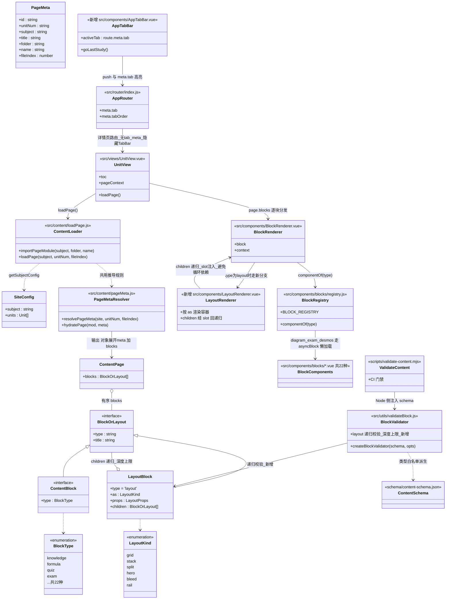
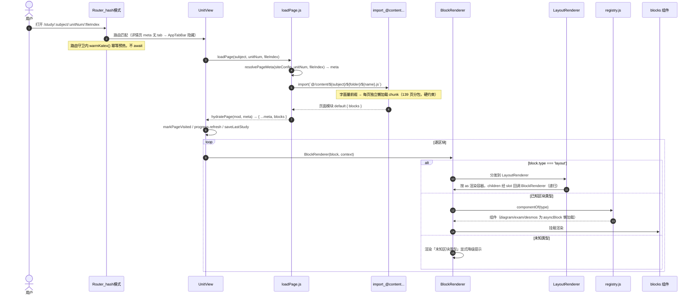
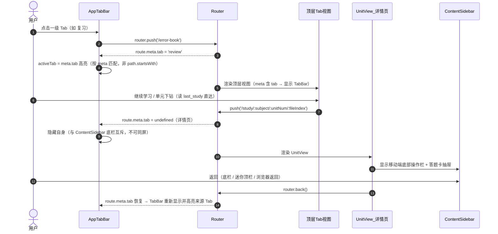

# 移动端体验大改造 · 系统设计 v1

> 状态：**v1.1（架构师已复核补全，2026-10-07）**。复核结论：本文档与架构师/PM 产出**一致，无失真**；更正 1 处事实错误（原「遗留技术债」条目中 geogebra「已无 src 引用」不实）、精化 1 处引用（§5.1 WebKit bug 触发条件）、补 1 处遗漏（§2 路由 meta 缺 `/practice`）。已补全 classDiagram / sequenceDiagram（§9）与细粒度任务分解（§10）。

---

## 1. 决策记录（ADR 摘要）

| #  | 决策       | 结论                                                          | 依据                                                                                             |
| -- | -------- | ----------------------------------------------------------- | ---------------------------------------------------------------------------------------------- |
| D1 | 技术栈      | **保留 Vue 3，不迁 React**                                       | 四条样式诉求 Vue 全部可做且三条已在用；真正的约束是内容模型，迁栈不解决；迁栈成本 4-8 周且需重趟风险点                                       |
| D2 | 目标载体     | **桌面窗口 + Android 包**，自适应优先（一份布局两端，不写两套）                     | 用户拍板                                                                                           |
| D3 | 底部导航     | **4 Tab：学习 / 练习 / 复习 / 我的**                                 | 采纳 PM 建议；"练习"为新增聚合层                                                                            |
| D4 | 内容模型     | **方案 A：布局原语**（排布自由度）                                        | 存量 147 页零改动；"任意自定义组件"仅在极少数页面作逃生舱                                                               |
| D5 | 动效       | **丰富，分级降级**（高端丰富/低端精简）                                      | WebView + 移动端性能硬约束                                                                             |
| D6 | 视觉       | 导航页玻璃拟态+柔光渐变；学习页 Claude 纸质阅读；**全面禁用 emoji，改 Lucide SVG 图标** | 用户拍板                                                                                           |
| D7 | 编辑器      | **删除**（使用频率 0）                                              | 用户拍板                                                                                           |
| D8 | Tailwind | **不引入**                                                     | 与现有 2000+ 行 token CSS 并存会风格漂移                                                                  |
| D9 | 图标       | **Lucide**（`lucide-vue-next`）                               | 24.8k star、ISC、编译期内联 SVG、CSP 零风险；排除 Iconify 运行时模式（connect-src 拦截）与 Phosphor（6 权重易花哨，与降 AI 味相悖） |

**CSP 硬约束**（贯穿所有选型）：`script-src 'self'`（禁 eval/内联脚本）；`style-src 'self' 'unsafe-inline'`（内联样式允许）；`font-src 'self' data:`（字体必须自托管）；`connect-src` 不含第三方域。

---

## 1.5 工程原则（贯穿全部实施阶段，2026-10-06 用户新增）

### 高内聚低耦合

| 原则 | 含义 | 落地方式 |
|---|---|---|
| **高内聚** | 一个模块/组件只负责一件事，相关状态与逻辑就近放置 | 延续 registry 模式（`blocks/registry.js` 集中注册）；通用逻辑抽 composable（`useKatex`/`useMermaid` 先例）；layout 原语与区块组件**正交**（互不感知，正交组合是内聚的） |
| **低耦合** | 模块间只通过明确接口通信，消灭隐式依赖 | 组件间只用 props/emits 显式契约（禁 provide/inject 滥用）；样式只经 CSS token（禁跨组件选择器穿透）；**"耦合检查"列为每阶段验收项** |

**已知耦合点（重构时必须处理）**：
- `ContentSidebar` 的底栏与 `UnitView` 深度绑定（互斥逻辑分散在两处）
- 悬浮番茄钟（`UnitView.vue:144`）与内容页状态耦合
- `iconOf(type)` 返回字符串被 TOC/HomeView 直接消费（契约脆弱，Lucide 迁移时已计划改为 `<AppIcon>` 组件）

### 中文注释规范

- **精简**：只注释"为什么"（决策原因、陷阱提醒、契约说明），不复述代码"是什么"
- **新手友好**：关键路径有步骤说明；魔法值与复杂时序有解释（正面示范：`main.css:16-48` 的迁移策略注释、`ColumnsBlock.vue` 的"不 import BlockRenderer 避免循环依赖"）
- **语言**：中文
- **范围**：所有新增代码必须遵守；存量代码在被触碰时顺手补齐，**不做专项补注释**（避免无意义的 diff 噪音）
- 反面示例：`// 设置为 true`、`// 遍历数组` 这类复述型注释

---

## 2. 信息架构

### 现状问题（PM 诊断，代码证据）

- Web 式 IA：首页 4 张卡做导航中心 + 页脚 nav + 面包屑；全站 grep 不到 tabbar/bottom-nav
- `App.vue` 常驻站点式顶部 header；`.app-main { max-width: 960px }` 桌面居中列
- Dashboard/ErrorBook/Profile 均带面包屑（纯 Web 惯用法）

### 目标 IA：底部 Tab Bar（移动）+ 侧栏（桌面）

| Tab    | 收录现有页面                                                      | 归并理由                                       |
| ------ | ----------------------------------------------------------- | ------------------------------------------ |
| **学习** | HomeView（继续学习卡、学科切换、阶段分组、搜索）                                | 内容导航最高频；"继续学习"卡天然是首屏                       |
| **练习** | **新增聚合层**：模拟冲刺 + 按学科/单元题目聚合（quiz/exam 区块提取）                 | "刷题"是独立任务流（进题→对错→结算），现 quiz/exam 埋在页内无聚合入口 |
| **复习** | ErrorBookView + useSpacedReview（SM-2 到期队列）+ Dashboard 薄弱点洞察 | 错题+间隔复习+薄弱点是同一"补漏"闭环                       |
| **我的** | ProfileView + DashboardView（进度/统计）+ 主题 + 管理后台(admin) + 退出   | "账号+数据+设置"标准"我的"Tab                        |

**二级下钻**：学习 → 学科 → 单元 → **内容页**（UnitView 保留）；练习 → 做题会话（全屏）→ 结算；复习 → 到期队列 → 错题详情 → 跳回来源页。

**路由 meta 结构**（架构师设计，入口清单已定）：

```
每个一级入口 = 顶层路由，meta: { tab: '<id>', tabOrder: n }
/           → meta {tab:'study'}（学习：现 HomeView）
/practice   → meta {tab:'practice'}（练习：新增聚合层，交互稿待 PM 细化）
/error-book → meta {tab:'review'}（复习）
/profile    → meta {tab:'me'}（我的）
/study/...  → 详情页不带 tab meta（push 进入，隐藏 TabBar）
/admin      → 非 tab（仅 admin）
```

- active 高亮按 `route.meta.tab` 匹配（非 path.startsWith），避免详情页误点亮
- **互斥规则**：详情页（ContentSidebar 底栏）与 AppTabBar 不可同屏——详情页隐藏 TabBar

---

## 3. 内容模型重构（核心）

### 现状证据

- 22 类型硬白名单：`schema/content-schema.json:27`；`validateBlock.js:70` 未知类型报错
- **容器区块已支持递归**（`ColumnsBlock.vue:13-15`、`GroupBlock.vue:22-24` 用 slot 避免循环依赖）——本仓库最有价值的既有资产
- **校验器已是递归实现**（`validateBlock.js:154-177`）→ 扩展成本低

### 三个候选方案

| 方案           | 做法                                                                                                                                        | 存量兼容                  | 作者工作流              | 工作量                         | 定位              |
| ------------ | ----------------------------------------------------------------------------------------------------------------------------------------- | --------------------- | ------------------ | --------------------------- | --------------- |
| **A 布局原语** ⭐ | `columns/group` 泛化为 `{type:'layout', as:'grid'\|'stack'\|'split'\|'hero'\|'bleed'\|'rail', props, children:[block\|layout]}`，允许 layout 嵌套 | ✅ 100%（新增类型，147 页零改动） | 手写声明式 .js 数据（已是现状） | 中（6-10 个原语 + 校验 + 注册表 + 测试） | **主力**          |
| B 逃生舱        | 页面可 `export default { component: () => import('...Xxx.vue') }`                                                                            | ✅ 100%（默认走 blocks 分支） | 写 Vue SFC，门槛陡      | 小                           | 仅极少数页面，**不作默认** |
| C 版式变体       | 22 类型加 `layout/span/tone/align` props                                                                                                     | ✅ 100%                | 改字段                | 极小                          | A 的低成本子集        |

**推荐：A 为主 + B 逃生舱 + C 作为 A 的子集**。明确反对"放弃数据模型、每页写组件"——会让 147 页 + 搜索索引（`build-search-index.mjs` 按 blocks 形状抽取）+ 未来任何批量改动全部失守。

**实现要点**：

- layout 与 block **共用 `type` 单键**（不引 `kind`）
- 校验器**统一递归**（复用 `validateBlock.js:154-177` 骨架）+ **递归深度上限**（防深嵌套）
- 渲染新增 `LayoutRenderer.vue`，复用现有 slot 递归模式
- 矛盾 A 回答：作者写**结构化布局数据**（非代码、非模板语言——禁 eval 符合 CSP），**可接受**

---

## 4. 移动端架构

### 4.1 TabBar —— 纯手写 `AppTabBar.vue`（~100 行）

- 仅 `< var(--bp-lg)`（1150px）显示；`padding-bottom: calc(8px + var(--sab))`
- 玻璃拟态底（`backdrop-filter`），**TabBar 自身不可被 transform 动画的祖先包裹**（见 5.1 陷阱）
- 高频直达入口：**中间凸起按钮**（fab-in-tabbar）形态，读 `last_study` → `router.push('/study/...')`，无历史降级为默认页
- 信息架构统一：现存的 App.vue 顶部 header、详情页 ContentSidebar 底栏、悬浮番茄钟——**三者不得与 TabBar 同屏打架**

### 4.2 响应式 —— 容器查询为主

**决定性依据**：项目大量"同一区块被放进不同宽度容器"（桌面侧栏里的区块其实很窄但视口很宽）→ **媒体查询按视口判断会误判**。容器查询按实际可用宽度判定。

- 用法：`container-type: inline-size` + 尺寸查询；**避开 `cqw/cqh` 单位（老 Safari bug）与 style queries（Safari 18 才支持）**
- 支持：WebView Android 105+ / Safari iOS 16+ / WKWebView macOS 13+ → 满足
- 兜底：`@supports not (container-type: inline-size)` → 退回媒体查询

### 4.3 断点收敛（现有 6 个碎片值 → 4 级阶梯）

| 名称        | 值      | 语义                    | 归并          |
| --------- | ------ | --------------------- | ----------- |
| `--bp-sm` | 600px  | 手机竖屏                  | ← 600（10 处） |
| `--bp-md` | 900px  | 平板/横屏                 | ← 640/768   |
| `--bp-lg` | 1150px | **桌面↔移动分界**（侧栏↔底栏切换线） | ← 1150/1151 |
| `--bp-xl` | 1280px | 宽桌面                   | ← 1024 归并   |

### 4.4 哪些组件需要结构性两套排布（仅 3 处）

| 类别                          | 组件                                                                            |
| --------------------------- | ----------------------------------------------------------------------------- |
| **结构性**（元素位置真的变，同一数据两个容器）   | `ContentSidebar.vue`（侧栏↔底栏+抽屉）、`UnitView.vue`（内容+侧栏↔迷你顶栏）、`AppTabBar.vue`（新增） |
| **布局变体**（props 表达意图，CSS 降级） | `ColumnsBlock.vue`（多栏↔单列）、`CompareBlock.vue`（左右↔上下）                           |
| **仅密度/排版**（不改结构，token 切换）   | 其余全部                                                                          |

### 4.5 安全区 —— 已就绪，只需规范化

`main.css:252-258` 已定义 `--sat/--sab/--sal/--sar`；`index.html:6` 已 `viewport-fit=cover`。规范：底栏 `calc(8px + var(--sab))`，sticky 顶栏 `calc(8px + var(--sat))`。

### 4.6 Tauri Android 前置条件（当前未装）

已具备：`lib.rs:5` `mobile_entry_point`、crate-type 含 staticlib/cdylib、android 脚本、icons/android+ios。  
尚缺：① Android Studio + SDK + NDK + JDK 17（`ANDROID_HOME`/`NDK_HOME`）② Rust target `aarch64-linux-android` ③ `npm run tauri:android:init` ④ keystore 签名 ⑤ 移动端缺失能力用 `#[cfg(desktop)]` 隔离。

---

## 5. 视觉与动效

### 5.1 玻璃拟态 —— 手写 CSS（无成熟库，Vue 侧空白）

```css
.glass {
  background: color-mix(in srgb, var(--surface) 70%, transparent);
  -webkit-backdrop-filter: blur(12px) saturate(1.2);  /* 必写前缀 */
  backdrop-filter: blur(12px) saturate(1.2);
  border: 1px solid color-mix(in srgb, var(--surface-strong) 45%, transparent);
}
```

- **blur 上限 8-16px**。引用精化（架构师已核实 bugs.webkit.org）：#316769 的触发条件是**极大 stdDeviation（~200px 级）**导致 paint >10s（已并入 #315118 修复钳制），对本项目 8-16px 不构成直接威胁；但 **#322045** 证实**中等半径（64px）下「blur 元素 + 内联 SVG 同帧首绘」仍会卡死首帧**——本项目玻璃层与 Lucide 内联 SVG 图标同屏是常态，故除钳制 blur 外：**首帧避免「玻璃 + 大量内联 SVG」同现**（hero 图标延后一帧挂载，或装饰性发光改用 CSS 渐变/mask 替代 blur）
- **头号陷阱**：祖先有 `transform`/`filter`/`will-change`/`contain:paint` → 创建新 backdrop root → **玻璃效果静默消失**。玻璃层不可被"动画 transform 的祖先"包住
- 降级：`@supports not (backdrop-filter)` → 不透明背景

### 5.2 动效 —— ⚠️ 需正式反转 `main.css:182-186` 的既有哲学

该处明确写"动效克制…不做路由过渡/stagger/滚动视差"。用户新需求要求反转，需同步改注释与策略。

**分层选型**：

| 层     | 方案                                                       | 依赖                                   |
| ----- | -------------------------------------------------------- | ------------------------------------ |
| 微交互   | Vue `<Transition>`/`<TransitionGroup>` + CSS             | 0 依赖                                 |
| 页面转场  | **View Transitions API**（`document.startViewTransition`） | Chrome111+/Safari18+；不支持则直接切换；<500ms |
| 滚动/手势 | **@vueuse/motion**（<25KB，自动尊重 reduced-motion）            | 轻量；不引 GSAP（25-35KB、命令式）              |

**动效清单**：

- ✅ 值得：Tab 指示器滑动、卡片按压 `scale(.97)`、区块进入 fade+rise（IntersectionObserver 一次）、阅读进度条（已有）、浮层进出、页面转场
- ⚠️ 陷阱：滚动视差（易掉帧，仅少量元素+低端机关闭）、一屏几十个同时动画、**对 backdrop-filter 元素做 transform 动画（破坏玻璃）**、长转场阻塞输入

### 5.3 性能预算与降级（用户已接受分级）

- **只动 `transform`/`opacity`**（compositor-only）；禁动 `width/height/top/left/box-shadow/blur`
- `will-change` 生命周期：进入前加、`animationend` 后移除
- 三层降级：`prefers-reduced-motion`（已有）→ 能力分级（hardwareConcurrency/deviceMemory 或首帧 FPS 采样）→ 低端机仅 opacity 或全关
- 验收：低端安卓真机 + `chrome://inspect` Performance 面板必测

### 5.4 图标迁移（Lucide）

- 迁移点：`blockTypes.js:16-38`（22 个 icon）、`content/index.js:41-45`（SUBJECT_META 📐✍️💻）、各 View 硬编码 emoji
- **契约变更**：`iconOf(type)` 现返回字符串 → 改返回 Lucide name + 新增 `<AppIcon :name>` 组件统一渲染；同步 `tests/block-registry.test.js`

### 5.5 Claude 纸质阅读风 —— 规范要点

纸白 `#f8f8f6`（非纯白）、墨色 `#1a1a1a`（非纯黑）、陶土橙 `#c96442` 极克制点缀、暖灰分隔线、暖可可色阴影；衬线标题（Source Serif 4 自托管，font-src 'self' 限制禁 CDN）单一中等字重 500；正文 16-17px / 行高 1.6-1.7；行宽 65-75ch（**中文 30-40 汉字**，需覆盖 prose 默认度量）；圆角阶梯 6/8/12/16。**现有 main.css token 已大体符合**，本轮是增强而非推翻。

---

## 6. 需求池（PM 产出，R1-R9）

| ID | 需求              | 优先级   | 验收要点                                                 |
| -- | --------------- | ----- | ---------------------------------------------------- |
| R1 | 底部 Tab Bar 一级导航 | P0    | 4 Tab 触控 ≥44×44；内容页自动隐藏；任意一级页 1 次点击可达其余 3 个          |
| R2 | 路由转场 + 返回手势     | P0    | ≤300ms 转场；边缘右滑返回；reduced-motion 兜底                   |
| R3 | 去 Web 味         | P0    | 删 960px 居中 / 面包屑 / 页脚 nav+版权 / 站点 header；有转场；触控原生反馈  |
| R4 | 页面级布局自由度        | P0    | ≥3 种 layout 模板落真实页面；同数据不同排布；缺省回退 reading             |
| R5 | 内容差异化（三轴）       | P0-P1 | 题型（例题渐进/练习专注/错题对比）、学科（三科调性）、层次节奏（≥2 级视觉层次）           |
| R6 | 动效系统            | P1    | 全站 :active 反馈；视差；手势切题；统一 token；reduced-motion 兜底     |
| R7 | 视觉现代化           | P1    | 字号/圆角/色阶层级提升；对比度 WCAG AA。⚠️ 与 Claude 调性冲突，按"增强不推翻"处理 |
| R8 | 删除编辑器           | P0    | 全仓 grep 无残留；路由不含 /editor；构建通过                        |
| R9 | 加载与首屏感知         | P0    | 骨架屏替代"加载中…"文字；无白屏空帧                                  |

**用户旅程**（PM 产出）：J1 系统性学习闭环（打开→薄弱点→做题→错题→复习→掌握）、J2 碎片续学（打开→继续→换科）。痛点：答错无即时引导、换科后重新找单元、概念页长瀑布无节奏。

---

## 7. 实施路线（每阶段可独立上线，非大爆炸）

| 阶段                | 交付                                                                       | 依赖               | 可独立上线 |
| ----------------- | ------------------------------------------------------------------------ | ---------------- | ----- |
| **P0 内容模型**       | LayoutRenderer + layout 原语 + schema 分支 + 递归校验（含深度上限）+ 注册表 + 测试；**存量零改动** | 无                | ✅ 纯增量 |
| **P1 移动端骨架**      | AppTabBar + 容器查询基础设施 + 断点收敛(600/900/1150/1280) + 安全区规范 + 信息架构统一          | 无（可与 P0 并行）      | ✅     |
| **P2 视觉**         | token 微调 + `<AppIcon>` 统一 + 玻璃层规范 + emoji 清零 + Lucide                    | 无（可并行）           | ✅     |
| **P3 动效**         | 三级递进（CSS → View Transitions → @vueuse/motion），每级独立开关+降级                  | P2（玻璃规范先行）       | ✅ 逐级  |
| **P4 内容差异化**      | 用 P0 能力重排高价值页（导航 hero、重点页定制布局）                                           | P0               | ✅ 逐页  |
| **P5 Android 打包** | 工具链 → tauri android init → 真机验证                                          | Android 工具链（当前缺） | ✅     |

**顺序要点**：P0/P1/P2 互不依赖可并行；P3 依赖 P2；P4 依赖 P0；全程不阻断存量。

---

## 8. 诚实评估（架构师，基于 147 页区块类型覆盖度统计）

| 页面类型             | 手机端      | 缓解                                 |
| ---------------- | -------- | ---------------------------------- |
| 纯阅读型（约 1/3）      | ✅ 两端 90+ | 单列窄栏正是阅读最佳形态                       |
| 含思维导图（96 页 ≈65%） | ⚠️ 80-88 | 纵向 flowchart 变体 / 触摸平移+双指缩放 / 全屏入口 |
| 含宽表（73 页 ≈50%）   | ⚠️ 80-88 | 横向滚动 + 首列 sticky（card 化会改变语义，不推荐）  |
| 含几何画板（14 页）      | ⚠️ 75-85 | 全屏化                                |
| 模拟卷（4 页）         | 🟡 82-88 | 可用                                 |
| 多栏/对照（<2%）       | ✅ 影响极小   | 降级单列                               |

**没有任何页面需要两套代码**——差异全部收敛为"布局变体 + token + 结构性重排（仅 3 处）"。  
**约束**：内容重页（导图/表）的"丰富感"必须让位于可读性。

---

## 9. 核心设计图

### 9.1 classDiagram —— 内容模型（方案 A）与渲染/校验/导航分层



**关系要点**：`LayoutBlock` 与 `ContentBlock` 共用 `type` 单键（不引 `kind`）；`LayoutRenderer ↔ BlockRenderer` 经 slot 互递归（沿用 `ColumnsBlock/GroupBlock` 既有模式，双方都不得 import 对方，由 BlockRenderer 内部分发）；校验器递归复用 `columns/group` 既有骨架并加**深度上限**。

### 9.2 sequenceDiagram ① 内容页加载与渲染链路（含 layout 分发）



### 9.3 sequenceDiagram ② TabBar 高亮与详情页互斥



---

## 10. 细粒度任务分解（P0-P5，文件路径级）

> 规则：任务按功能分组（非单文件拆分）；每阶段验收项含 **§1.5 耦合检查**；所有新增代码遵守中文注释规范。

### P0 内容模型（方案 A 地基）—— 存量零改动，可独立上线

| 任务 | 内容与文件 | 依赖 | 可并行 |
|---|---|---|---|
| P0-T1 schema + 校验 | `schema/content-schema.json`（加 `layout` allOf 分支 + `LayoutKind/LayoutProps` definitions）；`src/utils/validateBlock.js`（layout 分支：递归校验 children + `as`/`props` 白名单 + **深度上限**） | 无 | — |
| P0-T2 渲染分发 | 新增 `src/components/LayoutRenderer.vue`；改 `src/components/BlockRenderer.vue`（layout 分支）；改 `src/components/blocks/registry.js`（layout→LayoutRenderer 绑定） | P0-T1 | — |
| P0-T3 布局原语族 | 新增 `src/components/layouts/`（GridLayout / StackLayout / SplitLayout / HeroLayout / BleedLayout / RailLayout）+ `src/assets/css/layouts.css`（容器查询驱动降级） | P0-T2（联调）；组件编写可与 T2 并行 | ✅ 与 T4 |
| P0-T4 类型与守卫 | 同步 `src/types/content.d.ts`；扩展 `tests/block-registry.test.js`；新增 `tests/validate-layout.test.js`（含深度上限用例） | P0-T1、T2 | ✅ 与 T3 |

### P1 移动端骨架（自适应优先）—— 可独立上线

| 任务 | 内容与文件 | 依赖 | 可并行 |
|---|---|---|---|
| P1-T1 token 与断点收敛 | `src/assets/css/main.css`（`--bp-sm/md/lg/xl`、容器查询基础设施 + `@supports` 兜底、密度 token 移动端覆盖） | 无 | ✅ 与 P0 并行 |
| P1-T2 TabBar + 路由 | 新增 `src/components/AppTabBar.vue`（玻璃底 + 中间凸起直达 + meta.tab 高亮）；改 `src/router/index.js`（meta.tab/tabOrder、`/practice` 占位路由）；改 `src/App.vue`（挂载 TabBar、顶部 header 收敛） | P1-T1；入口清单已定（D3） | — |
| P1-T3 结构性重排 | `src/components/ContentSidebar.vue`（与 TabBar 互斥协调）；`src/views/UnitView.vue`（详情页隐藏 TabBar）；`src/views/HomeView.vue`（学习 Tab 改造：去 960px 居中 / 面包屑 / 页脚 nav） | P1-T2 | — |
| P1-T4 容器查询迁移 | `src/components/blocks/ColumnsBlock.vue`、`src/components/blocks/CompareBlock.vue`（媒体查询 → 容器查询） | P1-T1 | ✅ 与 T2/T3 |

### P2 视觉 —— 可独立上线

| 任务 | 内容与文件 | 依赖 | 可并行 |
|---|---|---|---|
| P2-T1 AppIcon + 图标数据 | 新增 `src/components/AppIcon.vue`；改 `src/components/blocks/blockTypes.js`（icon → Lucide name）；改 `src/content/index.js`（SUBJECT_META）；同步 `tests/block-registry.test.js` | 无 | ✅ 与 P0/P1 并行 |
| P2-T2 emoji 清零 | `src/App.vue`、`src/views/*.vue`（Home/Dashboard/ErrorBook/Login/Profile/Admin/Unit）、`src/components/blocks/asyncBlock.js`（加载文案）、`src/components/BlockRenderer.vue` | P2-T1 | — |
| P2-T3 玻璃层与阅读风 | `src/assets/css/main.css`（`.glass` 工具类 + `@supports` 降级 + blur 钳制）；`src/components/AppTabBar.vue`（玻璃底）；`src/views/HomeView.vue`（hero 玻璃+渐变）。⚠️ 遵守 §5.1 首帧「玻璃+内联SVG」规避 | P2-T1、P1-T1 | — |
| P2-T4 删除编辑器（R8，**无依赖可随时先行**） | 删除 `src/views/editor/`（EditorView.vue / BlockForm.vue / schemaForm.js）、`src/utils/contentWrite.js`、`src/utils/contentSchema.js`、`scripts/vite-plugin-content-write.mjs`、测试 `tests/block-form.test.js` / `tests/editor-schema-form.test.js` / `tests/content-write.test.js`；改 `src/router/index.js`（删 /editor）、`src/views/HomeView.vue`（删编辑器入口卡）。⚠️ **保留** `src/content/serializePage.js`（迁移脚本仍用）与 `src/utils/validateBlock.js`（CI 仍用） | 无 | ✅ 全程可并行 |

### P3 动效（三级递进，每级独立开关+降级）

| 任务 | 内容与文件 | 依赖 | 可并行 |
|---|---|---|---|
| P3-T1 微交互层 | `src/assets/css/main.css`（扩 `--dur-*/--ease-*`、:active 反馈、反转 §5.2 所述「克制」注释）；`src/components/AppTabBar.vue`（指示器滑动）；卡片按压 scale | P2-T3 | — |
| P3-T2 页面转场层 | 新增 `src/utils/viewTransition.js`（`document.startViewTransition` 封装 + 降级）；改 `src/App.vue`（router-view 转场接线）；改 `src/router/index.js` | P3-T1 | — |
| P3-T3 滚动/手势 + 能力分级 | 新增 `src/composables/useMotionPrefs.js`（reduced-motion + hardwareConcurrency/deviceMemory 分级）；改 `src/views/UnitView.vue`（区块进入动效）；`package.json` 引入 `@vueuse/motion`。⚠️ R2 边缘右滑返回：Tauri Android WebView 手势能力**待验证**，标注风险 | P3-T1 | ✅ 与 T2 |

### P4 内容差异化（依赖 P0）

| 任务 | 内容与文件 | 依赖 |
|---|---|---|
| P4-T1 layout 落地 ≥3 页 | `src/content/` 高价值页改用 layout 原语（导航 hero、重点页定制布局）；schema 不变 | P0 |
| P4-T2 三轴差异化 + 骨架屏（R9） | 新增 `src/components/SkeletonBlock.vue`；改 `src/views/UnitView.vue`（加载骨架）；区块 tone/variant 扩展（schema + 对应 block 组件） | P0、P2 |

### P5 Android 打包（依赖 P1-P3 + 工具链）

| 任务 | 内容 | 依赖 |
|---|---|---|
| P5-T1 工具链 | Android Studio + SDK + NDK + JDK 17；`ANDROID_HOME`/`NDK_HOME`；`rustup target add aarch64-linux-android`（环境，非代码） | — |
| P5-T2 init 与配置 | `npm run tauri:android:init`（生成 `src-tauri/gen/android`，**纳入版本控制**）；`src-tauri/tauri.conf.json`（`bundle.android.minSdkVersion` 等）；keystore 签名 | P5-T1、P1-P3 |
| P5-T3 真机验证 | 真机冒烟 + `chrome://inspect` Performance（§5.3 预算）+ CSP violation 扫描 + §8 妥协项（导图/表/画板）逐项确认 | P5-T2 |

---

## 11. 待确认 / 遗留

1. ~~Tab 划分~~ ✅ 已定（学习/练习/复习/我的）
2. ~~布局自由度含义~~ ✅ 已定（方案 A 排布自由度）
3. ~~动效降级~~ ✅ 已定（分级）
4. ~~手机平台~~ ✅ 已定（Android only）
5. ⬜ **"练习"Tab 的刷题聚合层是全新功能**，其交互设计（做题会话/结算页）需要 PM 在实施前细化
6. ⬜ R7 视觉现代化的边界：在 Claude 调性上"增强"的具体设计稿
7. ~~架构师复核本文档~~ ✅ **v1.1 已完成（2026-10-07）**：复核结论「无失真」；更正第 8 条 geogebra 事实错误；精化 §5.1 引用；补 §2 `/practice` 路由；补全 §9 / §10
8. ⬜ 遗留技术债：GeoGebra 演练场白屏（C7）在桌面端确认为区块级失败；**48MB `public/vendor/geogebra` 仍被引用，不可直接删**（复核证据：`src/components/blocks/DesmosBlock.vue:16`、`src/views/UnitView.vue:182,219`、`src/views/HomeView.vue:120,185` —— 原 v1 写「已无 src 引用」**有误，已更正**）；`lib.rs` 两条 warning
9. ⬜ PM 的 PRD 文件**未落盘到仓库**（`docs/` 下无 PRD 文件）——本复核基于 §6 已收录的 R1-R9 与用户旅程做遗漏检查。建议 PM 将 PRD 落盘（如 `docs/prd-mobile.md`）以便追溯
10. ⬜ 可选第 5 Tab「数据」：**架构师建议不设**（D3 已定 4 Tab；Dashboard 数据洞察已并入「我的」）。若后续要加，架构零阻碍——路由 meta 加一项 + `AppTabBar` 数组加一项（约 0.5 天），无需改容器
11. ⬜ 「练习」聚合层（全新功能）工作量：**中等，估 1-2 周**——①题目提取器（复用 `scripts/build-search-index.mjs` 的 blocks 遍历模式，聚合 quiz/exam 区块，按学科/单元建索引）②做题会话 store（新 Pinia store，错题写入复用 studyDb 的 `error_book`）③做题会话页 + 结算页 UI ④与间隔复习（useSpacedReview）打通。**前置**：PM 出做题会话/结算交互稿。风险：题目去重、exam 计分语义复用
12. ⬜ `tests/jsxgraph-eval-guard.test.js`（QA 复核中）：与 P0-P5 **无耦合**，不影响本设计实施

---

*v1 整理：team-lead（齐活林），2026-10-06。来源：PM PRD（许清楚）、架构师方案（高见远）、工程师库调研（寇豆码-2）、用户决策。*
*v1.1 复核补全：架构师（高见远），2026-10-07 —— 复核忠实性、更正 geogebra 事实、补 §10 classDiagram/sequenceDiagram、§11 任务分解、§12 新增 9-12。*
